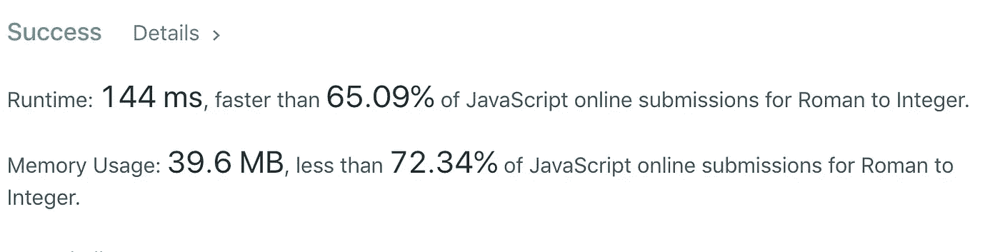

# 算法 101:在 JavaScript 中将罗马数字转换成整数

> 原文：<https://javascript.plainenglish.io/algorithms-101-convert-roman-numerals-to-integers-in-javascript-d3aba86a43d4?source=collection_archive---------5----------------------->

## Noob 诉 LeetCode 第 6 集


在我不断寻求解决 LeetCode 中“简单”算法问题的过程中，我遇到了将罗马数字转换成整数的挑战[。](https://leetcode.com/problems/roman-to-integer/)

LeetCode 示例:


幸运的是，我正和我的丈夫开车长途回家，他是一名软件工程师，已经习惯了这类难题。我们讨论的第一件事是如何知道何时从后面的数字中减去一个罗马数字。

我在想，如果是一个“I”后面跟着一个“V ”,我们就要减去。哦，对了，如果是“X”前面的“I ”,我们也要减去。等等，等等，天啊，这将会是一个很长的列表，关于什么时候要减去。

我的犯罪搭档有一个更好、更抽象的方法:如果我们看到的罗马数字与下一个相同或相等，我们可以把它加到总数中。如果它小于下一个，我们将从下一个中减去它，然后将结果加到总数中。

如果你已经看到了捷径，对你有好处。如果没有，请容忍我！

*注意:根据你的反馈，我从最初的帖子开始重构了这段代码，使代码和帖子更容易阅读。*

# 分解它

我们一到家，我就拿出电脑，把问题分解成更小的问题。我必须想出如何:

1.  将单个罗马数字转换为相应的数值
2.  设定何时加减的规则
3.  返回总计

# 第一步。将单个罗马数字转换为数值

我知道我希望“I”等于 1，“V”等于 5，等等。

所以我试了一长串常量:

```
const “I” = 1
const “V” = 5
etc.
```

问题是，“I”是字符串，不是变量。如果你想把它转换成一个变量，有很多关于如何做的相互矛盾的建议。我想让事情尽可能简单。经过许多死胡同，我决定在哈希。


这个谜题的测试用例输入是“III”。我知道我要单独查看这些“I”中的每一个，所以我把字符串分成一个数组:

`let array = s.split('')`

这给了我:`["I", "I", "I"]`

现在，我必须检查每个元素，找到它的换算值，然后将该值加或减到一个名为 total 的计数器中。

# 修订步骤 2:说明如何将每个数值相加得到一个总数。

我决定先写一个程序，简单地将每个字符的值加到一个总数中，而不是为何时加减设定规则。

我从这个开始:

```
//test value:
s = "III"array = s.split('')//set a counter called 'total' with an initial value of zero:
let total = 0

for(let i = 0; i < array.length; i++){
   total += conversion[array[i]]  
 }

return total// => 3
```

好啊，我的测试用例成功了！至少我走了这么远…

# 修订步骤 3。弄清楚什么时候做加法，什么时候做减法以及如何做减法

早些时候，我已经决定如果一个值大于下一个值，就给我的总数加一个值；否则我会从下一个值中减去它，然后把结果加到我的总数中。

所以我写了一个比较当前值和下一个值的方法。

如果我的数组中的当前元素是`array[i]`，那么下一个值就是`array[i+1].`

如果`array[i]`的数值为`conversion[array[i]]`

则`array[i+1]`的数值为`conversion[array[i+1]]`

所以如果我们想看看当前的值是否大于或等于下一个值，我们可以这样写:

```
if(conversion[array[i] >= conversion[array[i+1]] ...//feeling dizzy??
```


这种代码感觉就像一个镜子房子！为了让我更容易理解，我添加了几个变量:


这样就更容易写下一部分:

```
if (currentValue >= nextValue ){
       // add current value to total } else if (currentValue < nextValue) {
       //subtract current value from next value and add result to total ? }
```

# IX 的问题在于……

我们的 *for loop* 设置为一次处理一个元素，决定如何使用它来更改总计，然后继续处理下一个元素。但在代码的“else if”部分，我们跳过了这一步，一次处理两个值，数组[i]和数组[i+1]。

举个例子。如果我们把“I”跟在“X”后面，我们就把“I”翻译成 1，把“X”翻译成 10。遵循我们的规则，由于 1 小于 10，我们从 10 中减去 1，得到 9 的结果；然后我们将总数加 9。

但在下一个循环中，我们当前的元素是前一个“next”元素，即值为 10 的“X”。但在最后一个循环中，我们已经将这 10 个因素考虑在内了。如果我们再考虑同样的 10，我们将扔掉我们的总数！

# 掉进兔子洞

这提供了一个绝佳的机会，深入了解兔子洞。我在考虑将 else 语句中的 *i* 增加 2，这时我意识到……

我不必同时处理两种价值观。如果“I”在“X”之前，(或“C”在“D”之前等)。)我可以简单地从总数中减去它的数值，然后在下一个循环中将该数值与“后面的罗马数字”相加。

*当初我为什么要反过来做呢？*因为我的思维太过依赖字面意义:罗马数字中的“IX”是 9，所以我觉得必须将这些字符作为一对进行分析，而不是简单地减去 1，再加上 10。

# 修订步骤 4:返回总计

在我的 for 循环之后，我返回了总数。以下是这一点的全部功能:


# 重构

最大的改进来自清理解决方案的这一部分:

```
if (currentValue >= nextValue ){
            total += (currentValue);
        } else if (currentValue < nextValue) {
            total -= (currentValue);  
        } else if (currentValue && !nextValue) {
            total += currentValue
        }
```

我原来是这样写的:

```
if (currentValue >= nextValue ){
            total += (currentValue);
        } else if (currentValue < nextValue) {
            total -= (currentValue);  
        } 
```

但这种方法并不奏效，因为出现了“边缘”情况，即 *currentValue* 是数组中的最后一个值。出现这种情况时，没有 *nextValue* 可比较，因此代码跳过了对最后一个值的评估。这就是为什么我补充说:

```
else if (currentValue && !nextValue) {
            total += currentValue
        }
```

即，如果没有下一个值，则前进并将当前值加到总数中。

但是……这大大降低了代码的速度。浏览 LeetCode 上的其他解决方案时，我注意到[来自 hadleyac](https://leetcode.com/problems/roman-to-integer/discuss/373357/Simple-javascript-solution) *的这个解决方案(老实说，直到我自己编写代码时我才看到它！字面意思是几分钟前弹出来的…)* ，它采用了同样的方法，但以更干净的方式处理了 if 语句。所以我重构了:

```
if (currentValue < nextValue ){
            total -= (currentValue);
        } else {
            total += (currentValue);  
        }
```

这涵盖了*当前值*也是最后一个值的情况。

现在一起:


*注:*作为一个 noob，我的本能是把所有和函数有关的东西都放在函数里面；感谢克里斯多佛·马戴尔[https://medium.com/@truffula](https://medium.com/@truffula)的评论，他说散列可以放在函数之外，这样就不会在每次函数运行时被调用！

不算太寒酸:



ps, wait a few seconds and run it again and you might beat 95% …..

版权所有琼·印第安纳·琳斯 2019

[*接下来:算法 101，第七集:JavaScript 中的入室抢劫犯*](https://medium.com/@joanrigdon/algorithms-101-house-robber-in-javascript-da3e6ee36241)

[*以防你错过:算法 101，第 5 集:JavaScript 中的山羊拉丁语*](https://medium.com/@joanrigdon/algorithms-101-goat-latin-in-javascript-d388cc29dc73)