# 算法 101:用 JavaScript 计算素数

> 原文：<https://javascript.plainenglish.io/algorithms-101-count-primes-in-javascript-97f1ff85e040?source=collection_archive---------2----------------------->

诺布诉算法#17，厄拉多塞的筛子

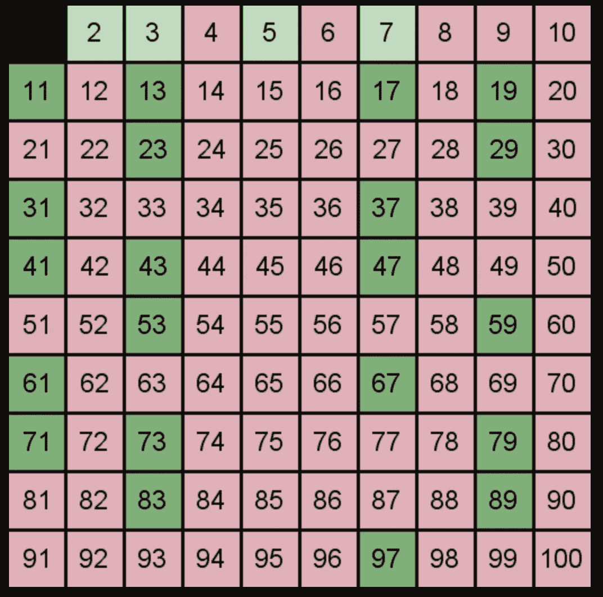

picture from algolist.net

在我们开始今天的挑战之前，先说一下质数:当然，质数是指大于 1 且只能被自身和 1 整除的数。

如果你和我一样，在你高中毕业的时候，你可能已经知道很多次了。但是你忘了我们为什么关心的备忘录。简而言之，我们可以使用非常大的素数来加密。[更多细节请点击这里。](https://www.abc.net.au/news/science/2018-01-20/how-prime-numbers-rsa-encryption-works/9338876)

今天 LeetCode 的谜题是:

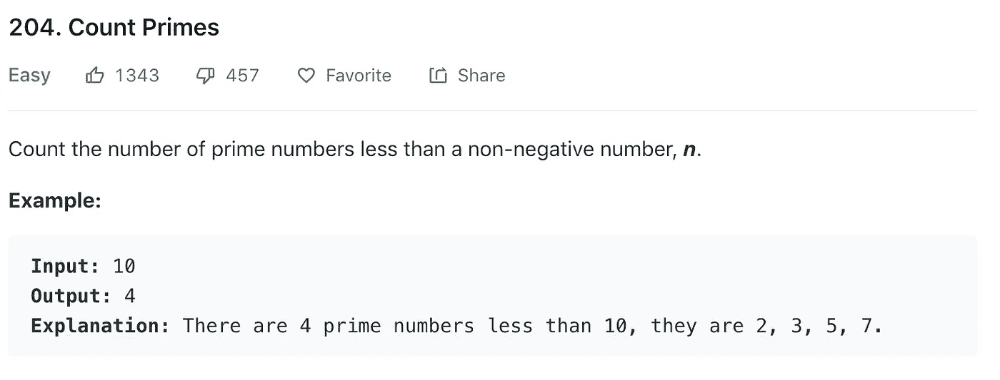

有几种方法可以解决这个问题，但听说过厄拉多塞的筛子后，我想试试他的方法！

## 这家伙是图书管理员，数学家，运动员…

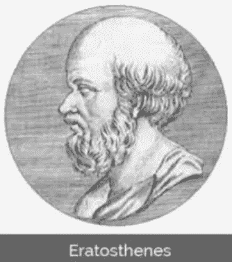

厄拉多塞(发音为*)出生于公元前 276 年，是一位希腊数学家、哲学家、历史学家、图书管理员、运动员、诗人和发明家。*

他最著名的是根据他的观察计算地球的周长，在一天的同一时间，阳光以不同的角度落在不同的城镇。

人们认为是他创造了“地理学”这个词；他在埃及亚历山大的伙伴们给他起了个绰号叫五项全能(在五个不同项目中完成比赛的运动员)。

## 厄拉多塞的筛子

他发明了一种优雅的算法来寻找 1 和任何给定数字之间的所有素数。我们以 120 为例。

1.  首先，写下 1 到 120 之间的所有数字。
2.  从 2 开始，划掉所有大于 2 的倍数。
3.  找到下一个没有被划掉的数字，把它添加到你的素数列表中，然后重复第一步。

你可以在 wikimedia.com 的 gif 中看到它是如何工作的:


from wikimedia.com

注意:每次我们找到一个没有被划掉的数字 *n* ，这个没有被划掉的数字的第一个倍数就是 *n*n.*

一旦我们发现一个 *n* 其中 *n*n* 大于我们列表中的 lat 数，继续下去就没有意义了。

# 那么这在代码中是如何工作的呢？

## 第一步。写下直到 *n* 的所有数字。

让我们试试 n = 10。记住，我们正在寻找小于 10 的质数，所以我们将在 9 停止。

我们可以使用 JavaScript 的 keys()方法来做到这一点。[来自文档:](https://developer.mozilla.org/en-US/docs/Web/JavaScript/Reference/Global_Objects/Array/keys)`**keys()**`方法返回一个新的`**Array Iterator**`对象，它包含数组中每个索引的键。

```
let nums = [...Array(n).keys()]
=> [ 0, 1, 2, 3, 4, 5, 6, 7, 8, 9 ]
```

你可能会想，为什么我们要从零开始，而实际上我们想从 2 开始。在下一步中，我们希望迭代这些数字，并且希望我们迭代的索引等于该索引处的值。

## 第二步。从数字 2 开始，划掉所有随后的 2 的倍数。

在代码中，我们可以改变它们的值，而不是划掉数字。为了更容易地看到发生了什么，当我们划掉一个数字时，让我们将它的值改为字符串“no”——例如，no，这个数字不是一个质数。

```
let n = 10
let nums = [...Array(n).keys()]
=> [ 0, 1, 2, 3, 4, 5, 6, 7, 8, 9 ]for(let i = 2; i*i < n; i++){
        if(nums[i] !== "nope"){
            for(let j = i*i; j < n; j += i){
                nums[j] = "nope"
            }
        }        
    }
```

让我们打开它。在我们的 for 循环中:

`let i =2;`

通常，当我们迭代一个数组时，我们希望迭代整个数组，从索引 0 开始。在这种情况下，我们希望从数字 2 开始，它位于索引 2 处。

`i*i < n;`

当我们找到一个数字`n`，其中`n*n`大于数组中的最后一个数字时，我们就没有数字可以划掉了。所以我们可以在这里停止循环。

## 划掉数字

`if(nums[i] !== “nope”)`

请记住，我们决定通过将数字值更改为*“否”*来“删除”数字。在上面的行中，我们查看 nums[i]看它是否没有被划掉。如果没有被划掉，我们继续。

```
for(let j = i*i; j < n; j += i){
                nums[j] = "nope"
            }
```

看了上面的代码，假设 *i = 2* 。我们设置一个新的迭代器`j` ，初始值为`i*i`，或者 4。第一次通过这个循环，我们在`nums[j]` (4)到`“nope”`处‘划掉’元素。然后我们将 `j` 增加 2，通过将*的*改为*“否”*来划掉这个数字。我们不断重复，直到数组中的数字用完。

所以当`i = 2`第一次循环后，我们的 nums 数组看起来像这样:

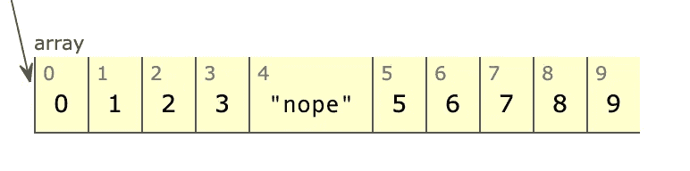

第二次之后:

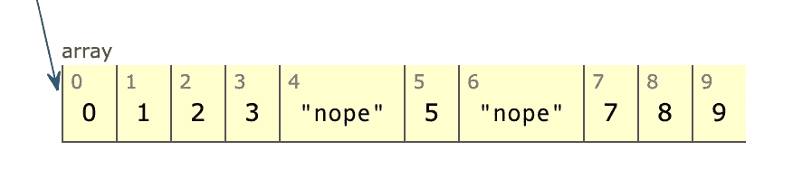

第三次之后:

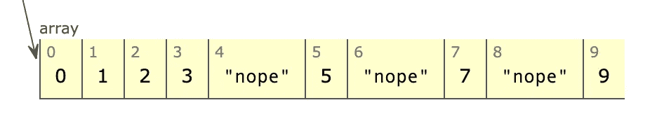

下一次我们递增 j 时，它等于 10，这超出了我们循环的范围。所以我们继续下一个`i`循环，这里 i=3。我们将 `j`设置为初始值`i²` (9)并划掉该数字。

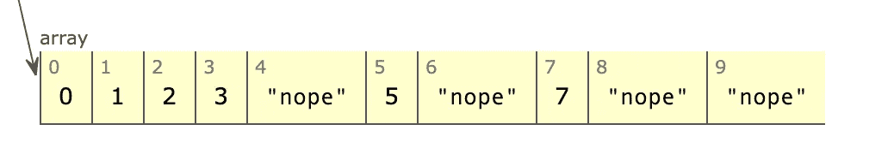

接下来，`j`循环告诉我们划掉所有随后的 3 的倍数…但是下一个倍数 12 不在我们的数组中，所以回到 I 循环，这里已经划掉的下一个数字是 5。然后我们回到 j 循环，试着划掉 i*i (25)，但那不在我们的数组里。

回到我们的 I 循环，我们到达 i=7，我们试着划掉 i*i，但是同样，在我们的循环中没有 49。所以我们已经到了尽头。

## 第三步。把我们修改过的 nums 数组变成一个质数列表

所以现在我们需要改变这一点:

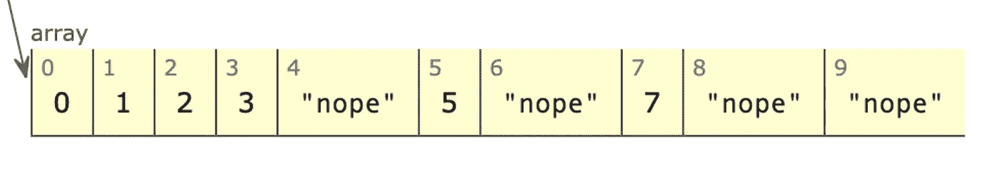

变成这样:

`[2,3,5,7]`

要做到这一点，我们可以迭代 nums，并获取每个大于 1 的元素:

```
for(let i = 0; i < nums.length; i++) {
        if(nums[i] > 1){
            primes.push(nums[i])
        }
    }
```

## 第四步。返回数组的长度。

方向告诉我们返回 1 和 n 之间的素数，而不是实际的素数。我们可以使用 JavaScript 的`.length():`

```
return primes.length()
```

现在一起:

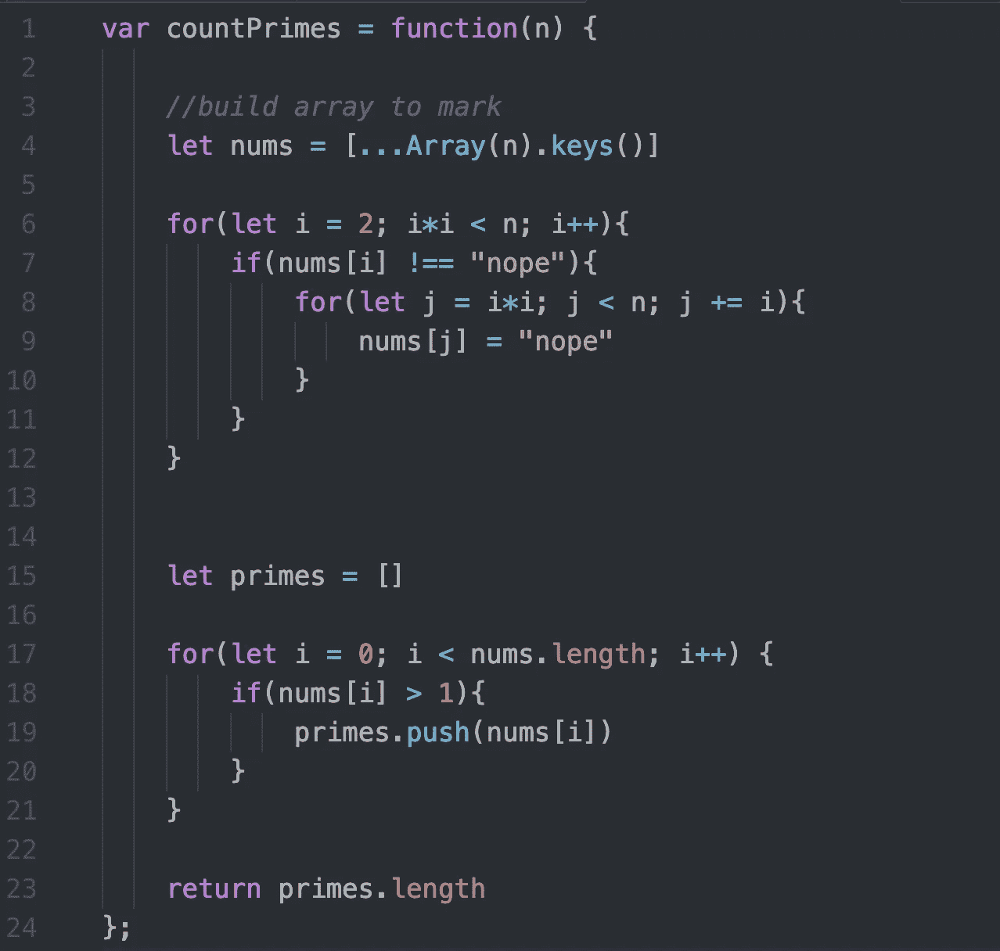

# 让我们加快一点速度！

根据 LeetCode 的说法，上面的代码运行需要 200 毫秒以上，非常慢。

我们可以通过改变划掉东西的方式来加快速度。我们可以将它们改为数字 1，而不是将它们的值改为字符串:

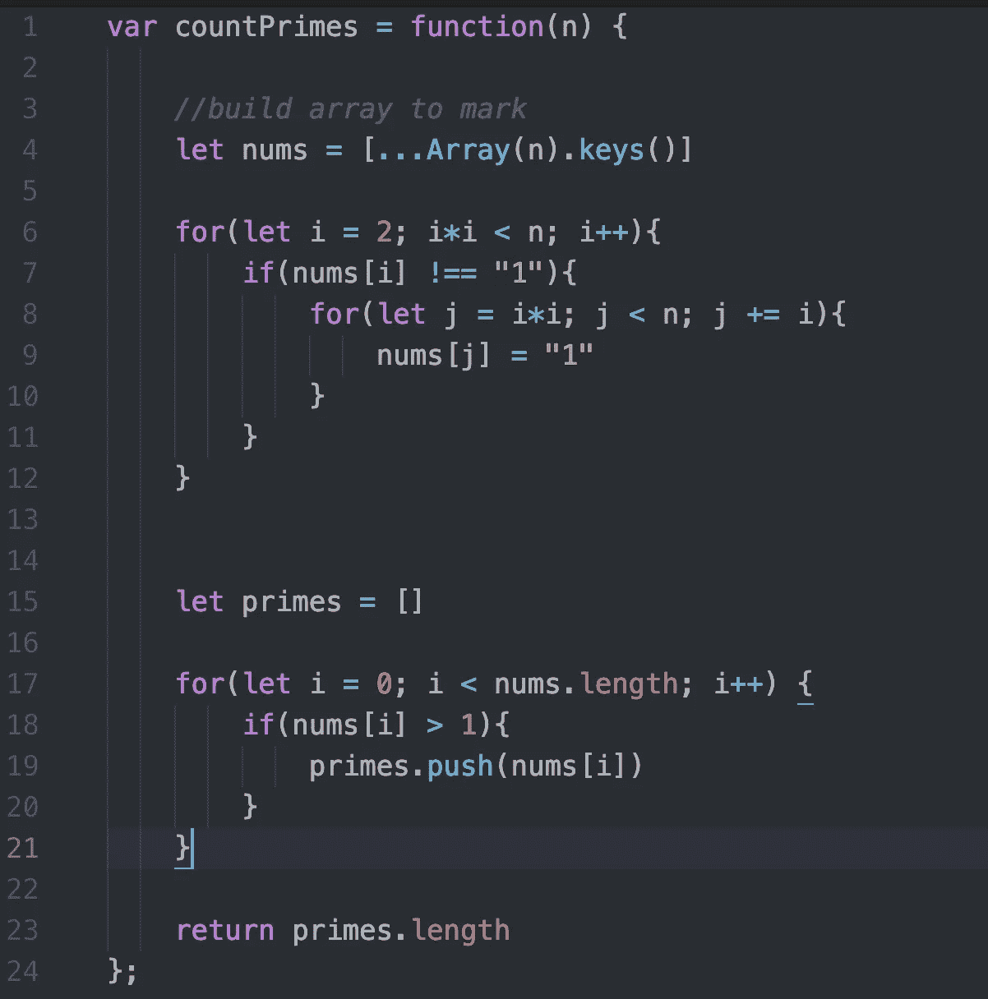

现在，我们比大多数人都快！

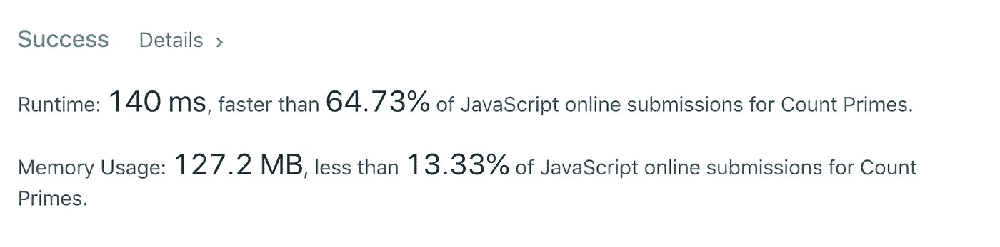

## 玩这个代码

你可以在 repl.it 上玩这个代码:[https://repl.it/@Joan_IndianaInd/count-primesjs](https://repl.it/@Joan_IndianaInd/count-primesjs)

你也可以[用 Pythontutor.org 在这里](http://www.pythontutor.com/visualize.html#code=let%20n%20%3D%2010%0A%0Avar%20countPrimes%20%3D%20function%28n%29%20%7B%20%20%20%20%0A%20%20%20%20%0A%20%20%20%20//build%20array%20to%20mark%0A%20%20%20%20let%20nums%20%3D%20%5B...Array%28n%29.keys%28%29%5D%0A%20%20%20%20%0A%20%20%20%20for%28let%20i%20%3D%202%3B%20i*i%20%3C%20n%3B%20i%2B%2B%29%7B%0A%20%20%20%20%20%20%20%20if%28nums%5Bi%5D%20!%3D%3D%20%22nope%22%29%7B%0A%20%20%20%20%20%20%20%20%20%20%20%20for%28let%20j%20%3D%20i*i%3B%20j%20%3C%20n%3B%20j%20%2B%3D%20i%29%7B%0A%20%20%20%20%20%20%20%20%20%20%20%20%20%20%20%20nums%5Bj%5D%20%3D%20%22nope%22%0A%20%20%20%20%20%20%20%20%20%20%20%20%7D%0A%20%20%20%20%20%20%20%20%7D%20%20%20%20%20%20%20%20%0A%20%20%20%20%7D%0A%20%20%20%20%0A%20%20%20%20let%20primes%20%3D%20%5B%5D%0A%20%20%20%20%0A%20%20%20%20for%28let%20i%20%3D%200%3B%20i%20%3C%20nums.length%3B%20i%2B%2B%29%20%7B%0A%20%20%20%20%20%20%20%20if%28nums%5Bi%5D%20%3E%201%29%7B%0A%20%20%20%20%20%20%20%20%20%20%20%20primes.push%28nums%5Bi%5D%29%0A%20%20%20%20%20%20%20%20%7D%0A%20%20%20%20%7D%0A%20%20%20%20%0A%20%20%20%20return%20primes.length%0A%0A%20%20%20%20%0A%7D%3B%0A%0AcountPrimes%28n%29%0A&cumulative=false&curInstr=1&heapPrimitives=nevernest&mode=display&origin=opt-frontend.js&py=js&rawInputLstJSON=%5B%5D&textReferences=false)可视化代码的执行。

版权所有琼·印第安纳·琳斯 2019

*万一你错过了:* [*算法 101 #16，在 JavaScript*](https://medium.com/javascript-in-plain-english/algorithms-101-find-pairs-in-javascript-72a1f5e9e68f) 里找对

*接下来:* [*算法 101 #18、JavaScript 中的组字谜*](https://medium.com/@joanrigdon/algorithms-101-group-anagrams-in-javascript-b3e3c10d211e)