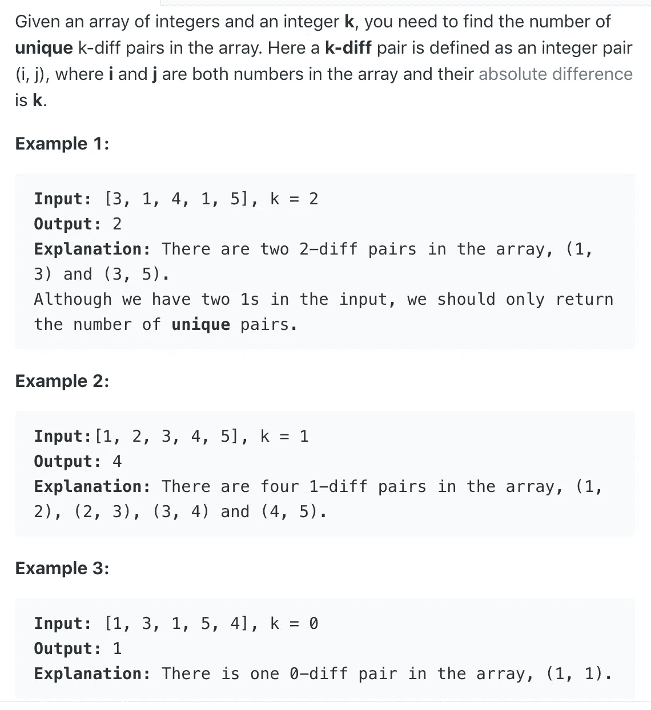
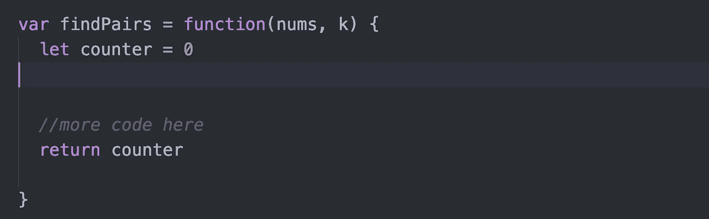
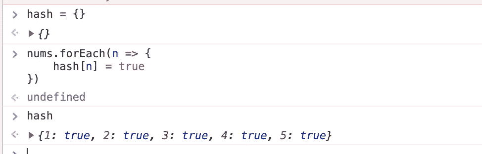
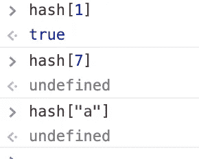
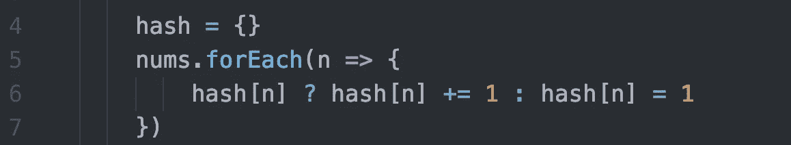
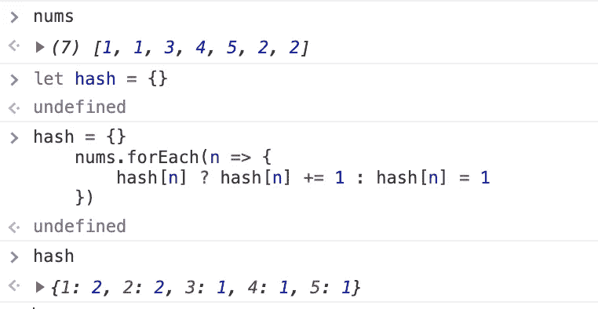
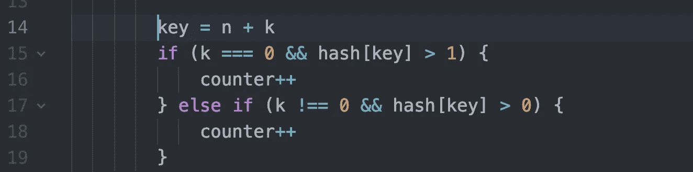
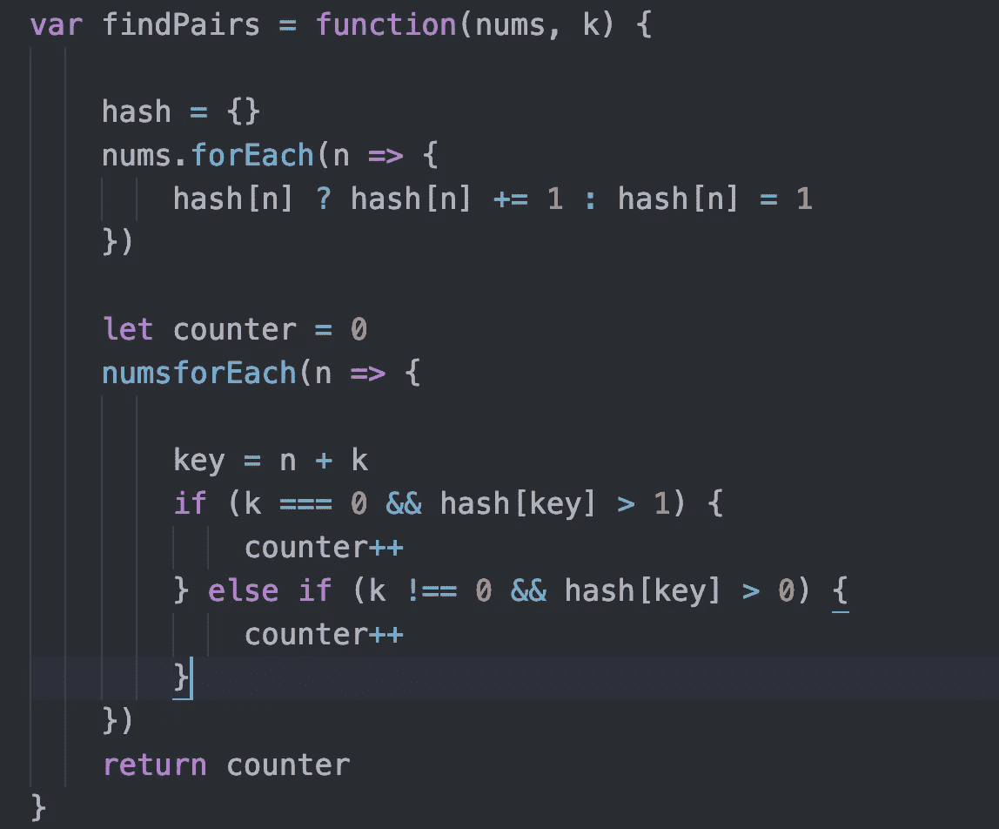
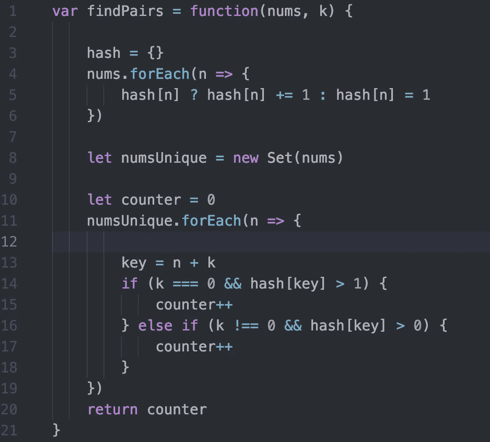

# 算法 101:在 JavaScript 中寻找配对

> 原文：<https://javascript.plainenglish.io/algorithms-101-find-pairs-in-javascript-72a1f5e9e68f?source=collection_archive---------0----------------------->

Noob 诉算法#16，频率计数器和设置


Photo by [Christian Fickinger](https://unsplash.com/@chrfickinger?utm_source=unsplash&utm_medium=referral&utm_content=creditCopyText) on [Unsplash](https://unsplash.com/s/photos/socks?utm_source=unsplash&utm_medium=referral&utm_content=creditCopyText)

[今天的 LeetCode 挑战:](https://leetcode.com/problems/k-diff-pairs-in-an-array/)



对于数组中的每个数字，我们想看看它是否可以与数组中的另一个数字配对，使得第一个数字减去另一个数字的绝对值为 *k* 。我们可以在不同的配对中使用每个数字，但前提是每个配对都是唯一的。

*注意*:如果 k = 0，我们寻找零差的数字对:即相同数字对。

## 为了解决这个问题，让我们把工作分成更小的步骤。

1.  设置一个计数器，这样我们就可以记录找到的配对数量。
2.  将数组中的每个数字与其他数字进行比较。看看有没有符合我们条件的。
3.  当我们找到满足我们条件的一对时，递增计数器。
4.  退回柜台。
5.  处理其他边缘情况。

## 第一步。设置计数器

我们的函数应该返回我们找到的配对的数量；所以我们还需要在函数结束时返回计数器，就像这样:



## 2.将数组中的每个数字与其他数字进行比较。

换句话说，对于数组中的每个元素，我们需要考虑数组中的每个其他元素。很容易用嵌套循环来实现这一点:

```
for(let i = 0; i < array.length; i++){
   for(let j= 1; j < array.length, j++){ 
      //check if absolute value of array[i] - array[j] === k  
   }
}
```

但是这种方法效率很低——它的运行时间为 n，这意味着它必须为 n 的数组执行的计算次数为 n。换句话说，与数组的长度相比，所需的计算次数呈指数增长。

## 哈希来救援！

当你发现自己试图用嵌套循环来解决某个问题时，这是一个信号，表明你应该考虑使用不同的数据结构，比如散列。我们可以将数组转换成如下的散列:



首先，我们设置一个空散列:`{}`

然后，我们遍历 nums 数组，将每个数字作为一个键添加到我们的新散列中，使用真值(我们使用“true”，但是我们可以使用任何真值，比如“banana”)。

稍后，如果我们想知道我们的散列是否包含某个键，我们可以简单地检查我们的散列是否包含与真值相关联的那个键。如果它



那么我们如何在这里使用它呢？

我们想要做的是检查数组中的每个数字，并找出它是否有匹配的数字。我们可以计算出匹配的数字是多少，然后检查我们的散列是否包含这个数字。

首先我们需要计算匹配的数字应该是多少。在本例中:

```
[3, 1, 4, 1, 5], k = 2
```

3 与 5 匹配，因为它们的绝对差是 2；1 和 3 匹配。在任何一种情况下，我们都可以通过将 k 加到配对中较小的数字来计算匹配的值。(因为我们在遍历整个数组，所以即使数组中较大的数字先出现，我们最终也会到达数组中较小的数字。)

然后我们可以检查我们的散列是否有一个等于我们考虑的数字+ *k* 的键。如果是，我们递增计数器。

```
nums.forEach(n => {
      let key = n + k if(hash[key]){
        counter++
      }
  })
```

到目前为止，我们的代码是这样的:


这适用于我们的第一个例子，但是有几个问题。

## 边缘情况

首先，如果 *k* 等于零呢？为了找到一对绝对差值为零的数字，我们需要两个相同的数字。我们的散列并没有告诉我们每个数字有多少；它只能告诉我们是否至少有一个数字。

所以我们需要把我们的 hash 改成一个频率计数器。我们不会给每个键分配一个值 *true* ，而是给它分配一个值，该值等于键在数组中出现的次数:



在第 7 行，我们说——嘿，我们的 hash 已经有一个键 *n* 了吗？如果是，则将键值增加 1；否则，我们将其添加到初始值为 1 的散列中。这是一个如何工作的例子:



现在我们需要修正我们检查匹配的方式:



在第 14 行，我们仍然在计算匹配数字的值，即数字本身加上 *k.*

在第 15 行，我们说如果 *k* 是 0，我们需要找到 *n* 的两个实例来组成一对。所以让我们检查一下我们的 *hash[key]* 是否有一个大于 1 的值。

在第 17 行，我们说对于所有其他的情况，其中 *k* 不等于零，让我们看看我们是否能找到匹配数字的一个实例。

现在我们的代码看起来像这样:



## 另一个极端情况:数组中有重复的数字

哎呦。如果得到如下所示的 nums 数组:

`[3,1,4,1,5]`和`k=2`

我们当前的代码找到了三个匹配对:

[3, 1], [1,3], [3,5],

但是说明书告诉我们只计算唯一的一对。说明中说，顺序不同的两个相同的数字不被认为是唯一的一对。

我们可以通过确保只迭代 nums 中唯一的数字来解决这个问题。为了消除 nums 中的重复，我们可以使用 JavaScript 的 Set 结构。

```
let nums = [1,1,2,3]
let unique = new Set(nums)
=> [1,2,3]
//this is an object, not an array
```

下面是我们代码的最终版本:



你可以在 repl.it 上玩这个代码:[https://repl.it/@Joan_IndianaInd/K-diff-pairs](https://repl.it/@Joan_IndianaInd/K-diff-pairs)

它不是超级快，但是比平均速度要好，并且在内存使用上相当轻:


感谢我的熨斗同学 Lizzie Chan，Burak Kocak 和 Vinh Do 帮助我解决了这个问题！

版权所有琼·印第安纳·琳斯 2019

*接下来:* [*算法 101，#17，厄拉多塞的 JavaScript /Sieve 中数素数*](https://medium.com/@joanrigdon/algorithms-101-count-primes-in-javascript-97f1ff85e040)

*以防你错过:* [*算法 101 #15，可以在 JavaScript*](https://medium.com/javascript-in-plain-english/algorithms-101-can-place-flowers-in-javascript-b87c6cb1dc24) 中放置花朵