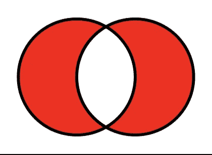
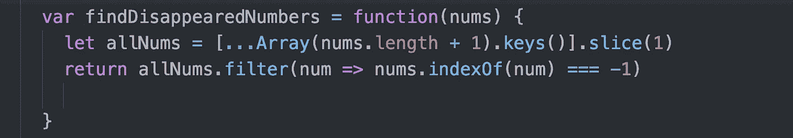

# 算法 101:找出 JavaScript 中两个数组的区别

> 原文：<https://javascript.plainenglish.io/algorithms-101-find-the-difference-between-two-arrays-in-javascript-c19f12dee103?source=collection_archive---------1----------------------->

## 诺布。算法#23，一个定制的，快速的方法来找出两个数组的不同



difference between two arrays in red, image from Wikipedia

今天来自 LeetCode 的挑战是[找到数组中所有消失的数字。](https://leetcode.com/problems/find-all-numbers-disappeared-in-an-array/)


# 强力

我们的输入包括一个带有缺失数字的实际数组。我们希望将该数组与相同长度的数组进行比较，其中没有遗漏数字。所以如果给我们`[4,3,2,7,8,2,3,1]`，我们想比较它`[1,2,3,4,5,6,7,8].`

进行比较的一种方法是生成没有遗漏数字的数组。我们可以用 Array.keys 来做这件事(这里是 [MDN 文档](https://developer.mozilla.org/en-US/docs/Web/JavaScript/Reference/Global_Objects/Array/keys))。

这是如何工作的:


注意你可以使用**。slice(index)** 返回从作为参数传入的索引开始的所有元素。

在我们的代码中，我们可以像这样使用这些概念:


现在，我们可以使用 JavaScript 的。filter()比较两者:


在第 3 行，我们要求返回所有 Nums 中那些不包含在 nums 中的数字的值。

这种方法可行，但速度很慢。


交换出去。includes 的 indexOf()没有太大的区别:



# 我们需要一种新的方法！

LeetCode 上有上百万种解决方案——我一直在寻找一种对像我这样的新手来说既高效又容易理解的解决方案。我发现一个很棒的是 LeetCode 的[***ashotovich 1990***](https://leetcode.com/ashotovich1990)***。***

先解释概念最简单。然后我们将继续构建代码。他是这样解决问题的:

## **设置**

建立一个长度正确的比较数组，其中所有的值都是假的。如果你的输入是`[1,2,2]`，你的比较数组将是`[false, false, false]`。

## **第一循环**

遍历输入数组，修改比较数组，如下所示(后面会解释)。

```
input array:                               [  1  ,   2   ,   2   ]comparison array before loop:              [false, false , false ]comparison array after loop:               [ true , true , false ]
```

## **第二循环**

遍历修改后的比较数组。当你找到`false`时，抓取它的索引并加 1 来确定缺少的数字的值。

```
comparison array after loop:               [ true , true , false ]indices =>                                     0   ,   1  ,   2missing number = index of false + 1                           3
```

最后，将每个缺失的数字推入一个响应数组并返回响应。

# 构建我们的解决方案

首先，让我们建立一个名为`missing`的空数组。我们将用它来收集我们丢失的号码。(Noobs:你会经常看到这个名为`res`的数组，是`response`的简称。我更喜欢用更有语义的名字)。


## 步骤 1，设置比较数组

让我们使用 JavaScript 的**来设置我们的比较数组。fill()** 。下面是设置新阵列的工作原理。(也可以用它来覆盖现有数组的值。 [MDN 文档此处](https://developer.mozilla.org/en-US/docs/Web/JavaScript/Reference/Global_Objects/Array/fill))。


在下面的代码中，我们将比较数组保存为`seen`。我们开始时将所有的值都设置为 false，以表明我们还没有从输入数组中“看到”任何数字。


## 第二步，我们的第一个循环。将“seen”中的适当值更改为 true。

```
let nums = [1,2,2]
//seen = [false, false, false]for (let i = 0; i < nums.length; i++) {
        seen[nums[i]-1] = true;
    };
```

让我们打开它。我们正在循环我们的输入数组，`nums.`我们正在检查每个`nums[i]`处的值，减去 1，然后将同一个索引`seen`处的值改为等于`true.`

如果这让你困惑，你并不孤单。使用上述输入，以下是`seen`在每次循环后的演变:

```
let nums = [1,2,2]
seen = [false, false, false]seen[nums[i]-1] = true; loop 1, i = 0:
      seen[nums[0] - 1]
  =>  nums[0] = 1
  =>  seen[1 - 1] 
  =>  seen[0] = true seen => [true, false, false] loop 2, i = 1:
      seen[nums[1] - 1]
  =>  nums[1] = 2
  =>  seen[2 - 1] 
  =>  seen[1] = trueseen => [true, true, false] loop 3, i = 3:
      seen[nums[3] - 1] 
  =>  nums[2] = 2
  =>  seen[2 - 1] 
  =>  seen[1] = trueseen => [true, true, false]
```

我们目前的代码是:


## 第三步。我们的第二个循环。

在这里我们循环通过`seen`，寻找`false`的值。

```
1\.  for (let i = 0; i < seen.length; i++) {
2\.         if (!seen[i]){
3\.           missing.push(i+1);
4\.   };
```

在第 2 行，seen[i]是我们正在循环的当前项目。当我们写`if(!seen[i])`时，我们是说，如果当前项的值为假(继续到第 3 行)。

在第 3 行，我们在索引号上加 1 以获得缺失数字的值，并将该数字放入缺失数组中。

这是最终代码。


Thank you Ashotovich1990!

这对内存来说不太好，但对速度来说很好！


你可以在 PythonTutor.com 上看到实时执行的代码，也可以在 repl.it:

[https://repl.it/@Joan_IndianaInd/missing-numbers-in-array](https://repl.it/@Joan_IndianaInd/missing-numbers-in-array)

**版权所有琼·印第安纳·琳斯 2019**

*接下来:* [*算法 101、#24:算法中位数的积与和——两种解法*](https://medium.com/@joanrigdon/algorithms-101-product-and-sum-of-digits-in-javascript-2c09925ac11a)

*以防你错过:* [*算法 101、# 22:JavaScript 中的旋转数组——三解*](https://medium.com/javascript-in-plain-english/algorithms-101-rotate-array-in-javascript-three-solutions-260fbc923b64)