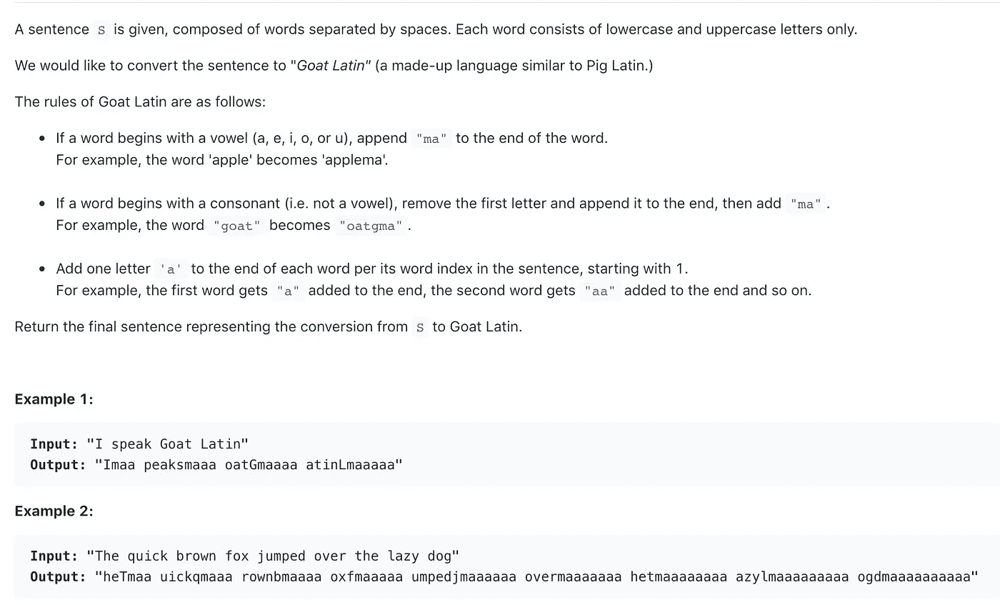
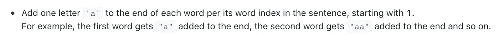
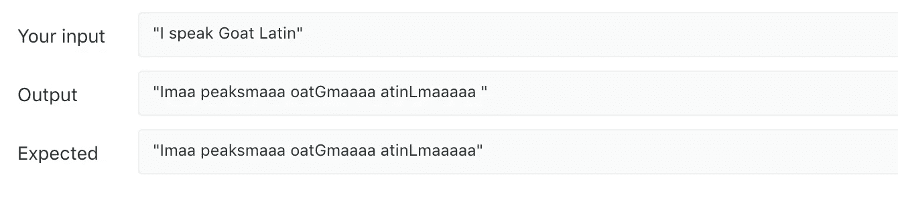
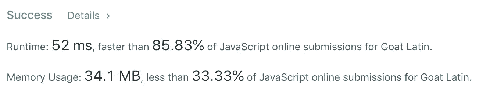

# 算法 101:JavaScript 中的山羊拉丁语

> 原文：<https://javascript.plainenglish.io/algorithms-101-goat-latin-in-javascript-d388cc29dc73?source=collection_archive---------4----------------------->

noob 诉 LeetCode，第 5 集—字符串操作


Latine loqui quod non realiter

今天来自 LeetCode 的挑战:把一个字符串翻译成‘山羊拉丁语’。以下是说明:



this tape will now self-destruct ….

我知道我必须循环阅读句子中的每个单词，然后翻译它。我也知道我需要一个地方来存放我翻译的单词。所以我设置一个变量结果等于一个空字符串:

`let result = ""`

接下来，我为迭代做好了准备。首先，我将输入字符串`S`分割成一个单词数组。

```
let sentence = S.split(‘ ‘)
 for (let i = 0; i < sentence.length; i++) {
 // translate each word
}
```

# 怎么翻译？

首先，我把问题分解成更小的问题:

对于每个单词:

1.  弄清楚它是以元音还是辅音开头
2.  如果它以辅音开头，就跟着辅音

然后，对于所有单词，包括我们刚才操作的辅音:

3.添加“马”

4.根据翻译单词在句子中的位置，在单词的末尾加上一个“a”。

# 第一步。它是以元音还是辅音开头的？

不要问，“这个单词的第一个字母是元音还是辅音？”让我们换一种方式问同样的问题:“元音列表包括单词的第一个字母吗？”

为此，我们需要一个元音列表:

`let vowels = [“a”, “e”, “i”, “o”, “u”]`

## 命名您的变量

我使用 split()方法将字符串转换成单词数组。虽然让代码尽可能短很诱人，但是记住，你总是可以在以后重构。当你还在解决一个问题时，用有意义的名字声明变量会很有帮助。对于这个挑战，我为*单词*和*首字母*声明了变量:

```
let sentence = S.split(‘ ‘)
for (let i = 0; i < sentence.length; i++) {
   let word = sentence[i].split(‘’)
   let firstLetter = word[0]
  //translate
}
```

现在让我们检查一下我们的第一个字母是否是辅音:

```
if (!vowels.includes(firstLetter.toLowerCase())){
 // follow consonants rule
}
```

让我们打开它。没有了`!`，或者“bang”又名“逻辑非”运算符，我们正在检查我们的第一个字母是否是元音字母。用它，我们检查它是否是一个元音*而不是*，在这种情况下，它是一个辅音。

*注意*:由于我们的元音列表都是小写的，我们在*的第一个字母*上调用 toLowerCase()，所以如果结果是一个大写的元音，我们仍然会将其识别为一个元音。

# 第二步。辅音规则。让我们拼接！

如果一个单词是以辅音开头的，我们需要把它去掉，加到末尾。

[JavaScript 的 splice()方法](https://developer.mozilla.org/en-US/docs/Web/JavaScript/Reference/Global_Objects/Array/splice)在这里很好用。`word.splice(0,1)` 说，‘进入单词数组，从元素 0(数组的第一个元素)开始，去掉一个元素，返回剩下的’。

例如，`[“G”, “o”, “a”, “t”].splice(0,1)`返回:`[“o”, “a”, “t”]`，`[“G”, “o”, “a”, “t”].splice(2,2)`返回:`[“G”, “o”]`

在去掉第一个字母后，我们需要将它添加到单词的末尾。我们可以使用 push()。

`word.push(firstLetter)`

# 第三步。所有单词的规则

现在我们已经实现了辅音规则，我们需要实现所有单词的规则:添加“ma”和正确数量的“a”

我们可以用 [push()](https://developer.mozilla.org/en-US/docs/Web/JavaScript/Reference/Global_Objects/Array/push) 加上“马”。

`word.push(“ma”)`

到目前为止，我们的代码是这样的:

```
const toGoatLatin = function(S) {
    let result = ""
    let vowels =  ["a", "e", "i", "o", "u"]
    let sentence = S.split(' ')

    for (let i = 0; i < sentence.length; i++) {     
       let word = sentence[i].split('') 
       let firstLetter = word[0]

       if (!vowels.includes(firstLetter)){
           word.splice(0,1)
           word.push(firstLetter)
       }//now that we're done with the consonant rule, here's the rule we follow for all words:

       word.push("ma")
       // figure out how to add "a"'s
       //add translated word to results string
    }return result
};
```

# 关于那些 a…

要添加正确数量的“a ”,我们需要弄清楚两件事:

1.  “a”的正确数字是多少？
2.  我们如何把这个数字加到单词的末尾？

让我们再看一下说明:



记住，我们是这样定义 word: `let word = sentence[i].split(‘’)` 的，所以这个单词的索引被嵌入到它的定义中。

如果一个单词在句子中是第一个，它的索引是 0，它得到一个“a”。如果是第二个，它的索引为 1，得到 2 个 a，所以它应该总是得到 index + 1 个 a。

现在我们有了正确的数字，我们如何把这个数字加到字符串的末尾呢？我们可以使用…

# 重复()

a。例如，重复(3)给了我们“aaa”

首先我尝试了这个:`word.push("a".repeat(i+1))`，但是它返回了一个错误:`Uncaught TypeError: word.push is not a function at <anonymous>`

所以我试着将多余的“a”存储在它们自己的变量中:

```
let addon = ("a").repeat(i + 1)
word.push(addon)
```

成功了！

然后，我将翻译的单词添加到结果字符串中:

`result += word.join(‘’) + ‘ ‘`

[join()](https://developer.mozilla.org/en-US/docs/Web/JavaScript/Reference/Global_Objects/Array/join) 将数组的每个元素放入一个字符串中。

# **第四步:返回结果**

此时，我们已经翻译了每个单词，并将其添加到结果字符串中。现在我们只需要返回结果。

但是`return result`并没有达到预期效果:



yup, that’s an extra space at the end

# 子字符串()

为了去掉末尾的空格，我使用了 [substring()](https://developer.mozilla.org/en-US/docs/Web/JavaScript/Reference/Global_Objects/String/substring) 方法，它有两个参数，起始索引和结束索引。

`return result.substring(0, result.length — 1)` 删除最后一个空格。这是整个函数:

```
const toGoatLatin = function(S) {
    let result = ""
    let sentence = S.split(' ')
    for (let i = 0; i < sentence.length; i++) {  

       let vowels =  ["a", "e", "i", "o", "u"]
       let word = sentence[i].split('') 
       let firstLetter = word[0]

       if (!vowels.includes(firstLetter.toLowerCase())){
           word.splice(0,1)
           word.push(firstLetter)
       }

       word.push("ma")
       let addon = ("a").repeat(i + 1)
       word.push(addon)
       result += word.join('') + ' '
    }return result.substring(0, result.length - 1)
};
```

虽然没有惊人的快，但比大多数都要快:



*接下来:* [*算法 101、#6:将 JavaScript* 中的罗马数字转换成整数 ](https://medium.com/javascript-in-plain-english/algorithms-101-convert-roman-numerals-to-integers-in-javascript-d3aba86a43d4)

[*以防你错过:算法 101，#4:在 JavaScript 中爬楼梯/ noob 重新学习斐波那契数列*](https://medium.com/@joanrigdon/algorithms-101-climbing-stairs-in-javascript-c8dec14cb2f6)

版权所有琼·印第安纳·琳斯 2019