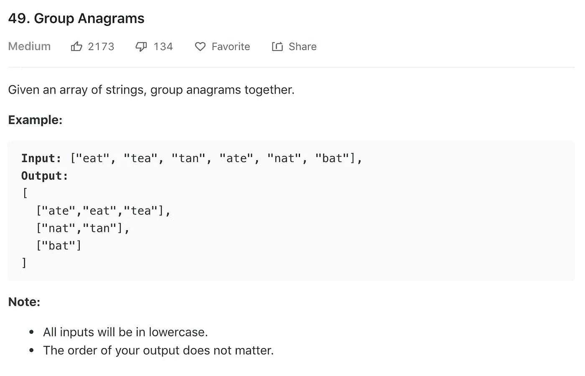
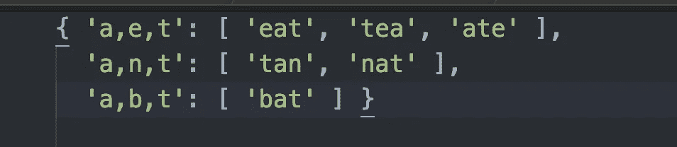
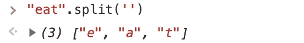
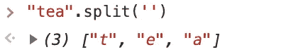
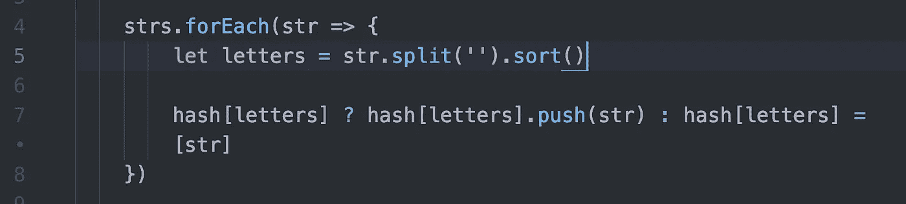
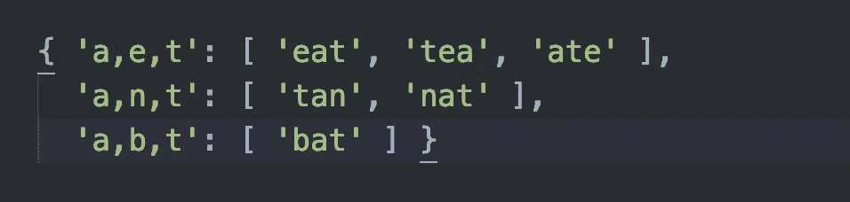
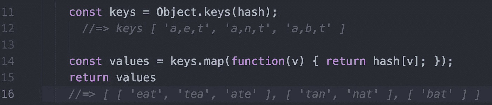
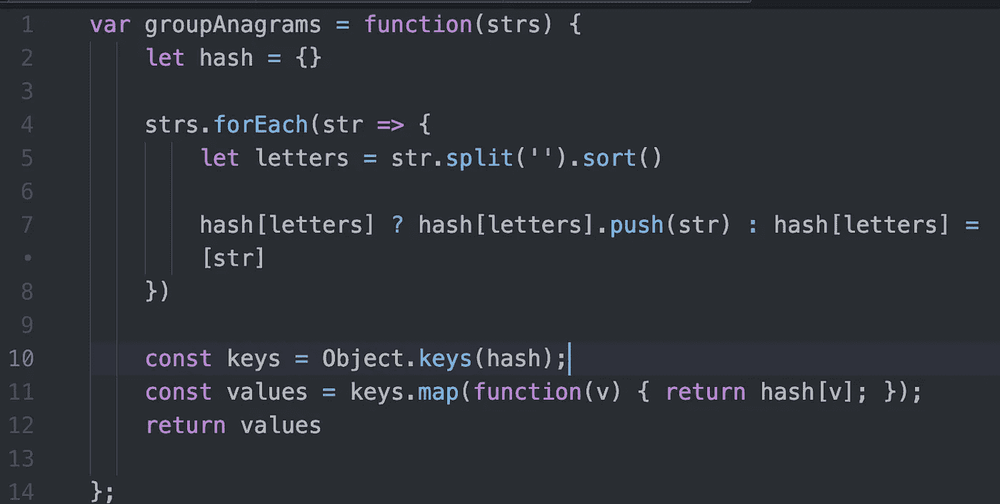
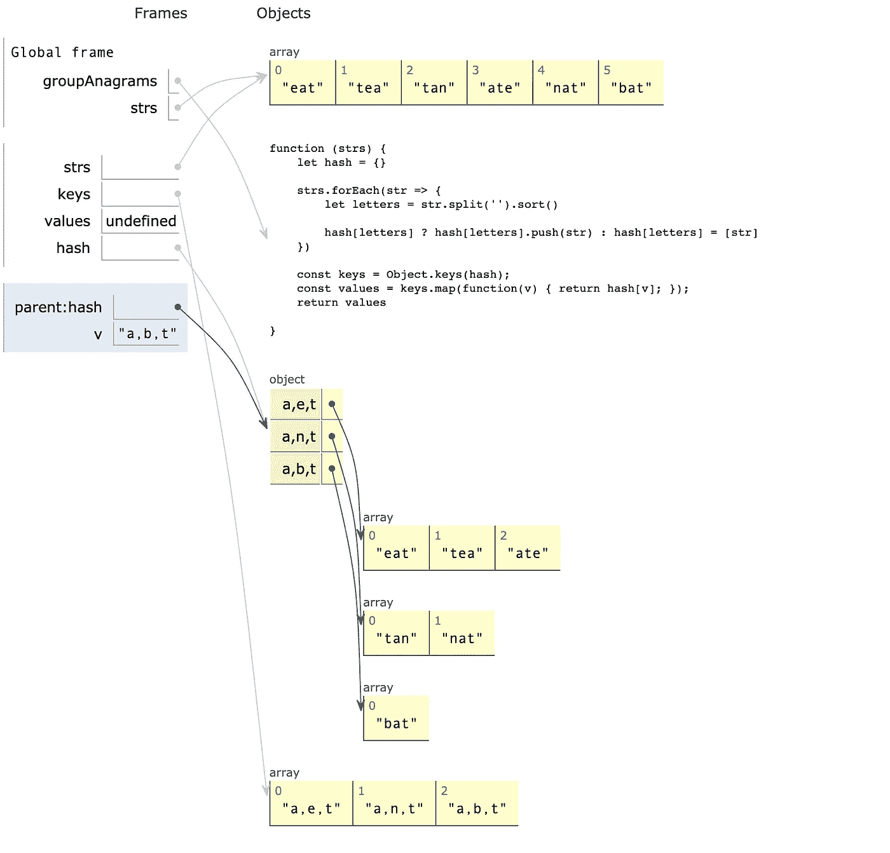
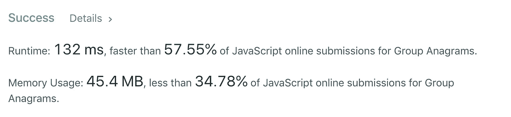

# 算法 101:JavaScript 中的分组字谜

> 原文：<https://javascript.plainenglish.io/algorithms-101-group-anagrams-in-javascript-b3e3c10d211e?source=collection_archive---------1----------------------->

## Noob 诉算法#18:散列的乐趣


image from wordsmith.org

前几天碰到[这个来自 LeetCode 的挑战:](https://leetcode.com/problems/group-anagrams/)



我原以为会相当困难，但我惊喜地发现！

# 变位词的定义如何帮助我们排序？

你已经知道什么是变位词，但是考虑一下这里的细节是值得的。互为变位词的单词都有相同的字母。

使用上面的例子…

如果我们有一个标有`“a” “e” “t”`的篮子，我们可以把单词`“ate”, “eat”` 和`“tea”`放进里面。

类似地，如果我们有一个标有`"t" "a" "n"`的篮子，我们可以把单词`"nat"`和`"tan"`放在里面，等等。

这意味着我们可以通过将每个字符串简化为字母，然后以某种方式将每个字母集连接到每个只包含这些字母的字符串来解决这个难题。

我们将如何连接它们？用哈希！

我们将构建一个如下所示的散列:



我们的输入如下所示:

`[“eat”,”tea”,”tan”,”ate”,”nat”,”bat”]`

要将其转换为散列，我们需要遵循以下步骤。

## 1.设置一个空散列

`let hash = {}`

## 2.从每个字符串中提取字母，并使它们成为我们新散列中的一个键

例如，要从“eat”中获取字母，我们可以使用 JavaScript 的。split()方法:



如果我们把那个键添加到我们的 hash 中，我们就可以让那个键指向一个数组来保存使用这些字母的字谜。评估完“吃”之后，我们会得到这样的结果:

```
hash = {
     ["e", "a", "t"]: ["eat"]}
```

但是当我们说到“茶”这个词时，我们就有问题了。它是“吃”的变位词，所以我们应该将其添加到同一个数组中。相反，当我们运行 split 时，我们以不同的顺序结束相同的字母…



所以代替这个的是:

```
hash = {
     ["e", "a", "t"]: ["eat", "tea" ]}
```

我们以此结束:

```
hash = {
     ["e", "a", "t"]: ["eat"], ["t", "e", "a"]: ["tea"]}
```

为了避免这个问题，在我们将字符串拆分成字母后，我们可以按字母顺序排列这些字母。如果我们对“吃”和“茶”都这样做，我们最终会得到这样的结果:

```
hash = {
     ["a", "e", "t"]: ["eat", "tea ]}
```

这正是我们想要的！

## 3.建立一个循环来构建我们的散列

现在我们知道了我们想要的散列是什么样子，让我们建立一个循环来构建我们的散列。



让我们打开它。在第 4 行，我们使用了一个 forEach 循环，它接受一个回调函数。

回调函数告诉我们拆分每个字符串，对字母进行排序，并将结果保存为变量 *letters。*

在第 7 行，我们使用一个三元函数来检查我们的 hash 是否已经有了一个*字母的键。*

如果它还没有一个*字母*的键，我们添加这个键，并将字符串(我们刚刚从中获得字母的那个)压入这个键的值:

```
hash[letters].push(str)
```

如果密钥确实存在，我们就不需要添加密钥。相反，我们继续将字符串推入键值。

在我们的循环完成对每个字符串的评估后，我们的哈希如下所示:



## 最后一步:用 Object.keys()格式化输出

现在我们有了散列，我们需要使它看起来像我们想要的输出:


note: the order of the nested arrrays does not matter

我们不需要钥匙了。我们只需要把我们的值放入一个数组中。(如果我们使用的是 Ruby，我们可以简单地运行`hash.values() )`。

在 JavaScript 中，我们可以将所有的键放入一个数组中，然后映射这些键以返回一个包含所有值的数组。



现在一起:



你可以在 repl.it 上玩这个代码:

[https://repl.it/@Joan_IndianaInd/group-anagrams](https://repl.it/@Joan_IndianaInd/group-anagrams)

在[PythonTutor.com](http://www.pythontutor.com/)上玩也总是很有趣(PythonTutor 是一个使用多种语言的代码可视化工具，不仅仅是 Python！)



这里是 PythonTutor 上代码的[链接。](http://www.pythontutor.com/visualize.html#code=%0Alet%20strs%20%3D%20%5B%22eat%22,%22tea%22,%22tan%22,%22ate%22,%22nat%22,%22bat%22%5D%0A%0Avar%20groupAnagrams%20%3D%20function%28strs%29%20%7B%0A%20%20%20%20let%20hash%20%3D%20%7B%7D%0A%0A%20%20%20%20strs.forEach%28str%20%3D%3E%20%7B%0A%20%20%20%20%20%20%20%20let%20letters%20%3D%20str.split%28''%29.sort%28%29%0A%0A%20%20%20%20%20%20%20%20hash%5Bletters%5D%20%3F%20hash%5Bletters%5D.push%28str%29%20%3A%20hash%5Bletters%5D%20%3D%20%5Bstr%5D%0A%20%20%20%20%7D%29%0A%0A%20%20%20%20const%20keys%20%3D%20Object.keys%28hash%29%3B%0A%20%20%20%20const%20values%20%3D%20keys.map%28function%28v%29%20%7B%20return%20hash%5Bv%5D%3B%20%7D%29%3B%0A%20%20%20%20return%20values%0A%0A%7D%3B%0A%0AgroupAnagrams%28strs%29%0A&cumulative=false&curInstr=29&heapPrimitives=nevernest&mode=display&origin=opt-frontend.js&py=js&rawInputLstJSON=%5B%5D&textReferences=false)

顺便说一下，我们的算法在 LeetCode 上的表现比大多数算法都要好:



琼·印第安纳·莱内斯 2019

万一你错过了: [*算法 101 #17，在 JavaScript 中数素数*](https://medium.com/javascript-in-plain-english/algorithms-101-count-primes-in-javascript-97f1ff85e040)

接下来: [*算法 101 #19、JavaScript 中的水平天井*](https://medium.com/@joanrigdon/algorithms-101-level-patio-in-javascript-c9e98696694e)