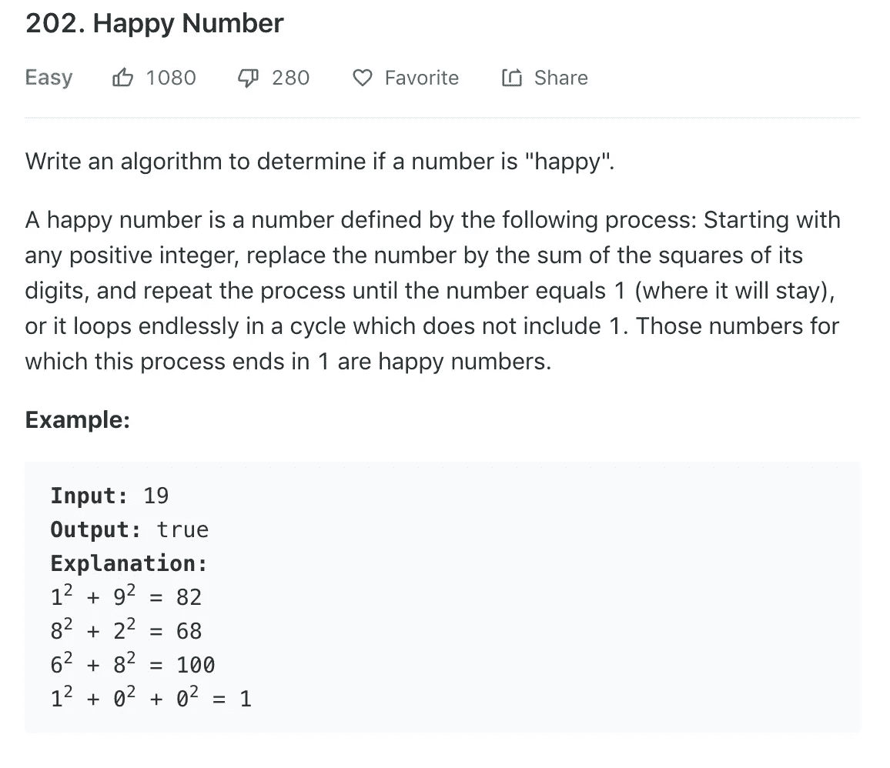
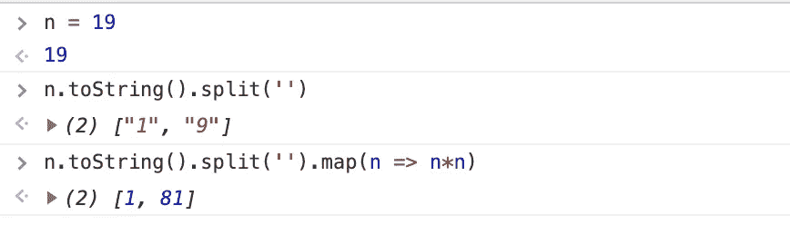
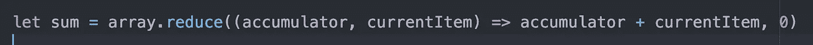
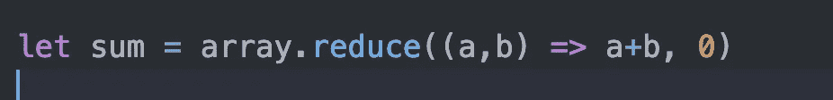
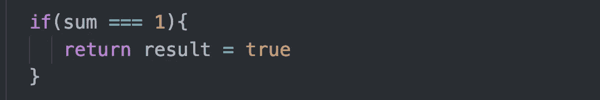
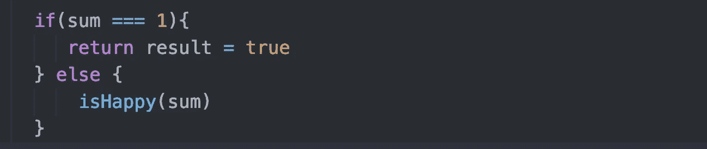
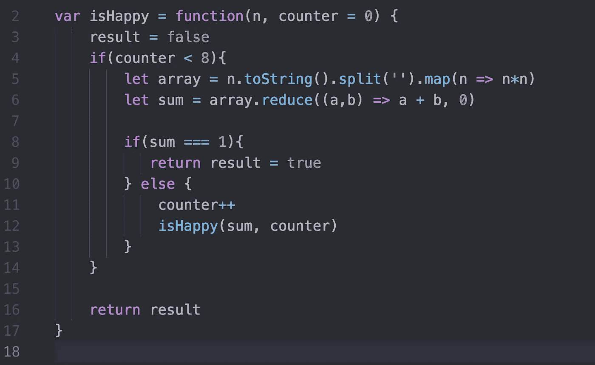
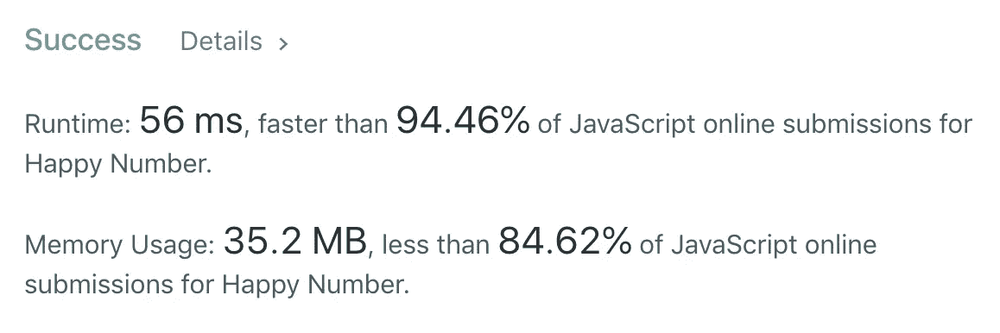

# 算法 101:JavaScript 中的快乐数字

> 原文：<https://javascript.plainenglish.io/algorithms-101-happy-number-in-javascript-bddeb3d17035?source=collection_archive---------2----------------------->

## Noob 诉算法#14，使用。reduce()，递归和缺省参数


from wikimedia commons

如果你曾经发现幸福难以捉摸，你会很高兴知道有一种叫做[幸福数字](https://en.wikipedia.org/wiki/Happy_number)的东西。LeetCode 是这样描述的:



```
var isHappy = function(n){//write code here}
```

[这是 LeetCode 上挑战的链接。](https://leetcode.com/problems/happy-number/)

## 那么，如果一个数字‘n’是快乐的，我们该如何编写返回 *true* 的代码呢？

使用上面的示例，我们将遵循以下步骤:

1.  把数字 19 分解成 1 和 9。
2.  平方每个数字
3.  对平方求和
4.  检查总和是否等于 1
5.  如果总和为 1，则返回 true
6.  否则，返回步骤 1 并重复。

## 第 1 步和第 2 步:将数字分解成几个数字，并对每个数字求平方


假设 n 是 19。下面是上面的代码如何一步一步地工作:



## 第三步:求和，使用。减少()

在 JavaScript 中，任何时候想要将数组简化为单个值，都可以使用 reduce 函数，该函数将一个函数作为参数。



writing this out longhand to make it easier to understand!

在上面的代码中，array.reduce()接受一个回调函数。这个回调将总和设置为零的初始值。然后遍历数组中的每一项，

在第一个循环中，它将 *currentItem* 加到初始值 0 上。它将总和存储在*累加器中。*在后续循环中，将 *currentItem* 加到*累加器*中。完成后， *sum* 等于数组中所有元素的总和。

## 图片帮忙！关于这是如何工作的优秀 gif，[请看这里。](http://reduce.surge.sh/)

一旦你理解了这个概念，你就可以缩短你的。将()代码简化为:



shorthand

## 步骤 4 和 5:检查总和:如果总和等于 1，则返回 true。



## 第六步，最难的部分:你到底如何重新开始？

我想编写一个递归的解决方案，就像这样。



但是如果 sum 永远不等于 1，这个函数将会无限循环下去。不不。

obligatory infinite loop giphy

为了阻止这种情况发生，我们需要一个基本案例。换句话说，我们希望这个函数什么时候停止调用自己？

如果一个数字是快乐的， *sum* 最终解析为 1。但如果它不快乐，我不确定会发生什么(我不太懂数论)。所以我决定这个函数应该调用自己有限的次数。

为此，我想添加一个计数器。

这在递归函数中很难做到。我习惯在函数顶部附近给计数器设置一个初始值，即:`let counter = 0`。但是如果你在一个递归函数中这样做，你的计数器在每次递归中被重置为零。

为了解决这个问题，您可以将计数器作为默认值为零的参数传递给函数。

如果*计数器*传入一个值，该函数将使用该值；但是如果*计数器*传入时没有值，该函数会将*计数器*读取为 0。(这里是关于默认参数的 [MDN 文档。)](https://developer.mozilla.org/en-US/docs/Web/JavaScript/Reference/Functions/Default_parameters)



让我们打开它。

我们将在函数结束时返回“result”。我们给结果一个假的初始值。

然后，从第 5 行开始，只要我们尝试的次数少于 8 次，我们就将`n`分解成它的数字，对它们求平方，对平方求和，并检查总和是否为 1。如果是，我们设置*结果*等于*真*并且退出循环。否则，我们递增计数器并重新开始。

*注意:*首先我尝试了 5 作为最大循环次数；它没有通过 LeetCode 测试，所以我把数字增加到 8，这确实有效。

而且，效果很好！



你可以在 repl.it 上玩这个代码:[https://repl.it/@Joan_IndianaInd/Happy-Number](https://repl.it/@Joan_IndianaInd/Happy-Number)

版权所有琼·印第安纳·琳斯 2019

接下来: [*算法 101 #15，可以在 JavaScript* 中放置花朵](https://medium.com/@joanrigdon/algorithms-101-can-place-flowers-in-javascript-b87c6cb1dc24)

万一你错过了: [*算法 101，# 13:JavaScript 中的帕斯卡三角*](https://medium.com/javascript-in-plain-english/algorithms-101-pascals-triangle-in-javascript-9fbd9032871)