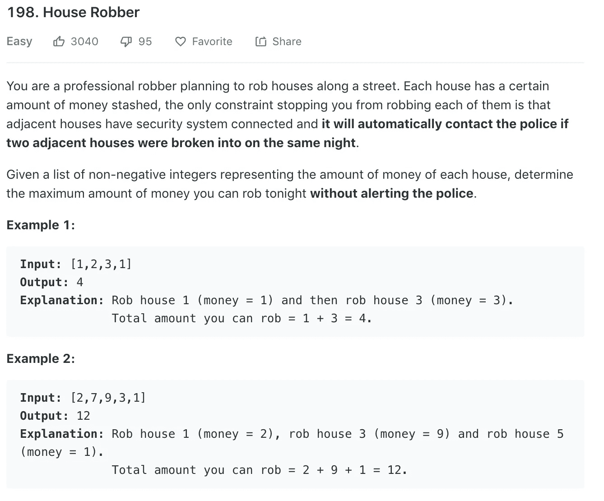

# 算法 101:JavaScript 中的入室抢劫犯

> 原文：<https://javascript.plainenglish.io/algorithms-101-house-robber-in-javascript-da3e6ee36241?source=collection_archive---------1----------------------->

## Noob 诉 LeetCode，第 7 集，数组操作。


有个强盗逍遥法外！他做过功课，所以他知道这个街区每栋房子的贵重物品的市价。这是 LeetCode 上的描述。[这是链接。](https://leetcode.com/problems/house-robber/)



这绝对属于容易的范畴，但是 Noob 并不觉得容易。我和一些朋友一起研究过这个，事实上我们都不觉得它容易！

我的第一个猜测是——也许我们应该把所有偶数的房子和所有奇数的房子加起来，然后选择最大的。这种策略对上面的测试案例有效。不幸的是，它在很多情况下都不起作用。

例如，在此数组中:

`array = [1, 9, 6, 3, 2, 7, 9]`

偶数索引(数组[0]，数组[2]等)加起来是 18；奇数指数加起来是 19。但是如果你是 cherrypick，你可以选择 9s 和 3，总共 21 个。

# 那么，我们如何在代码中选择呢？


very carefully …

我的视觉方法是寻找最大的数字，在心里避开它旁边的数字，然后选择剩下的最大数字，等等。这种方法对我们不起作用，因为它只考虑最大的数字，而不考虑旁边的数字。它没有考虑这样的数组:

`[ 1, 9, 9, 8, 4, 3]`

在这个数组中，我们有两个 9，但显然，我们最好选择前九个，因为这样，我们仍然可以选择 8。因此，在这两个大值之间进行选择的方法是在它们两边的值的上下文中进行比较。

我们考虑选择最大的数字，如果有几个数字，选择周围值最小的一个。在我们…对其他解决方案进行逆向工程之前，我们很难让这种方法发挥作用。

# 逆向工程——比放弃更好

我们找到的解决方案从数组的开始一次考虑三个数字，而不是从数组的中间选择最大值。我们是这样做的:

假设数组中至少有两个数字(只有一个和两个数字的数组是我们稍后将处理的边缘情况)，我们设置一个新的数组， *sorter* ，在这里我们可以计算我们的变化量。

我们首先将 nums 数组中的第一个数字添加到排序器中。然后，我们考虑 nums 数组中的第二个数字。既然相邻，就不能两个都选；我们将挑选两者中较大的一个，并把它放在分类器的末端。

这是我们目前掌握的情况:

```
let nums = [1, 5, 9, 4, 2, 20, 3, 7]
var rob = function(nums) { //deal with edge cases here //compare first two numbers of array, pick greater value
    let sorter = []
        sorter[0] = nums[0]
        // => [ 1 ] sorter[1] = Math.max(nums[1], nums[0])
        // => [1, 5]}
```

在评估了数组的前两个数字后，我们决定房子#2 是更好的选择，其可抢劫值为 5。

但是我们想记住房子#1，以防房子#1 的价值加上当前房子的价值(如果我们选择房子#2，我们必须避免这种情况)，加起来超过 5。

在下面的代码中，如果我们从房子#1 作为*选项 a 开始，我们将节省我们的最大收获。*如果我们从 2 号房屋开始作为*选项，我们将节省最大的收获。*

让我们把我们正在循环的项目， *nums[i]* 当作当前的*。*

*当我们决定是否在没有的情况下抢劫*当前时，我们需要考虑:是选择我们*选项 A* 的最大收获加上*当前没有*的最大收获，还是选择我们其他可能的*选项 B* 的最大收获，其中不包括*当前没有*的最大收获更有价值？然后，我们将这两个值中较大的一个添加到我们的*排序器*数组的末尾:**

```
*for(let i = 2; i < nums.length; i++){
        let optionA = sorter[i-2]
        let optionB = sorter[i-1]     
        let currentHouse = nums[i]

        if(option A + currentHouse > optionB){ 
            sorter[i] = optionA + currentHouse 
        }  else { 
           sorter[i] = optionB 
        }*
```

*让我们看看这一系列 num 是如何发挥作用的:*

```
 *[1, 5, 9, 4, 2, 20, 3, 7]*
```

*排序器从[ 1，5]开始*

*现在我们考虑第三个房子。我们是通过抢劫房子#3(价值 9)并将其添加到房子#1(价值 1)中获得更多的钱，还是应该坚持房子#2(价值 5)？由于 1 + 9 或 10 大于 5，我们将在*排序器*的末尾加上 10:*

*`sorter: [ 1, 5, 10]`*

*接下来，让我们看看 4 号房子。同样，我们是通过抢夺房子#4(值 4)并将其添加到*选项 A* (不包括房子#3 的收获)来获得更多的金钱，还是应该跳过当前房子并坚持使用*选项 B* (包括房子#3 的收获)。由于*选项 A* + *当前值* (5 + 4)小于*选项 B* (10)，我们将 10(较大的值)放在*排序器*的末尾。*

*`sorter [1, 5, 11, 10]`*

# *秘密武器*

*如果你跟不上其他菜鸟，不仅仅是你。但是——这里有一个秘密武器！(感谢 Cynthia Eddy 给我指出这一点！)*

*即使你没有使用 Python，你也可以使用[PythonTutor.com](http://pythontutor.com/)来运行多种语言的代码，让它一行一行地遍历代码，这样你就能确切地看到发生了什么。(当您登陆该页面时，点击“可视化您的代码…”链接，*

**

*click Visualize your code on the PythonTutor.com page*

*选择你的语言，用 input 输入你的代码，调用代码，然后点击‘可视化执行’。*

*在下一页，单击“前进”按钮，逐句通过您的代码。当您这样做时，它会填充代码中的值。*

*nums 数组位于顶部下方；分类器在底部。*

**

*下面是我们的代码，包括一个处理边缘情况的 if 语句:*

```
*var rob = function(nums) {
    if(nums.length === 1){
        return nums[0]
    } else if(nums.length === 0){
        return 0
    }

    let sorter = []
    sorter[0] = nums[0]
    sorter[1] = Math.max(nums[1], nums[0]) for(let i = 2; i < nums.length; i++){
        let optionA = sorter[i-2]
        let optionB = sorter[i-1]     
        let currentHouse = nums[i]

        if(optionA + currentHouse > optionB){
            sorter[i] = optionA + currentHouse
        } else {
            sorter[i] = optionB
        }

    }

    return sorter[sorter.length-1]
}*
```

**

# *重新因子！*

*感谢[本杰明·坎特鲁普](https://medium.com/@bjcantlupe)(见评论)，感谢他对修复这个循环的建议。我们从来不需要排序器中的所有值，只需要最后两个值。因此，我们可以在排序器中只存储和更新两个值，而不是构建一个长数组，如下所示:*

```
*for(let i = 2; i < nums.length; i++){
        let optionA = sorter[0]
        let optionB = sorter[1]     
        let currentHouse = nums[i]

        sorter[0] = optionB;
        sorter[1] = Math.max(optionA + currentHouse, optionB)
    }

return sorter[1];*
```

*在上面的代码中，在我们声明变量之后，我们通过将 sorter[0]设置为等于选项 B(排序器中当前的最后一个值)来更新它。然后，我们将排序器 1 更新为*选项 A +当前值*或*选项 B* 中的较大者，并且我们使用清理器 *Math.max()* 来完成。*

*在方法的最后，我们仍然返回 sorter 中的最后一个值。*

*现在我们的整个函数看起来像这样:*

```
*var rob = function(nums) {
    if(nums.length === 1){
        return nums[0]
    } else if(nums.length === 0){
        return 0
    }

    let sorter = []
    sorter[0] = nums[0]
    sorter[1] = Math.max(nums[1], nums[0]) for(let i = 2; i < nums.length; i++){
        let optionA = sorter[0]
        let optionB = sorter[1]     
        let currentHouse = nums[i]

        sorter[0] = optionB;
        sorter[1] = Math.max(optionA + currentHouse, optionB)
    }

    return sorter[1];
}*
```

*效率更高，可读性更强，但速度仍然很快！*

**

*[*接下来:算法 101，# 8:JavaScript 中买卖股票的最佳时机*](https://medium.com/@joanrigdon/algorithms-101-best-time-to-buy-and-sell-stock-in-javascript-7a2249b29495)*

**以防你错过:* [*算法 101，#6:在 JavaScript 中把罗马数字转换成整数*](https://medium.com/javascript-in-plain-english/algorithms-101-convert-roman-numerals-to-integers-in-javascript-d3aba86a43d4)*

**注:从技术上讲，一个不与任何人对抗就从房子里偷东西的人是窃贼！不是强盗。一个强盗抢劫一个人，一个窃贼从一个地方偷窃。**

*版权所有琼·印第安纳·琳斯 2019*