# 算法 101:JavaScript 中的 includes()与 indexOf()

> 原文：<https://javascript.plainenglish.io/algorithms-101-includes-vs-indexof-in-javascript-7f1b4af04127?source=collection_archive---------0----------------------->

## 算法#21:两个数组的交集。过滤器()

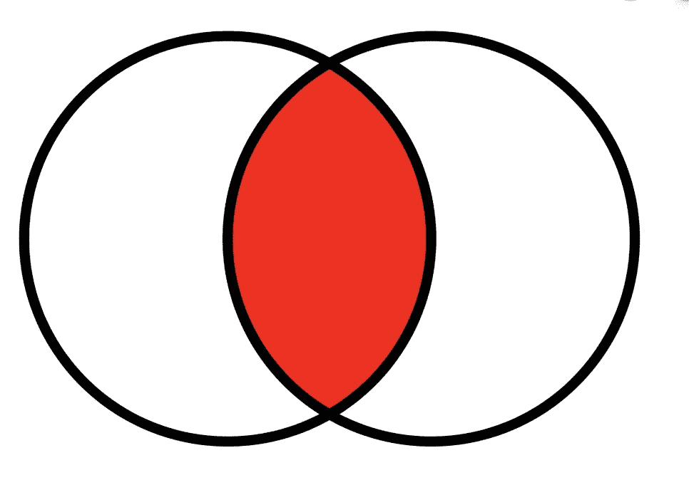

image from Wikipedia

在今天来自 LeetCode 的挑战中，我们在两个数组中寻找共同的项目。

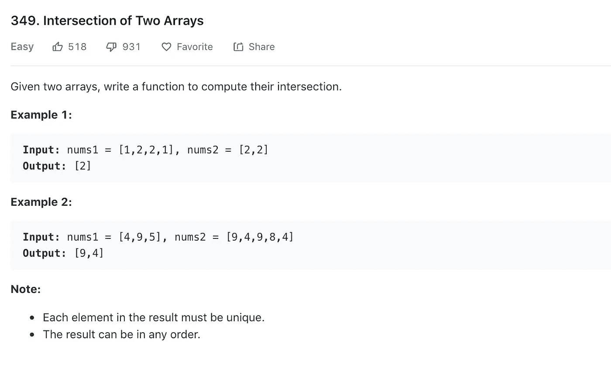

# 。过滤器()

我们可以使用。filter()方法返回一个包含所有满足条件的元素的新数组。

**是这样的。**滤镜()【起作用。 [(MDN 文档在此)](https://developer.mozilla.org/en-US/docs/Web/JavaScript/Reference/Global_Objects/Array/filter)

```
input: nums1 = [1,3,5,6,7,9]
nums1.filter(<callback method goes here>) //filter for elements that are greater than 4
nums1.filter(num => num > 4)
=> [6,7,9]//filter for elements that are even numbers
nums1.filter(num => num % 2 === 0)//filter for elements that are equal to 99
nums1.filter(num => num === 99)
=> []//filter for elements that are equal to "help"
nums1.filter(num => num === "help")
=> []
```

# 。包括()

让我们使用**将其应用到我们的挑战中。在我们的回调中包含()** [(MDN 文档在此)](https://developer.mozilla.org/en-US/docs/Web/JavaScript/Reference/Global_Objects/Array/includes)。

```
input: nums1 = [1,2,2,1], nums2 = [2,2]
nums1.filter(num => nums2.includes(num))
=> [2,2]
//desired output [2]
```

这让我们更接近了！**。includes()** 返回 nums2 ( [*MDN 文档此处*](https://developer.mozilla.org/en-US/docs/Web/JavaScript/Reference/Global_Objects/Array/includes) *)* 内 num 的每个实例。

# 一组

现在我们只需要返回唯一的项目。我们可以使用 ES6 的**设置**来实现。( [MDN 文档此处](https://developer.mozilla.org/en-US/docs/Web/JavaScript/Reference/Global_Objects/Set))。**设定**是一个对象。它只存储唯一的值，您可以遍历它。

您还可以通过将数组作为参数传递给 **new Set()** 来获取数组的唯一值，如下所示:

```
// Use Set to remove duplicate elements from the array 

const numbers = [2,3,4,4,2,3,3,4,4,5,5,6,6,7,5,32,3,4,5]

console.log([...new Set(numbers)]) 

// [2, 3, 4, 5, 6, 7, 32]
```

所以在我们的代码中，我们可以这样做:

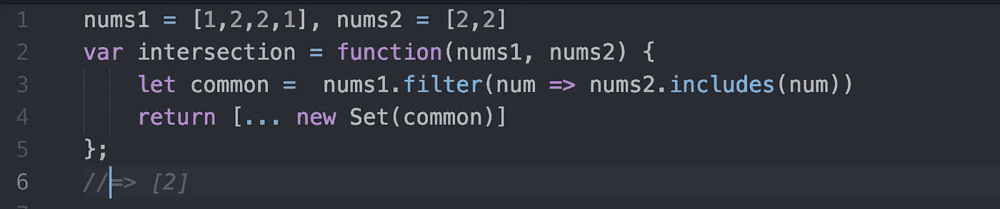

但是，根据 LeetCode，我们的运行时间并不是很长:

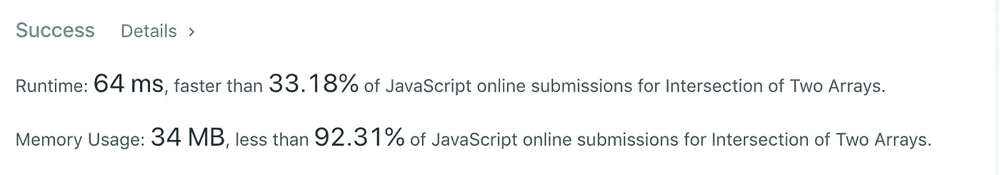

# 让我们加快速度——索引

我们可以通过使用 JavaScript 的**来加快速度。indexOf()** ( [*MDN 文档此处*](https://developer.mozilla.org/en-US/docs/Web/JavaScript/Reference/Global_Objects/Array/indexOf) *)* 。

它是这样工作的:

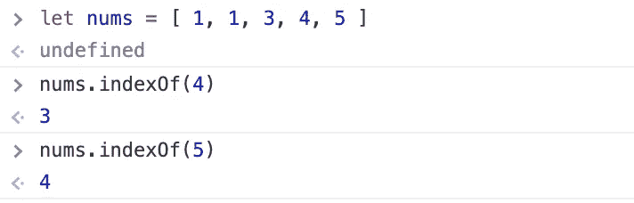

如果数组包含作为参数传递的值， **indexOf()** 返回该值的索引。

如果数组包含多个传入的值， **indexOf()** 返回该值的第一个索引，如下所示:

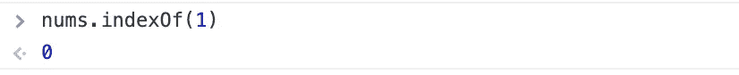

如果数组不包含传入的值，indexOf()返回-1:

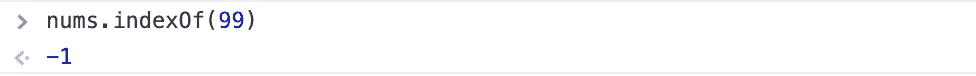

我们可以像这样在代码中使用它:

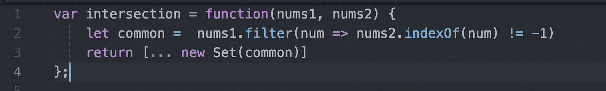

让我们打开它。在第 2 行，我们要求我们的过滤器返回每个元素，该元素的 indexOf()是*not*等于-1(记住，如果它不是负 1，它存在于数组中)。

顺便说一下，这些模式实现了相同的结果:

*   `nums2.indexOf(num) != -1)`
*   `nums2.indexOf(num) > -1)`

他们都试图建立指数是*而不是* `-1.`我更喜欢第一种，因为这是最直接的方式来说，我们正在寻找一个不等于负的值。无论哪种方式，这些模式都很难阅读！它们不是语义上的。

但是…如果你能接受这一点，现在我们的代码运行得更快了:

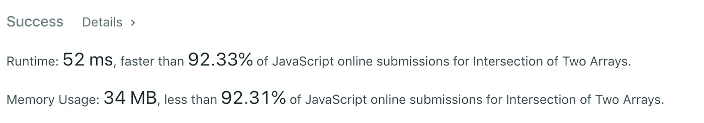

# 你什么时候使用？数组上的 includes()与 indexOf()。

**。includes()** 如果查找的项目在数组中，则返回布尔值 true 或 false。

**。indexOf()** 如果找到则返回索引，否则返回-1。

如果要在数组中搜索 NaN(非数字),请使用。包括()。indexOf()不会找到它，因为它使用了严格的等式运算符`===`，并且`NaN === NaN`的计算结果为`false`。

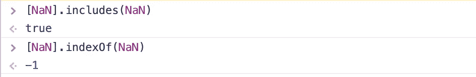

remember, -1 means ‘not found’

如果您正在搜索`undefined`，两种方法都有效(使用严格等式，`undefined === undefined`计算为`true`)。

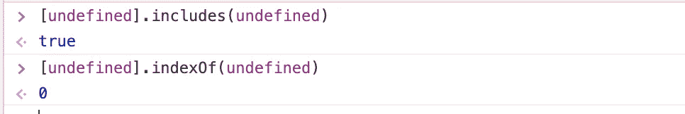

# 性能？

在这个挑战上，LeetCode 排名**。indexOf()** 为更快的方式；但是在 StackOverflow 和其他地方发布了许多基准测试，声称其中一个或另一个更快。

对我来说，当性能差别不大时，我会选择**。includes()** 因为它更容易阅读，因此也更容易维护！

你可以在[PythonTutor.com](https://bit.ly/2XjrEeN)上看到 JavaScript 代码的实时执行

你可以在 repl.it 上玩它:

【https://repl.it/@Joan_IndianaInd/StripedImportantArea】

# 嘘，红宝石迷们:

顺便说一下，如果你是 Ruby 的粉丝，Ruby 让这变得非常简单！

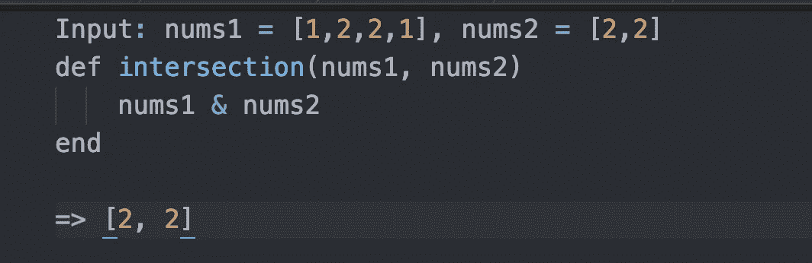

done.

**版权 Joan Indiana Lyness 2019**

*万一你错过了:* [*算法 101 #20，JavaScript*](https://medium.com/javascript-in-plain-english/algorithms-101-container-with-most-water-in-javascript-8843a962ee0f) 中盛水最多的容器