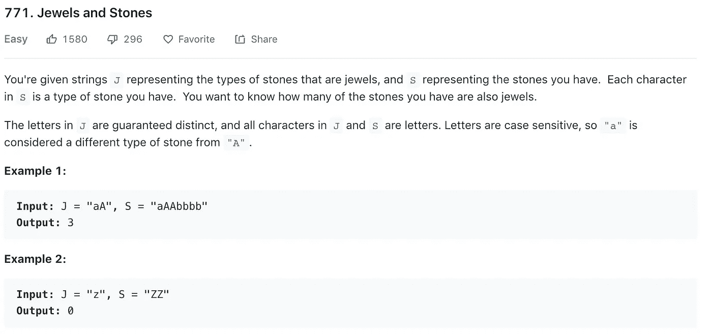
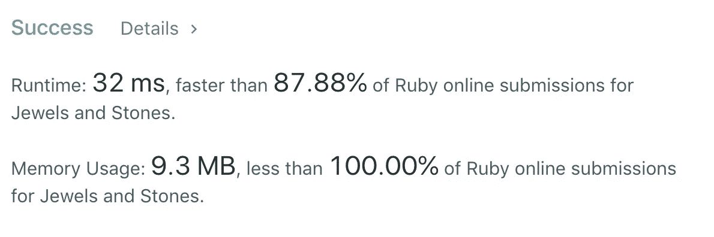
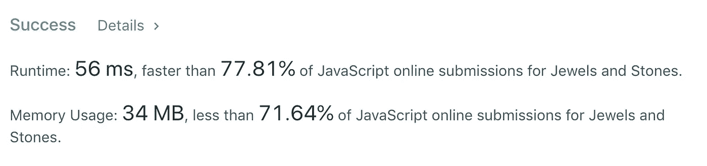
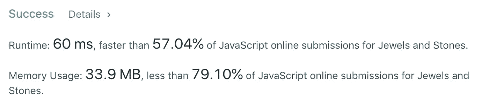

# 算法 101:红宝石和 JavaScript 中的宝石

> 原文：<https://javascript.plainenglish.io/algorithms-101-jewels-and-stones-in-ruby-and-javascript-c22fce37ad2b?source=collection_archive---------1----------------------->

## Noob 诉 LeetCode，第 9 集，计算字符串中的字符数


对于我的下一个简单的 LeetCode 挑战，我找到了这个，它涉及到在字符串中查找字母的出现:



因为我正试图提高我的 JavaScript 技能，所以我想从那里开始，但是我无法抗拒 Ruby，对于像这样的简单任务来说，Ruby 确实更直观。

我们正试图计算我们的 S，或石头串，包含了多少次来自 J 的字母，我们的珠宝串。

在 Ruby 中:

我们来设置一个计数器:`counter = 0`

然后将我们的 J 字符串拆分成一个数组，这样我们就可以轻松地迭代数组的元素:

`array = j.split(‘’)`

接下来，每当计数器在我们的“s”字符串中找到任何数组元素时，我们就递增它:

```
array.each do |el|
  counter += s.count(el) 
end
```

然后我们返回计数器。一起:

```
def num_jewels_in_stones(j, s)
    counter = 0
    array = j.split('')

    array.each do |el|
        counter += s.count(el) 
    end counter
end
```

还不错！它的速度非常快，内存使用量也非常低:



# 如果 javaScript 有那么简单就好了…

不打算撒谎。在 js 中使用相同的逻辑是一件痛苦的事情。

您仍然设置了一个计数器，并且仍然搜索 S 包含 J 中的一个字符的次数——但是语法比较沉闷。

```
 var numJewelsInStones = function(J, S) {
    let counter = 0;
   // iterate here
    return counter;
};
```

以下是 JavaScript 中迭代的基本模式:

```
for (let i = 0; i < S.length; i++) {
     if(J.indexOf(S.charAt(i)) !== -1)
         counter++;
    }
```

让我们打开它。

*   在第一行中，我们设置了一个值“I ”,这样我们就可以遍历 S 字符串的每个字符。
*   在第二行中，我们检查 S 中的字符在 J 中是否有索引(即它是否包含在 J 字符串中)。如果是的话，我们增加我们的计数器。
*   注意:如果 J 不包含我们正在寻找的字符，charAt()方法将返回`-1`。如果这个字符的索引不等于负一，我们实际上是在说，如果找到了这个字符。有时候这个也写成:`if(J.indexOf(S.charAt(i)) ≥ 0 )`。这只是一个看起来更干净的说法`!= -1`。

一起:

```
var numJewelsInStones = function(J, S) {
    let counter = 0;
    for (let i = 0; i < S.length; i++) {
        if(J.indexOf(S.charAt(i)) !== -1)
            counter++;
    }
    return counter;
};
```

不算太寒酸:



# 用 forEach()清理它

javaScript 有一个 forEach()方法，可以让您跳过

`for(let i= 0; i < array.length; i++)`语法。

语法是:

```
array.forEach(element => {
 // do something with element
});
```

您不能在字符串上使用它，但是您可以将字符串拆分成一个数组，并像这样使用它:

```
var numJewelsInStones = function(J, S) {
    let counter = 0;
    S.split('').forEach(element => {
        J.indexOf(element) >= 0 ? counter ++ : counter 
});return counter;
};
```

注意，在第 4 行，我们使用了一个三元运算符:`:`

它是这样工作的:

`condition met ? do this : otherwise do that`

这最后一个函数看起来稍微干净一点，并且和之前的函数有相同的属性。

# 迅速的

如果你真的想加快速度，你可以试试这个来自 [jssScripter](https://leetcode.com/jsscripter/) 的一行程序:

```
const numJewelsInStones = (J, S) => S.split('').filter(char => J.indexOf(char) !== -1).length;
```

让我们打开它。

我们仍然把 S 字符串拆分成一个数组。只是这一次，我们要过滤它——对于 S 的每个字符，如果在 J 中找到它，我们要返回该字符(同样，如果它的 indexOf 不等于-1)。一旦我们收集了这些字符，我们用. length 对它们进行计数。

它更快一点:



# 但是请注意，Ruby 要快得多。

Ruby 解决方案再次统计:


*接下来:* [*算法 101 #10、JavaScript 中的生日巧克力*](https://medium.com/javascript-in-plain-english/algorithms-101-birthday-chocolate-in-javascript-f5fcbd639bf3)

*以防你错过:* [*算法 101 #8、JavaScript 中买卖股票的最佳时间*](https://medium.com/javascript-in-plain-english/algorithms-101-best-time-to-buy-and-sell-stock-in-javascript-7a2249b29495)

版权所有琼·印第安纳·琳斯 2019