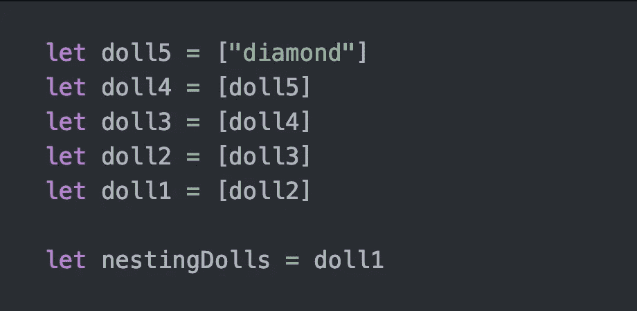
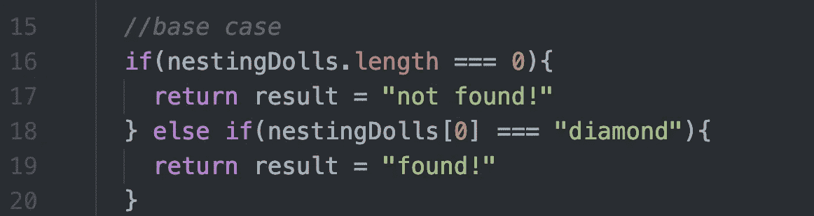
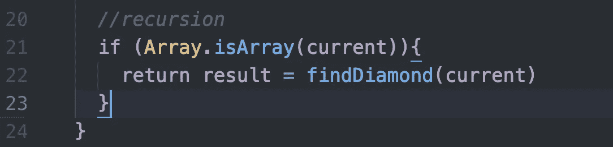
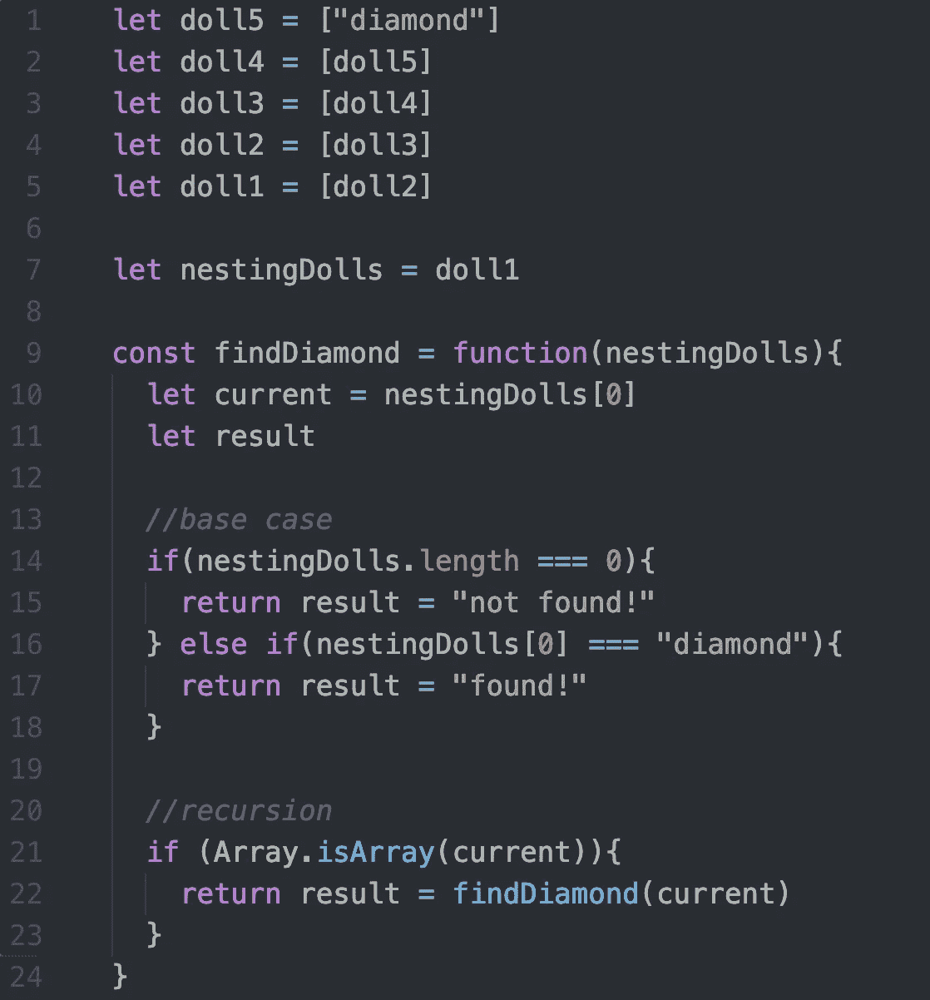

# 算法 101:学习 JavaScript 中嵌套玩偶的递归

> 原文：<https://javascript.plainenglish.io/algorithms-101-learn-recursion-with-nesting-dolls-javascript-a8c334fe65f6?source=collection_archive---------5----------------------->

## Noob 诉算法#12，递归的另一个例子

from nestingdolls.co

在我的上一篇文章中，我用公主和豌豆的例子讲述了 Ruby 中的递归。如果您理解了这一点，并想尝试一个更复杂的例子，让我们看看 JavaScript 中的另一个例子。

首先:递归是一个调用自身的函数。递归的一个经典用法是遍历文件树。

# 嵌套玩偶

打开文件树中的文件夹，以及这些文件夹中的文件夹，有点像打开嵌套玩偶。

假设一个朋友给你一套套娃。在打开的最小的娃娃里面，你会发现两样东西中的一个:一颗钻石！)或者什么都没有。

你将如何编写说明来确定你的套装是有钻石还是没有钻石？

# 搜索步骤

1.  打开娃娃。
2.  如果你找到了钻石，你的工作就完成了！
3.  如果你找到一个洋娃娃，打开它。
4.  如果你找到了钻石，你的工作就完成了！
5.  如果你找到一个洋娃娃，打开它。
6.  如果你找到了钻石，你的工作就完成了！
7.  如果你找到一个洋娃娃…

这里有一个模式。让我们浓缩一下:

1.  打开娃娃
2.  如果你找到了钻石，你的工作就完成了！跳过第 3 步。
3.  如果你找到一个洋娃娃，从第一步开始。

这是我们的嵌套玩偶在代码中的样子。

外面的娃娃是*doll 1*；当你打开它，你会发现*美元 2* 等。直到最后，你打开*美元，找到一颗钻石。*

# **基础案例，急需的出口！**

递归最重要的部分是基本情况——当满足条件时，函数停止调用自身。如果没有基本情况，递归函数就会无限循环下去。

recursive search with no base case = infinite loop!

定义基本情况最简单的方法是:我什么时候应该停止寻找？

在我们的例子中，我们需要两个基本案例。如果出现以下情况，我们希望停止寻找:

1.  我们打开了所有的娃娃却没有找到钻石，或者
2.  我们打开了所有的娃娃，找到了钻石。

在代码中:

第 16-17 行涵盖了我们打开所有娃娃却没有找到钻石的情况。(我们如何知道是否已经到达最后一个娃娃？因为最后一个娃娃要么什么都没有，要么是一颗钻石。如果我们找到一个娃娃，它一定是最后一个娃娃。)

第 18–19 行涵盖了我们打开一个非空娃娃并找到一颗钻石的情况。

# 递归

现在让我们编写搜索说明。

让我们打开它。

每次打开一个娃娃，我们都想知道——里面是不是还有一个娃娃(数组)？我们使用第 21 行来检查当前娃娃是否是一个数组。

如果是这样，我们将那个娃娃(名为 *current)* 的数组传递回函数中，并重新开始。

重要:我们不只是再次调用函数；我们说我们想返回这个函数的结果。结果在基本情况下定义。如果我们没有在第 22 行的开头包含“return result ”,我们就不会返回任何东西。

让我们看看整个函数:

第一次通过循环，我们检查以确保我们确实在看一些东西。我们看到的是 *doll1* ，这是一个长度为 1 的数组。

所以我们跳到第 20 行，遍历 *doll1* 的内容。我们找到 *doll2* ，把它传回来，检查它是否是空的，或者它的第一个项目是否是“钻石”。两者都不成立，所以我们回到第 20 行，迭代内容并找到 *doll3* 。诸如此类…

最后，我们到了最后一个娃娃，*娃娃 5* 。当我们将它反馈到函数中时，它满足第 16 行的基本情况的条件。即 *doll5* 内的第一项是*钻石*！

所以我们返回`result = “found!"`。现在有结果了，22 号线终于有回报了！所以我们的函数结束了。

你可以[在 repl.it 上玩这个代码。](https://repl.it/@Joan_IndianaInd/LemonchiffonGranularSpellchecker)试着把 *doll5* 改成 *[]* 看看没有方块的时候会发生什么。

# 需要更温和的递归介绍吗？

试试我之前关于递归的帖子， [*算法 101，#11:公主，豌豆&Ruby 中的递归。*](https://medium.com/@joanrigdon/algorithms-101-princesses-peas-and-recursion-in-ruby-dffb44799d6e)

[*接下来:算法 101，# 13:JavaScript 中的帕斯卡三角*](https://medium.com/javascript-in-plain-english/algorithms-101-pascals-triangle-in-javascript-9fbd9032871)

版权所有琼·印第安纳·琳斯 2019