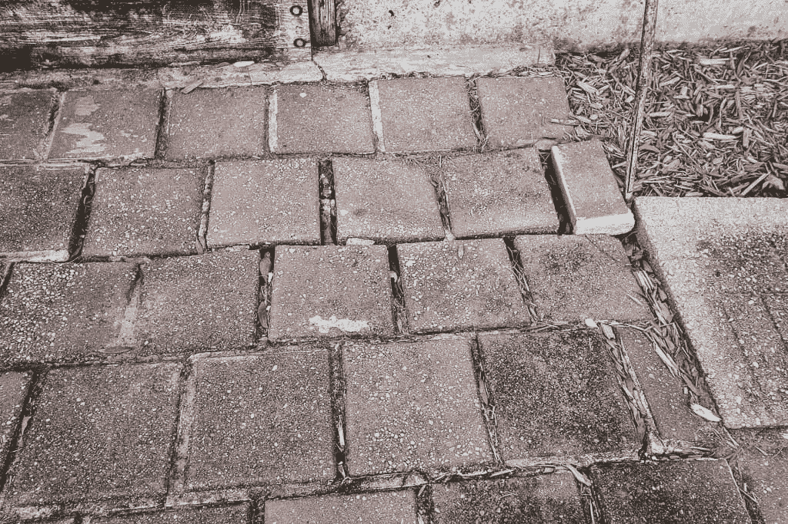
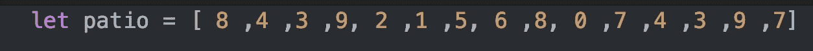
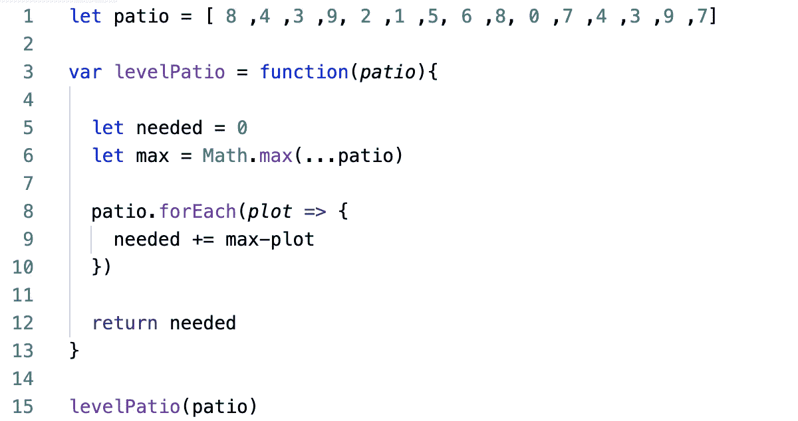
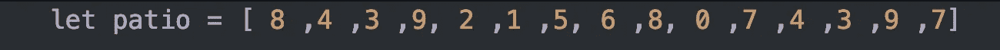
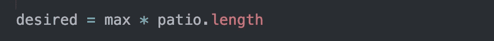
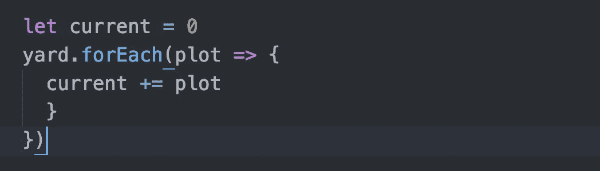
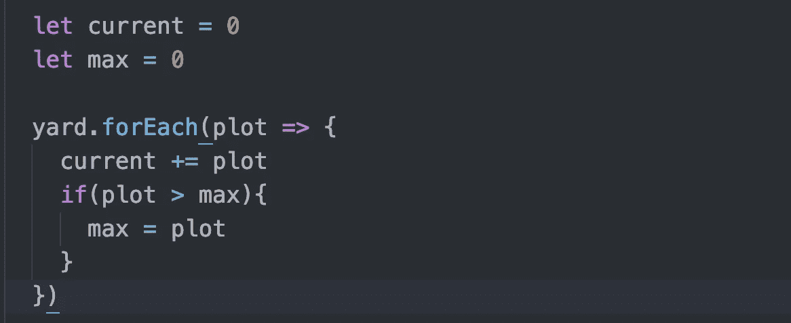
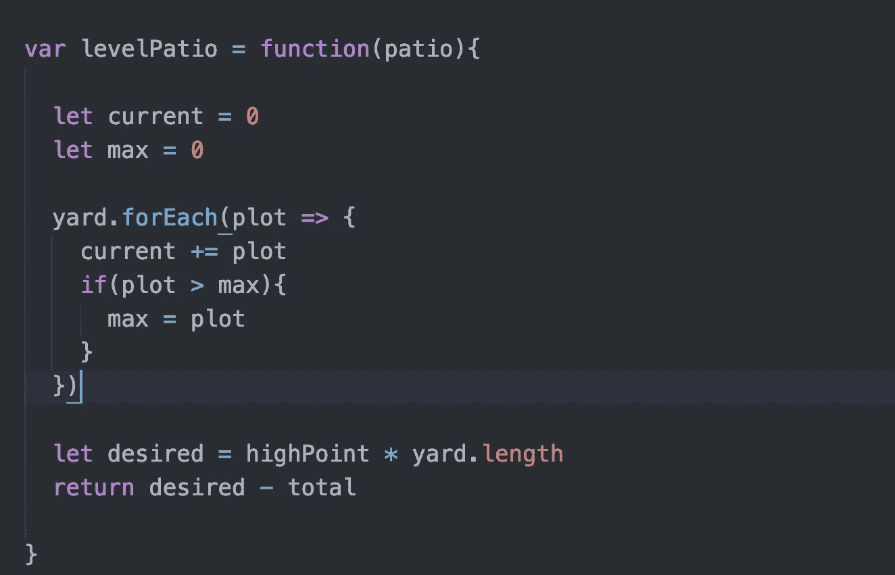

# 算法 101:JavaScript 中的水平天井

> 原文：<https://javascript.plainenglish.io/algorithms-101-level-patio-in-javascript-c9e98696694e?source=collection_archive---------8----------------------->

## Noob v. Algorithms #19，通过就地操作数组来提高运行时间



lumpy patio — photo from CharlestonCrafted

很久以前，我丈夫和我在我们的后院手工铺设了一个砖砌的露台。(是的，我们按照常规铺上了沙砾、沙子、杂草阻挡材料等等)。多年来，一些地区已经下沉。如果我们想重做的话，我们就必须把砖拿掉，把下面的砂砾基层弄平。

这给我们带来了挑战:

下面就说你吧(结节！)patio，其中每个数字代表该部分网格中砾石的高度，以任意单位测量:

```
8    4    3    9    21    5    6    8    07    4    3    9    7
```

你想把你的整个天井提升到砾石含量最高的高度。你的目标是:

```
9    9    9    9    99    9    9    9    99    9    9    9    9
```

问题:你需要添加多少砾石才能达到目标？

为了方便起见，您可以使用一维数组作为输入:



# 简单的方法

1.  找到数组中的最大值(最高点)
2.  迭代数组，找到我们需要添加到每个点的灰尘量:即每个点和最高点之间的差异
3.  将计数器递增该差值
4.  归还柜台



让我们打开它。

在第 5 行，我们设置了一个计数器来记录我们需要多少泥土。

在第 6 行，我们使用 JavaScript 的 Math.max()来查找数组中的最大值。

在遍历完数组后，随着我们的进行递增我们需要的计数器，我们返回 need。

# 使用大 O 符号的算法的运行时间是多少？

让我们来看看我们的算法的效率。如果你不确定什么是大 O 符号，这里有一个简短的解释:它告诉我们一个算法的运行时间是如何随着输入的增加而增加的。

例如，如果您的输入有 *n* 个元素，并且您对您的输入进行循环，您有一个大的 O 符号 *n.* 您必须进行的计算的数量将以一个均匀的斜率增加。

如果你有一个嵌套循环，你迭代数组的数组，然后迭代数组内部的每个元素——你的大 O 符号是 n .*noobs:看看这个关于栈溢出的优秀解释者*[](https://stackoverflow.com/questions/487258/what-is-a-plain-english-explanation-of-big-o-notation)**。**

**

*Big-O complexity graph, from Stack Overflow: [https://stackoverflow.com/questions/487258/what-is-a-plain-english-explanation-of-big-o-notation](https://stackoverflow.com/questions/487258/what-is-a-plain-english-explanation-of-big-o-notation)*

*回到我们的算法。我们有一个 O(n)的 Big-O 运行时。从技术上讲，我们的运行时间应该是 O(2n ),因为我们在数组上迭代了两次。***

**注意:*因为 Big-O 关注的是指数增长，所以忽略了常数。所以如果你对一个一维数组迭代 25 次，你的运行时间仍然被认为是 O(n)，而不是 O(25n)。*

## ** *两次？？*

*是的，虽然我们的算法看起来只有一个循环，但它实际上有两个。第一个循环是 Math.max()。为了获得数组的最大值，Math.max()遍历数组，一次比较两个元素，并始终保持两个值中较高的一个。*

*所以，如果我们想加速我们的算法，我们需要避免使用 Math.max()。*

*也许你在想，好吧，我们改为排序，然后抓取数组的最后一个元素。但是这对我们的运行时间没有帮助，因为 sort 也遍历数组来对值进行排序。*

*为了加快速度，我们必须一次性完成所有工作。*

# *让我们重构*

*编码前思考会有帮助。让我们再次看看我们的输入:*

**

*请记住，我们要返回我们需要的砾石数量—姑且称之为*需要* —以使每个地块与最高地块保持水平。*

*在高层次上，让我们定义一下所需的*:**

**

**想要的*是什么？这是我们使所有地块达到最高级别所需的总量。我们可以这样计算*期望*:*

**

*max is the highest value in our array — we’ll talk about how to calculate max later*

**当前*是我们已经拥有的。我们可以使用一个循环来计算它:*

**

## *没有 Math.max()我们怎么计算 max？*

*我们的做法和 Math.max()的做法一样。但是，我们将在计算*电流的同一个环路中进行计算，而不是使用单独的环路。**

**

*我们声明一个变量 max 来跟踪最大值。当我们迭代时，如果当前元素大于 max，我们设置 max 等于当前元素。在我们的循环结束时，max 将等于数组中的最大值。*

*现在一起:*

**

*你可以在 repl.it 上玩这个代码:*

*[https://repl.it/@Joan_IndianaInd/level-patio](https://repl.it/@Joan_IndianaInd/level-patio)*

*你可以[看到它在 PythonTutor.org 这里](https://tinyurl.com/level-patio)一步步执行。*

*版权所有琼·印第安纳·琳斯 2019*

**接下来:* [*算法 101# 20、JavaScript 中盛水最多的容器*](https://medium.com/javascript-in-plain-english/algorithms-101-container-with-most-water-in-javascript-8843a962ee0f)*

**万一你错过了:* [*算法 101 #18、JavaScript 中的组变位词*](https://medium.com/javascript-in-plain-english/algorithms-101-group-anagrams-in-javascript-b3e3c10d211e)*