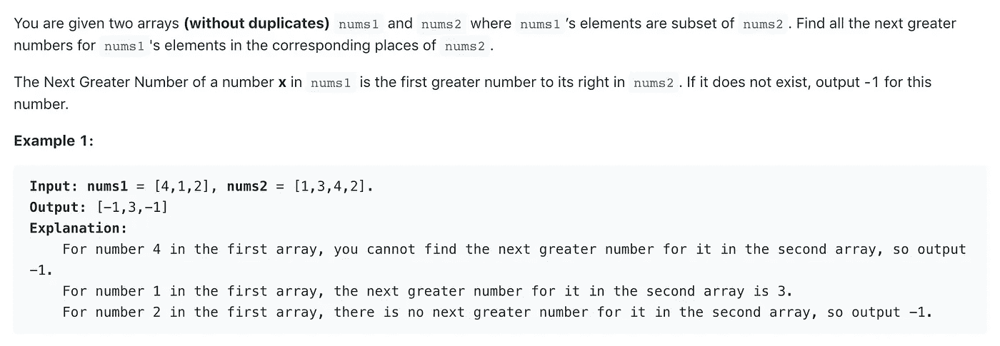
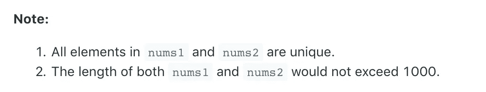
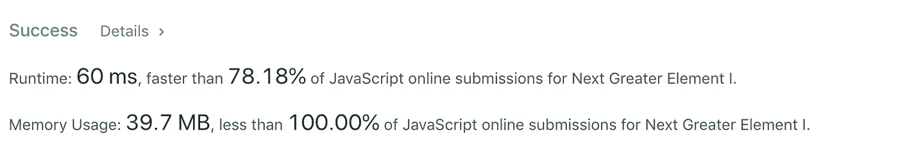

# 算法 101:JavaScript 中下一个最伟大的元素

> 原文：<https://javascript.plainenglish.io/algorithms-101-next-greatest-element-493e224f82b5?source=collection_archive---------2----------------------->

## Noob 诉算法，第 3 集


yup, that’s a noob

本周，我成功参加了在“DC 女性编码”的第二次算法聚会，并解决了 LeetCode 的下一个最大的元素挑战。

以下是信息:



房间里的几乎每个人都在用 Python 编码——所以我坐在其中两个人旁边，在用 JavaScript 解决问题时，我会定期与他们联系。

这里的说明有点混乱，所以每个人都花了不少时间来理解目标。我想如果你把上面的读三遍，那应该就够了！

# **把它分成更小的问题**

这总是让事情变得更容易。我的看法是:

迭代 nums1。对于每个号码= >

1.  在 nums2 中查找该元素的索引

2.搜索 num 2 中该元素右侧的元素

3.返回较大的元素，如果没有找到，返回-1

4.以数组的形式返回结果

5.如果你的代码不工作，重新检查上面的四个步骤！(老实说，我尝试了几次)

# **第一步。迭代**

我们想返回一个新的数组，所以让我们用 map()来做

```
return nums1.map(e => {}
```

# 第二步。在 nums2 中查找该元素的索引

javaScript 有一个 Index(of)函数，用于查找数组中某个值的第一个实例的索引。它在这里会起作用，因为在挑战的底部有这样一个注释:



all elements in nums1 and nums2 are unique

所以现在我们的代码看起来像这样:

```
var nextGreaterElement = function(nums1, nums2) {
    return nums1.map(e => {
        let found = nums2.indexOf(e); };
```

# 第三步。在 nums2 中搜索该元素右侧的元素

我们知道`found`是 nums2 中元素的索引。我们需要检查索引处的值:发现+ 1，发现+ 2 …一直到数组的末尾。

一种方法是创建一个新数组，只包含索引`found`右边的数字:

我们可以用 javaScript 的 slice()方法做到这一点。使用 slice(起始索引，结束索引)从第一个索引之前开始到第二个索引之前“切掉”数组的一部分:

```
let fruits = ["apples", "bananas", "canteloupes", "durien"]
fruits.slice(1,3)//=>  ["bananas", "canteloupes"]
```

如果您只传递一个参数，您将获得从该索引之前到数组末尾的所有内容:

```
fruits.slice(1)
//=> ["bananas", "canteloupes", "durien"]
```

在我们的例子中，我们希望所有东西都在找到的索引的右边(即从索引`found + 1`开始)

```
//make a new array with the rest of the elements
 let rest = nums2.slice(found + 1)
```

# 第三步。返回较大的元素，如果没有找到，返回-1

在这个名为`rest`的新数组中，我们需要找到右边第一个值更大的元素。为此我们可以使用 javaScript 的*。find()*

如果我们找到一个更大的值，让我们返回这个值。如果我们没有找到更大的值，指令告诉我们返回-1:

```
let greater = rest.find(number => number > e)
        return greater || -1
```

在第一行中，我们使用 find()遍历 rest 中的每个数字，如果我们发现一个数字满足大于 e(我们映射的元素)的条件，我们就返回它。如果不是，我们使用“或”操作符`||`返回-1。

现在一起:

```
var nextGreaterElement = function(nums1, nums2) {
    return nums1.map(e => {
        let found = nums2.indexOf(e);

        //set a new array with just the numbers to the right of found
        let rest = nums2.slice(found + 1)

        let greater = rest.find(number => number > e)
        return greater || -1
    });
};
```

而且……还不算太寒酸！

我们的速度非常快，内存使用量也非常低:



*接下来:* [*算法 101、# 4:JavaScript 中的爬楼梯*](https://medium.com/javascript-in-plain-english/algorithms-101-climbing-stairs-in-javascript-c8dec14cb2f6) *(斐波那契数列)*

[*以防你错过:算法 101，#2:在 JavaScript 中反转一个字符串*](https://medium.com/@joanrigdon/algorithms-101-reverse-a-string-in-javascript-de453d5ce77e)

版权所有琼·印第安纳·琳斯 2019