# 算法 101:JavaScript 中的帕斯卡三角

> 原文：<https://javascript.plainenglish.io/algorithms-101-pascals-triangle-in-javascript-9fbd9032871?source=collection_archive---------0----------------------->

## Noob 诉算法# 13——一次解决一行问题

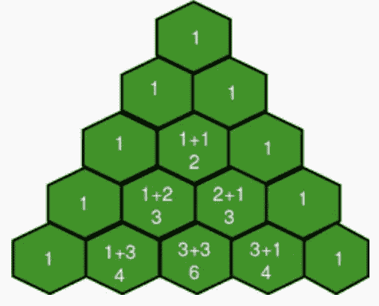

在我不断练习算法的过程中，我遇到了今天来自 LeetCode 的挑战【T0:

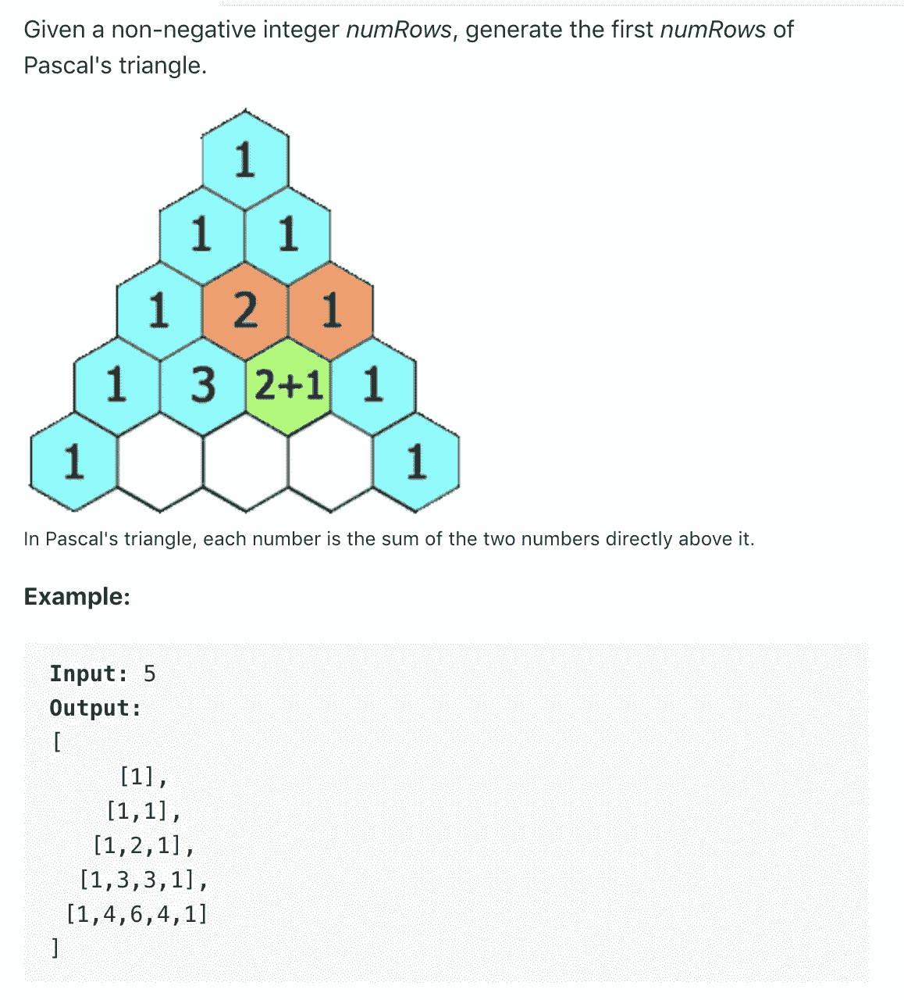

为了构建这个三角形，我们需要注意一些事情。

1.  每一行都以 1 开始和结束。
2.  在每一行中，在 1 之间，每一个数字是紧接在它上面的两个数字的和。
3.  我们可以使用这个模式从第 3 行开始构建新的行。但是我们不能用它来构建第一行或第二行。
4.  每一行都表示为一个数组；我们需要将整个三角形输出为这些行的数组(即数组的数组)。

# 一寸一寸，一排一排…

每当我在研究算法时，我都试图把问题分解成更小的问题。在这种情况下，不要担心构建整个三角形，让我们关注一个更简单的任务:如果我们知道前一行是什么样子，我们如何构建下一行？

我们稍后将处理边缘情况。现在，让我们假设我们应该建立至少 3 行这个三角形。因为我们的模式从第 3 行开始，所以让我们用前两行作为三角形的种子:

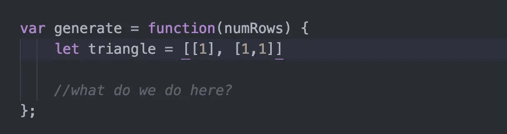

现在让我们来看看如何构建第 3 行:

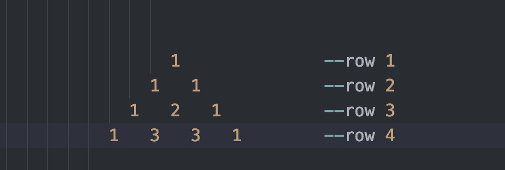

为了计算第 3 行中间的金额，我们需要访问第 2 行。具体来说，我们需要将第 2 行的两位数字相加，以计算第 3 行中间的数字。

从第 3 行生成第 4 行:同样，我们以 1 开始和结束。为了计算第一个“3”，我们将前一行的第一个和第二个数字相加。为了计算第二个“3”，我们将前一行的第二位和第三位数字相加。

所以对于每一行，不管它有多长，我们都需要从一个 1 开始，循环遍历前一行来计算中间的数字，然后在末尾添加另一个 1。

# 我们需要循环多少次？

我们需要计算的每个数字一次。对于第 4 行，它有四个数字，因为我们知道第一个和最后一个数字是 1，我们只需要计算两个数字。对于第 5 行，我们需要计算 3 位数。

因为我们循环第 3 行来计算第 4 行的两个中间数字，我们可以说我们需要循环第 3 行两次，这比第 3 行的长度少一个。所以循环次数， *i* ，应该小于*前一个*的长度。

循环结束后，我们将在行尾再加 1。

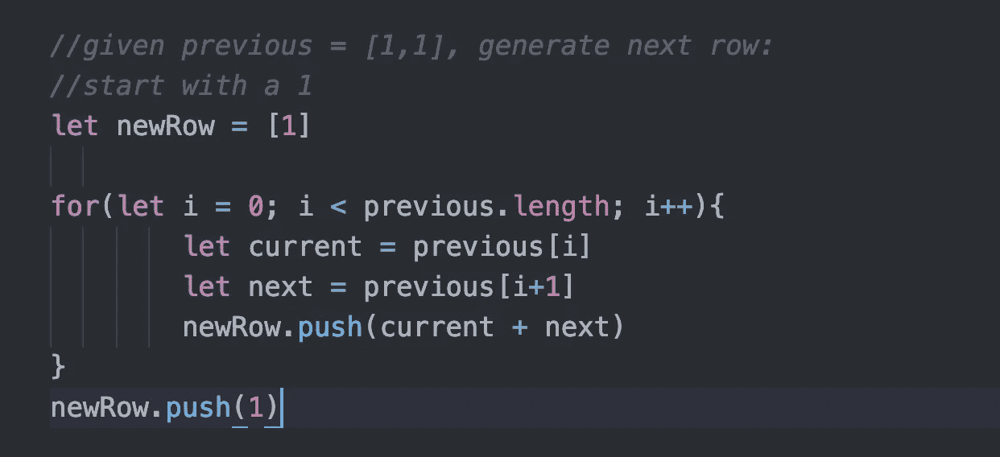

现在我们有了从以前的行创建新行的逻辑，我们把它放在哪里呢？我决定把它放在自己的函数里，这个函数以一个三角形作为参数，定义 *previous* 为三角形的最后一行:

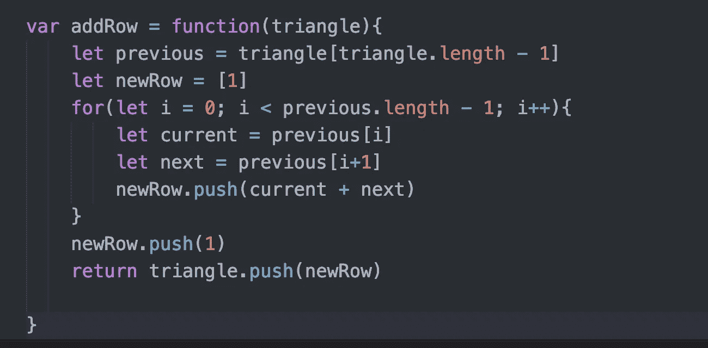

然后我决定从我的主函数中调用这个函数:

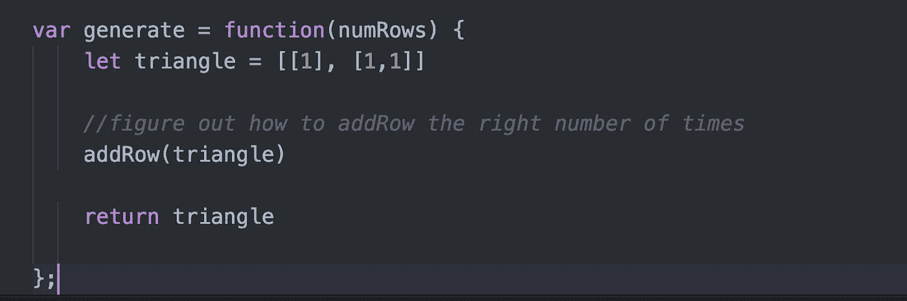

# 重复 x 次…

下一个挑战:我们需要运行 *addRow(triangle)* 多少次，我们该怎么做？

第一个问题很简单。假设 numRows 是 10。我们从两排开始。所以我们需要再生成 8 个，也就是 numRows 减 2。

下一个问题在 Ruby 中更容易解决。如果你像我一样喜欢 Ruby，你会知道它有这个很棒的重复动作的方法。

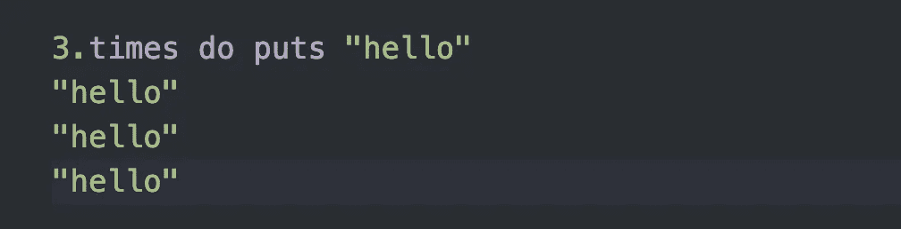

Ruby is so intuitive … but we’re working JavaScript

在 JavaScript 中，您可以通过 for 循环来实现这一点:

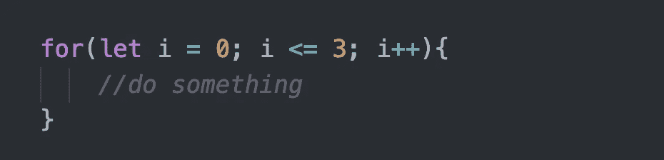

这给了我们这个:

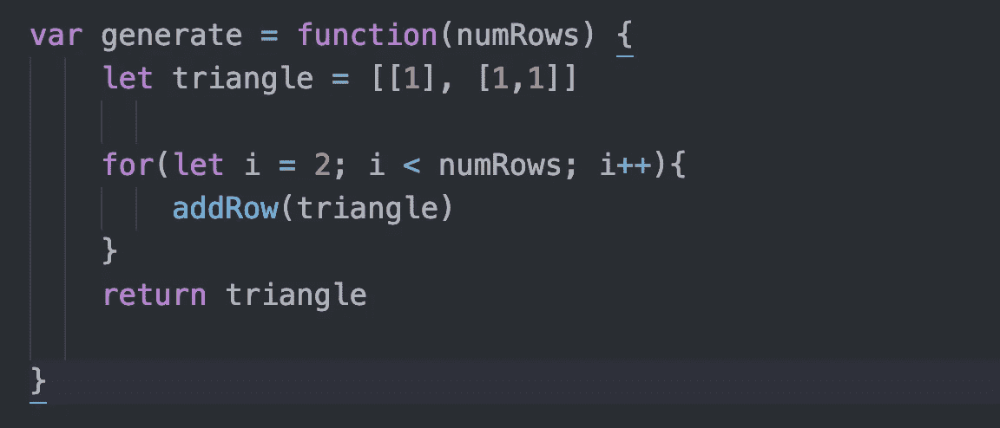

# 不要忘记边缘案例

现在，我们只需要处理边缘案件。我们的函数假设我们必须构建至少三行。但是如果 *numRows* 小于 3 呢？

如果是 0，我们不想返回三角形，这是一个空数组:`[]`如果是 1，我们只想返回第一行`[[1]]`等等:

现在一起:

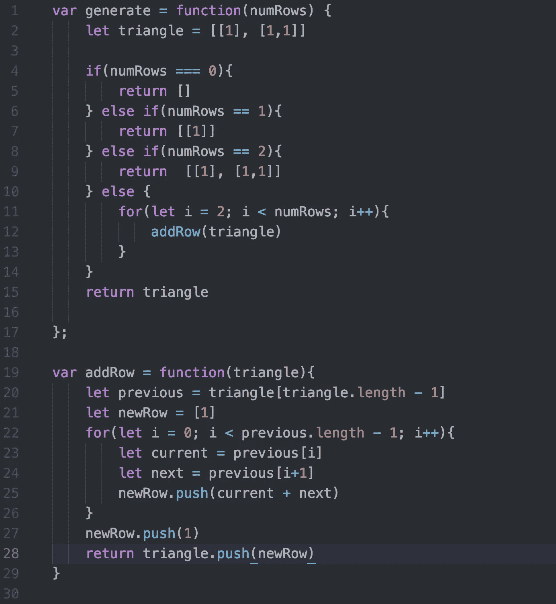

You can play with this code [on repl.it.](https://repl.it/@Joan_IndianaInd/Pascals-Triangle)

这不是最短的解决方案，但很容易理解。而且表现也很好！

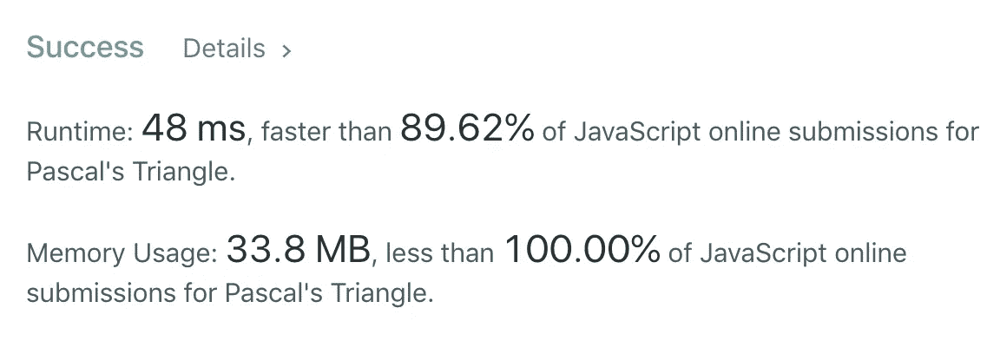

版权所有琼·印第安纳·琳斯 2019

接下来:*算法 101 # 14:*[*JavaScript 中的快乐数字*](https://medium.com/@joanrigdon/algorithms-101-happy-number-in-javascript-bddeb3d17035)

*以防你错过:算法 101 #12:* [*用嵌套玩偶*](https://medium.com/javascript-in-plain-english/algorithms-101-learn-recursion-with-nesting-dolls-javascript-a8c334fe65f6) 学习 JavaScript 中的递归