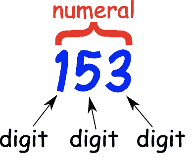
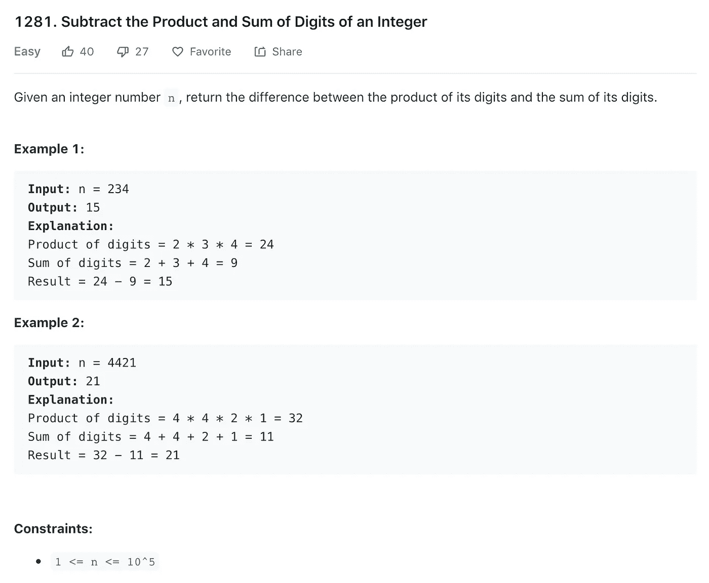
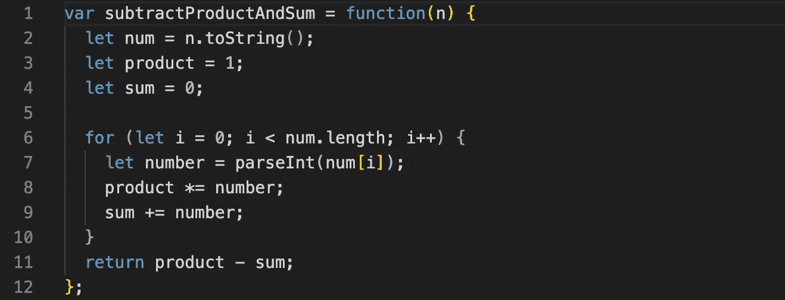
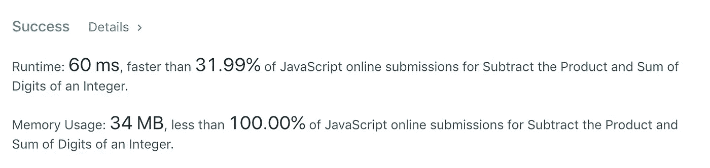
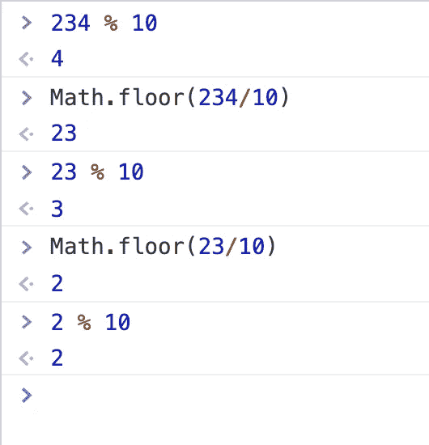
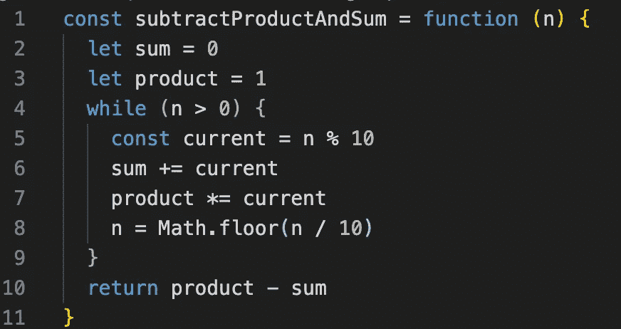
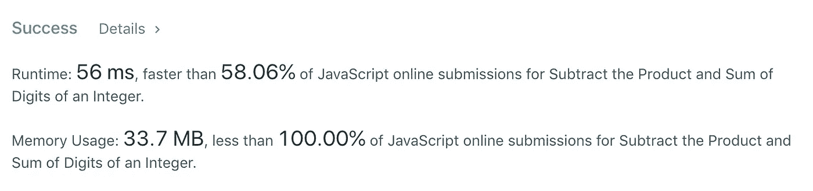

# 算法 101:JavaScript 中数字的积和

> 原文：<https://javascript.plainenglish.io/algorithms-101-product-and-sum-of-digits-in-javascript-2c09925ac11a?source=collection_archive---------5----------------------->

## Noob v. Algorithms #24，当你避免使用字符串时，解析数字要快得多！



今天 LeetCode 的挑战是减去一个整数的[乘积和数字之和。](https://leetcode.com/problems/subtract-the-product-and-sum-of-digits-of-an-integer/)



# 第一次尝试:慢速方式，使用字符串

我不是新手，我的第一个方法是把数字转换成字符串，抓取每个数字，再把它转换成数字，然后这样操作:

```
var subtractProductAndSum = function(n) { //turn digit into string
    let num = n.toString() for (let i = 0; i < num.length; i++) {
         //grab digit, turn it back into number
         let number = parseInt(num[i]) //operate on number to ...
         //get product
         //get sum
      } return product - sum;
}
```

我有很多从循环内部更新总和的实践:

```
sum = 0for(let num in array){
    sum += num
} 
```

你不能用同样的模式来更新一个产品；如果你给你的乘积一个零的初始值，无论你乘以什么，你都会得到零。

相反，当您想要更新产品时，可以从初始值 1:

```
product = 1for(let num in array){
    sum *= num
}
```

(是*=一个东西？我试过了，效果很好……)

一旦我填好了这些空白，我最后得到了这个:



这是可行的，但速度并不快:



# 第二次尝试:数学，数学，数学(无字符串)

让我们看看是否可以通过完全避免字符串来加快速度。

在数学中，如果你想从数字中得到数字，你可以使用 javaScript 的余数运算符[从 1 开始抓取它们，在其他语言中称为 a modulo。它是这样工作的:](https://developer.mozilla.org/en-US/docs/Web/JavaScript/Reference/Operators/Arithmetic_Operators)

```
 Let's get the remainder after dividing 234 by 10:234 % 10 => 4 
```

只要一个数字至少有两位，您就可以通过运行`num % 10`获得“个”列中的数字。

你如何从那里得到十列中的数字？百位专栏？您可以遵循以下模式:



让我们打开它。

1.  我们从一个三位数开始，运行余数运算符，返回 4，即“1”列中的数字。
2.  我们将数字除以 10(并向下舍入，使用 javaScript 的`Math.floor()`)。
3.  我们对第二步的结果运行`% 10`，得到 3，十位数。
4.  我们重复第 2 步和第 3 步，从百位列中获取数字。

下面是它在代码中的样子:



而且更快！



感谢: [Victor Wang](https://medium.com/u/c8c6c8a74f3b?source=post_page-----2c09925ac11a--------------------------------) 在 LeetCode 中发布了他的“ [clean JS solution](https://leetcode.com/problems/subtract-the-product-and-sum-of-digits-of-an-integer/discuss/447196/JavaScript-clean-JS-solution) ”。

你可以在 repl.it 上玩代码[，在 PythonTutor.com](https://repl.it/@Joan_IndianaInd/product-and-sum)上你可以看到代码在[现场执行](http://www.pythontutor.com/visualize.html#code=const%20subtractProductAndSum%20%3D%20function%28n%29%20%7B%0A%20%20let%20sum%20%3D%200%3B%0A%20%20let%20product%20%3D%201%3B%0A%20%20while%20%28n%20%3E%200%29%20%7B%0A%20%20%20%20const%20current%20%3D%20n%20%25%2010%3B%0A%20%20%20%20sum%20%2B%3D%20current%3B%0A%20%20%20%20product%20*%3D%20current%3B%0A%20%20%20%20n%20%3D%20Math.floor%28n%20/%2010%29%3B%0A%20%20%7D%0A%20%20return%20product%20-%20sum%3B%0A%7D%3B%0A%0Alet%20n%20%3D%20234%0AsubtractProductAndSum%28n%29&cumulative=false&curInstr=3&heapPrimitives=nevernest&mode=display&origin=opt-frontend.js&py=js&rawInputLstJSON=%5B%5D&textReferences=false)

**版权所有琼·印第安纳·琳斯 2019**

*以防你错过:算法 101 #23，* [*在 JavaScript*](https://medium.com/javascript-in-plain-english/algorithms-101-find-the-difference-between-two-arrays-in-javascript-c19f12dee103) 中找出两个数组的区别