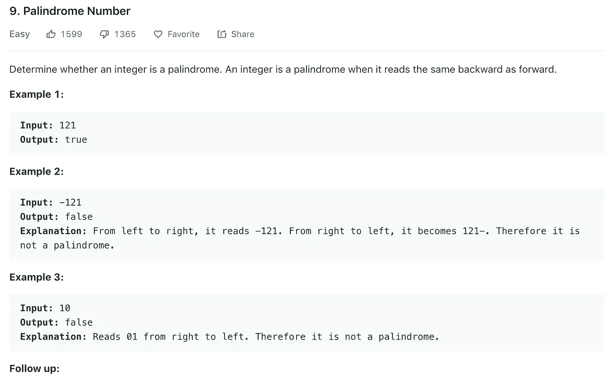
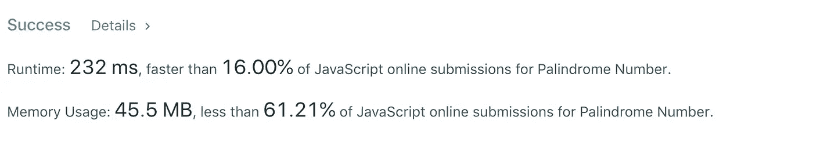
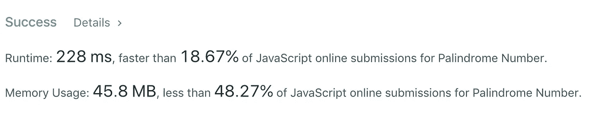
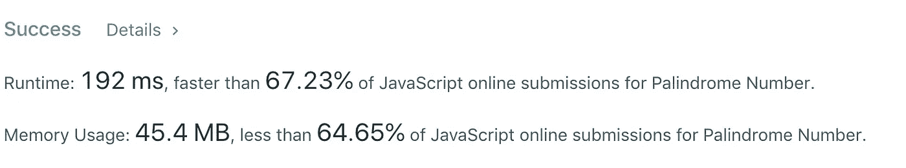
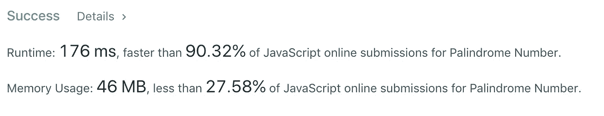
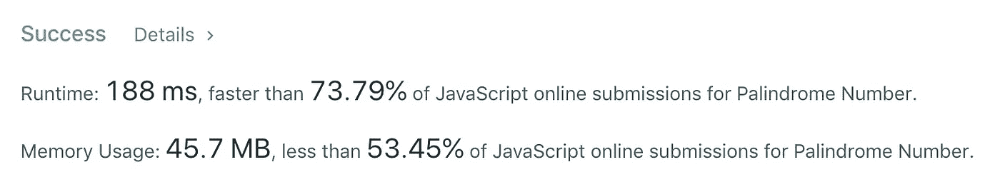
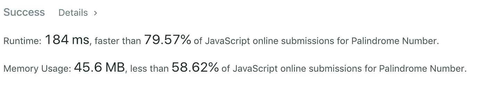

# 算法 101:在 JavaScript 中反转字符串

> 原文：<https://javascript.plainenglish.io/algorithms-101-reverse-a-string-in-javascript-de453d5ce77e?source=collection_archive---------5----------------------->

## *Noob 诉 LeetCode，第二集*


noob, not a bad thing.

显然，这是科技面试中的一个经典挑战:



这个问题的强力解决方案很容易找到。要在 js 中反转一个字符串，你要做的就是

*   把它分成一个数组
*   反转数组中元素的顺序
*   然后把它变回字符串

对一个数字做同样的事情，首先你把它变成一个字符串，然后*然后*你运行上面的步骤。(不能直接把一个数拆分成一个数组)。

```
let x = 121let string = x.toString()
// => "121"let array = string.split('')
// => ["1", "2", "1"]
//note: string.split() => ["121"]let reversedArray = array.reverse()
// => ["1", "2", "1"]let reversedString = reversedArray.join('')
// => "121"return x.toString() === reversedString ? true : false 
// => true 
```

所有加在一起，用一个[三元运算符](https://developer.mozilla.org/en-US/docs/Web/JavaScript/Reference/Operators/Conditional_Operator):

```
let x = 141const isPalindrome = function(x) { 

   return x.toString() === x.toString().split(‘’).reverse().join(‘’) ? true : false  };//=> true
```

不幸的是，像往常一样，粗暴的方法很慢。



我们没有使用太多的内存，但是我们的运行时间排在最后 16%。

# 更好、更聪明、更快

*顺便说一句，这是我以前供职的报纸《华尔街日报》的座右铭*

第一种方法很慢，因为在它对照反转数组中的每个字符检查数组中的每个字符之前，它不能返回 true 或 false。我们怎样才能加快速度呢？

我尝试添加一个初始屏幕:检查数组的第一个元素是否等于数组的最后一个元素，如果不等于，则返回 false。如果这是真的，那么继续最初的方法。

这有点像让求职者或室友申请者在电子邮件的主题行中包含某个代码字；并忽略所有不包含它的应用程序。如果申请人提供了代码，筛选时间和以前一样长；但是你要筛选的就少多了。对了，这个很好用！在现实生活中。

但是在代码中效果不好。

```
const isPalindrome = function(x) {  

    let array = x.toString().split('') 
    if (array[0] === array[array.length - 1]) {        
        return array.join('')  === array.reverse().join('')? true : false  
        } else {

            return false
        }
      return false                 
};
```



runTime is only slightly better, now we’re in the bottom 18%

我的下一个直觉是错误的:放弃这种方法，去别处看看。我这样做了，并最终找到了一个伟大的解决方案，使用…相同的概念，但发挥它的所有方式。

obligatory d’oh giphy

我们可以使用迭代来检查第二个元素、倒数第二个元素、第三个元素和倒数第三个元素，等等，而不是只检查数组的第一个和最后一个元素作为初始屏幕。

如果你像我一样是个新手，你知道如何从数组的开始迭代，但是你不知道如何同时从数组的结尾迭代。

从一开始，你可以用这个:

`for let(i = 0; i < array.length; i++)`

或者，从最后，你可以用这个:

`for (let j = array.length — 1; j > 0; j--)`

如果你想两者一起做，你可以只使用一个 for 循环。每次你用`i++`增加`i`，你用同样的循环用`j--`减少`j`。

注意:我们在这里不必使用 reverse，这意味着我们不需要将我们的字符串转换为数组(reverse 适用于数组，不适用于字符串)。相反，我们可以用 [charAt()检查字符串的每个元素。](https://developer.mozilla.org/en-US/docs/Web/JavaScript/Reference/Global_Objects/String/charAt)

```
let string = String(x)
// turn number x into a stringlet j = string.length - 1 for (i = 0; i < string.length; i ++ )
    if (string.charAt(i) === string.charAt(j)){
         j --
     } else {
         return false
     }
}return true
```

变得更快:



现在，如果我们在上面的代码中添加一个初始屏幕，立即为负数返回 false:

```
const isPalindrome = function(x)  {x < 0 ? false : null

 let string = String(x)
 let j = string.length - 1

 for (i = 0; i < string.length; i ++ )
     if (string.charAt(i) === string.charAt(j)){
         j --
     } else {
         return false
     }
    return true   

}; 
```

我们的速度更快:



注意:如果用箭头函数运行相同的代码，运行时间会稍微长一点:

```
const isPalindrome = (x) =>  { x < 0 ? false : null

      let string = String(x)
      let j = string.length - 1

      for (i = 0; i < string.length; i ++ ){
          if (string.charAt(i) === string.charAt(j)){
               j --
          } else {
               return false
          }
      } return true   

};
```



# 但是如果……

在最后一种方法中，我们迭代通过`i`到数组的末尾，即使我们只需要到数组的中点+ 1(如果 array.length 是 4，我们只需要迭代字符串开头的元素 0 和 1；最后是 3 和 2。我们不需要从头到尾遍历字符串。

如果 array.length 为 5，或者任意奇数，我们只需要遍历元素`array.length/2 + 1`(元素 0，1，2，其中元素 2 在中心)。

出于好奇，我们试试这个怎么样:

```
const isPalindrome = function(x)  { x < 0 ? false : null

     let string = String(x)
     let j = string.length - 1

     for (i = 0; i < (string.length/2 + 1); i ++ ){
          if (string.charAt(i) === string.charAt(j)){
              j --
          } else {
              return false
          }
     } return true   

};
```



好吧，稍微慢了一点，但是这一点点内存使用的改进让我们在内存效率方面排在前 41%!

# 速度更快:

还有一个改进，这要感谢 DaleHurtt。正如他指出的，我们不必在每次迭代中定义的中点。相反，我们可以在循环之前定义它。

```
const isPalindrome = (x) =>  {x < 0 ? false : nulllet string = String(x)
     let j = string.length - 1
     let midpoint = string.length / 2 + 1for (i = 0; i < midpoint; i ++ ){
         if (string.charAt(i) === string.charAt(j)){
             j --
         } else {
             return false
         }
     }
    return true   

};
```


# 感谢…

chavarriacarlos，用[照亮了他在 LeetCode](https://leetcode.com/problems/palindrome-number/discuss/371714/JavaScript-Easy-to-Understand.-O(n)-solution.-Faster-than-70) 和 [DaleHurtt](https://medium.com/@dalehurtt) 上的讨论帖子(见他的优雅解决方案的评论)。

*下一个:* [*算法 101:Javascript 中的下一个最大元素*](https://medium.com/javascript-in-plain-english/algorithms-101-next-greatest-element-493e224f82b5)

[*以防你错过:算法 101:Javascript 中的二和*](https://medium.com/javascript-in-plain-english/algorithms-101-twosum-in-javascript-b493c8d64014)

版权所有琼·印第安纳·琳斯 2019