# 算法 101:在 JavaScript 中旋转数组——三种解决方案

> 原文：<https://javascript.plainenglish.io/algorithms-101-rotate-array-in-javascript-three-solutions-260fbc923b64?source=collection_archive---------1----------------------->

## Noob 诉算法#22，玩。pop()，。unshift()和。拼接()

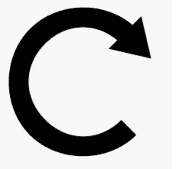

rotate right!

浏览 LeetCode 中的顶级面试问题，其中一个比较难的简单问题是[这个:](https://leetcode.com/problems/rotate-array/)

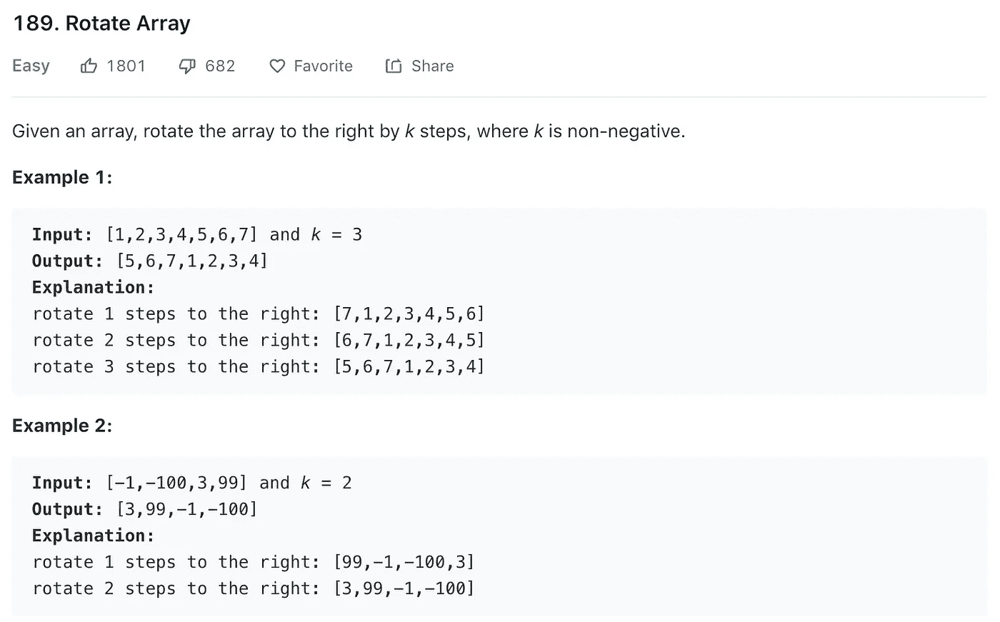

# 第一种解决方案:while 循环使用。pop()和。未移位()

最简单的解决方案是使用 JavaScript 的**。pop()** ，结合**，破坏性地移除并返回数组的最后一个元素( [MDN 文档此处为](https://developer.mozilla.org/en-US/docs/Web/JavaScript/Reference/Global_Objects/Array/pop))。unshift()** ，破坏性地将元素添加到数组的开头( [MDN 文档此处](https://developer.mozilla.org/en-US/docs/Web/JavaScript/Reference/Global_Objects/Array/unshift))。

这是如何工作的:

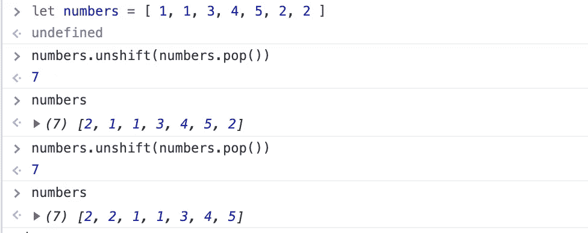

在这个挑战中，我们要执行`k`次操作。我们可以通过设置一个 **while 循环**来实现:

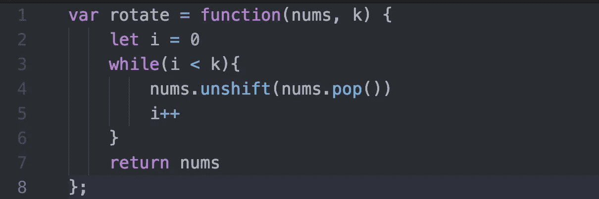

让我们打开它。

在第 2 行，我们设置了一个初始值为零的计数器。在每个循环结束时(第 5 行)，我们将计数器加 1。

在第 3 行，我们说:“当我们的计数器小于我们应该执行循环的次数时，继续循环”。

*注意:*是的，我是从零开始计数的，而不是从一。如果你想从 1 开始，那么在第 3 行写`while i <= k`而不是`while i < k`。

这是可行的，但是没有那么快:

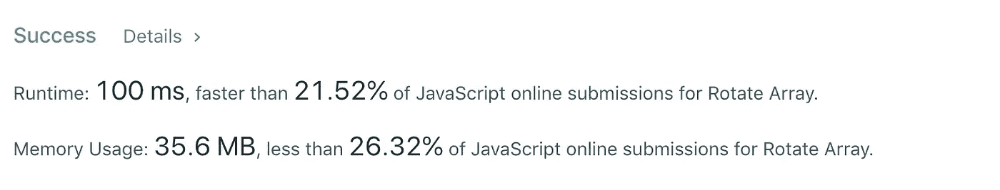

我们怎样才能加快速度呢？我决定试试**。拼接()**而不是**。流行()** …

# 第二个解决方案:。拼接()而不是。流行()

LeetCode 性能时间不是很一致。当我第一次尝试这个解决方案时，**。拼接()**跑得比**快。pop()**；后来好像也是这样。

当你从一个数组中删除一个元素时，后面的元素必须向前移动以取代内存中丢失的元素。根据数组的大小，这可能会降低运行时间。(因为数组的所有元素都必须在内存中“坐在一起”，所以每次数组改变时，元素都必须重新索引)。

如果总是删除数组中的最后一项，则没有后面的项，因此可以跳过重新索引。根据定义**。pop()** 总是只删除最后一项。所以它的速度很快。

**。splice()** 可以将目标项放在数组的任意位置；因此，当它瞄准除了最后一个项目以外的任何项目时，它会更慢。

**。splice()** 需要两个参数。

*   要开始移除项目的索引。(使用-1、-2 表示最后、倒数第二等等。数组的索引。)
*   要移除的项目数。如果没有提供第二个参数，slice 将删除从提供的索引开始直到数组末尾的所有元素。

这是一种破坏性的方法，会改变原始数组。(如果想要无损的方法，试试**。slice()** ，它采用不同的参数。这里是关于 [**的 MDN 文档。拼接()**](https://developer.mozilla.org/en-US/docs/Web/JavaScript/Reference/Global_Objects/Array/splice) 和 [**。片()**](https://developer.mozilla.org/en-US/docs/Web/JavaScript/Reference/Global_Objects/Array/slice) ) **。**

下面介绍**。**作品拼接():

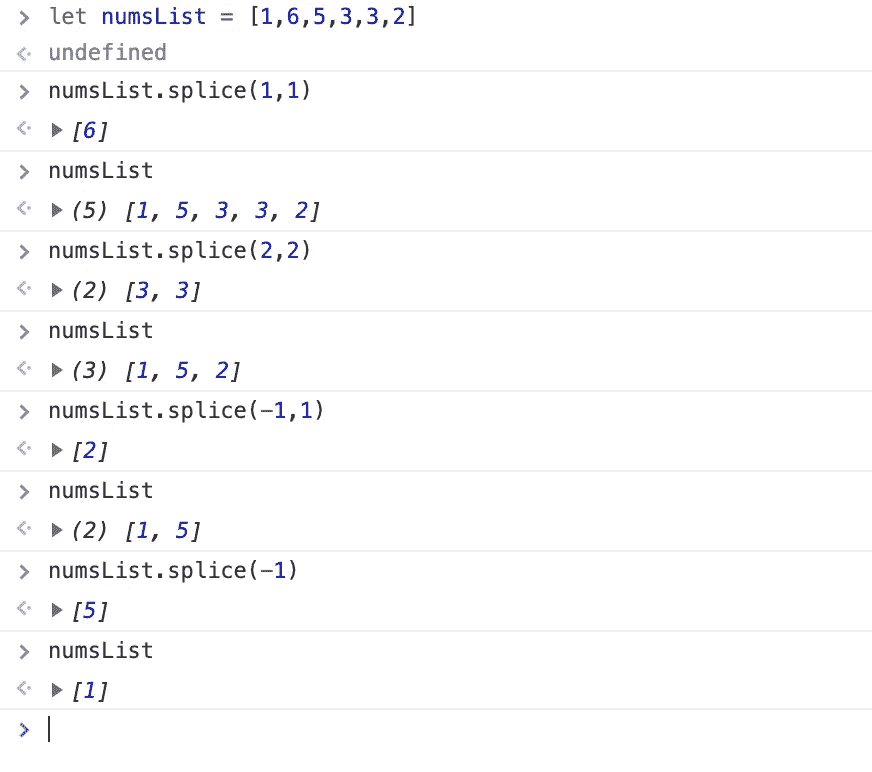

在我们的挑战中，我们可以这样使用它:

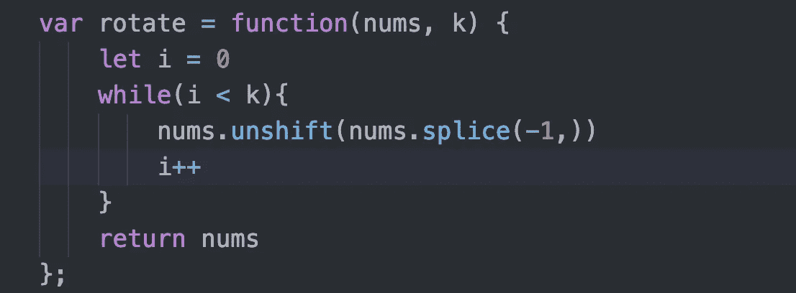

但是……(叹气)……并没有更快:

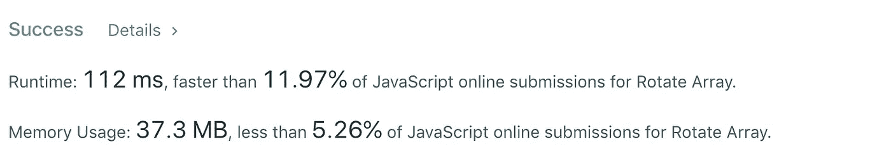

# 第三种解决方案:针对不同场景进行优化。

到目前为止，我们的代码是通过一次弹出一个元素并将其附加到数组的前面来实现的。不管是短数组还是长数组，都是一样的。以及我们应该弹出 1 个项目还是 100 万个项目。

我们可以通过针对不同场景进行优化来加快速度。如果我们有一个 100 个元素的数组，而`k`是 90 会怎么样？如果我们弹出最后一项并将其追加到数组的前面 90 次，我们必须重新索引数组…90 次。那太多了。

如果我们只是从末尾**拼接()**掉最后的`k`项，并将它们作为一个块添加到数组的前面，怎么样？

我们可以这样做:

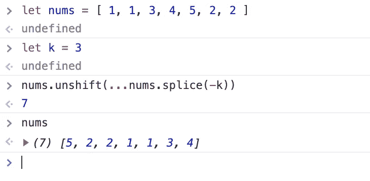

注意:

*   我们用`-k`来。 **splice()** 关闭数组的最后一个`k`项。
*   nums.splice(-k)返回一个数组。为了将数组的元素添加到 nums 的开头(而不是数组本身)，我们使用了扩展操作符:`...nums.splice(-k)`

按原样运行代码:

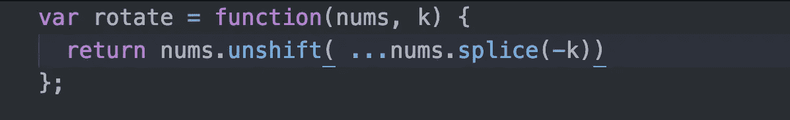

whoops ….

不工作…

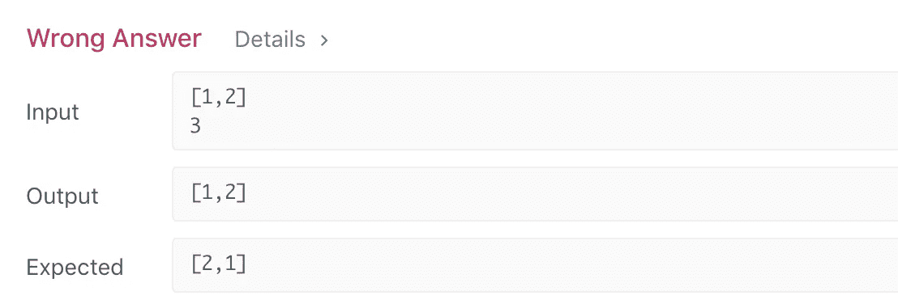

因为它错过了我们需要旋转的次数`k`大于数组长度的边缘情况。

为了处理边缘情况，我们可以添加一个 if /else 语句:

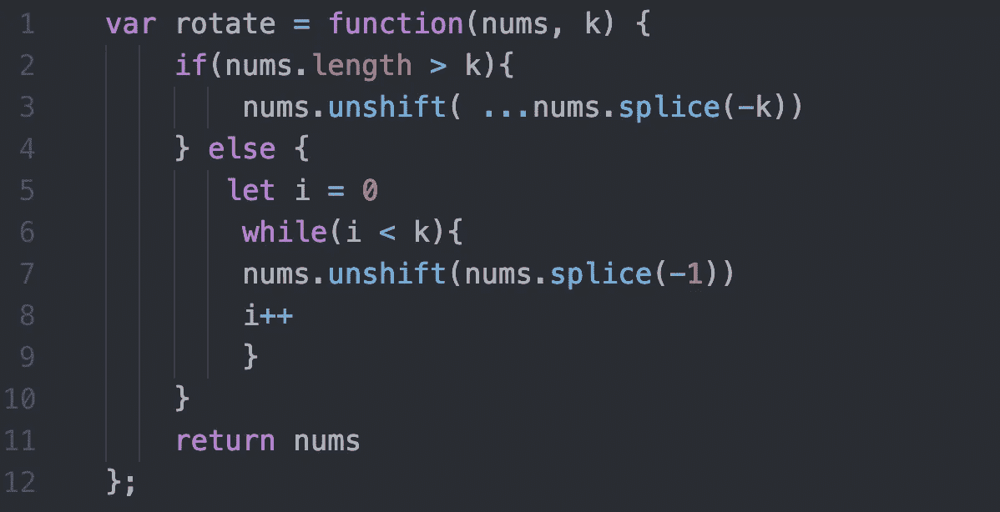

注意，else 语句使用了我们第二个解决方案中的代码！

现在我们的代码运行得更快了:

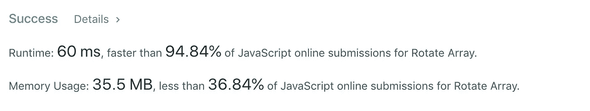

你可以在 PythonTutor.com 上看到现场执行的代码

你可以在 repl.it 上玩它:

[https://repl.it/@Joan_IndianaInd/rotate-arrays-leetcode](https://repl.it/@Joan_IndianaInd/rotate-arrays-leetcode)

**版权所有琼·印第安纳·琳斯 2019**

*接下来:* [*算法 101 #22、JavaScript 中两个数组的区别*](https://medium.com/@joanrigdon/algorithms-101-find-the-difference-between-two-arrays-in-javascript-c19f12dee103)

*万一你错过了:* [*算法 101、#20、。JavaScript*](https://medium.com/@joanrigdon/algorithms-101-includes-vs-indexof-in-javascript-7f1b4af04127) 中的 includes()与 indexOf()