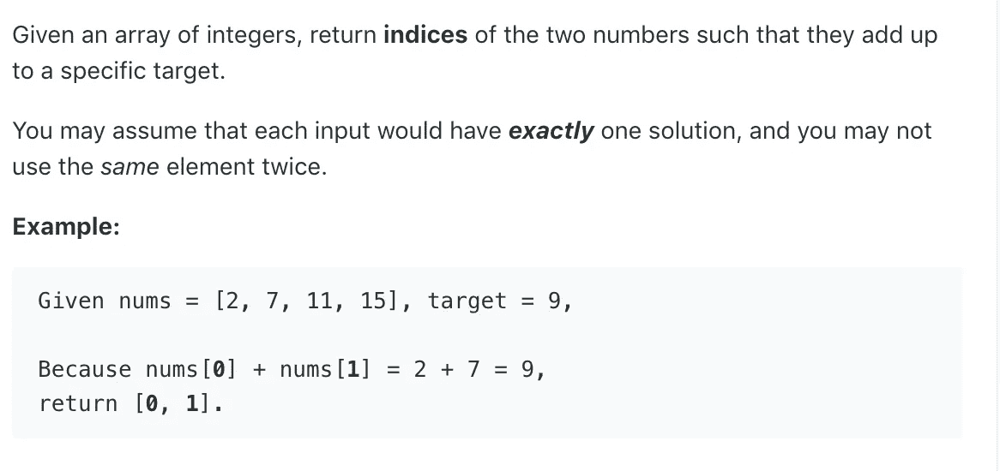
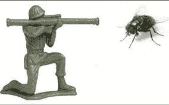
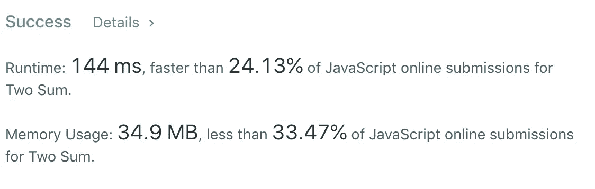
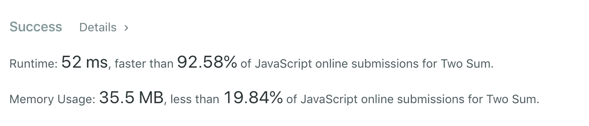

# 算法 101:JavaScript 中的二和

> 原文：<https://javascript.plainenglish.io/algorithms-101-twosum-in-javascript-b493c8d64014?source=collection_archive---------3----------------------->

## *Noob 诉 LeetCode，第一集*


not a bad thing

寻找编码工作的很大一部分是能够通过技术面试，这通常包括解决像 LeetCode.com 上的算法。

有什么地方比起点更好呢？LeetCode 的第一个算法挑战叫做[二和](https://leetcode.com/problems/two-sum/)。



sounds simple, right?

# 蛮力/天真



像我这样的菜鸟通常会先找到“蛮力”或幼稚的解决方案。这些是可行的解决方案，但是会占用大量的处理时间和/或内存。有点像用火箭筒拍苍蝇。它工作，但是…

但是，你必须从某个地方开始。一旦你得到一个强力解决方案，你总是可以重构。

进入，火箭筒:

如果将数组中的每个元素与数组中的其他每个*元素进行比较，可以检查任意两个元素的和是否等于目标值。然后你可以找到这两个元素的索引，把它们放在一个数组中并返回这个数组。*

换句话说，你可以用一个嵌套循环来做这件事。

```
const twoSum = function(nums, target) {
  for (let i = 0; i < nums.length; i++){
     for (let j = 0; j < nums.length; j++ ) {
        if (nums[i] + nums[j] === target && i !== j){
           return [i,j]
        }
     }
   }
}
```

让我们打开它。

如果你知道`(let i = 0; i < nums.length; i++)`是什么意思，跳过下面几段！

“I”代表索引。通过将‘I’设置为零，我们说从第一个元素开始(index = 0)；让我们一直走，直到到达数组的末尾(当 i =到数组的长度)；在此之前，每次迭代后，让我们将“I”加 1。

同时，让我们再做一次同样的事情，但是这次我们将查看“j”索引处的元素。

如果我们在索引“I”处找到一个元素，在索引“j”处找到一个元素，这两个元素加起来就是目标——*和*。如果我们在索引“I”处找到的元素与在索引“j”处找到的元素不同，那么我们知道我们找到了两个满足要求的独立元素。让我们把它们的索引‘I’和‘j’放入一个数组中。

它起作用了，但是很慢:



在这个例子中，我们的代码看起来并不慢，因为我们的数组只有四个元素。为了在一个有四个元素的数组中检查每一项和其他项，我们需要做 16 次，或者 4 次比较。

但是如果我们的数组有 4000 个元素呢？那我们就得做 4000 次比较。换句话说，对于数组中的 n 个元素，我们需要进行 n 次比较。从数学上来说，这是 n 的大 O 符号，被认为非常非常慢。

一个更好的解决方案应该是 n 的大 O 符号——这意味着我们只需要迭代一次数组。

# 更好、更聪明、更快

让我们重新想象一下这个问题。

假设你有一个很大的篮子，里面有不同重量的球。你想知道它们中的任何两个加起来是否等于 x。在第一个解决方案中，我们尝试了所有可能的组合，直到找到正确的组合。


kinda like this … but we’ll only use two baskets of balls

在下一个解决方案中，我们将从同一个球篮(篮子#1)加上一个空篮子(篮子#2)开始。对于篮子#1 中的每个球，我们将遵循以下步骤:

1.  称一下球。(姑且称之为‘当前球’)。
2.  从目标中减去当前球的重量，得到所需的重量——我们需要另一个球来称量当前球的重量，这另一个球就是我们的解。所以如果当前的球重 2 克，我们的目标重量是 10 克，那么需要的重量是 8 克。
3.  在 2 号篮子上挥动魔杖，说:“喂，8 克重的球！”如果它在那里，它会跳出来！(当然，我们第一次这样做时，篮子#2 将是空的；没关系)。
4.  如果我们在篮子#2 中没有找到我们要找的东西，在当前球上写下当前球的重量。然后把它放进 2 号篮子里。

我们这样做了几次，没有找到匹配，然后…最后…

1.  当前球重 8 克
2.  从目标重量中减去得到所需重量:2 克)
3.  在 2 号篮子上挥动魔杖，大声喊“喂，2 克重的球！”—嘿，在那儿！

4.我们找到我们的那一对了！

# 代码看起来是这样的:

```
var twoSum = function(nums, target) {
    const previousValues = {};
    for (let i = 0; i < nums.length; i++) {        
        const currentNumber = nums[i];
        const neededValue = target - currentNumber;
        const index2 = previousValues[neededValue];
        if (index2 != null){
            return [index2, i];
        } else {
            previousValues[currentNumber] = i;
            // hash[key] = value }        
    }
}
```

让我们再次打开包装。

空散列值 *previousValues* 是篮# 2；这是我们检查完球后扔球的地方。

*   *当前号码*是当前球(在我们的 nums 数组的索引‘I’处的那个)
*   *所需值是*所需重量

```
const index2 = previousValues[neededValue];
```

*index2* 是我们在原始数组中找到所需重量的球的位置(如果该球存在，则为*)。*

```
if (index2 != null){
            return [index2, i];
```

如果 *index2* 确实存在，则所需重量的匹配球存在，所以我们返回匹配球的位置和当前球的位置…

```
} else {
            previousValues[currentNumber] = i;
            // hash[key] = value}
```

如果 *index2* 不存在，那么我们给 *previousValues* 添加一个键值对，其中 key 为 *currentNumber* ，value 为 currentNumber 在原数组中的索引。

注意:由于 previousValues 是一个散列，当我们在其中查找 neededValue 时，我们不需要迭代。我们只需要看看它是否有某个值，只有当它有某个键等于变量 *neededValue* 时才会有。从散列中获取值要快得多(有点像调用‘Accio！’用魔棒)要比遍历数组好得多。与嵌套循环的 n 相比，它有一个很大的 O 符号值 n)

果然，我们的方法更快:



# 非常感谢…

所以，诺布，不要绝望。起初，我对如何解决这个问题毫无头绪。我做了很多谷歌搜索，玩了很多我找到的解决方案，最终偶然发现了这个视频，由 WebDev Simplified 制作，它帮助我理解了这些概念！

[*接下来:算法 101:在 JavaScript 中反转一个字符串*](https://medium.com/javascript-in-plain-english/algorithms-101-reverse-a-string-in-javascript-de453d5ce77e)

版权所有琼·印第安纳·琳斯 2019