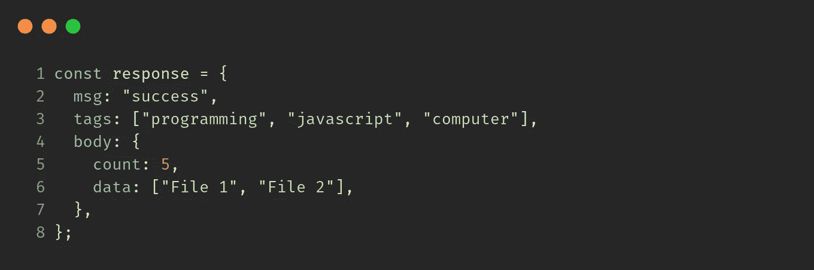
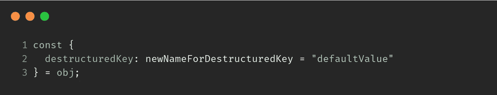
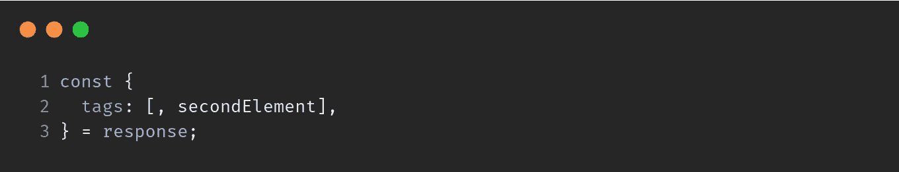
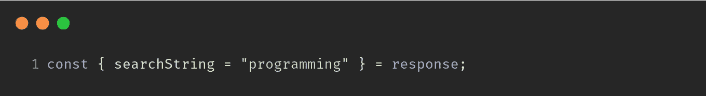
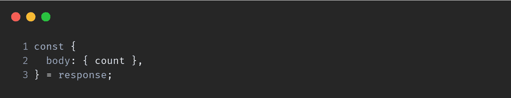
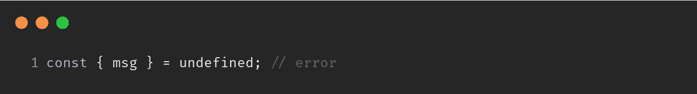
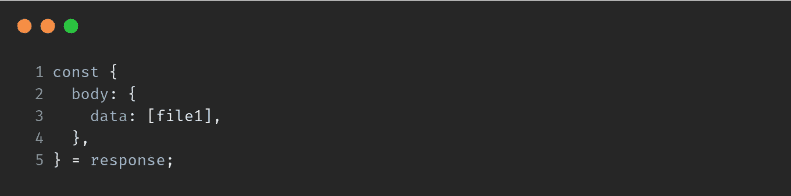

# JavaScript 析构基础

> 原文：<https://javascript.plainenglish.io/all-about-destructuring-84188bb00993?source=collection_archive---------13----------------------->

Photo by [Sean Lim](https://unsplash.com/@seanlimm?utm_source=medium&utm_medium=referral) on [Unsplash](https://unsplash.com?utm_source=medium&utm_medium=referral)

在 **ES2015/ES6** 中引入了析构。如果你知道所有的来龙去脉，这真的很有帮助。有很多文章，但是它们并没有用一个例子涵盖使用**析构**的所有不同方式。在一个**对象/阵列**上可以做以下事情:

1.  **提取数值**
2.  **提供默认值**
3.  **提取值并重命名变量**

下面我们就跟着数据走，看看 ***6 个例子*** 。所有的例子都是基于这些数据。

基本语法是:

**1。解构**键`**msg**`

**2。** **从** `**response.tags**`析构第二个元素(即 `**'javascript'**` **)**

**3。** **析构** `**msg**` **键并重命名为** `**message**`

4.**用*默认*值**解构*不存在的*键

**5。从** `**response.body**`析构嵌套键 `**count**`

****

**这里，首先`**body**`被析构，然后`**count**`从`**body**`再次被析构。**

*****陷阱 1 —*** 如果`**response**`中不存在`**body**`键怎么办？因为`**body**`是`**undefined**`，所以在析构`**count**`时会抛出一个错误。**

*****解* :-** 给`**body**` ( `**{}**`)提供一个默认值**

****

*****陷阱 2 —*** 如果响应为`**undefined**`会怎样？**

****

**超级简单，**

****

**如果`**response**`是`**falsy**` ( `undefined`或`null`，那么它就把它作为一个`**empty**`对象。**

**6.**从**到`**response.body.data**`解构 `**'File 1'**`**

********

******感谢阅读**💙****

****关注 **@codedrops.tech** 了解更多****

****[insta gram](https://www.instagram.com/codedrops.tech/)●[Twitter](https://twitter.com/codedrops_tech)●[脸书](https://www.facebook.com/codedrops.tech/) ● [Linkedin](https://www.linkedin.com/company/codedrops-tech/)****

****[**codedrops . tech**](https://www.codedrops.tech/)****

**** [## 文件操作- Visual Studio 市场

### 轻松标记/别名文件和快速切换文件。1.文件标签-标签/别名/书签文件 2。快速切换-快速…

marketplace.visualstudio.com](https://marketplace.visualstudio.com/items?itemName=mehullakhanpal.file-ops)****