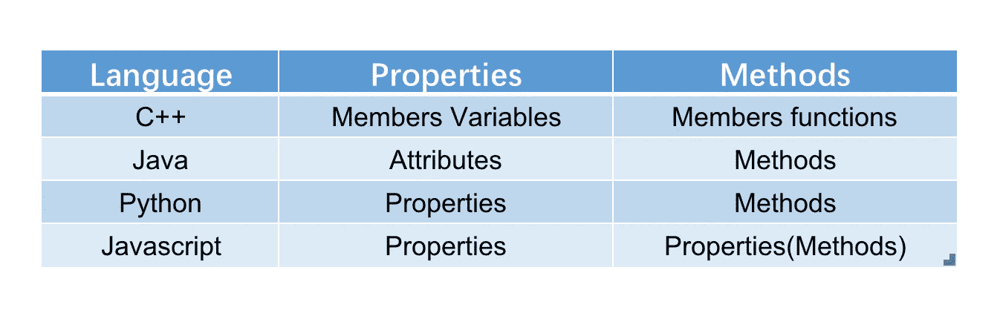

# 关于面向对象的 JavaScript

> 原文：<https://javascript.plainenglish.io/all-about-javascript-object-oriented-694cb74569b3?source=collection_archive---------8----------------------->

## 有人说 JavaScript 是面向对象的语言，有人说 JavaScript 是基于对象的语言，什么是基于原型的语言。带你深入了解 JavaScript 对象系统

Photo by [Artem Sapegin](https://unsplash.com/@sapegin?utm_source=medium&utm_medium=referral) on [Unsplash](https://unsplash.com?utm_source=medium&utm_medium=referral)

有人说 JavaScript 是一种面向对象的语言，就像 Java、C++、C#等；有人说 JavaScript 是基于对象的语言，就像 Visual Basic (VB)一样。有人说它是基于原型的……

从[语言规范](http://ecma-international.org/ecma-262/6.0/)中，我们可以找到以下两段描述。

> ECMAScript 是基于对象的:基本语言和主机设施由对象提供，ECMAScript 程序是一组通信对象。
> 
> ECMAScript 是一种面向对象的编程语言，用于在宿主环境中执行计算和操纵计算对象。

这两种描述让我们更加困惑。JavaScript 是面向对象和基于对象的语言吗？

在本文中，我将和您一起揭开 JavaScript 面向对象系统的面纱。

# 什么是面向对象编程

> **面向对象编程** ( **OOP** )是基于“[对象](https://en.wikipedia.org/wiki/Object_(computer_science))”概念的[编程范式](https://en.wikipedia.org/wiki/Programming_paradigm)，可以包含[数据](https://en.wikipedia.org/wiki/Data)和代码。

在*面向对象的分析和设计与应用中，* Grady Booch 总结了“*对象*的概念。从人类认知的角度来看，物体是以下任何一种:

*   有形和/或可见的东西
*   智力上可以理解的事物
*   思想或行动指向的事物

对象是人类的一种抽象。在编程中运用这种思想，我们就有了面向对象的编程。面向对象编程只是一种编程范式，编程思维。

事实证明，面向对象编程提高了程序的灵活性和可维护性，并广泛应用于大型项目设计中。

现在几乎所有主流语言都支持面向对象，比如 Common Lisp、Python、C++、Objective-C、Smalltalk、Delphi、Java、Swift、C#、Perl、Ruby、PHP 等。

Photo by [KOBU Agency](https://unsplash.com/@kobuagency?utm_source=medium&utm_medium=referral) on [Unsplash](https://unsplash.com?utm_source=medium&utm_medium=referral)

# 什么是基于对象的编程

基于对象的编程实际上是面向对象编程的一种方式。它不使用“类”而是直接使用“对象”。有时，术语“基于对象”适用于基于原型。最具代表性的基于对象的语言是 JavaScript。

JavaScript 语言的设计之初，JavaScript 的设计者 Brendan Eich 选择了*原型*来实现面向对象的概念。这可能与作者是一名 [scheme](https://en.wikipedia.org/wiki/Scheme_(programming_language)) (一种 Lisp 方言)程序员有关。后来，由于非技术原因，网景管理层要求布伦丹·艾希(Brendan Eich)制作新语言以模仿 Java ( Java 在当时很流行)，布伦丹·艾希不得不添加 *new、this* 和其他功能，以使新语言看起来更像 Java。最后，新语言的名字也改成了 Java 风格的名字。JavaScript 诞生了。

# JavaScript 中的对象

虽然 JavaScript 的初衷是使用原型。然而，由于 Java 和面向对象的思想统治了 JavaScript 的诞生和随后的时代，许多程序员都在试图让 JavaScript 更像一种传统的面向对象语言。直到 ES6 发布，‘class’才正式进入 JavaScript 标准。

那么 JavaScript 原型编程下的面向对象编程是什么样子的呢？

## JavaScript 中的属性和方法都在属性中

OOP 中“对象”的概念可以包含[数据](https://en.wikipedia.org/wiki/Data)和代码:以[字段](https://en.wikipedia.org/wiki/Field_(computer_science))形式的数据(通常称为*属性*或*属性*)，以及以过程形式的代码(通常称为 [*方法*](https://en.wikipedia.org/wiki/Method_(computer_science)) )。

不同的语言实现属性和方法的方式略有不同。

从表中可以看出，JavaScript 通过 JavaScript 属性统一实现属性和方法。

以下代码显示了如何在 JavaScript 中创建对象。

# 动态的

JavaScript 中对象最独特的特性是对象是高度动态的。与大多数基于类的对象语言不同，属性可以通过给它们赋值来动态地添加到对象中。

下面的代码演示如何在运行时向对象添加属性。对于 Java 语言来说，这种特性非常复杂。

# 对象类型

对象在逻辑上是属性的集合。每个属性要么是一个*数据属性*，要么是一个*访问器属性*:

## 数据属性

一个*数据属性*将一个键值与一个 [ECMAScript 语言值](http://ecma-international.org/ecma-262/6.0/#sec-ecmascript-language-types)和一组布尔属性相关联。

*   Value:通过属性的 get 访问检索的值。
*   可写:决定属性的值属性是否可以更改。
*   可枚举:决定属性是否可以由 for-in 枚举。
*   可配置:决定是否可以删除属性或更改其属性。

## 访问属性

*访问器属性*将一个键值与一个或两个访问器函数以及一组布尔属性相关联。访问器函数用于存储或检索与属性相关联的 [ECMAScript 语言值](http://ecma-international.org/ecma-262/6.0/#sec-ecmascript-language-types)。

*   Get:值是函数对象或未定义。当访问属性值时调用。
*   Set:值是函数对象或未定义。当属性值被赋值时调用。
*   可枚举:决定属性是否可以由 for-in 枚举。
*   可配置:决定是否可以删除属性或更改其属性。

## object . getownpropertydescriptor()

这种方法允许检查一个属性的精确描述。

我们在这里定义了两个属性。通过函数`Object.getOwnPropertyDescriptor()`查看属性，可以看到我们定义的属性都是数据属性，`writable`，`enumerable`，`configurable`它们的默认值都是`true`。

## Object.defineProperty()

如果你想直接在一个对象上定义一个新的属性，或者修改一个对象上已有的属性，你可以使用`**Object.defineProperty()**` 的方法。

当创建一个对象时，你也可以使用`get`和`set`来创建**访问属性。**代码如下:

使用`getOwnPropertyDescriptor`，我们知道我们定义了一个访问属性。与数据属性不同，`getter`或`setter`函数在每次访问属性时执行。这里我们的`getter`函数返回`37`，所以每次调用`object1.property1`都会得到`37`。

这里我们可以知道 JavaScript 对象在逻辑上是属性的集合。属性使用键值来标识。属性键值可以是 ECMAScript 字符串值，也可以是符号值。该值可以是数据属性值，也可以是访问者属性值。

# 结论

通过以上，我们了解到 JavaScript 的对象设计与其他**基于类的**面向对象的主流语言有很大的不同。

虽然设计比较特殊，但是 JavaScript 提供了完整的对象系统，所以还是面向对象的语言。

如果你想了解 JavaScript 对象系统的起源，你必须忘掉所有关于“基于类的面向对象”的知识。利用人类对物体的初始认知来理解 JavaScript 的设计思想。

幸运的是，从 ES6 开始，JavaScript 提供了大量的语法糖来帮助我们完成面向对象的编程。

*感谢阅读。*

## 关于 JavaScript 的其他内容:

 [## Javascript 数据类型中你需要知道的 5 件事

### 对 Javascript 数据类型的深入理解。

medium.com](https://medium.com/@saneryee_studio/5-things-you-need-to-know-in-javascript-data-types-c8e50fd87811)