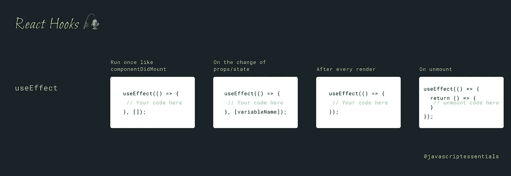

# 所有关于反应钩子-使用效果

> 原文：<https://javascript.plainenglish.io/all-about-react-hooks-useeffect-b02b7e8d7b5a?source=collection_archive---------6----------------------->


钩子是在 [React 16.8](https://reactjs.org/blog/2019/02/06/react-v16.8.0.html) 版本中新加入的。它们允许您使用状态和其他 React 特性，而无需编写类组件。

> useEffect 挂钩允许您在函数组件中执行副作用

使用效果挂钩是万能的👑钩子的形状。是`componentDidMount`、`componentDidUpdate`和`componentWillUnmount`的组合。它用于在组件挂载时获取数据，在状态或属性改变时执行数据，在组件卸载时清理数据。这个 useEffect 挂钩可能真的令人困惑💡直到你理解或知道它是如何工作的。

在本文中，我将用代码片段解释`useEffect`挂钩，这样您就可以理解 useEffect 是如何工作的。

# 像 componentDidMount 一样运行一次

默认情况下，useEffect 钩子在组件的每次渲染后运行，为了只在挂载时运行 useEffect，传递一个空数组`[]`作为第二个参数。useEffect 需要一个*依赖*来重新渲染，这里我们声明这个 useEffect 没有任何*依赖*来重新渲染。所以它只渲染一次。

```
useEffect(() => {
 // Your code here
}, []);
```

# 关于道具/状态的变化

默认情况下，useEffect 钩子在每次渲染后运行，您也可以通过将 props 或 state 变量作为第二个参数传递来控制何时重新渲染，第二个参数是一个依赖关系数组，如果依赖关系数组中的任何变量发生变化，useEffect 钩子将运行。

```
useEffect(() => {
 // Your code here
}, [variableName]);
```

# 每次渲染后

useEffect 钩子在每次渲染后运行，如果你简单地忽略第二个参数，它将完成这项工作🙃

```
useEffect(() => {
 // Your code here
});
```

# 卸载时

要执行卸载组件的操作，

```
useEffect(() => {
  return () => {
   // unmount code here
  }
});
```

您将放在`return () ⇒ { }`块中的代码将在卸载之前执行。卸载功能不只是在卸载组件时执行。它在每次 useEffect 运行之前执行，从最后一次渲染开始清理。



参考

1.  [https://reactjs.org/docs/hooks-intro.html](https://reactjs.org/docs/hooks-intro.html)