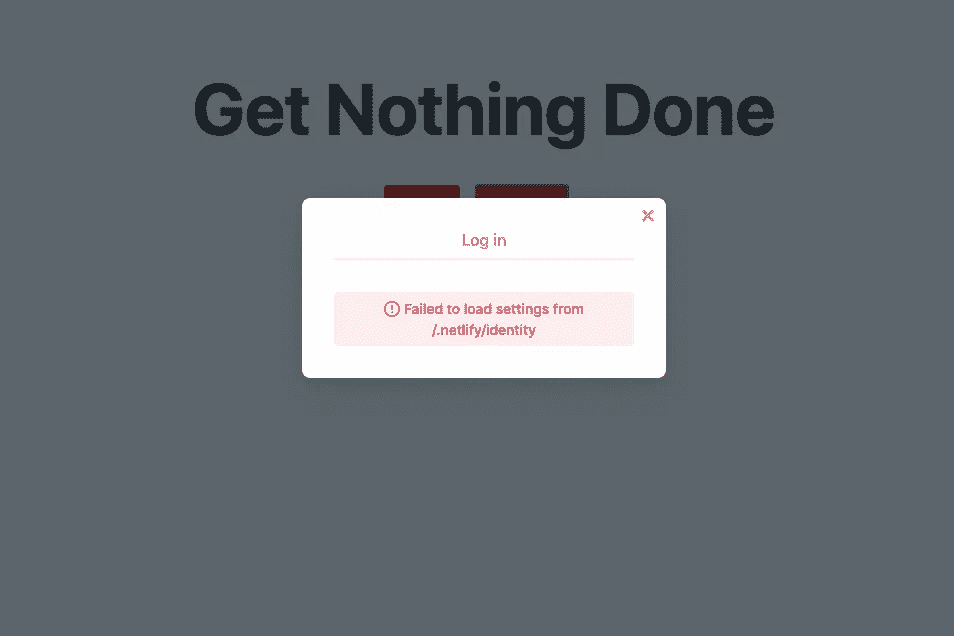
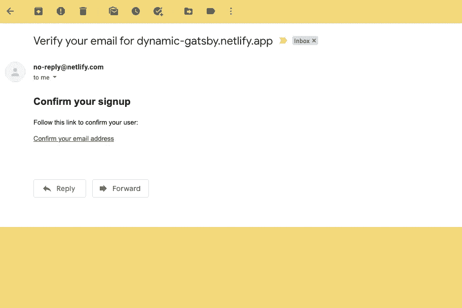
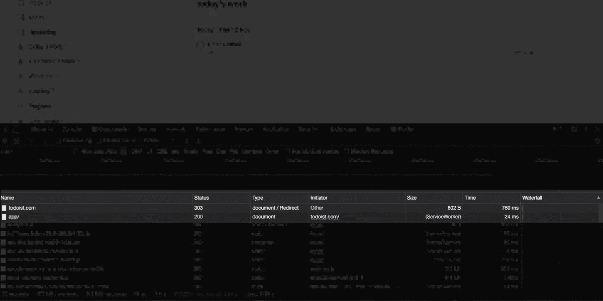
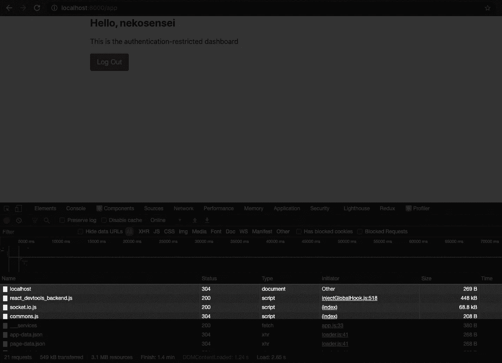
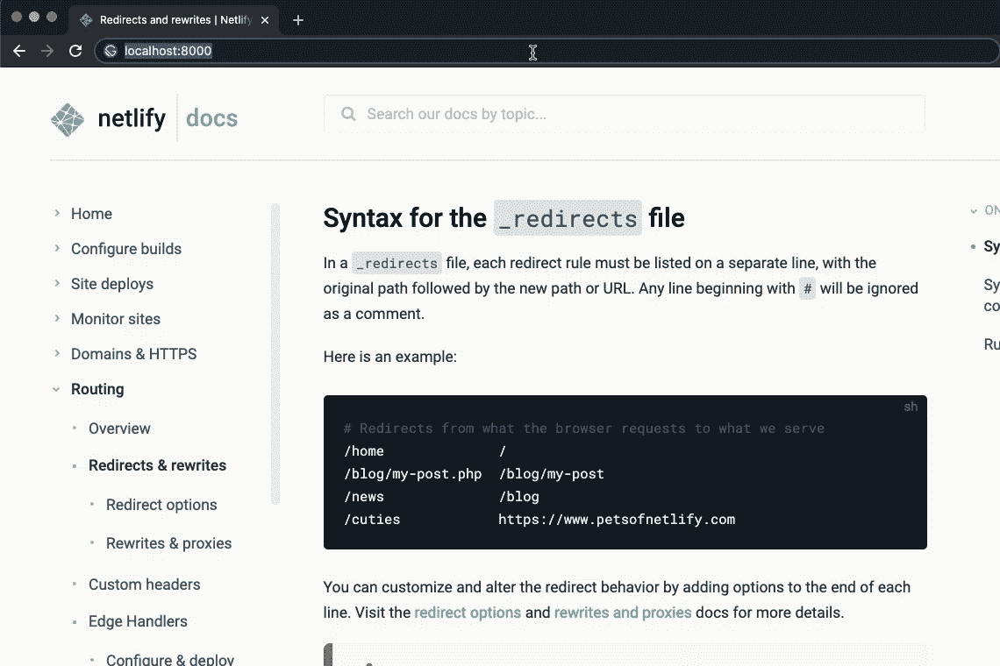

# 盖茨比的页面重定向

> 原文：<https://javascript.plainenglish.io/all-about-redirect-with-gatsby-coding-for-profit-and-fun-d49561ff8b2b?source=collection_archive---------4----------------------->

## 您想知道的关于 Gatsby.js 中的重定向的一切，以获得最佳用户体验

Photo by [Javier Allegue Barros](https://unsplash.com/@soymeraki?utm_source=medium&utm_medium=referral) on [Unsplash](https://unsplash.com?utm_source=medium&utm_medium=referral)

所以你的网站和[盖茨比](https://www.gatsbyjs.com/)一起愉快地运行着。然而，就像每一个数字产品一样，它必然会成长和发展。一个你可能没怎么考虑的变化是 URL 架构。

一篇以 http://yourdomain.com/website-speed 这样的网址开始的博客文章可能会被重定向到 http://yourdomain.com/blog/how-to-make-your-website-faster.

另一种情况是，当你的内容吸引了大量的追随者，提示你为订阅者提供一个封闭的部分。

一旦它们进入您的主页，它们将被自动带到一个私人的仪表板页面。与此同时，登陆该私有路径的未经身份验证的用户将被导航到带有登录部分的主页。这是 web 应用程序中非常常见的设计模式。

我们如何将它付诸实施？请继续关注我，到本文结束时，您将构建一个生产就绪的重定向工作流，您可以将它插入到您设计的任何 Gatsby 应用程序中。

# 设置和部署新站点

点击此[链接](https://app.netlify.com/start/deploy?repository=https://github.com/bytrangle/gatsby-redirect)设置一个入门应用。这将:

*   使用起始代码在您的帐户上创建一个新的 Github repo
*   使用您的 repo 创建并部署一个新的 Netlify 站点

一旦您的 starter 站点部署完毕，将您创建的新 repo 克隆到您的本地机器上。

`git clone git@github.com:<YOUR_USERNAME>/gatsby-redirect.git`

使用 Netlify 部署时，将`gatsby-redirect`替换为您为 repo 设置的任何名称。

然后移到新文件夹，安装所有必需的依赖项。

`cd gatsby-redirect npm install`

在您喜欢的代码编辑器中打开`gatsby-redirect`。

# 启用网络身份

在我们的例子中，认证正是需要重定向的原因，为此我们将使用 [Netlify Identity](https://docs.netlify.com/visitor-access/identity/) 服务。

访问您的 Netlify 仪表板，导航到您刚刚部署的站点。单击身份选项卡，然后单击启用身份按钮。

否则，当你点击现场的“注册”按钮时，你会看到下面这个可怕的错误。

启用 Netlify Identity 后，返回终端并启动开发站点。

前往`[localhost:8000](http://localhost:8000)`，点击“注册”按钮。Netlify 会自动检测到我们正在本地服务器上运行。粘贴您的生产站点的 URL，然后单击“设置站点的 URL”按钮。

Netlify 注册模式将再次加载。像往常一样注册，并检查你的电子邮件中是否有一封来自 Netlify 的确认邮件，看起来像这样。

单击确认链接，您将被引导至您的生产站点。打开您的浏览器历史记录，查找带有此模式的 URL`your-domain.netlify.app/#confirmation_token=<TOKEN>`。

复制从散列开始到 URL 结尾的字符串，并将其添加到本地主机站点，如下所示:`localhost:8000/#confirmation_token=<TOKEN>`。

将字符串粘贴到地址栏并输入。这就是你如何在本地服务器上确认你的帐户。

如果您收到类似“验证您的帐户时出现错误”这样令人畏惧的通知，请不要担心切换回您的网络生活仪表板，并转到身份选项卡。如果你看到你的新账户，那才是最重要的。

# 站点重定向的内幕

所有类型的重定向都可以分为两组:

*   服务器端:服务器用 30x 状态码响应浏览器的请求。
*   客户端:浏览器自己进行重定向(可以用 HTML 或 JavaScript 完成)。

传统上，每次您尝试访问某个 URL 时，您的浏览器都会向服务器发送一个 GET 请求。服务器回复一个特定的状态码，它是一个三位数。状态代码可以表示成功的响应，也可以表示错误。

这个过程被称为*服务器端渲染*。要进行服务器端重定向，您需要与服务器达成一项协议，即无论访问者何时访问具有特定模式的页面，服务器都会将他们发送到不同的 URL，而不改变内容。例如，现在每次访问`[gatsbyjs.org](http://gatsbyjs.org)`都会被重定向到`gatsbyjs.com`。

根据您的 web 服务器，有许多方法可以配置服务器端重定向。幸运的是，我们的站点部署到了 Netlify，所以我们可以简单地为 Gatsby 安装官方的 Netlify 插件，并在`gatsby-config.js`中添加几行代码进行重定向。

注意，我传统上使用单词*是因为现在，不是每个 URL 访问都构成对服务器的请求。许多网络应用程序使用*客户端路由*，这意味着访问者可以访问应用程序中的不同链接，而无需向服务器发出任何请求。*

客户端重定向有专门的库，但是在本教程中，我们将使用`gatsby`包提供的`navigate`帮助函数。它是`window.location`的包装器。

无论你喜欢称之为客户端渲染还是客户端路由，目标都是一样的:让 web 应用程序像桌面应用程序一样快速、简洁。

# 如何区分服务器端重定向和客户端重定向

默认情况下，服务器端重定向比客户端更快，因为它是由服务器发出显式指令，不需要等待 JavaScript 加载。

但是，当你不知道什么是快或不快时，这可能没有多大意义。

这是我能想到的最可靠的方法:

*   打开新的浏览器选项卡。
*   打开浏览器开发工具，然后单击网络选项卡。
*   点击清除图标以确保网络选项卡处于干净状态。
*   访问您已登录的 web 应用程序，该应用程序会将登录用户从主页重定向到受限页面。我知道的两个应用是 [Todoist](https://todoist.com/) 和 [TickTick](https://ticktick.com/?language=en_US) 。
*   查看网络选项卡。如果你在主页上看到第一个网络请求，例如[todoist.com](http://todoist.com)，带有一个 30X 的状态码，类型为 Document/Redirect，后跟一个对私有路由 todoist.com/app,的请求，这几乎可以肯定是服务器端重定向。

Server-side redirect for Todoist

Server-side redirect for Ticktick

另一方面，我的演示 Gatsby 应用程序使用客户端重定向，所以您只能看到来自`localhost`的请求，而看不到`localhost:8000/app`。JavaScript 重定向不会触发对服务器的请求。

Client-side redirect from home page to /app route

也就是说，在什么情况下应该使用哪个？

通常，当您链接到站点内的其他页面时，客户端呈现用于站点内链接。此外，当您通过客户端呈现进行导航时，您可以节省对服务器的昂贵请求。你的用户不会在屏幕上看到闪光，总体来说，你的应用程序会看起来更快。

另一方面，服务器端重定向负责站点间链接:其他站点通过断开的链接导航到您的站点。你无法控制其他网站的 JavaScript，从服务器上做是唯一的出路。

总的来说，重定向不是一种非此即彼的情况。您应该在服务器端和客户端都做，以获得最佳的用户体验。设置服务器端重定向的方法因主机提供商而异，所以在本教程中，我们将重点关注客户端重定向。

# 通过客户端重定向

既然我们能够登录，我们可以添加一些逻辑，以便在 Netlify Identity 返回有效用户时重定向用户。

认证超出了本教程的范围。如果你想学习如何在用 Gatsby 构建的静态站点中实现即插即用的认证服务，请期待我的下一篇教程。

长话短说，我们将整个 Gatsby 应用程序包装在一个母亲组件中，该组件将用户信息、Netlify 身份对象和登录完成状态(对或错)传递给任何愿意收到她回复的孩子。

这两个子组件分别是`src/pages/index.js`内部的`LandingPage`组件和`src/pages/app.js`导出的`App`组件。

这个用户上下文包含两个值，一个是初始化 Netlify 身份小部件时检索到的用户对象，另一个是`netlifyIdentity`对象。当用户未登录时，user 对象返回 null，而一个对象具有键值对，如 id、JWT、电子邮件、全名等。

理论上，客户端重定向非常简单。在`LandingPage`组件中，您检查是否定义了用户，然后使用 Gatsby 的内置函数进行导航。否则，呈现公共信息，包括用于登录或注册的表单。

但是我们的方法有两个明显的问题:

首先，如果您现在运行`gatsby build`，您将得到一个威胁性的错误:“窗口未定义”。这是因为`navigate`方法使用幕后的`window.location`进行重定向，而`window`对象在服务器端构建期间不可用。

为了解决这个问题，我们将使用 React 中的`useEffect`钩子，仅在组件被渲染时触发`navigate`。

对`app.js`文件做同样的事情。

这种方法的第二个问题是用户可能没有在浏览器上启用 JavaScript。这种情况并不少见，尤其是当用户从一个有严格政策的公司网络访问你的应用时。这意味着我们还需要处理服务器端重定向。

即使您的用户启用了 JavaScript，服务器端重定向仍然是必要的，因为它总是更快，并且优先于客户端呈现。

# 客户端重定向是不够的

最终，Gatsby 生成的只是 HTML、CSS 和 JavaScript 文件。它不运行任何类型的服务器来响应生产中的浏览器请求。因此，您不能单独使用 Gatsby 来处理重定向。

打开您的主机文档，查看重定向部分。如果您使用 Netlify 作为您的主机，您可能会对基于角色的访问感兴趣。下面是引擎盖下发生的事情:

*   当用户具有特定角色时，您可以在重定向文档中指定重定向的内容和位置。例如，角色为“用户”的用户访问您的主页时，将被重定向到`/app`路线。
*   当有人访问您的 web 应用程序时，身份验证服务被启动，它检查是否有一个具有“用户”角色的有效 JSON web 令牌。这两个条件都必须满足，重定向才会发生。
*   如果是的话，用户会比他们意识到的更快地被指引到`/app`路线。

我想给你展示一下它的演示，但是基于角色的访问是商业计划的一个特点，所以好好探索 Netlify 吧。

作为总结，下面是最终的客户端重定向工作流。

有没有更好的办法用 Gatsby 做客户端重定向？请在评论中分享你的交易技巧。