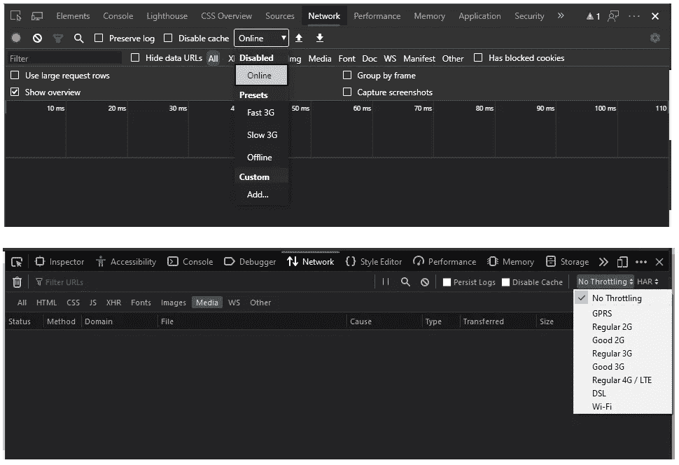
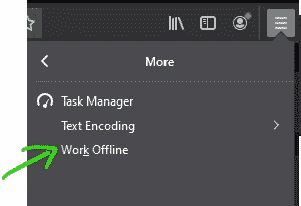
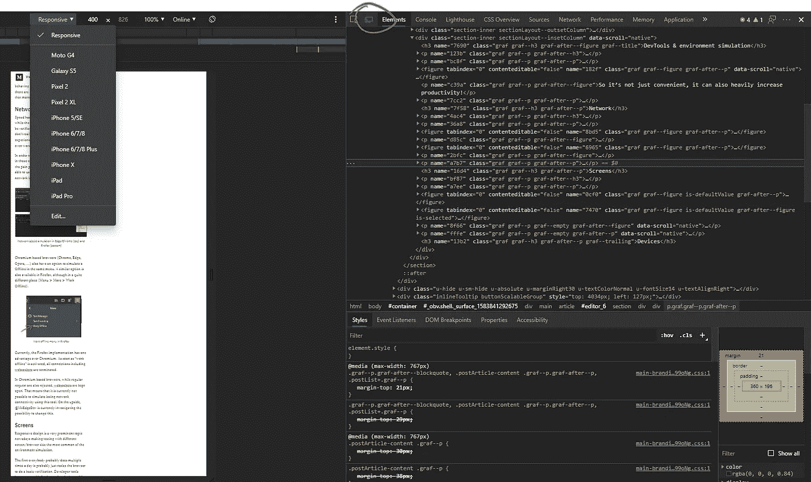
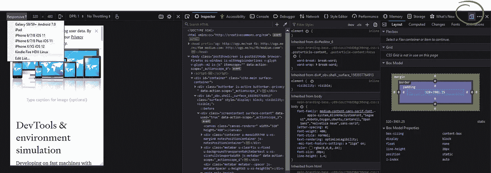

# 测试您的 Web 应用程序所需的东西

> 原文：<https://javascript.plainenglish.io/all-the-things-you-need-to-test-your-web-app-5efbc3028d13?source=collection_archive---------12----------------------->

## 最近，我在自己开发的一个应用程序中发现了一些只影响 iPhone 用户的错误。

当遇到 bug 时，第一步通常是尝试重现问题，然后用开发人员工具分析它。然而，iOS 是最难调试/分析的环境，除非你完全忠于苹果，并且自豪地拥有 iPhone 和 Mac。如果您缺少其中的任何一个，您就没有开发工具可以调试。但是让我们稍后再回到这个话题。

# 开发环境

在具有(多个)大屏幕和快速(有线)网络的快速机器上开发总是非常方便，这也是大多数开发人员在选择时可能更喜欢的。

它允许快速“编译”和几乎即时部署您的代码，多屏幕使得比较不同浏览器中的输出和每个浏览器中打开的开发工具成为可能。

Dual monitor setup

所以，这不仅仅是方便，它还可以大大提高生产力！

然而，这种设置很少与人们访问你的网站(或网络应用)的方式相匹配。因此，作为开发人员，我们需要能够模拟甚至极端的最终用户环境，以验证网站的行为是否也符合我们的预期。幸运的是，有很多工具可以帮助我们解决这个问题…

# 网络

速度对用户体验有很大的影响，虽然一个网站的整体速度可以很容易地通过像 [lighthouse](https://developers.google.com/web/tools/lighthouse/) 或 [webhint](https://webhint.io/) 这样的工具来验证，但这些工具并不能真正给出用户在 GPRS 这样的慢速网络或更糟糕的不稳定网络上的具体体验。

以便检查您的网站在那些环境中的行为，甚至了解某些用户的痛点。我们需要能够使用类似的网络限制您自己的网站。这时 DevTools 中的节流就派上了用场。

Network speed simulation in Edge/Chrome (top) and Firefox (bottom)

[基于 Chromium](https://www.chromium.org/Home) 的浏览器(Chrome，Edge，Opera，…)在同一个菜单中也有模拟“离线”的选项。Firefox 中也有类似的选项，尽管是在一个完全不同的地方(菜单>更多>离线工作)。

Work offline menu in Firefox

目前，Firefox 的实现比 Chromium 有一个优势:一旦“离线工作”被激活，包括 WebSocket 在内的所有连接都会被终止。

在基于 Chromium 的浏览器中，虽然常规请求也会被拒绝，但 WebSocket 保持打开。这意味着目前无法使用该工具模拟失去网络连接的情况。从好的方面来说， [@MsEdgeDev](https://twitter.com/MSEdgeDev) 目前正在研究改变这种情况的可能性。

# 屏幕

响应式设计是当今一个非常突出的话题，使得不同屏幕/浏览器尺寸的测试成为最常见的环境模拟。

每个人可能一天要做多次的常规测试包括简单地调整浏览器大小来做一个基本的验证。然而，开发者工具走得更远，只需点击一下，就可以检查特定设备的精确分辨率。

Device screen simulation in Edge

Device screen simulation in Firefox

您可能会注意到，在查看上面的 2 个截图时，在这两个浏览器中，模拟器视图也可以直接访问我们之前在开发工具中使用的相同虚拟网络设置。

虽然这个工具可以很好地帮助检查网站中特定设备的精确分辨率，但在两个模拟器视图中显式命名设备可能会有点误导，因为这些没有考虑设备浏览器引擎。

# 设备

那么如何才能检查不同的发动机呢？

最容易测试的当然是便携式浏览器的“桌面”引擎，比如 Chromium 和 Firefox，它们可以在许多平台(Windows、MacOS、Linux)上使用。

用 Safari (WebKit)这样只在单一平台上可用的浏览器进行测试变得更加困难。

移动浏览器也有些困难。而一些移动浏览器依赖于与桌面浏览器相同的引擎。仍然有一些差异，其中一些甚至被故意添加到浏览器中，以提高性能和节省电池。

为此购买几个设备通常不是一个选择。这太贵了，如果你和一个远程团队一起工作，每个人都需要访问这些设备，那就更贵了。

然而，现在有解决这个问题的方法，我们可以通过我称之为云抽象来访问大量的真实设备。

像 [lambdatest](http://www.lambdatest.com) 和 [browserstack](http://www.browserstack.com) 这样的服务让我们可以在众多设备和引擎上运行我们的应用，并访问开发人员工具。如果我们愿意，我们甚至可以在 CI 中使用这些服务来进行测试自动化。

# 结论

有一大堆工具可以帮助我们确保大多数用户在使用我们的网站时获得良好的体验，或者在最坏的情况下，至少是体面的体验。

这都是关于模拟和测试的。在这之前，建立一个[浏览器列表](https://github.com/browserslist/browserslist)并将其与一堆 linters 和预编译器结合起来，以确保我们编写的代码已经尽可能多地适应了我们首先想要支持的浏览器，这总是一个好主意。