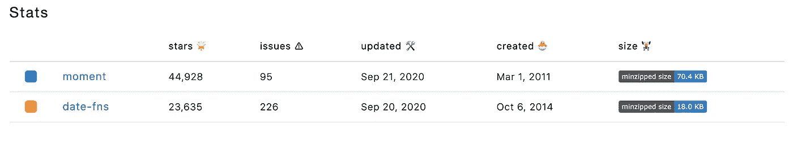
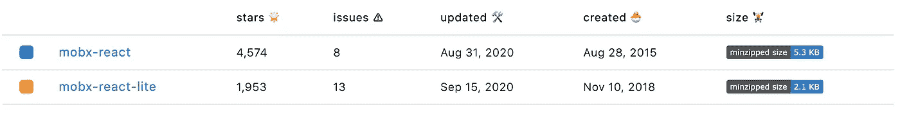
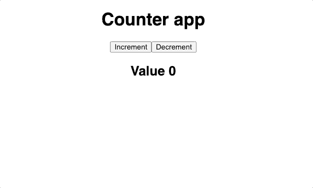
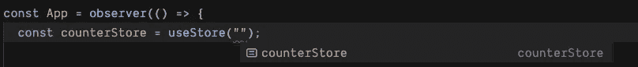
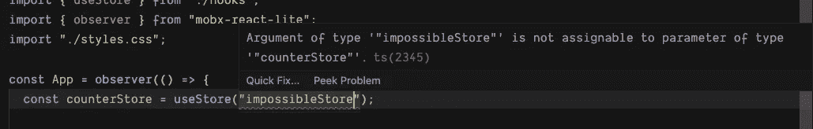
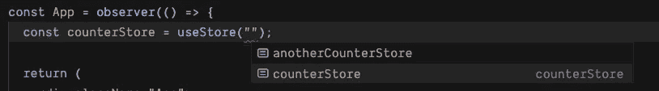
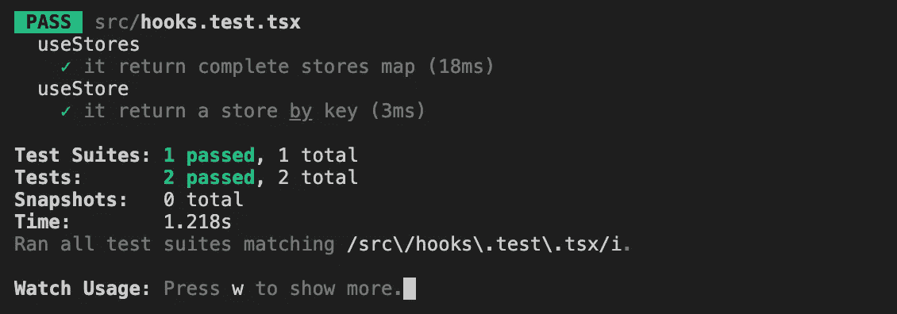
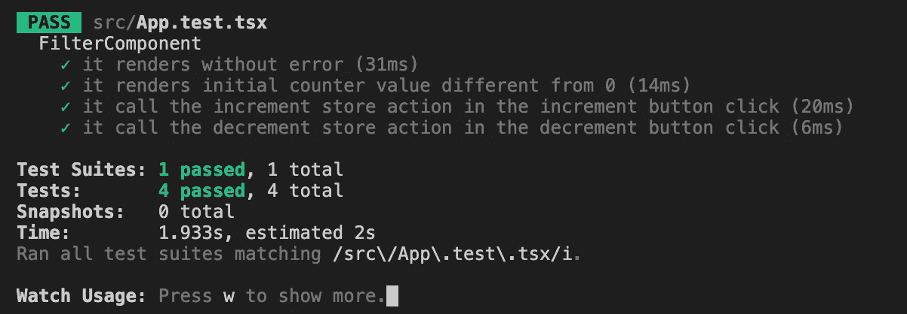

# 你所需要的就是 mobx-react-lite

> 原文：<https://javascript.plainenglish.io/all-you-need-is-mobx-react-lite-47ba0e95e9c8?source=collection_archive---------2----------------------->


Photo by [Devin Avery](https://unsplash.com/@devintavery?utm_source=medium&utm_medium=referral) on [Unsplash](https://unsplash.com?utm_source=medium&utm_medium=referral)

MobX 的知名度越来越高。减小束尺寸的需求也增加了。不仅如此，我们还寻求在我们的项目中编写更干净和可维护的代码。那么如何才能做到这一点呢？

自从 React 团队从 v16.8.0 发布了 hooks 我们被引入了一种以函数方式编写组件的好方法。在我个人看来——在悬挂物上使用挂钩看起来干净多了。用钩子从商店中访问数据似乎也更干净。我们倾向于用功能组件编写更少的代码，而不是用类组件编写大块的代码。这是增加代码可维护性的方法之一。

## 捆绑包大小呢？

使用轻量级包是减少最终包大小的一个好方法。我们可以通过许多包来实现这一点。还记得用 Moment.js 吗？我不记得使用它有一段时间了，因为它有一个更大的包大小的替代日期-fns 包。即使如此，现在仍然有两倍多的下载量和明星。



[https://www.npmtrends.com/moment-vs-date-fns](https://www.npmtrends.com/moment-vs-date-fns)

Mobx-react-lite 是一个轻量级绑定，用于粘合 Mobx 存储和功能性 react 组件。它的尺寸更小，但可能没有你想象的那么大。然而，这就是我们所需要的。



[https://www.npmtrends.com/mobx-react-vs-mobx-react-lite](https://www.npmtrends.com/mobx-react-vs-mobx-react-lite)

# 我们开始吧

我们需要一个 React 项目设置和两个依赖项来开始:

```
yarn add mobx mobx-react-liteORnpm install mobx mobx-react-lite
```

举个简单的例子，我们可以用一些动作和值创建一个计数器存储。我使用的 Typescript 具有支持 decorator 语法的特性，但是对于我们的例子，使用 decorator 还是函数并不重要。

为了从组件访问商店，我们需要创建商店的实例，当然，以某种方式与组件共享它。React Context 非常适合这项任务，我们可以根据需要利用它。让我们用商店实例和上下文包装器创建一个`stores.ts`文件。

很好。现在我们有了一个`stores`变量，可以保存 Mobx 商店的实例。我们冻结这个物体是为了避免它发生任何意想不到的变化。但是，当然，这是一个可选步骤。

我们创建了一个基于商店变量的 React 上下文，还创建了一个商店提供者组件，我们很快就会用到它。

现在，让我们用上下文提供者包装器更新根`index.tsx`文件。遵循以下代码片段。

很好。在这一点上，我们有一个地方，我们保存我们的商店。我们也有办法与组件共享存储，但不是完全共享。要访问该上下文，我们必须创建两个定制且非常方便的钩子。一个将返回所有商店，另一个返回特定的首选商店。

好了，现在我们有了。看到`useStore`钩子奇怪的类型定义了吗？它将为传递的存储键提供正确的类型。

```
<T extends keyof typeof stores>
(store: T): typeof stores[T]
```

只有当`store`变量类型是`stores`对象的键之一时，我们才会接受它。因此，在我们的例子中，它将只接受一个`counterStore`字符串，并返回给定商店的相应类型。很好，不是吗？

好吧，让我们最终从实际的组件中访问存储、它的方法和属性。为此，我们必须用自定义钩子和 Mobx Observer 包装来修改`App.tsx`文件。

我们用它的钥匙进入柜台商店，并得到商店的回报。此外，我们必须将组件包装到`observer`函数中，以允许组件监听商店的变化。但我们仍然不会破坏商店。

```
const counterStore = useStore("counterStore");
```



Counter App demo

该应用程序工作正常，酷！让我们看看我们从这个设置中得到的 TypeScript 提示，以及它将如何保护我们不做错事。

首先要提到的是代码完成特性。当我们添加`useStore`钩子并开始传递一个字符串作为参数时——将会显示一个关键提示。我们也将无法传递不存在的商店密钥。不错。



TypeScript hint



TypeScript warning

当我们有多个商店时，这也适用。我们可以用单独的`useStore`挂钩或`useStores`挂钩来接近它们。看看这个。



TypeScript hint for multiple options

# 测试

当然，我们需要测试一下。在本文中，我们不会对商店本身进行测试，因为这是一个性质不同的话题。

我发现使用 Jest 和反应测试库很容易。所以，让我们添加必要的依赖项。

```
yarn add @testing-library/react-hooks react-test-renderer -DORnpm install @testing-library/react-hooks react-test-renderer --save-dev
```

酷！现在我们可以开始测试钩子文件了。这里没什么特别的，但还是必要的。



Hooks file tests results

## 组件测试怎么样？

为此，我们将需要更多的依赖。测试组件并执行用户事件。

```
yarn add @testing-library/react @testing-library/user-event -DORnpm install [@testing](http://twitter.com/testing)-library/react @testing-library/user-event --save-dev
```

很好。让我们现在测试组件。我们可以使用 Jest 来模拟`useStore`钩子，让它总是返回一个特定的商店。而且，我们可以通过几行额外的代码来实现类型安全。对于每个测试，我们都希望钩子返回一个新的存储。但是，对于其中一个测试，我们将稍微改变一下，并替换计数器的初始值。请检查此代码段。



App file tests results

很简单，不是吗？没错。我们也被开了绿灯！

# 摘要

Mobx-react-lite 实际上是我个人项目中所需要的一切。这也是你喜欢的选择吗？请在下面的评论中告诉我😉。

整个项目可在 [GitHub 链接](https://github.com/bohdanbirdie/mobx-react-lite-example)上找到。

## 谢谢你阅读这个话题！