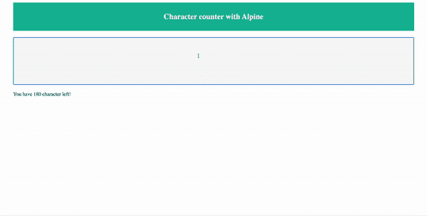

# Alpine.js 101:了解基础知识

> 原文：<https://javascript.plainenglish.io/alpine-js-101-understanding-the-basics-in-3-minutes-76890650046?source=collection_archive---------7----------------------->


Photo by [Maxwell Nelson](https://unsplash.com/@maxcodes?utm_source=medium&utm_medium=referral) on [Unsplash](https://unsplash.com?utm_source=medium&utm_medium=referral)

我们将讨论 alpine，它有可能取代 jQuery 甚至 Angular、React 或 Vue 等你在开发网站时通常使用的库。

如果您经常构建需要在 UI 上少量使用 JavaScript 的网站，以提供更好的用户体验，那么这篇文章非常适合您！！

> *在做了大量研究，甚至使用了无数次之后，我意识到 Alpine.js 可能真的有所发现。*

# Alpine.js vs 其他

如果你看一下这个表，你会发现 alpine 和其他常用的库/框架在文件大小上的不同。

> *像许多其他开发人员一样，我们通常会过度复杂我们的工作流程。*

我们总是选择最新和最受欢迎的图书馆。我们去网上能找到的最好的图书馆。我们看到 React，Angular，Vue 搜索排名最高，盲目开始使用。

我认为这是一个错误的方法，因为在许多情况下，这些库都是多余的，没有别的作用。

我不想从 Angular 和 React 这样的框架中拿走任何东西。我实际上每天都在使用它们，而且我实际上在 angular multiple 项目中有我所有的代码库。我想说的是，有一些网站不需要那些复杂和高级的框架，因为它们确实增加了规模，你实际上可以在上表中看到这一点。

# 何时(何时)使用阿尔卑斯山

如果你想在你的下一个项目中使用 Alpine，让我为你澄清一些事情。

## 何时避免阿尔卑斯山= >

当你的网站:

*   有很多数据操作
*   需要大量的验证。
*   必须通过大量的 API 调用来获取和处理数据。

对于这些场景，我真的真的建议你使用 Vue、React、Angular 或者任何你喜欢的框架。

## 何时使用 Alpine = >

当你的网站:

*   必须对 DOM 进行基本的操作。
*   在某些情况下，您必须在用户交互时附加类
*   监听一些事件并改变用户界面。

我认为在这些场景中，Alpine.js 是你最好的朋友。

# 装置

**CDN:**

首先，您只需要将这个脚本标签添加到`<head>`:

就是这样。它会自己初始化！

**NPM:**

如果您喜欢从`npm`安装软件包:

```
npm i alpinejs
```

# 创建基本下拉列表

让我们从一个实际的例子开始。

如果我们点击这个按钮，下拉菜单是可见/打开的。如果我们再次点击，它就消失了。

> *现在让我们来理解代码= >*

```
<div x-data="{ open: false }">
    <button @click="open = true">Open Dropdown</button> 
    <ul
        x-show="open"
        @click.away="open = false"
    >
        Dropdown Body
    </ul>
</div>
```

正如你在代码中看到的，有些东西来自 Alpine，不是原生 HTML。比如 x-data、@click、x-show 等。

*   **x-data** 基本上是我们传递给组件(或者本例中的 div)的数据。它有一个对象，可以有一些属性，甚至可以有函数。在这种情况下它的`{open: false}`。
*   随着点击，使用该按钮的 **@click 属性**，变量 **open** 应该等于 **true** 。接下来会发生什么？在后台，我们有一个无序列表，它基本上是一个下拉框，根据 **open** 变量的值，它变得可见。因此，如果 open 为真，我们将实际看到 **ul** 或列表，每当我们单击远离下拉主体时，变量 **open** 被赋值为 **false** ，然后隐藏下拉列表。
*   在 **@click.away** 的帮助下，如果我们点击屏幕上的其他任何地方，就会触发 **open = false** ，再次隐藏下拉菜单！

这很简单，你已经可以看到这个库的威力了。

# 构建一个 Twitter 风格的字符计数器

让我们来看一个稍微复杂一点的例子:让我们用 alpine 构建一个字符计数器。

其中我们基本上有一个文本区，下面是可以输入的字符数。我们将允许用户输入 180 个字符，我们将更新文本区域下面的每个输入的计数。



Final character-counter example

> 推荐:为 VsCode 安装 Alpine IntelliSense，这样它会给你相关的自动完成功能。

## 第一步:让我们从基本的骨架开始

```
<!doctype html>
<html lang="en">

<head>
    <meta charset="UTF-8">
    <title>Document</title>
    <script src="https://cdn.jsdelivr.net/gh/alpinejs/alpine@v2.x.x/dist/alpine.min.js" defer></script>
</head>

<body>
    <div class="header">
        <h2>Character counter with Alpine</h2>
    </div>

</body>

</html>
```

## 第二步:撒一些阿尔卑斯山

```
<body>
    <div class="header">
        <h2>Character counter with Alpine</h2>
    </div>
    <div x-data="{
        content: '',
        limit: 180
    }">
        <textarea></textarea>
        <p></p>
    </div>
</body>
```

让我们在 x-data 中为 **div** 传递一个对象。假设我们有一些内容(a `string`)，现在是空的，我们有一个等于 180 的限制。

此外，还有一个`textarea`，在它下面，我们有一个段落将最终显示字符数。

**注:**我其实事先已经加了一些造型，不过你不用担心。

> *完整代码在本教程末尾！*

## 第三步:逻辑

下面的`remaining()`函数基本上应该返回内容长度和限制之间的差值。

```
<div x-data="{
    content: '',
    limit: 180,
    remaining() {
        return this.limit - this.content.length
    }
}">
    <textarea x-model="content"></textarea>
    <p>
        You have <span x-html="remaining()"></span> character left!
    </p>
</div>
```

*   A **span** ，因为我们其实是想计算**极限**和**含量**的差值。
*   最简单的方法是创建一个`remaining()`函数，这个函数基本上会返回限制和内容长度之差。
*   让我们在跨度内调用它。这将使用`remaining()`函数的返回来更新 span 的内部 HTML 内容。
*   目前，Alpine 不知道我们在`textarea`中有什么，因为它不知道内容是什么。我如何将这个**内容**变量与我的文本区域绑定？我们可以用`**x-model**` 来说明。

瞧！

我们有一个相当好的工作应用程序，它基本上告诉我们你已经输入了多少个字符，或者你目前可以输入多少个字符。

# 完全码

```
<!doctype html>
<html lang="en">

<head>
    <meta charset="UTF-8">
    <title>Document</title>
    <script src="https://cdn.jsdelivr.net/gh/alpinejs/alpine@v2.x.x/dist/alpine.min.js" defer></script>
    <style>
        textarea {
            width: 95%;
            height: 150px;
            padding: 12px 20px;
            box-sizing: border-box;
            border: 2px solid #ccc;
            border-radius: 4px;
            background-color: #f8f8f8;
            resize: none;
            margin-top: 20px;
            margin-left: 2.5%;
        }

        p {
            margin-left: 2.5%;
        }

        .header {
            padding-top: 10px;
            padding-bottom: 10px;
            text-align: center;
            background: #1abc9c;
            color: white;
            width: 95%;
            margin-left: 2.5%;
        }
    </style>
</head>

<body>
    <div class="header">
        <h2>Character counter with Alpine</h2>
    </div>
    <div x-data="{
        content: '',
        limit: 180,
        remaining() {
            return this.limit - this.content.length
        }
    }">
        <textarea x-model="content"></textarea>
    <p>
        You have <span x-html="remaining()"></span> character left!
    </p>
    </div>
</body>

</html>
```

我希望这篇文章能帮助你理解 Alpine.js 的基础知识

感谢阅读。如果你有任何问题，请随时回复。

If you prefer to watch the tutorial and learn!

# 资源

1.  [https://github.com/alpinejs/alpine](https://github.com/alpinejs/alpine)
2.  [https://www . smashingmagazine . com/2020/03/introduction-alpine js-JavaScript-framework/](https://www.smashingmagazine.com/2020/03/introduction-alpinejs-javascript-framework/)
3.  [https://www.alpinetoolbox.com/](https://www.alpinetoolbox.com/)

*原载于*[*https://www.theimmigrantprogrammers.com*](https://www.theimmigrantprogrammers.com/p/alpinejs-101-understanding-the-basics)*。*