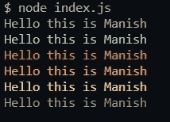
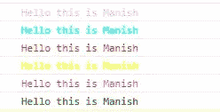
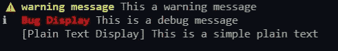
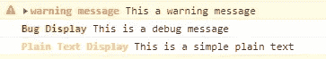
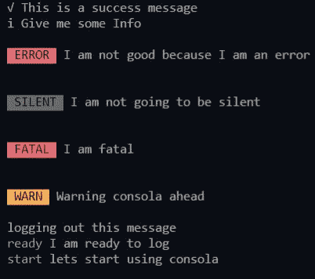
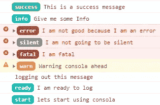
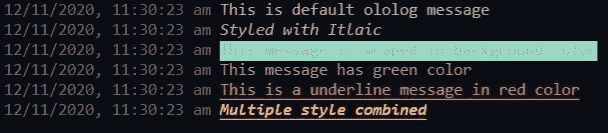
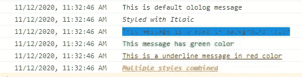

# 下一个 JavaScript 项目的 Console.log()的备选库

> 原文：<https://javascript.plainenglish.io/alternative-libraries-for-console-log-for-your-next-javascript-project-af6bc9a2f2ba?source=collection_archive---------0----------------------->

如果你是一名 JavaScript 开发人员，你必须使用`console.log()`来调试你的 JavaScript 项目。但是你知道吗，除了`console.log()`还有一些替代库。这些库可以用于您的下一个**节点、React、Angular、**或 **Vue** 项目。因此，让我们看看这些库是什么，以及如何使用它们。

## [1。控制台](https://www.npmjs.com/package/Console)

控制台是一个轻量级的库，可以作为`console.log()`的替代品。关于控制台最好的部分是，除了支持警告、信息、日志或错误方法之外，它还支持成功、调试和压力方法。

**用法**

安装:`npm install Console`或`yarn add Console`

导入:`const Console = require("Console");`或`import Console from "Console"`

Terminal Output

Browser Output

## 2.[记录日志](https://www.npmjs.com/package/logdown)

Logdown 是一个调试工具，用于支持 Markdown 的浏览器和服务器，在浏览器和服务器之间提供了一个单一的接口和类似的行为。

关于 logdown 最好的部分是你可以传递你的模块的名字，它将返回一个修饰过的控制台。

**用法**

安装:`npm install logdown`或`yarn add logdown`

导入:`const logdown = require("logdown");`或`import logdown from "logdown"`

`Note: Using **isEnabled** state the log method can be enabled or disabled.`

Terminal Output

Browser Output

## 3.[控制台](https://www.npmjs.com/package/consola)

Consola 是 Node.js 和 Browser 最常用的日志库。它每周有 150 万次下载。您也可以使用 consola 暂停或恢复您的日志。

**用途**

安装:`npm install consola`或`yarn add consola`

导入:`const consola = require("consola");`或`import consola from "consola"`

Terminal Output

Browser Output

## 4. [Ololog](https://www.npmjs.com/package/ololog)

Ololog 是一个库，可以用来在控制台中以不同的样式显示日志消息。它支持文本颜色、背景颜色、斜体等来显示你的日志信息。

**用途**

安装:`npm install ololog`或`yarn add ololog`

进口:`const log = require("ololog");`或`import log from "ololog"`

`Note: It’s not compulsory to use the configure method.`

Terminal Output

Browser Output

希望这篇文章对你的下一个 JavaScript 项目有用。

感谢阅读