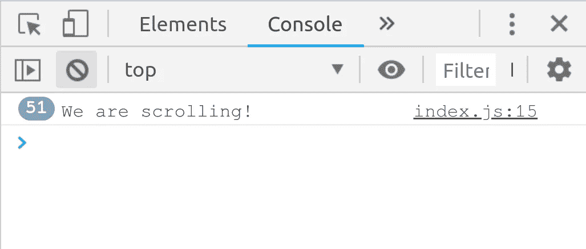
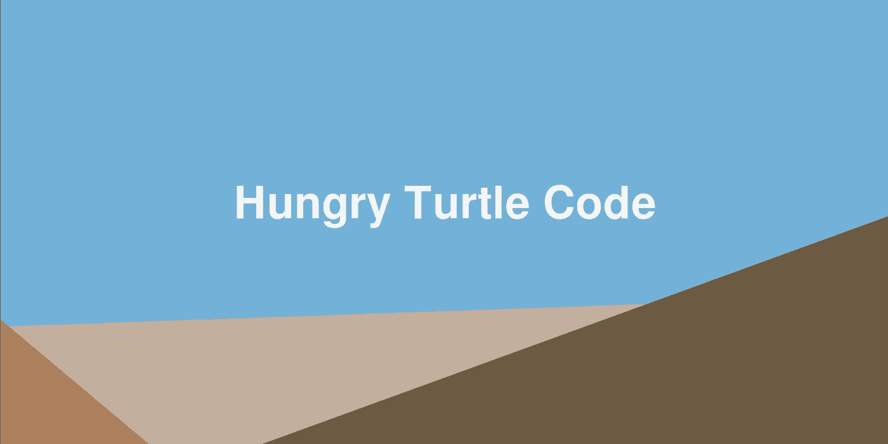

# 纯 JavaScript 中惊人的视差效果

> 原文：<https://javascript.plainenglish.io/amazing-parallax-effect-in-pure-js-hungry-turtle-code-e4663af35c9f?source=collection_archive---------15----------------------->

# 视差效果不一定是令人讨厌的

***注意:*** *这是系列文章的第一部分，我们将从想法和杂乱的代码到一个概括的抽象，我们将在 NPM 上发布为开源库*

我不想说谎，视差网站在某些圈子里没有最好的声誉，这是理所当然的。通常，视差效果是通过某种劫持用户在页面上的滚动位置来实现的。这只会导致可怕的经历，让许多人讨厌这个概念。然而，互联网上有很多这种效果的好例子。

一个好的 parallax 网站的关键是用户完全控制滚动，但是滚动的位置直接决定了页面上应该显示什么。换句话说，UI 上显示的是滚动位置的纯函数。然后体验感觉很好。就好像在页面上滚动就像在视频时间轴上滑动一样。该网站成为互动视频类型体验的画布。

在这篇文章中，我想尝试使用纯 JavaScript 来创建这样的东西，只是为了展示做好它是多么简单。

# 我们会做什么？

这是我们将要做的:[现场演示](https://hungryturtlecode.com/demos/parallaxbasic/)

您也可以查看视频教程的开头，快速浏览我们将要创建的内容。

正如你所看到的，我们将创建一个非常有趣的 3d 视差效果，看起来像我们正在穿越一些山脉，一些移动的文本动画和一个典型的滚动视差。

当我第一次开始建立网站时，这种事情看起来非常困难，远远超出了我的能力范围。但是我在这里告诉你，这真的没有你想象的那么难。所以让我们开始吧。

# 搭建出 HTML 和 CSS

我们将开始一个简单的 HTML 页面和一些 CSS:

```
<!DOCTYPE html>
<html lang="en">
<head>
  <meta charset="UTF-8">
  <title>Turtle Parallax</title>
  <link href="main.css" rel="stylesheet" />
</head>
<body>
  <script src="index.js"></script>
</body>
</html>code
* {
  margin: 0;
  padding: 0;
}

body {
  height: 5000px;
}
```

***注意:*** *将主体高度设置为 5000 像素在这一点上是任意的，因为我们只是想要比屏幕高的东西，这样我们就有东西可以滚动了。这可以在以后变得更加清晰和精确，但是现在将其设置为某个随机的大值就可以了。*

# 写一些 JavaScript

您可能已经注意到我们在 html 中包含了一个到`index.js`的链接，所以现在让我们创建它，并通过监听滚动事件开始。

```
document.addEventListener('scroll', () => {
  // do something on scroll
  console.log('We are scrolling!');
});
```

现在，如果我们打开浏览器，我们可以稍微滚动一下，看看控制台输出:



***注:*** *为了方便起见，我喜欢使用一个名为* `*live-server*` *的 npm 包，它让我在开发时可以实时重新加载浏览器。你可以使用* `*npm install -g live-server*` *全局安装它，然后在项目目录中运行* `*live-server*` *，index.html 将在浏览器中弹出打开，为一些实时重载做好准备。*

# 我们需要一些 html 来处理

在这一点上，我们有了一个基本的结构，我们可以听滚动，但我们需要在页面上的一些实际的 html，让我们在滚动时进行操作。因此，让我们创建初始的山看起来的东西。

在 index.html 的正文顶部插入以下内容:

```
<div id="app">

  <div class="fixed-section firstpage">

    <h1 class="heading">Hungry Turtle Code</h1>

    <div class="background">
      <div class="bg-block"></div>
    </div>

    <div class="middleground">
      <div class="mg-block"></div>
    </div>

    <div class="foreground">
      <div class="fg-block"></div>
    </div>

  </div>

</div> <!-- end of #app -->
```

因此，我们为整个应用程序创建了一个容器，我们给它的 id 是`app`，在这个容器中，我们为应用程序的“第一页”创建了另一个包装器，这将是 mountain fly through 部分。里面有一个标题和三个部分:背景、中间地带和前景。每一个里面都有另一个 div，它将是实际的“mountain-y”部分。

我们在每个部分中都有一个 div 的原因是，我们可以有一个统一的锚点来操作所有不同的部分。我的意思是，所有的“山”部分都在不同的地方，所以如果我们没有将每个部分包装在一个容器中，它们都将有不同的锚点，如果我们开始扩展或转换它们，将会变得一团糟，以保持一切一致。

取而代之的是，我们将每一个包裹在一个容器中，这个容器的大小相当于整个窗户的大小。现在，我们可以自由地将每个元素放在容器中我们想要的任何位置，并简单地相对于容器调整它的大小。当需要操作和变换每个部分时，我们可以操作容器(它们都是窗口的大小，因此具有相同的定位点),因此一切都保持一致，我们不必处理不同定位点的混乱。

**可能在视频中说明这一点，并链接到文章中的时间戳**

这是使用的 CSS:

```
#app {                                
  position: fixed;    
  top: 0;           
  left: 0;                  
  width: 100%;            
  height: 100%; 
}

.fixed-section {
  position: fixed;
  top: 0;            
  bottom: 0;         
  left: 0;     
  right: 0;                
  background: #71b1d9;
  z-index: 2; 
}                     

.background,
.middleground,
.foreground {
  position: absolute;
  top: 0;
  bottom: 0;
  left: 0;
  right: 0;
}

.bg-block {
  background: #c3af9d;
  position: absolute;
  bottom: -10vh;
  left: 0;
  width: 100%;
  height: 40vh;
  transform: skewY(-2deg);
}

.mg-block {
  background: #ab805c;
  position: absolute;
  bottom: -45vh;
  left: -30vw;
  width: 100%;
  height: 40vh;
  transform: skewY(40deg);
}

.fg-block {
  background: #6d5a44;
  position: absolute;
  bottom: -45vh;
  left: 0;
  width: 100%;
  height: 60vh;
  transform: skewY(-20deg);
}

.heading {
  position: absolute;
  font-size: 5vw;
  left: 26vw;
  bottom: 24vw;
}

.firstpage h1 {
  color: #f4f4f4;
}
```

这里的核心是整个首页部分的位置是固定的，所以滚动实际上不会影响元素。每一个“山”部分都是 div，它们已经被着色并使用倾斜变换进行了变换，以使它们成角度。剩下的只是将元素放置在正确的位置。

所以现在我们有了以下内容:



# 让它动起来！

我们有一些 html 山-y 的东西，我们可以听滚动。让我们在滚动的时候操作 html。

首先，我们需要获取对我们想要操作的元素的引用。因此，将以下内容添加到您的`index.js`脚本的顶部:

```
const fg = document.querySelector('.foreground');
const mg = document.querySelector('.middleground');
const bg = document.querySelector('.background');
const title = document.querySelector('.firstpage h1');
```

然后，在滚动事件侦听器中，我们希望获得总滚动偏移量，并定义穿过山脉的缩放动画的长度。这个长度将是一个像素值。例如，如果我们将长度定义为 500，那么动画将需要滚动 500 个像素才能完成。

```
document.addEventListener('scroll', () => {
  const yoff = window.pageYOffset;

  const MOUNT_SCALE_END = 500;
});
```

紧接着我们将开始逻辑。我们将检查当前的滚动位置是否小于动画的结尾，如果是，我们将缩放山峰和标题。我们通过缩放离我们“近”的元素而不是“远”的元素来创造 3d 的幻觉。

```
document.addEventListener('scroll', () => {
  const yoff = window.pageYOffset;

  const MOUNT_SCALE_END = 500;

  if (yoff < MOUNT_SCALE_END) {
    const perc = yoff / MOUNT_SCALE_END; // how far through the animation are we?
    fg.style.transform = `scale(${1 + 0.4 * perc})`;
    mg.style.transform = `scale(${1 + 0.1 * perc})`; 
    bg.style.transform = `scale(${1 + 0.04 * perc})`;
    title.style.transform = `scale(${1 + 0.35 * perc})`;
  }
});
```

***注意:*** *我们使用* [*模板字符串*](https://developer.mozilla.org/en-US/docs/Web/JavaScript/Reference/Template_literals) *来允许我们轻松地将变量添加到字符串中，而不必做大量的字符串连接。*

我们实际操作元素的第一件事是将`pageYOffset`归一化，以表示通过将偏移量除以缩放山峰部分的末端而完成的动画的百分比。

一旦我们有了这个百分比，我们就可以用它来缩放不同的元素，方法是将百分比乘以某个常数，从而得到每个元素的不同缩放比例。

当我们开始滚动时，最终结果是一个美丽的视差缩放效果，当我们向下滚动页面达到 500 像素时就停止了。

# 第二节

接下来要做的是添加第二部分。我要做的第一件事是创建一个淡出过渡，它将在后面引入第二部分。

我们将改变`.firstpage`元素的不透明度，所以我们需要抓住它。因此，在脚本的顶部添加以下内容:

```
const firstpage = document.querySelector('.firstpage');
```

在我们创建的另一个名为`MOUNT_SCALE_END`的定时常数下，我将在第二部分添加另一个标志过渡期结束的常数:

```
const TRANSITION_END = 800;
```

然后，我们可以将 else if 语句添加到 if 块中，我们当前必须检查偏移量是否在转换的边界内:

```
if (yoff < MOUNT_SCALE_END) {
  // code from above
} else if (yoff < TRANSITION_END) {
  const perc = (yoff - MOUNT_SCALE_END) / (TRANSITION_END - MOUNT_SCALE_END);
  firstpage.style.opacity = `${1 - perc}`;
}
```

同样的想法在这里，我们计算百分比，我们通过过渡，并改变不透明度的基础上，该百分比。

这次百分比的计算有点复杂，因为过渡不是从 0 开始，而是从爬山部分的终点开始，所以我们必须从偏移中去掉`MOUNT_SCALE_END`来得到起点，现在因为我们已经通过去掉`MOUNT_SCALE_END`使起点正常化，我们也必须从终点去掉它。

现在，当我们向下滚动时，群山会慢慢消失。但是，我们希望第二部分显示下面，因为它褪色。现在让我们为该部分创建标记。

# 小问题

如果您修改浏览器中的滚动，您可能会注意到当前代码中的一个小问题。这个问题是，如果你向下滚动经过过渡，然后快速向上滚动，第一部分的不透明度可能不会一直回到 1。这是因为你滚动得太快了，以至于在我们离开过渡代码回到缩放代码之前，滚动事件不能被足够快地调用来改变不透明度。

为了解决 if 语句中的这个问题，我们应该添加一些代码来使第一部分 1 不透明，以保证即使我们滚动得很快，它也会被重置。

```
if (yoff < MOUNT_SCALE_END) {
  // rest of scaling code

  firstpage.style.opacity = '1';
} else if (yoff < TRANSITION_END) {
  // transition code
}
```

# 第 2 节加价

下面是要添加到首页标记下的 html:

```
<div class="fixed-section secondpage">
  <h1 class="heading">
    <span>Hungry</span>
    <span>Turtle</span>
    <span>Code</span>
  </h1>
   <imgsrc="https://res.cloudinary.com/djxscnpzf/image/upload/v1538571617/hungryturtle_high3_af4hyq.png"
    class="turtlemascot"
  >
</div>
```

如你所见，我们再次使用了`.fixed-section`类，所以这将与第一页具有相同的基本样式。我们还重用了`.heading`类，因为我们想让标题看起来和第二部分一样。

我们将标题中的每个单词放入它自己的范围，这样我们就可以挂钩到每个单词，并在以后单独转换它们。

我们还将添加以下额外样式:

```
.secondpage {
  background: #cabaad;
}

.secondpage h1 {
  color: #fdeabf;
  transform: scale(1.35);
}

.secondpage h1 span {
  display: inline-block;
}

.turtlemascot {
  position: absolute;
  width: 40vw;
  left: 32vw;
  bottom: 17vw;
  transform: scale(0);
}
```

这里需要注意的是，我们将 h1 的比例设置为 1.35。为什么？在第一部分中，我们正在缩放标题，缩放比例使用常数 0.35，这意味着在动画结束时，标题被缩放到 1.35。我们希望第二页中的标题与第一页中的标题完全匹配，所以我们需要将其缩放到 1.35，以便匹配。乌龟吉祥物也是从 0 开始缩放，所以它可以随着滚动而放大。

# 动画标题

首先，我们需要理解 JavaScript 中的标题:

```
const titleParts = document.querySelectorAll('.secondpage h1 span');
```

你大概可以知道此时会发生什么。我们需要将标题动画的结尾指定为一个常量，然后添加另一个 else if 来检查我们是否在标题过渡动画边界内。

```
// Other constants defined here
const WORD_SPLIT_END = 2300;

if (yoff < MOUNT_SCALE_END) {
  // Mountain scaling code
} else if (yoff < TRANSITION_END) {
  // Transition code
} else if (yoff < WORD_SPLIT_END) {
  const offset = yoff - TRANSITION_END;
  titleParts[0].style.transform = `translate3d(0, -${offset}px, 0)`;
  titleParts[1].style.transform = `translate3d(0, 0, 0)`;
  titleParts[2].style.transform = `translate3d(0, ${offset}px, 0)`;

  if (offset > 300) {
    titleParts[1].style.transform = `translate3d(-${offset - 300}px, 0, 0)`;
  }
}
```

像往常一样，我们通过减去前一部分的结尾来标准化偏移量，然后使用该值来转换`translate3d`属性。请注意，我们最初没有对标题的中间部分做任何事情，但是如果标准化的偏移量大于 300，那么我们开始移动中间部分。这就是我们如何延迟中间部分的动画，正如你在演示中看到的。

# 给乌龟称重

参考海龟的形象:

```
const mascotimg = document.querySelector('.turtlemascot');
```

然后通过比例计算百分比，并使用该百分比更新比例:

```
if (yoff < MOUNT_SCALE_END) {
  // Mountain scaling code
} else if (yoff < TRANSITION_END) {
  // Transition code
} else if (yoff < WORD_SPLIT_END) {
  // Rest of title animation

  if (offset > 500) {
    const perc = Math.min(
      1, 
      (offset - 500) / (WORD_SPLIT_END - TRANSITION_END - 500)
    );
    mascotimg.style.transform = `scale(${1.2 * perc})`;
  }
}
```

同样，这里的百分比计算有点复杂。最终，它只是偏移除以动画的长度。偏移量就是我们之前的值，动画的持续时间是通过从当前部分的结尾减去前一部分的结尾来计算的。然而，因为我们只是从 500 像素开始，我们需要从两边减去 500。然后我们将这个值加上 1，以确保我们永远不会得到大于 1 的值。

# 第三节

第三部分也是最后一部分更像是传统的视差滚动。

以下是标记:

```
<div class="thirdpage">
  <div class="progress-line">
  </div>

  <div class="title">
    <h2>Hello Parallax</h2>
  </div>

  <div class="imgs">
    
    
  </div>

  <div class="bottom-sect"></div>
</div>
```

和 CSS:

```
.thirdpage {         
  transform: translate3d(0, 100vh, 0);
  background: #231f20;
  padding-top: 50px;     
}              

.thirdpage .title {       
  display: flex;     
  align-items: center;  
  justify-content: center;
  font-size: 2vw;     
}                    

.thirdpage .imgs {   
  margin: 100px 0;
  position: relative;
}              

.img {     
  position: absolute; 
  display: block;    
  top: 10vw;         
}                

.img1 {         
  left: calc(50vw - 350px);
}            

.img2 {           
  left: calc(50vw - 50px);
  top: 16vw;          
}                    

.thirdpage .title h2 {
  color: #c2c2c2;        
} 

.bottom-sect {
  height: 1000px;
}

.progress-line {
  position: absolute;
  width: 2px;
  background: red;
  height: 100%;
  left: 5vw;
  top: 0;
  transform: translate3d(0, -100%, 0);
  z-index: 0;
}
```

像往常一样，我们将不得不抓住我们想要操纵的元素。在这种情况下，我们显然需要抓取我们要视差的图像，但我们也要抓取整个应用程序容器。

```
const app = document.querySelector('#app');
const imgs = document.querySelectorAll('.imgs .img')
const progressLine = document.querySelector('.progress-line');
```

为了使这部分滚动，我们需要做一些欺骗。这样做的原因是前两个部分已经被`position: fixed`了，因为我们希望它们在我们滚动时保持不动，并且只对其中的元素进行动画处理。不过现在我们希望一切都滚动，包括定位第二部分。

实现这一点的最好方法是让整个应用程序容器固定位置(我们实际上已经在上面这样做了，卑鄙吧？)然后以与窗口滚动相同的速度平移 3d 应用程序容器的位置。这会给人一种视觉上的感觉，我们实际上是在滚动，而我们实际上只是以与滚动相同的速度平移容器。

```
const END_OF_PAGE = 3450;

if (yoff < MOUNT_SCALE_END) {
  // Mountain scaling code
} else if (yoff < TRANSITION_END) {
  // Transition code
} else if (yoff < WORD_SPLIT_END) {
  // Title animation code
} else if (yoff < END_OF_PAGE) {
  const offset = yoff - WORD_SPLIT_END;
  const duration = END_OF_PAGE - WORD_SPLIT_END;

  app.style.transform = `translate3d(0, -${offset}px, 0)`;
  imgs[0].style.transform = `translate3d(0, -${offset * 0.1}px, 0)`;
  imgs[1].style.transform = `translate3d(0, -${offset * 0.25}px, 0)`;
}
```

此时，您应该对上面的代码非常熟悉。我们通过减去前一部分的结尾，将总偏移量归一化为该部分的偏移量。然后，我们通过从当前部分的末尾减去上一部分的末尾来计算滚动的持续时间。将很快使用持续时间。

然后，计算出的偏移量被用来翻译应用程序容器，以模拟如上所述的滚动。我们也用两个不同的常数乘以偏移量来平移每张图片。通过使用两个不同的值，我们创建了视差效果，因为每个图像以不同的速度移动。

# 进度条

现在要做的最后一件事是添加跟踪视差滚动部分进度的红色条。

我们不想立即触发进度条，所以我们将使用与上面徽标缩放代码相似的逻辑。

```
if (yoff < MOUNT_SCALE_END) {
  // Mountain scaling code
} else if (yoff < TRANSITION_END) {
  // Transition code
} else if (yoff < WORD_SPLIT_END) {
  // Title animation code
} else if (yoff < END_OF_PAGE) {
  // rest of scrolling code

  const progressTrigger = duration * 0.2;

  if (offset > progressTrigger) {
    const progressDur = duration - progressTrigger;
    const progressOff = offset - progressTrigger;
    const progress = Math.min(1, progressOff / progressDur) * 100;
    progressLine.style.transform = `translate3d(0, -${100 - progress}%, 0)`;
  } else {
    progressLine.style.transform = `translate3d(0, -100%, 0)`;
  }
}
```

在这里，我们计算进度条的偏移量和持续时间，然后计算用于转换 div 的进度百分比(在 CSS 中转换为 100%)。我们添加 else 块以确保当我们在进度条动画的边界之外时，我们重置进度条位置的状态。这是一个类似于我们之前展示的关于滚动太快和没有正确重置第一部分的不透明度所造成的错误的修复。

# 修复 bug

如果您在浏览器中修改网页并滚动，您会注意到，当我们快速滚动时，还有一些其他问题没有正确地重置元素状态。我们现在将清理这些 bug。

您可能注意到的第一个问题是，如果我们快速向上滚动标题动画，我们不会将标题位置重置回 0。为了解决这个问题，我们将在过渡部分将其重置为零，如下所示:

```
} else if (yoff < TRANSITION_END) {
  titleParts[0].style.transform = `translate3d(0, 0, 0)`;
  titleParts[2].style.transform = `translate3d(0, 0, 0)`;
  titleParts[2].style.transform = `translate3d(0, 0, 0)`;
}
```

一个稍微微妙的错误是，如果你在第二或第三部分刷新页面，然后向上滚动到第一部分，当“山”部分的缩放开始时，会有一个闪光。这是因为比例从 1 开始，并在第一部分动画中放大到某个更大的值。然而，如果我们刷新第三部分中的页面，那么第一部分中的动画从未运行过，因此当我们在过渡阶段中向后滚动时，比例仍然为 1，但是一旦我们再次点击第一部分动画，它将弹出更大的比例值。

因此，在我们返回到过渡部分之前，我们需要将音阶重置为较大的值。我们还会将不透明度重置为 0，以准备进入将转换回 1 的过渡。将此添加到 word 动画块:

```
} else if (yoff < WORD_SPLIT_END) {
  title.style.transform = `scale(1.35)`;
  fg.style.transform = `scale(1.4)`;
  mg.style.transform = `scale(1.1)`;
  bg.style.transform = `scale(1.04)`;
  firstpage.style.opacity = `0`; 

  // rest of word animation code
}
```

海龟形象也存在同样的问题。我们将它放大到 1.2，但在下一节中不要将其重置为 1.2，以避免我们向后滚动时可能出现的闪烁。

```
} else if (yoff < END_OF_PAGE) {
  mascotimg.style.transform = `scale(1.2)`;

  // rest of scrolling code
}
```

最后一个 bug 相当微妙，实际上可能没那么重要。问题是，我们只是通过将不透明度更改为 0 来从视图中删除第一页，但元素实际上仍然在那里，在页面上的所有其他内容之上，我们只是看不到它。这意味着，如果我们试图选择文本或其他东西，它不会工作，因为我们实际上是在点击不可见的第一页。

我们将通过以下方法解决此问题:当页面不在视图中时，使其不显示，当它重新出现在视图中时，将其更改为阻止显示:

```
if (yoff < MOUNTAIN_SCALE_END) {
  // mountain scale code
} else if (yoff < TRANSITION_END) {
  firstpage.style.display = 'block';

  // rest of transition code
} else if (yoff < WORD_SPLIT_END) {
  firstpage.style.display = 'none';

  // rest of word animation code
}
```

我们做到了！使用纯 JavaScript 完成了一个漂亮的视差效果(但是很粗糙)。我真的希望你喜欢它，我期待在[的下一部分](https://hungryturtlecode.com/projects/parallax-library/)看到你，我们将把这段代码，清理并转换成一个通用库，我们将发布到 NPM，这样任何人都可以轻松地创建像这样的惊人视差网站！到时候见。

保持饥饿，继续编码。

艾德里安(男子名)

如果你喜欢这篇文章，请分享一下。每个人都需要那个**的好朋友**给他们发送令人惊奇的东西。

【https://hungryturtlecode.com】最初发表于[](https://hungryturtlecode.com/projects/parallax-mountains/)**。**