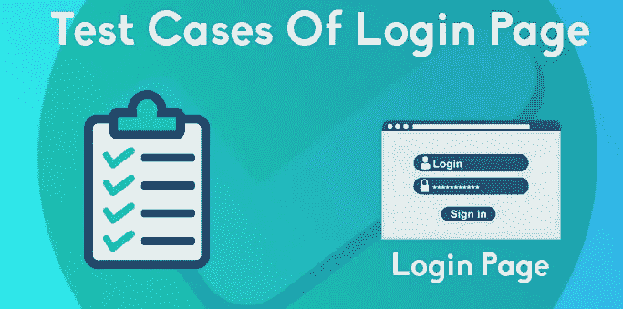

# 用 Nightwatch.js 测试 Amazon.com 登录页面

> 原文：<https://javascript.plainenglish.io/amazon-com-login-page-testing-with-nightwatch-js-a2acd0faa2f8?source=collection_archive---------3----------------------->



1

在我以前的文章中，我谈到了，什么是 Nightwatch.js，如何安装它，我演示了第一次测试。

[](https://medium.com/lucid-archive/how-to-install-nightwatch-js-first-test-with-nightwatch-js-cffd7b96f49f) [## 如何安装 Nightwatch.js？用 Nightwatch.js 进行第一次测试

### 在下面的文章中，我将重点介绍如何安装 Nightwatch.js，你必须知道的内容以及如何进行安装

medium.com](https://medium.com/lucid-archive/how-to-install-nightwatch-js-first-test-with-nightwatch-js-cffd7b96f49f) 

现在我们将重点关注用 Nightwatchjs 进行的登录页面测试。首先，我们将确定一个页面并检查它。现在让我们为登录页面编写必要的代码。


Amazon.com Login Page

我选择了 Amazon.com 页。理解了逻辑之后，如果您愿意，可以使用其他页面。

在我们编写测试用例之前，让我们创建三个名为 Pages、Tests 和 Screenshots 的文件夹。接下来，让我们在 Pages 和 Tests 文件夹中创建名为 login.js 的文件。我们将在页面中编写我们在 login.js 中指定的选择器和命令。在我们的测试代码中，我们将在 Tests 文件夹中编写 login.js。最后，我们会将测试中的截图发送到截图文件夹中。现在我们已经完成了这些，我们可以开始编写我们的测试场景了:

**测试用例-1** :进入 Amazon.com 页面，检查页面标题和正文部分是否可见，并截图。

**测试用例-2** :点击主页面的登录按钮，检查表单在登录页面是否可见，并截图。

**测试案例-3** :在登录页面尝试使用无效用户名和密码登录，看到错误并截图。

**测试案例-4:** 在登录页面尝试使用有效用户名和密码登录，检查页面是否正确并截图。

正如你所看到的，我们已经准备了我们想在测试中做的 4 个场景。在我们的测试中，让我们将已经确定的选择器和命令粘贴到我们在 Pages 中创建的 login.js 中:

```
*/**
 * (pages/loginCommand.js)
 *
 * Page object amazon.com login page.
 *
 */*module.exports = {
    url: function () {
        return `https://www.amazon.com/`;
    },
    elements: {
        signIn: {
            selector: '#nav-link-accountList'
        },
        form: {
            selector: '.a-section'
        },
        email: {
            selector: '#ap_email',
        },
        password: {
            selector: '#ap_password',
        },
        continue: {
            selector: '#continue',
        },
        signInButton: {
            selector: '#signInSubmit',
        },
        errorMessageAlert: {
            selector: '.a-box-inner.a-alert-container',
        },
        loggedInSuccess: {
            selector: '#nav-link-accountList .nav-line-1',
        },
        logout: {
            selector: '#nav-item-signout',
        },
    },
    commands: [{
        /*
         * Test Case-1:
         *
         * check all fields visibility title/body.
         * */
        checkAmazonMainPage: function () {
            return this
                .assert.title('Amazon.com: Online Shopping for Electronics, Apparel, Computers, Books, DVDs & more')
                .assert.visible('body')
        },
        /*
         * Test Case-2:
         *
         * check all fields visibility title/username/password/submit.
         * */
        verifyLoginElements: function () {
            return this
                .click('@signIn')
                .assert.title('Amazon Sign-In')
                .assert.visible('@form')
                .assert.visible('@email')
                .assert.visible('@continue')
        },
        /*
         * Test Case-3:
         *
         * login fail check, with invalid username/password and error message.
         * */
        invalidUsernamePassword: function() {
            return this
                .click('@signIn')
                .setValue('@email', 'test@test.com')
                .click('@continue')
                .setValue('@password', '1234567890')
                .click('@signInButton');
        },
        loginErrorMessage: function() {
            return this
                .assert.elementPresent('@errorMessageAlert')
                .assert.containsText('@errorMessageAlert', 'To better protect your account, please re-enter your password and then enter the characters as they are shown in the image below.')
        },
        /*
         * Test Case-4:
         *
         * login success check, with valid username/password, user profile page check and logout success.
         * */
        validUsernamePassword: function() {
            return this
                .click('@signIn')
                .setValue('@email', 'mithatozturk34@gmail.com')
                .click('@continue')
                .setValue('@password', 'Test12345')
                .click('@signInButton');
        },
        successUserLogin: function() {
            return this
                .assert.visible('@loggedInSuccess')
        },
    }],
};
```

让我们将代码粘贴到 Tests 文件夹中的 login.js 文件中，我们将在这里编写测试场景:

```
*/**
 * (test/loginTest.js)
 *
 * Amazon.com login page test...
 *
 */* module.exports = {
    tags: ['login'],
    before: (browser) => ***console***.log('Test is starting...'),
    beforeEach: (browser) => ***console***.log('Amazon.com login page testing...'),
    after: (browser) => ***console***.log('Test is finished...'),
    'Test Case-1: Go to Amazon.com, check elements, take screenshots': (browser) => {
        const page = browser.page.loginCommand();
        page.navigate()
            .checkAmazonMainPage()
            .saveScreenshot('test/screenshots/' + 'amz-main-page.png')
            .end();
    },
    'Test Case-2: Go to login page, check elements, take screenshots': (browser) => {
        const page = browser.page.loginCommand();
        page.navigate()
            .verifyLoginElements()
            .saveScreenshot('test/screenshots/' + 'amz-login-page.png')
            .end();
    },
    'Test Case-3: Login fail, invalid email/pass, take screenshots': (browser) => {
        const page = browser.page.loginCommand();
        page.navigate()
            .invalidUsernamePassword()
            .loginErrorMessage()
            .saveScreenshot('test/screenshots/' + 'login-fail.png')
            .end();
    },
    'Test Case-4: Login success, valid email/pass, take screenshots': (browser) => {
        const page = browser.page.loginCommand();
        page.navigate()
            .validUsernamePassword()
            .successUserLogin()
            .saveScreenshot('test/screenshots/' + 'login-success.png')
            .end();
    },
};
```

我们将粘贴到 more pages / login.js 中的代码中的 URL 扩展、元素和选择器是用于命令的。

在第二部分中，在我们粘贴到 Tests / login.js 中的代码中，调用了命令并截取了屏幕截图，记录了哪些类使用了哪个名称。

我们在上一篇文章中讨论了如何运行我们的测试:

```
**yarn run nightwatch Tests/login.js**
```

让我们看看运行测试后的结果:


Figure-1: Amazon.com Login Page Test Result

我们来看看截图在哪里:


Figure-2: Screenshots and files

最后，您可以从[**【Nightwatchjs.org】**](https://nightwatchjs.org/?source=post_page---------------------------)或[](https://nightwatchjs.com/?source=post_page---------------------------)*站点获取详细信息。还可以访问英语和土耳其语的分享，在[**night watch js**](https://www.instagram.com/nightwatchjs/?source=post_page---------------------------)**insta gram 页面提出你的问题。***

> ***[**点击此处获取本文的土耳其语版本……**](https://medium.com/@miktadozturk/nightwatch-js-ile-amazon-com-login-sayfas%C4%B1-testi-f270a532a90e)***

***感谢您的阅读…***

1.  ***[**精选图片来源——https://artoftesting.com/login**](https://medium.com/@ranakuldeep1989/nice-article-but-you-should-give-due-attribution-while-using-someone-elses-image-c987b3fc25ea?source=responses---------0-----------------------)***

***点击查看作者的其他文章:***

***[](https://medium.com/javascript-in-plain-english/the-progressive-javascript-framework-vue-js-65f106080cb6) [## 渐进式 JavaScript 框架:Vue.js

### Vue.js 是一个用于构建网站 ui 的 Javascript 框架。它在许多方面与角相似，也有…

medium.com](https://medium.com/javascript-in-plain-english/the-progressive-javascript-framework-vue-js-65f106080cb6) [](https://medium.com/lucid-archive/how-to-install-nightwatch-js-first-test-with-nightwatch-js-cffd7b96f49f) [## 如何安装 Nightwatch.js？用 Nightwatch.js 进行第一次测试

### 在下面的文章中，我将重点介绍如何安装 Nightwatch.js，你必须知道的内容以及如何进行安装

medium.com](https://medium.com/lucid-archive/how-to-install-nightwatch-js-first-test-with-nightwatch-js-cffd7b96f49f) [](https://medium.com/swlh/software-testing-process-and-levels-of-testing-4274904ce655) [## 软件测试过程和测试级别

### 软件测试过程

medium.com](https://medium.com/swlh/software-testing-process-and-levels-of-testing-4274904ce655) [](https://medium.com/swlh/software-testing-and-methodologies-1fc519c98fdf) [## 软件测试和方法

### 在我的软件测试系列中，我将尝试讨论为什么测试是必要的，这些测试是如何执行的，如何…

medium.com](https://medium.com/swlh/software-testing-and-methodologies-1fc519c98fdf)***