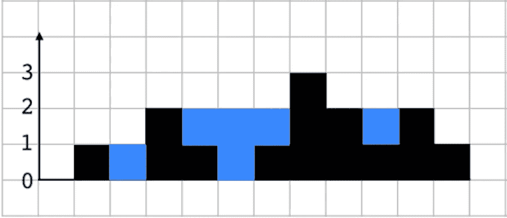

# 亚马逊软件开发工程师面试问题

> 原文：<https://javascript.plainenglish.io/amazon-software-development-engineer-interview-questions-a40a6b092c3a?source=collection_archive---------0----------------------->

## 2 题:1 易；1 努力。

## 最近，一名训练营的毕业生联系我，告诉我他们在亚马逊的技术面试失败了。

再说一次，这是很常见的，不要被它吓跑，它发生在我们最好的人身上。

他们说他们有一个问题还不错，我认为在这个算法/数据结构技术面试的世界里是“容易”的。其中一个很难。我很惊讶地看到 Amazon 甚至把这个问题给了一个初级开发人员，他是 bootcamp 的毕业生，没有任何编码经验。

我会在下面张贴问题，请随时留下您的解决方案/评论。在一些回应后，我会张贴我的解决方案。

## 容易的

给定一个仅包含字符`'('`、`')'`、`'{'`、`'}'`、`'['`和`']'`的字符串，确定输入的字符串是否有效。

在以下情况下，输入字符串有效:

1.  左括号必须用相同类型的括号括起来。
2.  左括号必须以正确的顺序结束。

请注意，空字符串也被视为有效。

**例 1:**

```
**Input:** "()"
**Output:** true
```

**例 2:**

```
**Input:** "()[]{}"
**Output:** true
```

**例 3:**

```
**Input:** "(]"
**Output:** false
```

**例 4:**

```
**Input:** "([)]"
**Output:** false
```

**例 5:**

```
**Input:** "{[]}"
**Output:** true
```

## 困难的

给定代表高程图的非负整数 n，其中每个条形的宽度为 1，计算雨后它能够收集多少水。

**示例:**

```
**Input:** [0,1,0,2,1,0,1,3,2,1,2,1]
**Output:** 6
```

我将把数组画出来，以便更好地可视化。



6 units of rainwater (blue) are trapped

给这两个问题一个机会，让我知道你对初级角色被问这样一个难题的想法！