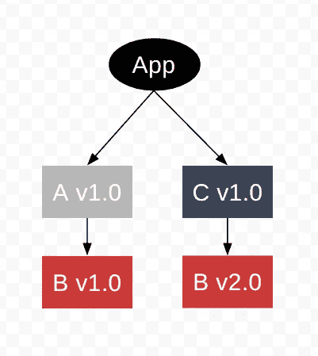
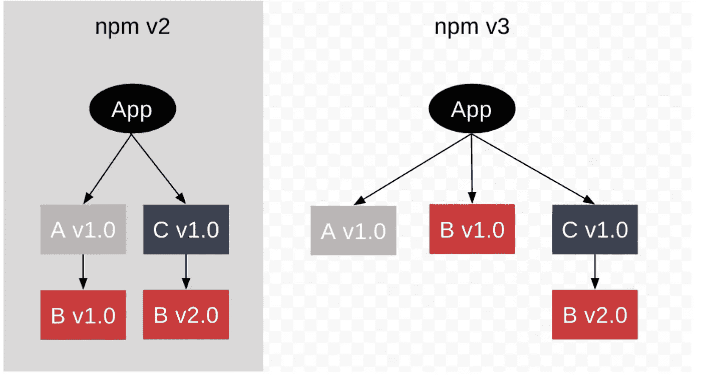
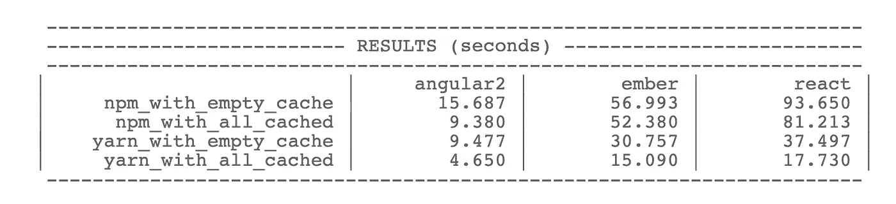
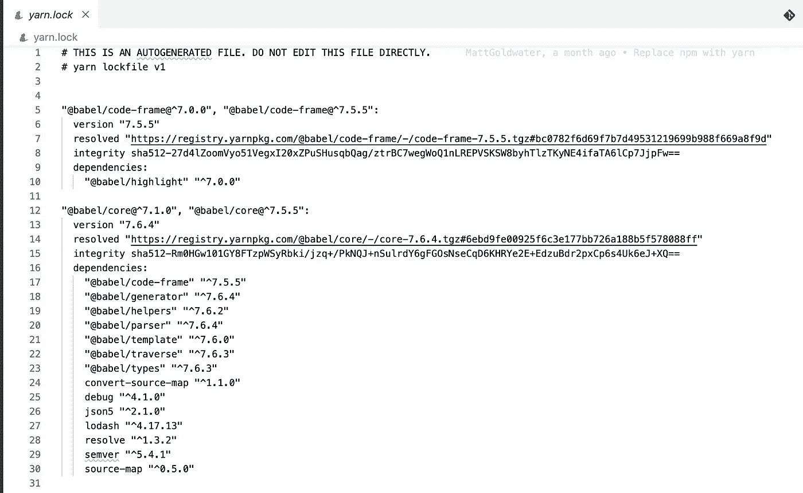
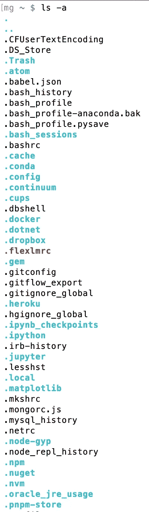
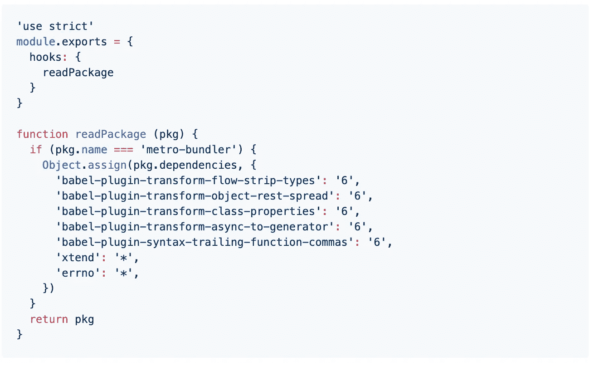
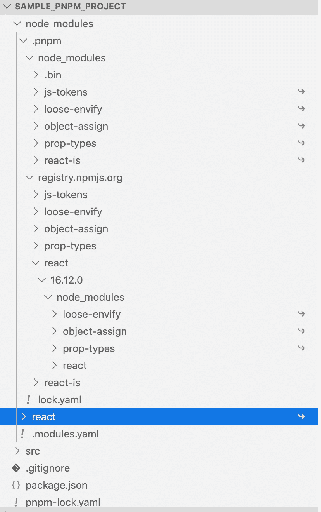
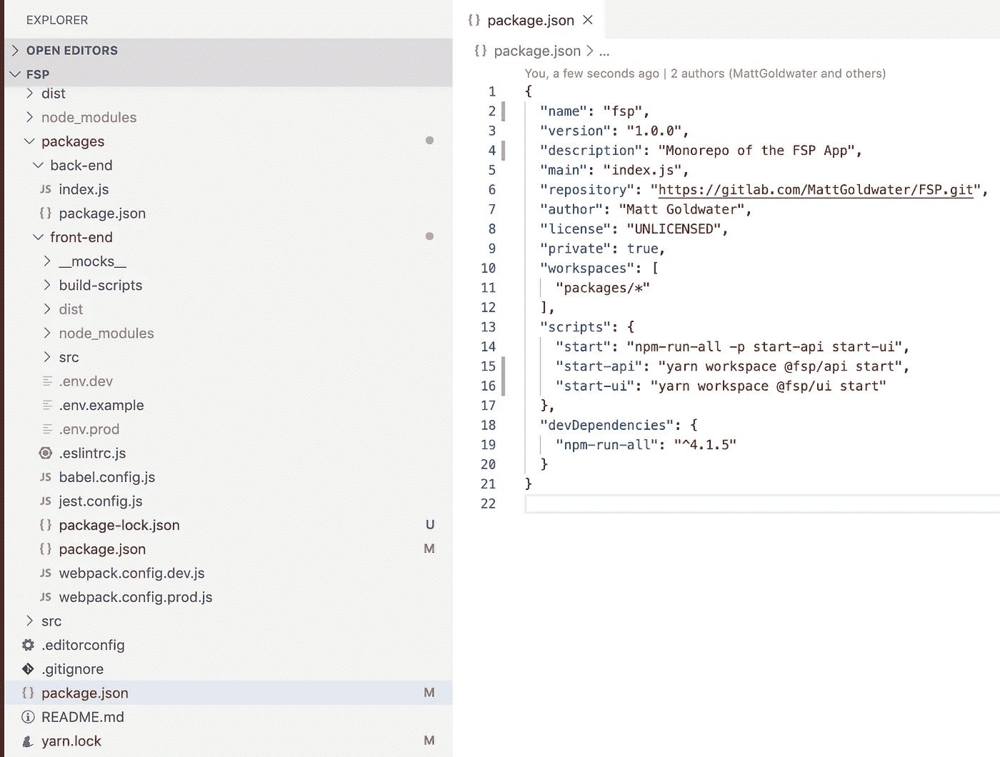

# JavaScript 包管理器简史

> 原文：<https://javascript.plainenglish.io/an-abbreviated-history-of-javascript-package-managers-f9797be7cf0e?source=collection_archive---------1----------------------->

# 介绍

这篇文章解释了为什么 [npm](https://www.npmjs.com/) 、[纱](https://yarnpkg.com/lang/en/)和 [pnpm](https://pnpm.js.org/) 被创造出来，以及它们已经解决的其他主要问题。

如果有必要的话，你应该阅读一下[我为这篇文章](https://gist.github.com/MattGoldwater/f03264a972a04c35367c854853520c3a)准备的词汇表。它定义了术语包、模块、库、依赖、子依赖、裸说明符、依赖图、包注册表和包管理器。

包管理器有用的基本原因是它们自动化了从安装子依赖到配置依赖树的大量工作。如果你需要更彻底地理解这些好处，我推荐阅读关于[我尝试在没有后端包管理器的情况下开始一个项目](https://github.com/MattGoldwater/no-package-manager-backend-test)。我还[写了一篇解释为什么 npm，yarn 或者 pnpm 常用在前端](https://github.com/MattGoldwater/no-package-manager-frontend-test)。

在深入包管理器之前，理解 node 如何找到您试图导入的包也是值得的。为此，我推荐阅读[我对 node 的模块解析系统](https://gist.github.com/MattGoldwater/78f89ea93b9f1dfc19d3440e172cfa49)的解释。

# Npm

Npm 于 2010 年 1 月 12 日发布，是 node 的第一个包注册表和包管理器。

[2011 年 5 月 1 日，npm 版本 1 发布](https://nodejs.org/en/blog/npm/npm-1-0-released/)，使得[本地包安装工作一致](https://nodejs.org/fa/blog/npm/npm-1-0-global-vs-local-installation/)。这一变化是一个巨大的进步，因为让事情与全球软件包一起工作是一件痛苦的事情。如果你全局安装一个包，你会注意到你不能仅仅通过使用一个简单的说明符来导入一个包。

您[可以配置 npm 将全局包安装到不同的文件夹](https://github.com/mixonic/docs.npmjs.com/blob/master/content/getting-started/fixing-npm-permissions.md#option-2-change-npms-default-directory-to-another-directory)中，node 的模块解析系统将在该文件夹中找到您的包，但这样您的应用程序将可以访问您的所有包，您可能会意外地使用您忘记放在 package.json 中的全局包。这将导致您的应用程序在其他人试图使用您的应用程序时崩溃。如果我在 2010 年不得不使用 npm，我可以想象自己会犯这个错误，因为全局安装不会自动将你安装的包添加到你的 package.json 中。

此外，默认情况下，npm 仅存储全局软件包的一个副本。例如，如果您运行 npm install [express](https://www.npmjs.com/package/express) ，然后运行 npm install express@4.16.4，express 的 4.16.4 版本将覆盖 express 的最新版本。这将[使得在不同的项目中使用不同版本的全局包变得困难。](https://stackoverflow.com/questions/12138917/how-to-install-multiple-versions-of-the-same-node-js-module)

在版本 1 中，npm 实现了一个嵌套的依赖结构。这意味着您将在您的根 node_modules 文件夹中找到您本地安装的包，并且您的所有子依赖项将存储在您的依赖项的 node_modules 文件夹中。

The two versions of B are installed in different directories avoiding dependency hell. [https://npm.github.io/how-npm-works-docs/npm2/how-npm2-works.html](https://npm.github.io/how-npm-works-docs/npm2/how-npm2-works.html)

比如，假设你的 app 在你的 package.json 中有包 A 和包 C，包 A 有依赖包 1.0 版，包 C 有依赖包 2.0 版。包 A 和 C 将位于您的根节点模块中。包 1.0 版将位于包 A 的 node_modules 文件夹中，包 2.0 版将位于包 c 的 node_modules 文件夹中。

这种方法解决了“依赖地狱”的问题如果你试图在同一个文件夹中安装一个包的两个版本，就会出现依赖地狱，这会破坏你的应用程序。由于依赖项存储在 npm 中其依赖项的 node_modules 文件夹中，所以当您安装软件包时，永远不会发生依赖项地狱。

然而，这种嵌套的依赖关系结构导致了长的文件路径，因为一个依赖关系可以有一个子依赖关系，而子依赖关系又有自己的依赖关系，等等。这导致应用程序在使用 Windows 时中断。Windows 默认对文件路径的大小有 260 个字符的限制，在 Windows 10 之前这个限制不能改变。

Npm 版本 3“扁平化”了依赖关系树以解决此问题。这意味着默认情况下，所有依赖项和子依赖项都将放在根 node_modules 文件夹中。如果包的一个版本已经在根 node_modules 文件夹中，为了避免依赖关系崩溃，它将被放在使用它的依赖关系的 node_modules 文件夹中，就像在 npm v2 中一样。因此，依赖树并不是完全平坦的，但它足够平坦，Windows 用户的文件路径问题大大减少了。

[https://npm.github.io/how-npm-works-docs/npm3/how-npm3-works.html](https://npm.github.io/how-npm-works-docs/npm3/how-npm3-works.html)

再一次想象你的应用在你的 package.json 中有包 A 和包 C，包 A 有依赖包 1.0 版，包 C 有依赖包 2.0 版。安装程序包 A 时，程序包 B 版本 1.0 会添加到您的根节点模块文件夹中。安装软件包 C 时，不能将软件包 2.0 版添加到根 node_modules 文件夹中，因为软件包 1.0 版已经存在。

展平依赖关系树也有助于节省磁盘空间和加快安装速度。如果您有上面的应用程序并试图安装软件包 D 版本 1.0，它有软件包 B 版本 1.0 的子依赖项，那么您不需要像在 npm 版本 2 中一样再次安装软件包 B 版本 1.0。

随着模块捆绑器的出现，如 [browserify](http://browserify.org/) 和 [webpack](https://webpack.js.org/) ，在前端使用 npm 也变得更加容易。当时开发人员可能已经在客户端使用了 [Bower](https://bower.io/) 包管理器。然而， [Bower 强制用户每个应用](https://snyk.io/blog/bower-is-dead/)只能安装一个版本的包，这意味着开发者必须手动解决依赖地狱。

此外，当时浏览器不支持 [ES 模块](https://developer.mozilla.org/en-US/docs/Web/JavaScript/Guide/Modules)，也就是 JavaScript 模块，你仍然不能在浏览器中使用裸说明符。这意味着 Bower 用户必须[键入包路径](https://bower.io/#use-packages)并担心全球范围的污染。[我在这个回购](https://github.com/MattGoldwater/no-package-manager-frontend-test)中提供了这个问题的一个例子。

少数用户更喜欢 Bower 而不是 npm，因为他们更喜欢手动解决依赖性问题，以获得完全扁平的 node_modules 结构。但是，[一旦 2016 年 10 月 11 日发布，甚至 Bower 的维护者也推荐使用 Yarn](https://bower.io/blog/2016/using-bower-with-yarn/) 。他们似乎[比 npm](https://bower.io/blog/2017/how-to-migrate-away-from-bower/) 更喜欢 yarn，因为它[提供了一个选项来完全扁平化你的 node_modules](https://yarnpkg.com/lang/en/docs/cli/install/#toc-yarn-install-flat) 。

# 故事

由于有脸书和谷歌的支持，Yarn 很快获得了关注，并且用 Yarn 安装软件包比 npm 要快得多。Yarn 的安装速度比 npm 更快的一个原因是[它使用更快的算法从缓存中获取数据](https://www.alexkras.com/understanding-differences-between-npm-yarn-and-pnpm/#twitter-widget-0)。

Benchmarks comparing npm and yarn shortly after yarn was released [https://www.berriart.com/blog/2016/10/npm-yarn-benchmark/](https://www.berriart.com/blog/2016/10/npm-yarn-benchmark/)

Yarn 最初还提供了一些优于 npm 的其他好处。

Yarn 也使用了它的缓存，所以你可以离线使用任何以前下载的包。这个特性对脸书和其他公司来说很重要。那是因为脸书想[切断他们的持续集成环境与互联网的联系](https://engineering.fb.com/web/yarn-a-new-package-manager-for-javascript/)所以[他们更难破解](https://smallbiztrends.com/2017/03/can-an-offline-computer-be-hacked.html)。

使用包的离线副本还可以加速持续集成构建时间和常规包安装，因为您不需要发出网络请求来获取包。如果您没有发出网络请求，您不需要担心包的网络请求失败，这使得构建更加可靠。例如，当流行的 npm 包[从 npm 注册表](https://qz.com/646467/how-one-programmer-broke-the-internet-by-deleting-a-tiny-piece-of-code/)中删除时，离线存储包可以让公司避免问题。

Yarn 还通过从每个包的内容中生成一个[校验和(又名哈希)](https://cheapsslsecurity.com/blog/decoded-examples-of-how-hashing-algorithms-work/)来提高应用程序的安全性。简而言之，这是通过使用哈希函数完成的，这是一个纯函数。这意味着每次你输入相同的数据到一个函数中，你都会得到相同的输出。因此，即使你的包中有一个字符发生了变化，Yarn 的哈希函数也会识别出出错的地方。这确保了[你不需要担心黑客在你安装软件包的时候改变 npm 注册表上的软件包内容或者修改软件包](https://snyk.io/blog/yarn-is-micro-secure/)。

Yarn 的“锁定文件”也受到了很多关注。第一次安装软件包时，会创建一个名为 yarn.lock 的文件，它列出了每个已安装软件包的确切版本。每次安装和更新软件包时，Yarn 都会更新这个文件。

A yarn.lock file

使用 npm 安装包时，package.json 中的包默认情况下会预先固定一个插入符号，[，表示安装一个包的最新次要版本](https://michaelsoolee.com/npm-package-tilde-caret/)。这意味着开发人员 A 可以在下午 1 点克隆一个使用 [React](https://reactjs.org/) 的应用程序，一切正常，但 React 可能会在下午 1:30 更新，更新可能会意外包含一个错误。因此，当开发人员 B 在下午 2 点安装相同的应用程序时，安装了新版本的 React，而该应用程序无法工作。

默认情况下，Yarn [安装 yarn.lock 文件中列出的包版本，而不是安装基于 package.json](https://yarnpkg.com/lang/en/docs/cli/install/#toc-yarn-install) 的最新 semver 版本。这可以防止开发人员花费时间调试为什么一个应用程序在一台计算机上工作，但在另一台计算机上却坏了。

Npm 实际上已经有了自己的锁定文件版本，它命名为[包膜文件](https://npm.github.io/using-pkgs-docs/shrinkwrap/index.html)，这将修复这个问题。但是，许多开发人员并不知道包覆面提取文件，因为默认情况下它是不启用的。

2017 年 5 月 25 日 NPM 第五版发布的时候 [npm 很大程度上赶上了 Yarn。这个版本优化了 npm 的缓存，将安装速度提高到和 Yarn 一样快。此外，npm 默认启用其版本的锁定文件，并将其重命名为 package-lock。你可以在这里](https://blog.npmjs.org/post/161081169345/v500)了解 yarn.lock 和 package-lock.json [的细微差别。Npm 也开始使用校验和](https://yarnpkg.com/blog/2017/05/31/determinism/)[让用户从他们的本地缓存离线安装包。](https://blog.pusher.com/what-you-need-know-npm-5/)

# Pnpm

Pnpm 出现在 2017 年 6 月的照片中，当时它[发布了第一版](https://medium.com/pnpm/pnpm-version-1-is-out-935a07af914)，它的创造者[Zoltan·科昌](https://medium.com/u/a29a602b5573?source=post_page-----f9797be7cf0e--------------------------------) [在博客中对此进行了描述](https://medium.com/pnpm)。在他的帖子“[我们为什么要使用 pnpm](https://medium.com/pnpm/why-should-we-use-pnpm-75ca4bfe7d93) ”中，Kochan 解释了 pnpm 如何让用户节省磁盘空间，并避免 npm 和 Yarn 的 node_modules 结构的问题。

当时，当 npm 和 Yarn 安装软件包时，他们会为每个项目安装每个软件包的至少一个副本，即使该软件包已经在其缓存中。Pnpm 只将一个包安装到它的缓存中一次，这个缓存被称为它的存储。如果您安装了 pnpm，您可以在。pnpm-在您的个人文件夹中存储目录。

.pnpm-store is at the bottom of this picture

pnpm 不是每次在项目中使用一个包时都安装它的副本，而是从您的 pnpm 存储中创建[到包中所有文件的硬链接](https://en.wikipedia.org/wiki/Hard_link)。硬链接本质上是一个拷贝，除非你修改了原始文件或硬链接文件，你会同时改变两个文件。虽然传统副本占用的空间与原始文件一样多，但硬链接只增加了少量空间来命名硬链接文件。

这意味着如果你不止一次的使用一个版本的包，你将几乎不用额外的硬盘空间。例如，即使您在 2 个或更多 pnpm 项目中使用 react，react 也只由 pnpm 安装一次。

这些储蓄复利。流行的初学者工具包 [create-react-app](https://www.npmjs.com/package/create-react-app) ，默认使用 Yarn，附带一个 212 兆字节的 node_modules 文件夹。因此，如果我的电脑上有 10 个以上的 create-react-app 项目，我会节省 2.12 千兆字节，再加上更多的空间用于任何不止一次使用的额外库。

除了节省磁盘空间，您还可以节省大量安装额外软件包的时间。

因为文件是硬链接的，所以你需要小心修改 node_modules 的内容。如果您更改了它们的任何内容，您也将临时更改您计算机上所有其他 pnpm 项目的包。

为了缓解这个问题，Pnpm 保留了原始包的校验和，这允许它识别您何时更改了它的内容。它会在您下次尝试安装时自动将您的更改恢复到软件包中。

Kochan 也不喜欢 npm 中使用的平面 node_modules 结构，因为第 3 版和 Yarn 允许用户在应用程序代码的根 node_modules 文件夹中要求子依赖项。在他的博客文章中， [pnpm 的严格有助于避免愚蠢的错误](https://medium.com/pnpm/pnpms-strictness-helps-to-avoid-silly-bugs-9a15fb306308)，Kochan 解释说如果用户忘记安装包，这可能会导致问题，但它已经作为子依赖项安装了。这意味着你的项目现在可以工作，但是如果这个子依赖项作为你的依赖项的一个依赖项被删除，它就会中断。如果您的依赖项开始使用该子依赖项的新版本，您的项目也可能会中断。

Kochan 的逻辑是正确的，但 npm 和 Yarn 应用如此广泛，以至于许多开发人员已经创建了项目，这些项目导入了不在他们 package.json 中的包。例如， [create-react-native-app](https://github.com/pnpm/pnpm/issues/940#issuecomment-357041802) 就出现了这个问题。这意味着您可以键入 NPM install create-react-native-app 之类的内容，或者使用 Yarn，它可以工作，但不能与 pnpm 一起工作。

在 create-react-native-app 的情况下，它使用了依赖关系 [metro-bundler](https://www.npmjs.com/package/metro-bundler) ，这忘记了向它的 package.json 添加许多依赖关系。Pnpm 用户必须找到库开发人员忘记添加到他们的 package.json 的依赖关系，并使用 [pnpm 钩子](https://pnpm.js.org/en/2/hooks)来安装这些依赖关系。为了[将来为其他人修复问题](https://medium.com/pnpm/why-package-managers-need-hook-systems-b8125d8b3dc7)，他们可以提交一个 pull 请求来修复第三方库。

The pnpm hook used so create-react-native-app could work with pnpm

Kochan 认识到 npm 和 Yarn 比 pnpm 更受欢迎，并且大多数用户希望他们的软件包尽快工作。Kochan 在 pnpm 版本 4 中做了一个妥协，它将您的子依赖项提升到 node_modules 文件夹中，您的依赖项可以在那里访问它们。

这意味着当你安装其他与 npm 和 Yarn 一起工作的包时不会有任何问题。如果你这样做，Pnpm 确实提供了一个选项，[可耻地提升](https://pnpm.js.org/en/faq#solution-3)，使用类似 npm 和 Yarn 的扁平 node_modules 结构。

Kochan 仍然很严格，不允许你的应用访问它自己的子依赖项。这意味着没有新的 pnpm 项目会有 metro-bundler 遇到的问题，但是您不需要修复现有的包来使 pnpm 一致地工作。

[您还可以使用 npm 安装带有— global-style 标志的软件包，以创建 node_modules 结构，该结构仅允许您导入直接依赖项。](https://docs.npmjs.com/misc/config#global-style)

An example pnpm project. React is the only package I installed

从上图可以看出，pnpm 的 node_modules 结构很复杂，但是很管用。Pnpm 使用[符号链接](https://en.wikipedia.org/wiki/Symbolic_link)(或者 Windows 上的[连接](https://docs.microsoft.com/en-us/windows/win32/fileio/hard-links-and-junctions#junctions)来构建这个结构，节点跟随这个结构找到包的位置。中的 node_modules 文件夹。pnpm 文件夹是存储子依赖关系的硬链接文件的位置。

React 是我的示例中安装的唯一直接依赖项，它直接列在 node_modules 文件夹中。该文件夹用符号链接到 node_modules/文件夹。pnpm/registry . NPM js . org/react/16 . 12 . 0/node _ modules/react 包含实际包的位置。Node 跟在 symlink 后面，68 个字符，文件路径足够短，pnpm 很容易避免触及 Windows 的 260 个字符的限制。

pnpm 还有一个缺点，因为它使用符号链接[，所以它不能与一些文件监视工具](https://intoli.com/blog/node-package-manager-benchmarks/)一起工作，比如 [Watchman](https://facebook.github.io/watchman/) 。这也是 Yarn 放弃使用 symlinks 的[原始计划的原因之一。它也不能与不支持硬链接或符号链接的文件系统一起工作。只有当你想把你的项目存储在闪存盘或 SD 卡上时](https://github.com/yarnpkg/yarn/issues/499#issuecomment-251583225)[才是个问题。](https://www.howtogeek.com/177529/htg-explains-why-are-removable-drives-still-using-fat32-instead-of-ntfs/)

如果你有兴趣学习更多关于硬链接、符号链接以及 pnpm 如何使用它们的知识，我可以看看下面的资源。

1.  [https://www . ostechnix . com/explaining-soft-link-and-hard-link-in-Linux-with-examples/](https://www.ostechnix.com/explaining-soft-link-and-hard-link-in-linux-with-examples/)
2.  [https://stack overflow . com/questions/9042542/NTFS-junction-points-and-symbolic-links/48586946 # 48586946](https://stackoverflow.com/questions/9042542/what-is-the-difference-between-ntfs-junction-points-and-symbolic-links/48586946#48586946)
3.  [https://pnpm.js.org/en/faq](https://pnpm.js.org/en/faq)

# 工作区

2017 年 8 月，Yarn 团队发布了 [Yarn workspaces](https://yarnpkg.com/lang/en/docs/workspaces/) ，这是一个更容易引导和管理 monorepos 的功能。

monorepo 是包含多个项目的存储库。Monorepo 通常用于存储谷歌和脸书等大公司的私人代码，也用于 React 和 [Babel](https://babeljs.io/) 等开源项目。许多开发人员更喜欢 monorepo 结构，而不是为每个项目创建单独的存储库。这是因为[他们觉得 monorepo 让更新版本和重构代码变得更加容易，而无需创建新的存储库](https://www.drmaciver.com/2016/10/why-you-should-use-a-single-repository-for-all-your-companys-projects/)。

Yarn 帮助开发人员管理 monorepo，让他们在 mono repo 中的所有项目上同时安装软件包。 [yarn workspace](https://yarnpkg.com/lang/en/docs/cli/workspace/) 命令也让开发者更容易从根目录管理单个项目。

An example directory structure and root package.json of an app using yarn workspaces.

工具 [Lerna](https://github.com/lerna/lerna) 还拥有 Yarn workspaces 的所有功能以及更多功能。Yarn 团队推荐使用工作区，因为它安装包更快，也更稳定。他们补充说 [Lerna 也不能做到这一点，因为它是包管理器的包装器，而不是包管理器本身](https://yarnpkg.com/blog/2017/08/02/introducing-workspaces/#lerna)。Lerna 可以与 Yarn 工作区一起使用，如果您希望使用它的功能来更容易地将包发布到 npm 注册表，它仍然是有用的。

Pnpm 也实现了自己的[版本的 workspaces](https://pnpm.js.org/en/workspaces) ，npm 也将在其[下一个主要版本](https://blog.npmjs.org/post/186983646370/npm-cli-roadmap-summer-2019)中添加 workspaces 特性。 [Npm 似乎也计划在未来的版本中添加 Lerna 的特性来发布软件包](https://github.com/npm/cli/wiki/Roadmap#workspaces)。

Yarn 的下一个主要版本将允许[嵌套工作空间](https://github.com/yarnpkg/yarn/issues/6953)。顾名思义，这意味着您将能够在工作区中创建一个工作区。

# 精确导航处理器(Precision Navigation Processor)

2018 年 9 月，纱线团队推出了[纱线即插即用](https://github.com/yarnpkg/rfcs/pull/101)(纱线 PnP)。纱线 PnP 解决了平面 node_modules 结构和重复包装安装的相同问题，pnpm 以不同的方式解决了这些问题。他们选择使用不同的方法来使包安装更快，并最终消除在连续集成构建上安装的需要。

纱线 PnP 文档说明[硬链接消除了包重复，但是使用它们需要 Node 花时间对您的操作系统](https://yarnpkg.com/lang/en/docs/pnp/)进行一系列调用。他们在纱线 PnP 白皮书的第 2 页上对使用符号链接和硬链接的[缺陷做了进一步的详细说明。](https://github.com/yarnpkg/rfcs/files/2378943/Plugnplay.pdf)

使用纱线 PnP，当您的包被安装时，纱线会创建一个名为. pnp.js 的文件，而不是 node_modules 文件夹。. pnp.js 文件列出了您的包、它们的依赖关系以及它们在硬盘上的相对路径。

Information about react in my .pnp.js file

纱线 PnP 修改 [Node 的默认模块解析](https://nodejs.org/api/modules.html#modules_all_together)本质上是说，不是在文件的父文件夹中查找 node_modules 目录，而是查看. pnp.js 文件。如果它在那里找到该版本的包，它将使用 packageLocation 字段将您带到磁盘上的适当位置。

使用纱线 PnP 时，您可能还会注意到一个名为。pnp，[将更名为。纱线版本 2 发布时的纱线](https://stackoverflow.com/questions/53135221/what-does-yarn-pnp)。这存储了带有[安装后脚本](https://docs.npmjs.com/misc/scripts)的包，脚本在包安装后立即运行。这是因为带有安装后脚本的包的内容，如 [node-sass](https://github.com/sass/node-sass/blob/master/package.json) ，可能会因您的节点版本而有所不同。这意味着必须为每个项目分别安装软件包，因为每个项目可能使用不同的节点版本。

由于纱负责解析依赖关系，而不是纱 PnP 中的节点，纱可以识别您是否正在导入一个被列为开发依赖关系而不是包中依赖关系的依赖关系。

这解决了平面 node_modules 结构的另一个问题，pnpm 无法直接解决这个问题，因为它依赖于 node 的默认模块解析系统。如果不使用 Yarn PnP，你将不得不通过一个外部包来解决这个问题，比如 Zoltan·科昌的 [package-preview](https://www.npmjs.com/package/package-preview) ，当你在运行测试的同时导入 devDependencies 时 [catch。](https://medium.com/pnpm/never-ever-forget-to-install-a-dependency-1c39dd3bbb37)

虽然 Yarn 默认不启用 PnP，但是您可以通过添加几行代码来[设置它。但是，Yarn PnP 目前没有做出 pnpm 版本 4 所做的改变，即允许依赖项访问任何子依赖项。这意味着，如果你正在使用一个忘记添加依赖项的包，你的应用程序在使用 Yarn PnP 时会中断，而它现在可以与其他包管理器一起工作。](https://yarnpkg.com/lang/en/docs/pnp/getting-started/)

像许多新技术一样，纱线 PnP 变得稳定也需要时间。脸书最近禁用了它，因为它与他们的许多软件包不兼容。

[Yarn PnP 是一种规范，而不是 Yarn](https://dev.to/arcanis/plugnplay-and-tink-4684) 独有的特性，因此它将来可以被其他包管理器采用。

# 未来

纱线维护者已经[发布了他们的版本 2](https://github.com/yarnpkg/yarn/issues/6953) 的计划。这些包括优化 Yarn，这样你在克隆一个库之后就不再需要运行 Yarn install，并且使 Yarn 更容易与 JavaScript 之外的其他语言一起使用。纱线 PnP 也将默认启用。

Npm 已经宣布计划在版本 8 中做出重大改变，他们将其命名为 tink。Tink 的工作方式是覆盖[文件系统(fs)节点核心模块](https://nodejs.org/api/fs.html)，在运行时将您的包加载到所有项目共享的缓存中。

这给用户带来了一些好处。你不必再输入 npm install，即使你第一次在一个新项目中使用一个包。另外，[在某些情况下，npm 将能够更智能地只下载你需要的包的部分](https://npm.community/t/tink-faq-a-package-unwinder-for-javascript/3191)。Npm 的文件系统模块替换[也将能够识别 TypeScript 和 JSX 文件，无需任何额外的配置](https://npm.community/t/tink-state-of-the-unwinder-2018-10-25/2973)。

虽然软件包是在运行时安装的，但您可以运行 npm prepare 命令，因此它们都是在您的应用程序投入生产之前加载的。

由于 npm 还没有发布第 7 版，我预计 tink 正式发布还需要一段时间。如果你等不及了，[你可以尝试 tink](https://www.npmjs.com/package/tink) 的开发版本，但是 npm 警告不要在生产中使用它。

纱线 PnP 和 npm tink 具有不同的权衡。 [Yarn 维护者 mal Nison 发现覆盖节点核心模块是有风险的](https://dev.to/arcanis/plugnplay-and-tink-4684)，因为这是一个足够大的变化，可能会有一些错误，可能会使你的应用程序不那么安全和可靠。 [Npm 已经承认这种风险，但是指出](https://2019.jsconf.eu/kat-marchan/tink-a-next-generation-package-manager.html)[electronic](https://electronjs.org/)已经成功使用了这种方法。

Npm 也更喜欢他们的方法，因为 [Yarn PnP 需要额外的配置](https://yarnpkg.com/en/docs/pnp/getting-started)来使用某些工具，如 webpack、Jest 和 TypeScript。这些工具已经集成了 Yarn PnP ( [jest](https://github.com/arcanis/jest-pnp-resolver) ， [TypeScript](https://github.com/arcanis/pnp-webpack-plugin#ts-loader-integration) )和 [webpack 5 将默认支持 Yarn PnP](https://webpack.js.org/migrate/5/#clean-up-configuration) ，所以这可能不会是一个长期的问题。

我希望你喜欢这篇文章！请在评论中告诉我你的想法。