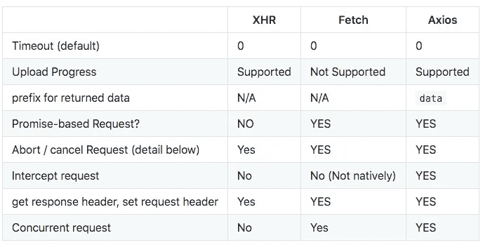
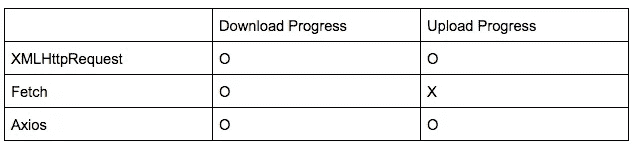
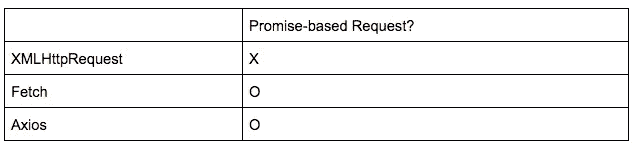
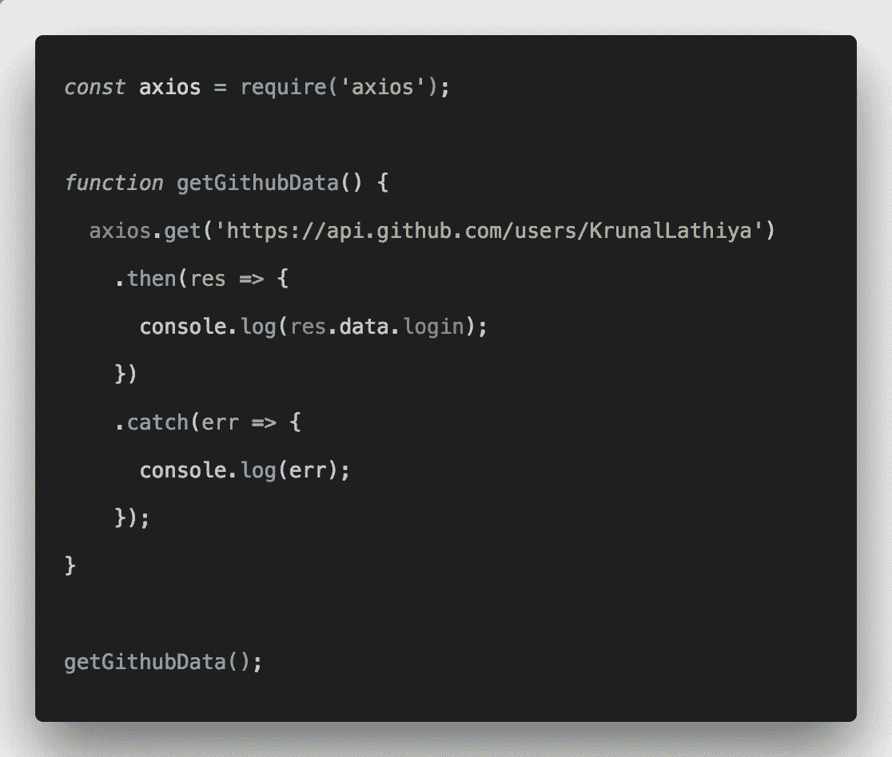
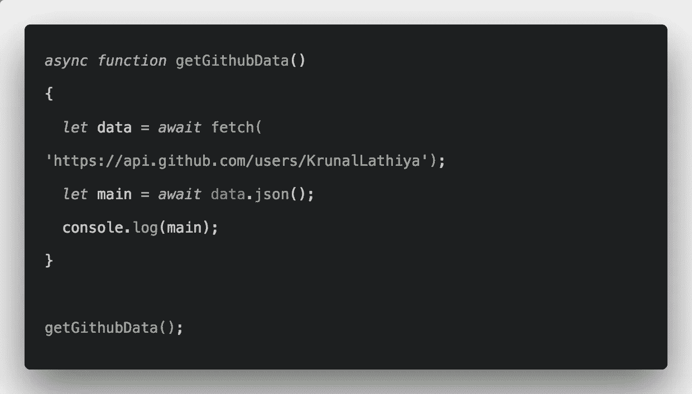

# JavaScript Http 请求绝对指南

> 原文：<https://javascript.plainenglish.io/an-absolute-guide-to-javascript-http-requests-44c685edfa51?source=collection_archive---------2----------------------->

## XHR()与 Fetch()与 Axios()

*TL；博士:见下图*



# XHR

## XHR 的简短描述

*   `XMLHttpRequest` (XHR)是一个内置的浏览器对象，用 JavaScript 发出 HTTP 请求
*   随着更现代的方法`fetch`的引入，变得不推荐使用
*   AJAX(异步 JavaScript 和 XML)使用 XMLHttpRequest。虽然 Ajax 支持跨浏览器，但 XHR 不支持

## **阿贾克斯和 XHR 的一点历史**

**20 世纪 90 年代初至中期，**

*   大多数网站都是基于完整的 HTML 页面；即使部分更改也需要重新加载浏览器**(服务器上的额外负载；额外带宽)**

**1998 年，**

*   Microsoft Outlook Web Access 小组开发了 XMLRequest 脚本对象背后的概念

**2000 年~ 2002 年，**

*   Outlook Web Access (2000)和 Oddpost (2002)等大型应用程序使用了后台 HTTP 请求和异步 Web 技术

**2004 年~2005 年，**

*   Google 在 Gmail (2004)和 Google Maps (2005)中广泛部署了符合标准的跨浏览器 Ajax
*   Kayak.com 测试版是第一个使用 AJAX (2004)的大规模电子商务

**2006 年，**

*   W3C(万维网联盟)发布了 XMLHttpRequest 对象的第一个规范草案，试图创建一个官方的 Web 标准

## 句法

```
**// Create `XMLHttpRequest**
let xhr = new XMLHttpRequest();**// Initialize XHR object** xhr.open(method, URL, [async, user, password])**// Send**
xhr.send([body]) **// This method opens the connection and sends the request to the server**
```

## 例子

## 用例

因为`fetch`方法的引入反对`XMLHttpRequest`，所以`XMLHttpRequest`的用例非常有限

1.  支持已经使用`XMLHttpRequest`编写的现有脚本
2.  支持旧的浏览器&不希望多填充(例如，保持脚本微小)
3.  需要做一些`fetch`还不能做的事情(例如跟踪上传进度)

**跟踪下载&上传进度**



# 取得

## 获取的简短描述

*   Fetch 是一个新的 API，它提供了一个更加强大和灵活的特性集(与 XHR 相比更加现代)
*   旧浏览器不支持它(可以填充多种内容),但现代浏览器非常支持它
*   Fetch API 是基于承诺的，它支持更简单和更干净的 API，避免了回调地狱

**基于承诺的请求**



## 句法

```
let promise = fetch(url, [options])
```

## 例子

## 用例

*   可用于任何网络请求(如提交订单、加载用户信息等)，而无需重新加载页面

# Axios

## Axios 的简短描述

*   基于 Promised 的 HTTP 库，用于在 Nodejs 和 Browser 上执行 HTTP 请求
*   支持所有现代浏览器，甚至包括对 IE8 +的支持

## 句法

```
axios.get(url[, config])
axios.delete(url[, config])
```

## 例子

## 用例

*   可以使用来执行在浏览器和 Node.js 平台上都可以工作的 HTTP 请求
*   随着 Node.js 和 SPA 框架越来越流行，变得非常流行

# 结论(XHR 与 Fetch 和 Axios)

## 1.默认超时 0

每个方法的默认超时毫秒数是 0，这意味着没有超时。但是您可以手动设置超时，这样如果请求花费的时间超过了`timeout`，请求就可以被中止

## 2.上传进度

在 **Fetch()上不支持**


## 3.Axios 返回数据的默认“`data` -`键

默认数据在 **axios()** &中以`data`键返回，有时人们会觉得不方便

> Axios 默认数据键



>获取



## 4.基于承诺的请求？

**Fetch()**&**Axios()**是基于承诺的 API，支持更简单、更干净的 API，避免了回调地狱


## 5.中止/取消请求

**xhr**

```
xhr.abort() // terminate the request
```

**获取**

```
const controller = new AbortController();
const { signal } = controller;fetch("http://localhost:8000", { signal }).then(response => {
    console.log(`Request 1 is complete!`);
}).catch(e => {
    console.warn(`Fetch 1 error: ${e.message}`);
});

// Abort request
controller.abort();
```

**Axios**

```
const source = axios.CancelToken.source();

axios.get('https://media.giphy.com/media/C6JQPEUsZUyVq/giphy.gif', {
  cancelToken: source.token
}).catch(thrown => {
  if (axios.isCancel(thrown)) {
    console.log(thrown.message);
  } else {
    // handle error
  }
});

// cancel the request (the message parameter is optional)
source.cancel('Request canceled.');
```

## 6.拦截请求

**xhr**

不支持

**获取**

不支持；使用库，如`fetch-intercept`

**Axios**

拦截器

```
axios.interceptors.request.use(function (config) {
 **// Do something before request is sent**
    return config;
  }, function (error) {
 **// Do something with request error**
    return Promise.reject(error);
  });
```

## 7.获取响应标头，设置请求标头

**xhr**

```
**// GET Response header**
xhr.getResponseheader('Content-Type')**// SET request header**
xhr.setRequestHeader('Content-Type', 'application/json');
```

**获取**

```
**// GET Response header**
let response = await fetch('https://api.github.com/...');
let header = response.headers.get('Content-Type'));**// SET request header**
let request = fetch(protectedUrl, {
  headers: {
    Authentication: 'secret'
  }
});
```

**Axios**

```
**// GET Response header**
axios.get('/user/12345')
  .then(function (response) {
    let headers = response.headers;}**// SET request header**
axios.get('https://example.com/getSomething', {
 headers: {
   Authorization: 'Bearer ' + token //the token is a variable which holds the token
 }
})
```

## 8.并发请求

**xhr**

不支持

**获取**

可以通过使用`Promise.all`来实现

```
try {
  let [items, contactlist, itemgroup] = await **Promise.all**([
    fetch("http://localhost:3000/items/get"),
    fetch("http://localhost:3000/contactlist/get"),
    fetch("http://localhost:3000/itemgroup/get")
  ]);
```

**Axios**

`axios.all`

```
function getUserAccount() {
  return axios.get('/user/12345');
}

function getUserPermissions() {
  return axios.get('/user/12345/permissions');
}

**axios.all**([getUserAccount(), getUserPermissions()])
  .then(axios.spread(function (acct, perms) {
    // Both requests are now complete
  }));
```

> 期待您的反馈


Photo by [Charles Deluvio](https://unsplash.com/@charlesdeluvio?utm_source=medium&utm_medium=referral) on [Unsplash](https://unsplash.com?utm_source=medium&utm_medium=referral)

# **简明英语笔记**

你知道我们有四份出版物和一个 YouTube 频道吗？你可以在我们的主页[**plain English . io**](https://plainenglish.io/)找到所有这些——关注我们的出版物并 [**订阅我们的 YouTube 频道**](https://www.youtube.com/channel/UCtipWUghju290NWcn8jhyAw) **来表达你的爱吧！**