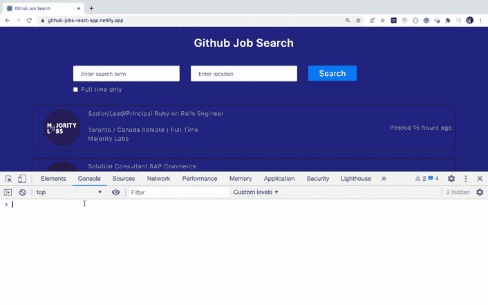

# 在 Chrome DevTools 中访问网页元素的简单方法

> 原文：<https://javascript.plainenglish.io/an-easy-way-of-accessing-elements-of-a-webpage-in-browser-9ad848dceba1?source=collection_archive---------5----------------------->

## 一个鲜为人知的访问网页元素的技巧


Photo by [Keila Hötzel](https://unsplash.com/@keilahoetzel?utm_source=medium&utm_medium=referral) on [Unsplash](https://unsplash.com?utm_source=medium&utm_medium=referral)

很多时候，当我们编写 JavaScript 代码时，我们希望快速测试网页上的某个元素是否存在，或者统计显示的元素列表。

## 例如

**统计显示的工作数量:**

```
document.querySelectorAll('.job-item').length
```

**获取按钮的文本:**

```
document.querySelector('.btn').innerHTML
```

但是每次做一件事都要敲`document.querySelector`或者`document.querySelectorAll`很繁琐。

所以 Chrome 开发者工具提供了一个更简单的方法。

我们可以用`$`代替`document.querySelector`，用$$代替`document.querySelectorAll`

因此，不再需要键入长文本，只需使用`$`或`$$`就可以了。

看看下面的 gif 图片，看看这是怎么回事



use of $ and $$ in chrome developer tools

今天到此为止。我希望你学到了新东西。

**别忘了订阅我的每周时事通讯，里面有惊人的技巧、诀窍和文章，直接在这里的收件箱** [**订阅。**](https://yogeshchavan.dev/)