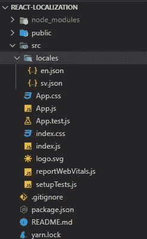
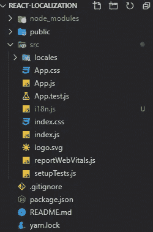

# 本地化 React 应用程序的简单方法

> 原文：<https://javascript.plainenglish.io/an-easy-way-to-localize-your-react-application-aa8a3e81a543?source=collection_archive---------7----------------------->


反应 JS。当然现在是趋势框架。它更轻。并且易于使用。在许多库的支持下，您可以在您的 React 项目中实现许多事情。所以今天，我将向您展示如何在 React 中进行本地化，使用一个名为 i18next 和 react-i18next 的简单库。

# i18next 和 react-i18next

i18next 是一个著名的基于 JavaScript 的项目框架。因为它是纯 JavaScript，你将很难把它转换成 React。但是不用担心。有了名为 react-i18next 的库，这就简单多了。react-i18next 是一个为 react 制作的包装器，基于 i18next。所以不需要转换任何东西。我们可以简单地通过一些小的配置来使用这个库。

所以，没有更多的理论，让我们进入实际。

# 第一步。创建一个 React 项目，然后安装 i18next

我将使用以下命令创建我的项目:

```
npx create-react-app react-localization
```

然后。让我们安装 i18next 和 react-i18next。用您最喜欢的编辑器打开项目。我的是 VS 代码。打开终端。使用下面的代码，您可以安装两个库。

```
yarn add i18next react-i18next
```

*React 现在带有纱线，而不是 npm。所以最好总是使用纱线。*

酷毙了。现在我们有了一个新的 React 项目，安装了 i18next。

# 第二步。创建本地文件

语言环境文件是保存翻译的文件。在我们的申请中，我只有两种语言。英语和瑞典语。所以我需要本地文件。创建一个名为 locales 的文件夹，并添加两个 JSON 文件。



Locale files

让我们在那里补充一些词。

sv.json

en.json

# **第三步。创建 i18 下一个配置文件**

这是 i18next 的主要配置文件。在根目录下创建一个名为 i18n.js 的新文件。以及 index.js。



i18n.js

我们需要在那里进行必要的配置。在我的应用程序中，我希望默认语言是瑞典语。所以我配置了我的 i18n.js 如下。

i18n.js

创建 i18n.js 后，必须将其导入 index.js。

index.js

# 步骤 4 —修改您的组件以支持本地化

在这里，我将把内容添加到我的 App.js 文件中。你要做的主要事情是用“withTranslation”导出评论。这是 react-i18next 给出的函数。您可以通过下面的代码片段看到我是如何做到的。

如你所见，我已经导入了“withTranslation ”,也导出了组件。另一个值得注意的是

```
const { t } = props;
```

这个“t”函数用于呈现译文。我们需要换行，用“t”来翻译内容。您可以在下面的代码中看到我是如何包装文本的。

Texts are wrapped with the t function.

如果你现在运行你的项目，你可以看到文本被翻译成瑞典语。


Translated App.js

这是因为我已经将我的默认语言设置为 Svenska。

# 步骤 5-添加语言切换按钮

网站应该有办法改语言吧？所以我们要添加一个按钮，在英语和斯文斯卡语之间切换语言。

通常这个按钮被添加在标题中。由于我没有使用 header，所以我将在 App.js 中添加按钮。在这里，我们必须使用一些 react-i18next 函数来更改语言。您可以在下面的代码中看到我是如何做到这一点的。

下面是最终结果:

Final result

因此，使用 React 进行本地化非常容易。希望你能从中学到一些东西。

您可以在这里找到示例项目。

[](https://github.com/ayeshN/react-localization.git) [## ayeshN/react-本地化

### 这个项目是用 Create React App 引导的。在项目目录中，您可以运行:在…中运行应用程序

github.com](https://github.com/ayeshN/react-localization.git)