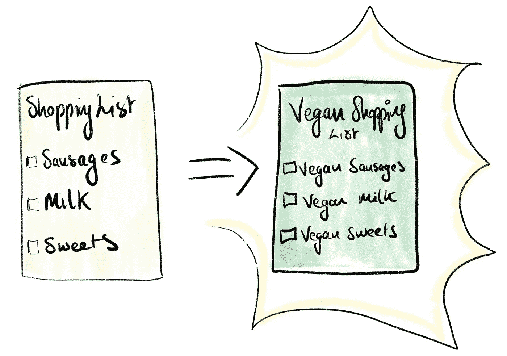
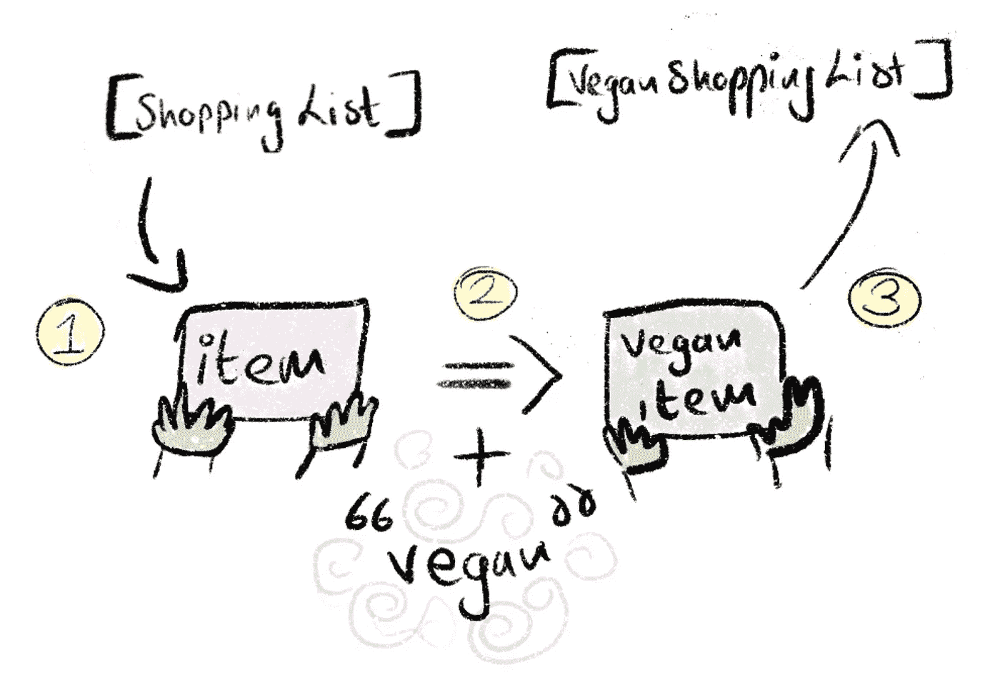
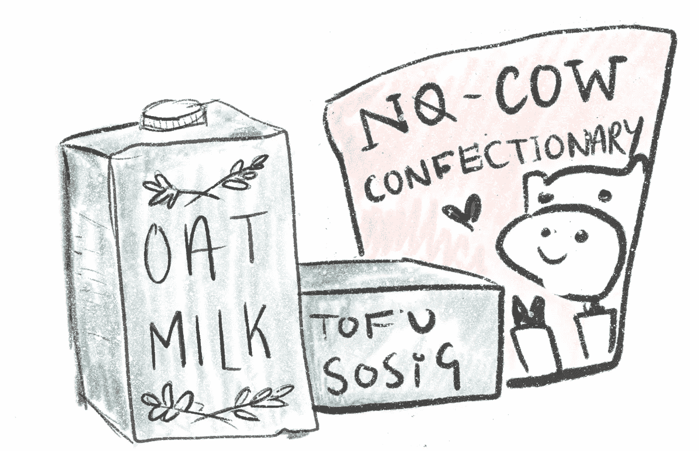

# JavaScript 映射方法的图解指南

> 原文：<https://javascript.plainenglish.io/an-illustrated-guide-to-javascripts-map-method-69178adb92c6?source=collection_archive---------9----------------------->


JavaScript 打包了一些漂亮的工具，可以让你巧妙地使用数组。让我们探索一下在处理数组迭代和操作时最常见的方法之一。

[直接来自 MDN 文档:](https://developer.mozilla.org/en-US/docs/Web/JavaScript/Reference/Global_Objects/Array/map#Description)

*"*`***map()***`*方法* ***创建一个新数组*** *，其中填充了调用数组中每个元素上提供的函数的结果。"*

…呃？


# 一个有插图的例子

我们有一个数组，它只是一个当我们去购物时，我们想要拿起的东西的列表。

```
**const** shoppingList = ['sausages', 'milk', 'sweets']
```

现在让我们假设你决定尝试一个 30 天素食挑战，并且需要改变你的购物清单。你住在一家很棒的素食商店附近，所以你在那里购买替代品。

我们更新清单上的每一项来反映这一点怎么样。



所以，我们想做的是把购物清单上的每一项都改成纯素食版本，然后保存到新的纯素食购物清单上。

我们有合适的工具来做这项工作吗？

> 我听到你说什么？是的**，阵列。地图法！**

```
**const** shoppingList = ['sausages', 'milk', 'sweets'];**const** veganShoppingList = shoppingList.**map**(item => 'vegan ' + item);
```

让我们打印出我们的新名单吧！

```
console.log(veganShoppingList);// ["Vegan sausages", "Vegan milk", "Vegan sweets"]
```

## 分解它

1.  map 方法获取数组中的每一项。
2.  对项目执行操作(功能)。
3.  返回该操作的结果，并将其存储在一个新的**数组中。**



## 我什么时候用这个？

(除了素食购物？)

*   当您想要操作数组中的项目并将它们保存到新的数组中时。

## 什么时候应该不用？

*   每当你不想要一个全新的数组返回。

# Map() vs forEach()？

现在你可能认为这个地图魔术听起来很像`.forEach()`方法。

有什么区别，各自什么时候用？

*   **forEach()** 遍历数组中的所有项。它可以对每个项目执行操作，但是不返回任何内容。在我们的购物示例中，这可能意味着将“纯素食”添加到每个项目中，但不将我们的纯素食项目保存到新的购物列表中。
*   **。map()** 做同样的事情，但是**将每个动作的结果**返回到一个新的数组中。



我希望这是对使用 JavaScript 的`.map()`方法的温和介绍。我总是发现通过画例子来分解这些事情更容易——越奇怪越好！😅

感谢你花时间阅读这篇文章。随时在 Twitter 上打我[*@ daire _ NIC*](https://twitter.com/daire_nic)*！:)*