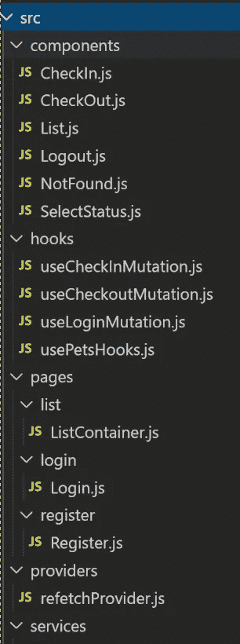

# 介绍带有 React 钩子和上下文 API 的 Apollo GraphQL

> 原文：<https://javascript.plainenglish.io/an-intro-to-apollo-graphql-with-react-hooks-and-context-api-1de5c3ab3c83?source=collection_archive---------4----------------------->


Photo by [James Wheeler](https://unsplash.com/@souvenirpixels?utm_source=unsplash&utm_medium=referral&utm_content=creditCopyText) on [Unsplash](https://unsplash.com/s/photos/fishing-hooks?utm_source=unsplash&utm_medium=referral&utm_content=creditCopyText)

以前我写过如何使用阿波罗图形 QL [这里](https://medium.com/swlh/an-intro-to-graphql-with-apollo-client-and-angular-7bcf66638e11)角。我在 egghead.io 上看了一个来自[伊芙·波尔切洛](https://medium.com/u/7341702f4f0e?source=post_page-----1de5c3ab3c83--------------------------------)的 GraphQL 视频，我觉得用 Angular 和 Apollo GraphQL 客户端模仿她在 GraphQL 操场上(【https://pet-library.moonhighway.com】T5)的动作会很有趣。

由于我一直想尝试 React 有一段时间了，我想到了使用 hooks 和功能组件在 React 中重写 angular app，并希望与您分享我的学习经验。

## 项目

我们的项目将是一个简单的克隆宠物图书馆游乐场从头开始使用 React 和阿波罗客户端，其功能包括认证，返回所有宠物的列表和检查/检查宠物。我们不会在这个项目中使用基于类的组件，因为 react 钩子让我们管理本地组件状态和组件生命周期。

可以在这里 查看完整源代码 [***。***](https://github.com/rajvirtual/react-apollo-graphql-hooks)

## 文件夹结构



上图显示了我们将要使用的文件夹结构。所有可重复使用的组件将放入组件文件夹，代表页面或路线的页面将放入页面文件夹。组件使用的钩子将会在钩子文件夹中结束。将由组件访问的 React 上下文将放在 providers 文件夹中。

组件文件夹将包括以下组件:

*   List.js:一个简单的表示组件，将呈现宠物列表，并将宠物作为道具。
*   CheckIn.js:用于登记宠物并刷新列表的组件。
*   CheckOut.js:签出宠物的组件，签入和签出组件都将宠物 Id 作为属性。
*   SelectStatus.js:根据状态过滤出宠物的组件。

Pages 文件夹将包括以下组件:

*   js:一个包含过滤器下拉列表和列表组件的容器组件。
*   Login.js:处理认证的组件。

让我们使用 create-react-app 来创建我们的项目。

```
create-react-app react-apollo-graphql-hooks
```

我们还将在我们的项目中使用 react bootstrap，因此让我们通过键入以下命令将其添加到我们的项目中:

```
npm install react-bootstrap bootstrap
```

然后，我们将在 components 文件夹中创建 SelectStatus.js，并添加以下代码。

```
export const SelectStatus = ({ petStatus, defaultValue, onSelect }) => {
  const setSelect = (e) => {
    e.preventDefault();
    let index = e.target.options.selectedIndex;
    let status = petStatus[index];
    if (onSelect) {
      onSelect(status);
    }
  };return (
    <>
      <Form.Group controlId="status">
        <Col>
          <Form.Label>Pet Status:</Form.Label>
        </Col>
        <Col>
          <Form.Control
            as="select"
            defaultValue={defaultValue?.name}
            onChange={(e) => setSelect(e)}
          >
            {petStatus.map((item) => {
              return <option key={item.key}>{item.name}</option>;
            })}
          </Form.Control>
        </Col>
      </Form.Group>
    </>
  );
};
```

暂时忽略道具{ petStatus，defaultValue，onSelect }，稍后我们将回到这些。正如你所看到的，这个组件只是一个表示性的组件，不包含任何内部状态，只是通过循环宠物状态列表来呈现引导“选择”组件。

让我们继续讨论列表组件。

```
export const List = ({ pets }) => {
  return (
    <>
      <div className="row mt-4">
        <div className="col-sm-8">
          <table className="table table-striped">
            <thead>
              <tr>
                <td className="w-25">
                  <p> Pet </p>
                </td>
                <td className="w-30">
                  <p> Category</p>
                </td>
                <td className="w-50">
                  <p> Customer</p>
                </td>
                <td className="w-50">
                  <p> Action</p>
                </td>
              </tr>
            </thead>
            <tbody>
              {pets.map((item) => {
                return (
                  <tr key={item.id}>
                    <td>{item.name}</td>
                    <td>{item.category}</td>
                    <td>{item.inCareOf?.name}</td>
                    <td>
                      {item.status === "AVAILABLE" ? (
                        <CheckOut petId={item.id} />
                      ) : (
                        <CheckIn petId={item.id} />
                      )}
                    </td>
                  </tr>
                );
              })}
            </tbody>
          </table>
        </div>
      </div>
      ;
    </>
  );
};
```

它也只是一个表示组件，将呈现一个宠物列表。它还有一个签入/签出组件，接受一个宠物 id 作为道具。让我们稍后回到签入/签出组件。

在创建容器组件之前，让我们编写第一个 Apollo 客户端钩子。使用以下代码在 Hooks 文件夹中创建 usePetsHooks.js。

```
import { useQuery } from "[@apollo/client](http://twitter.com/apollo/client)";
import gql from "graphql-tag";const petFieldsQuery = gql`
  fragment petFields on Pet {
    id
    name
    category
    status
    inCareOf {
      name
    }
  }
`;export const filterPetsQuery = gql`
  query petsQuery($status: PetStatus) {
    allPets(status: $status) {
      ...petFields
    }
  }
  ${petFieldsQuery}
`;export default (status) => {
  return useQuery(filterPetsQuery, {
    fetchPolicy: "network-only",
    variables: {
      status: status,
    },
  });
};
```

我们使用 Apollo 客户端的 useQuery 钩子来获取 GraphQL 数据。对 useQuery 的调用返回一个对象，该对象的属性包括 loading、error、data 和 refetch 函数。当我们使用签入/签出功能时，我们将研究如何使用 refetch 函数。我还将 fetchPolicy 保持为“仅网络”，因为我们对这个项目中的缓存查询结果不感兴趣。

我们还需要确保当我们签入/签出时，列表会刷新，这样当前的宠物就会从列表中消失。还记得 useQuery 返回一个 refetch 函数吗？当我们签入一只宠物时，我们想从签入组件中调用这个 refetch 函数。我们如何在不使列表组件成为 refetch 的传递组件的情况下做到这一点？

一种方法是使用上下文 API，这样我们就不必通过 List 组件手工将 props 传递给 CheckIn/CheckOut 组件。因此，使用 API 我们可以创建一个新的上下文。使用以下代码创建一个文件 refetchProvider.js。

```
import React from "react";
export const PetsContext = React.createContext({});
export const PetsProvider = PetsContext.Provider;
```

Provider 可以包含任何值，也可以是函数(动作)。在下一节中，我们将把 refetch 函数设置为 provider 值。

接下来让我们创建容器组件 ListContainer.js。

```
export const ListContainer = () => {const petStatus = [
    { key: 1, id: null, name: "All" },
    { key: 2, id: "AVAILABLE", name: "Available" },
    { key: 3, id: "CHECKEDOUT", name: "Checked Out" },
  ];
const [selectedStatus, setSelectedStatus] = useState(() => null);const { loading, error, data, refetch } = usePetsQuery(
    selectedStatus ? selectedStatus.id : null
  );const onSelectStatus = (status) => {
    setSelectedStatus(status);
  };const onRefetch = () => {
    refetch();
  };if (loading) return "Loading...";
if (error) return `Error! ${error.message}`;return (
    <>
      <Container className="mt-4">
        <Form>
          <Form.Row>
            <SelectStatus
              petStatus={petStatus}
              onSelect={onSelectStatus}
              defaultValue={selectedStatus}
            />
            <div className="ml-auto">
              <Logout />
            </div>
          </Form.Row>
        </Form>
        <PetsProvider value={() => onRefetch()}>
          <List pets={data.allPets} />
        </PetsProvider>
      </Container>
    </>
  );
};
```

我们使用容器模式，这样我们可以将状态和事件与表示组件分开。

```
const [selectedStatus, setSelectedStatus] = useState(() => null);
```

这里我们使用 React.useState 来维护选择下拉菜单的状态。useState 返回一个数组，我们可以使用 ES6 析构语法来访问这些值。当我们更改选择过滤器时，我们需要重新呈现整个列表组件，updater 函数(setSelectedStatus)将负责这项工作。

还要注意我们如何将列表组件包装到 PetsProvider 中。这有助于我们在每个组件中使用上下文。我们将很快在 CheckIn 组件中看到这一点。

对于签入功能，让我们创建一个签入组件。

```
export const CheckIn = ({ petId }) => {const refetch = useContext(PetsContext);const doCheckIn = useCheckInMutation();
  const checkIn = () => {
    doCheckIn(
      {
        variables: { petId: petId },
      },
      { refetchQueries: [`petsQuery`] }
    )
      .then((_) => {
        refetch();
      })
      .catch((e) => console.log(e));
  };if (!isLoggedIn()) {
    return null;
  }return (
    <>
      <button onClick={() => checkIn()} className="btn btn-link">
        Check In
      </button>
    </>
  );
};
```

我们从 useContext API 获得对 refetch 处理程序的引用。在签入突变发生后，我们将调用 refetch()函数，该函数将依次调用 ListContainer.js 中的 onRefetch 处理程序。

## 结论

这是我尝试分享我使用 React hooks 和 Context API 所学到的东西。这个示例项目展示了如何使用 useState 维护本地状态，以及如何将上下文传递给内部组件，只要它们在同一个组件树中的某个位置。你可以在这里 找到更多关于钩子 [*的信息。*](https://reactjs.org/docs/hooks-reference.html)

你可以在这里 查看 [***的完整源代码。***](https://github.com/rajvirtual/react-apollo-graphql-hooks)

## **用简单英语写的 JavaScript 笔记**

我们已经推出了三种新的出版物！请关注我们的新出版物:[**AI in Plain English**](https://medium.com/ai-in-plain-english)[**UX in Plain English**](https://medium.com/ux-in-plain-english)[**Python in Plain English**](https://medium.com/python-in-plain-english)**——谢谢，继续学习！**

**我们也一直有兴趣帮助推广高质量的内容。如果您有一篇文章想要提交给我们的任何出版物，请发送电子邮件至[**submissions @ plain English . io**](mailto:submissions@plainenglish.io)**，并附上您的 Medium 用户名，我们会将您添加为作者。另外，请让我们知道您想加入哪个/哪些出版物。****