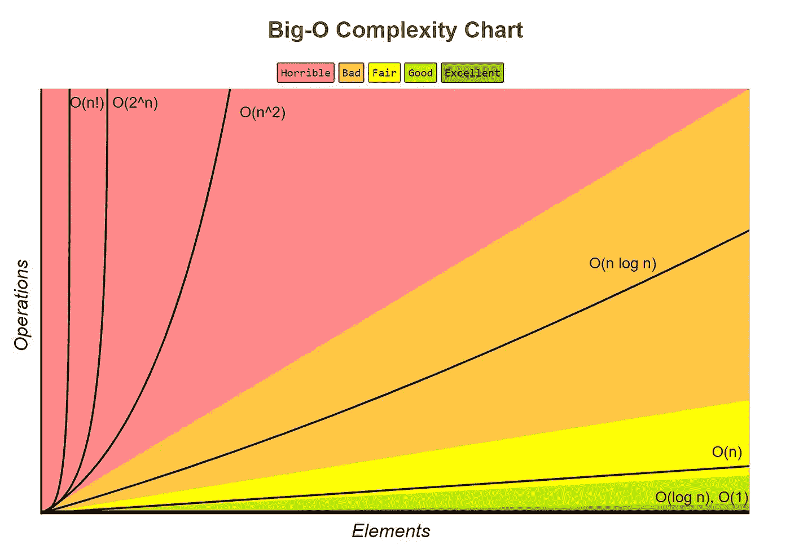
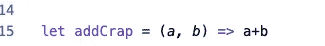
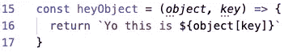
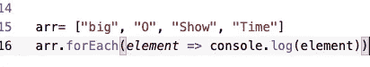
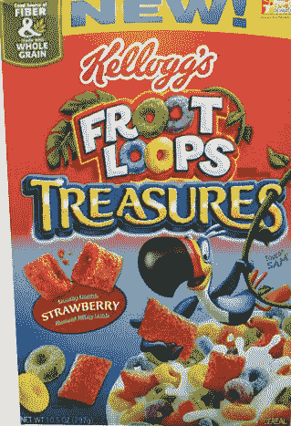
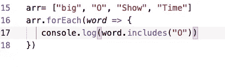

# JavaScript 中的大 O 简介

> 原文：<https://javascript.plainenglish.io/an-intro-to-big-o-in-javascript-a-k-a-dont-mess-up-ur-interview-u-silly-nub-8082005e47c2?source=collection_archive---------2----------------------->

## A.又名“别把你的面试搞砸了，你这个笨蛋”

I wish this was what this post was about.

一座没有记忆的城市，一个专注的孤儿百万富翁在他的巨型机器人的帮助下努力保护这座城市，这一切都发生在一个不远的未来世界，与我们的世界没有什么不同。这是大 O 的故事，也是我希望这篇博文所讲述的内容。然而，有两点导致这种情况没有发生:

1.  几乎没人知道这部动漫。这部电影在日本并不受欢迎，实际上只是因为它在美国的 Toonami 上引起了兴趣才得以重启，因为美国人[喜欢蝙蝠侠和强壮的机器人。说真的，当我在](https://www.urbandictionary.com/define.php?term=Chud)[熨斗学校](https://flatironschool.com/)当着一群人的面开这个玩笑时，他们中的许多人都是公认的动漫爱好者，没有一个人在意或笑，甚至没有表现出认可。
2.  我主要写编程，这就是你在这里的原因，而不是我可怜的动漫参考。

反正回到手头的话题。作为一名最近的 bootcamp 毕业生，我知道我们中的许多人都在找工作，虽然 [web 开发非常有利可图](https://www.indeed.com/salaries/junior-software-engineer-Salaries,-New-York-NY)，但我们中的许多人没有学习算法和大 O 符号，这不仅在技术面试中经常被问到，而且还包括针对困难的代码挑战的问题解决技术。

我很幸运，当我在学校的时候，我的助教尼基·多佛给我上了一堂关于大 O 的选修课，但我最终在 Udemy 的柯尔特·斯蒂尔课程中对它进行了更深入的研究。

我并不认为自己是一个特别数学化的人或天才般聪明的人，我来自表演和即兴喜剧的世界，这种世界不适合聪明的东西，大多只是屁股笑话。因此，我将尽可能简单地解释它。

**大 O** 是一种谈论**特定**进程**或**功能**工作速度**的方式，与运行它的机器无关。基本上:什么是最快的。这里有一张来自网络的图片！

注:这只是从**时间复杂度**来说的。还有很大的空间复杂度，但是我甚至不想去解决它！去学年轻的寄居者吧！

look at me stealing content!

这是最愚蠢的解释方式，省略了很多东西！我将尝试解决三个概念，**大 O(1)** ，**大 O(n)** 和**大 O(n)。**

**大 O(1):** 你有一个只是纯数学的函数吗？就像是:

simple

恭喜你。你有**大 O①！**这意味着**无论你试图往里面放什么疯狂的数字，你的函数永远不会比现在更复杂！**

这也被称为**恒定时间**。**恒定时间**的另一个例子就是从一个地方到另一个地方开车或带着硬盘飞行。不管你有多少数据，飞行时间总是一样的！同样，在 JavaScript 中，**查找**一个**对象**中的**键**就是**常量时间**！这也是对象和 [**面向对象编程**](https://en.wikipedia.org/wiki/Object-oriented_programming) 之所以如此受欢迎的原因之一！这意味着一个对象中可能有一百万个键，但是函数是这样的:

Always constant!

对于我们的工作来说，和前面的数学函数一样好。如果你能有一个有**大 O(1)** 的函数，你做得真的很好，你的老板/面试官/任何人都会对你印象深刻。同样，**非常重要的是**，**不管你的函数中有多少这样的查找或数学，它仍然简化为大 O(1)。这包括当你把这些操作添加到下一个例子中时，这不会使它们有更坏的大 O** 。

**大 O(n):** 大 O(1)是挺牛逼的，但并不总是现实的。一般来说，如果你正在编程，你经常使用一个**循环**。一个**循环**是任何一个**函数**，它查看**一个数据结构的每个**元素，比如一个数组或一个对象，然后对它们进行操作。一个**循环**可能看起来像:

get the reference?

**循环**往往涉及的**或**而。**在 [**React.js**](https://reactjs.org/) 中，我们经常使用**映射、过滤和排序**从我们后端的 JSON 对象的[数组中获取数据，并使用它们在我们的虚拟 DOM 中呈现组件。这些也是**循环**。但像这样的事情也是如此！](https://www.w3schools.com/js/js_json_objects.asp)**

secret loop!

一些你可以在数据结构上调用的**方法**或**函数**实际上是秘密**循环**！

Not these kinds of loops!

**数据结构上的 **includes** 和**index**等**方法实际上是循环，所有循环都提供了**大 O(n)** 时间，因为它们与我们之前的数学运算或对象“查找”示例不同，**函数中任何单独的非嵌套循环** **都提供了大 O(n)时间**。

**这意味着，随着问题的值或对象数量 *n* 的增加，项目会变得更慢**，这与时间常数为 O(1)的**函数相反。**这是相对正常的，好消息是许多函数在**大 O(n)** 时间运行，尽管一些奇特的函数，如 [**分治算法**](https://en.wikipedia.org/wiki/Divide-and-conquer_algorithm) 在所谓的**大 O(log n)** 时间或**大 O(n log n)** 时间运行(如**排序**方法)，我们不会在这里深入讨论。

另一个好消息是**一个函数中可以有几个非嵌套循环，并且仍然有很大的 O(n)时间**。当**结合数学和对象查找**时，这非常有用，我们将在后面看到。

最后，为了本文的目的，我们使用了大 O(n)。哪个不好。任何时候你有一个循环中的循环(包括那些秘密循环！)你发现你自己有一个指数型的**大 O(n )** 就像其他的一样，如果你有几个嵌套循环或者一个嵌套循环和非嵌套循环的组合，它被认为是相同的。

no bueno!

**嵌套循环**意味着你的数据变得越复杂越长，**它会以指数速度变慢**！如果你是一个像 **Twitter** 这样发布大量推文的网站，或者像**美国运通**这样试图检查你的信用是否仍然良好的网站，这真的很糟糕！所以**大 O(n)被认为是尽量避免**的情况。

最后，让我们来看看使用真正的代码挑战来解决问题的一些方法，其中涉及到 **Big O** 。

给我一个挑战，给我一个**数组**，找出该数组中有多少个**唯一值**。所以首先，让我介绍一下行话中所谓的糟糕或幼稚的解决方案。

Oh so square!

这个解决方案是可行的，它将查看数组中有多少唯一值，但是它有很长的时间，因为它在一个循环中使用了一个包含 T21 的方法。也就是说，如果我在面试中没有更好的了解或者紧张，我肯定会把它作为一个选项提出来，并说我认为我可以重构它。

但是我们可以看到，通过一点创造性的问题解决和**对象查找**常量时间**大 O(1)** 我可以创建一个做同样事情的函数。

**注意:**我已经用性能模块记录了这些函数的性能，但是即使它们现在的时钟不同，随着它们变大，它们的性能也会改变。我已经把 [**Repl.it**](http://repl.it/) s 给你了，你自己试试吧！

Good way!

通过创建一个**对象**，也称为**频率计数器**，我可以使用**对象查找**逻辑，在我的**循环**内有一个**大 O(1)** 和一个**大 O(n)** 时间。然后我可以使用由 **Object.keys** **方法**给出的**数组**的长度来查看唯一值。

但也许这对你们中的一些人来说太复杂了，对此我的回答是:

1.  你不用为这个博客付钱！庆幸我没有多做动漫参考吧！
2.  好吧，你听说过 ES6 新增的一个叫做 **Set** 的东西吗，它允许你创建一个只有**唯一值**的列表？

ES6 Way!

这里我们使用 **Set** 数据结构来**过滤**数组为唯一值，然后 ES6 **spread 操作符**创建一个唯一的数组，我们可以找到它的长度。

More Big O…

这就是你要做的，对 JavaScript 中的**大 O** 的非常非常入门的介绍，在这里我尽量避免谈论动画。我会提到蝙蝠侠一样的主角也有一个看起来像阿尔弗雷德·潘尼沃斯的管家，但我想这不是这里也不是那里。

就像我说的，知道 **Big O** 是许多技术面试和代码挑战的一个重要方面，所以即使能够泛泛地谈论它，并知道我提供的第一个和第二个函数之间的区别，也足以让你找到工作。

*   如果你想更深入地了解大 O、数据结构和算法， [**我从柯尔特·斯蒂尔的课程**](https://www.udemy.com/course/js-algorithms-and-data-structures-masterclass) 中学到了，但也有一些很棒的书籍**，**其他的 Udemy 课程 [**比如 Grider one**](https://www.udemy.com/course/coding-interview-bootcamp-algorithms-and-data-structure/) 朋友们已经完成并喜欢，甚至是有趣的聚会，比如 [Talia Fayaz](https://medium.com/u/13021dc64b64?source=post_page-----8082005e47c2--------------------------------) 的 [**NYC Coders 我的朋友**](https://www.meetup.com/nyc-coders/)**[迭戈·马丁内斯](https://medium.com/u/dfd80ef0f6d9?source=post_page-----8082005e47c2--------------------------------)找到了一张借书证** ，并在你的 LinkedIn 上给你颁发了证书。多种选择！

最后，这是你们想要的，一些可爱的狗:

Cuties

这些是夫人(斑纹)和繁荣(谭)老年人 Pibbles。它们很友好，喜欢吃零食、嗅嗅、在东西上撒尿。它们是可爱的狗狗，有一颗大大的心。

战争，博克，再见了，:D

-尼克