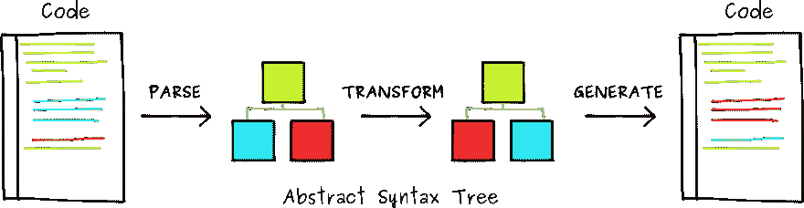

# 巴别塔介绍

> 原文：<https://javascript.plainenglish.io/an-introduction-to-babel-545ac22bca67?source=collection_archive---------7----------------------->

## 什么是巴别塔，你今天可以如何开始使用它


Source: [https://unsplash.com/](https://unsplash.com/)

# 巴别塔是什么？

Babel 是一个帮助我们[将新版 JavaScript 代码](https://scotch.io/tutorials/javascript-transpilers-what-they-are-why-we-need-them)如 [ES6](https://www.w3schools.com/js/js_es6.asp) 转换成旧版 JavaScript 的工具:它甚至可以帮助你转换 [TypeScript](https://iamturns.com/typescript-babel/) 。

Babel 根据您为其定义的配置读取源代码，并编译更新的 JavaScript 特性，如[箭头函数](https://developer.mozilla.org/en-US/docs/Web/JavaScript/Reference/Functions/Arrow_functions)或[可选链接](https://developer.mozilla.org/en-US/docs/Web/JavaScript/Reference/Operators/Optional_chaining)。巴别塔的三个主要工具就是如此:

*   首先，Babel 的[解析器](https://github.com/babel/babel/tree/master/packages/babel-parser)获取 JavaScript 代码，并将其转换为[抽象语法树(AST)](https://en.wikipedia.org/wiki/Abstract_syntax_tree) ，这是计算机可以理解的源代码结构。
*   接下来，Babel 的[遍历器](https://github.com/babel/babel/tree/master/packages/babel-traverse)获取 AST，研究它，并将其修改为我们在 Babel 配置中定义的预期代码。
*   最后，Babel 的[生成器](https://github.com/babel/babel/tree/master/packages/babel-generator)会将修改后的 AST 翻译回常规代码。



# 巴别塔用法

Babel 可以通过 [NPM](https://www.npmjs.com/) 软件包管理器作为软件包依赖项安装。

我们将在初始化项目目录后安装这些依赖项:

*   这是一个非常好的使用命令行编译 JavaScript 文件的工具
*   babel-plugin-transform-async-to-generator—通过这个插件，我们告诉 Babel 只为我们传输某个特性；在这种情况下 [ES7 的异步功能特性](https://medium.com/@habibridho/javascript-es7-async-await-tutorial-64275c81ce2e)
*   [巴别塔-预设-es2015](https://babeljs.io/docs/en/babel-preset-es2015/)——这是一个巴别塔插件的集合，允许巴别塔移植 ES6(或者换句话说 es 2015)的特性:

```
// use `cd` to go to the right directory and then runmkdir babel_project// initialize a package.jsonnpm init// install babel-cli as a tool for running babel, as well as its presets and pluginsnpm install --save-dev babel-cli babel-preset-es2015 babel-plugin-transform-async-to-generator
```

安装完 CLI 以及相关预置和插件后，我们需要一个地方来定义顶级巴别塔设置。为此，我们将在根目录下创建一个. [babelrc](https://babeljs.io/docs/en/6.26.3/babelrc) 文件。该文件中的代码如下所示:

```
{ "presets": ["es2015"], "plugins": ["transform-async-to-generator"]}
```

下一步，我们构建一个文件 async.js 文件，用一个 async 函数来测试 babel:

```
//  async.jsconst fetch = require("node-fetch")async function getData() { let res = await          fetch("https://jsonplaceholder.typicode.com/todos/1") let json = await res.json() console.log('data', json);}getData();// result:// ▶*Object {userId: 1, id: 1, title: "delectus aut autem", completed: false}*
```

我们将使用以下命令运行 babel CLI:

```
npx *babel async.js*
```

要对某个文件运行 babel，可以使用以下命令:

```
npx babel async.js --out-file async.transpiled.js --source-maps
```

这样，我们指定了 transpiled 文件的名称以及源映射文件；这将通过告诉浏览器传输文件的哪一行与原始文件匹配来帮助我们进行调试。要查看 babel 如何将该文件传输到 ES5 的示例，请确保查看这里的。

通过 CLI 运行 babel 可以处理这样一个简单的例子，但是在实际的应用程序中，我们更愿意将它作为构建过程的一部分。在一个典型的项目中，构建过程包括蒸发、缩小、美化、缩小或输出构建，这些可以通过像[package](https://parceljs.org/)这样的工具来处理。

让我们看看如何设置它；为此，我们设置了 package.json 文件:

```
{ "name": "babel", "version": "1.0.0", "description": "", "main": "index.html", "scripts": { "start": "parcel index.html --open", "build": "parcel build index.html"},"dependencies": { "babel-preset-es2015": "6.24.1", "node-fetch": "2.6.0"},"devDependencies": { "@babel/core": "7.2.0", "@babel/plugin-transform-async-to-generator": "7.9.5", "parcel-bundler": "^1.6.1"},"keywords": []}
```

此时，运行`npm run-script` build 应该可以为我们处理传输文件了。请注意，在这个例子中，我们使用[包](https://parceljs.org/)作为捆绑器/构建器，它有一个内置的转换器 Babel。