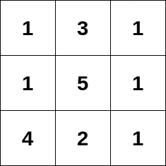
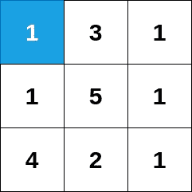
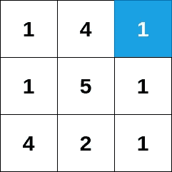
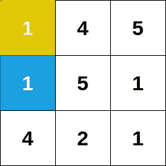
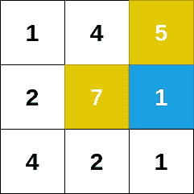
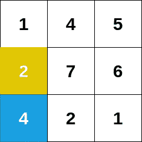
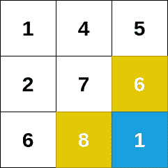

# 自底向上动态编程导论

> 原文：<https://javascript.plainenglish.io/an-introduction-to-bottom-up-dynamic-programming-992fa2a8c11f?source=collection_archive---------4----------------------->

## 对递归不自信？别担心——下面是如何用自下而上的方法解决 DP 问题的指南。

**动态编程** ( **DP** )是个搞笑的名词。这样命名是为了避免[激怒前国防部长](https://en.wikipedia.org/wiki/Dynamic_programming#History)，这个名字一直沿用至今。

本质上，它没有什么动态。DP 可以简单地归类为一种算法策略，其中将单个问题分解为子问题。通过解决每个子问题，算法越来越接近解决原问题。在解决了所有的子问题之后，就找到了原问题的答案。

有经验的读者很可能会认为这个定义非常接近于递归的概念——的确如此，大多数采用 DP 解决方案的问题都可以用递归来解决。

然而，出于本文的目的，我们将研究一下**自底向上的动态编程** ( **BUDP** )，它不一定使用递归。在彻底检查完手头的主题后，我们将使用 BUDP 解决问题 [**最小路径和**](https://leetcode.com/problems/minimum-path-sum/) ，并使用几个说明性的图来完成。

# 快速浏览一下这个问题

在深入 BUDP 之前，让我们分解一下 [**最小路径和**](https://leetcode.com/problems/minimum-path-sum/) 问题。我们现在就这样做，因为对 BUDP 是什么以及它如何工作的解释将取决于使用这个问题作为例子。

问题描述如下:

> 给定一个填充了非负数的`m x n` `grid`，找出一条从左上到右下的路径，使沿其路径的所有数字之和最小。
> 
> **注意:**在任何时间点你只能向下或向右移动。

所以，我们有一个网格，这是一个像`[[1,3,1], [1,5,1], [4,2,1]]`一样的二维数组。它看起来会像这样，取决于`m && n`的大小:

在这张图片中，蓝色方块代表在**最小路径**中的方块。这就把我们带到了下一个相关的问题:最小路径是什么？

此题中的最小路径是从左上(第一个索引)到右下(最后一个索引)的**最小**累加和。当我们在网格中移动时，我们需要通过**添加** **一个先前的元素**(一个数字)到当前的方块来将方块连接成路径。

这就引出了下一个问题:我们如何穿越网格？根据问题的描述，我们只能下移或右移。因此，我们可以选择的路径仅限于两个方向:向下或向右。

可以看到，这个例子中的最小路径是从`1 -> 3 -> 1 -> 1 -> 1`开始，加起来就是`7`。所有其他可能的路径都大于`7`(继续，试着数出来)。

现在，我们到了一个有趣的问题:我们如何解决这个问题？让我们通过 BUDP 了解一下。

# BUDP 是什么？

首先解释使用 DP 解决了什么问题是很重要的。

幸运的是，发现 DP 问题相当容易。DP 问题是需要找到**约简**或**累积**答案的问题。

在我们当前的例子中，我们正在寻找一个简化的答案。我们正在寻找**最小的可能路径**，因此我们需要找到具有最小总和的最后一个索引的路径。

减少/积累问题非常适合动态规划的原因是动态规划采用解决子问题的策略来解决整体问题。在这类问题中，我们需要迭代整个输入(通常是一个矩阵)来寻找答案，因为在寻找答案时必须考虑整个输入。

例如，在我们当前的例子中，我们将需要找到到达矩阵末端的最小可能路径。这意味着我们需要检查每个元素，并为其解决一个子问题。然而，我们需要从某个地方开始。

这是我们真正定义动态编程的**自底向上**风格的地方。采用自下而上的策略，我们从起点开始，解决子问题，直到到达终点。一旦我们到达终点并计算了所有的子问题，整个问题的答案应该是显而易见的。这是因为累积的子问题是用来计算整体问题的最终答案的。

现在，让我们把这种思维方式运用到例题中:这道题中的子题是什么？

子问题反映了总体问题:不同之处在于，我们需要找到通向矩阵中任意给定索引集**的最小路径，而不是找到通向最终索引的最小路径。对于这个策略，这意味着我们需要遍历整个矩阵。通过将矩阵中的每个元素视为整体问题的一个微小子问题，我们可以使用**累积解**来计算**整体解**。**

> 注意:如果这没有意义也没关系——下一节包括巩固子问题用法概念的图表。

至此，我们对 BUDP 有了足够的了解，可以用最小路径和问题来实践它。

# 将 BUDP 应用于最小路径和

在本节的剩余部分，我们将使用下图来说明 BUDP 的用法:

这个矩阵表示`[[1,3,1], [1,5,1], [4,2,1]]`的输入数组。

首先，我们将只用图表来解决这个问题。然后，我们将写出代码来实现我们的解决方案。

我们已经确定，使用 BUDP，我们从输入的开始处开始，一直到末尾，这是它的最终索引。我们还确定我们将需要遍历整个输入数组，因为我们将需要考虑所有的数字，以便确信我们最终达到了最小路径和。所以，让我们突出第一个元素，`1`。

现在我们来解决这个索引处的子问题，就是:这个索引处的最小路径和**是多少？因为我们在第一个索引处，我们的路径必然从这里开始。所以，我们把它作为`1`，因为这是在这个索引中唯一可能的路径和。迭代到第二个元素`3`。**

这个指数的最小路径和是多少？我们必须考虑一条路径如何达到这个指数。我们可以用哪两种方法来构造一条穿过这个矩阵的路径？没错——只有向下和向右。例如，我们不能从`5`移动到`3`，也不能从`2`移动回它之前的`4`。

这意味着路径只能从当前元素左侧或上方的**连接。我们知道这一点，因为我们只能在路径上向右或向下移动。因此，我们可以通过检查以下内容来检查任何给定索引处的最小路径和:当前元素左侧的元素、当前元素正上方(上一行)的元素，然后从它们中挑选比**小**的元素。我们将把左边或顶部元素中较小的一个加到当前元素上，将其转换成当前元素的最小路径和。**

在最上面一行，我们只能检查左边的元素，所以这必然是要添加到当前元素的数字。因此，我们将`1`加到`3`上，然后继续迭代到第一行的最后一个元素`1`。

因为我们仍然在顶行，所以这个子问题的答案与上一个相同:我们将当前元素左边的元素添加到我们的当前元素中。这意味着先前的最小路径和`4`被添加到`1`。接下来，向下移动到下一行，并遍历这些元素。

> 注意:现在我们已经开始突出显示**潜在元素** ( **黄色**)以添加到**当前元素** ( **蓝色**)。

现在我们到了第二行，这意味着我们**有一个顶部元素来检查最小路径和。然而，在第一个元素`1`，我们没有左元素，因为我们在该行的第一个索引处。因此，我们将`1`(从顶部元素)添加到当前元素`1`。继续进行`5`。**

`5`是第一个元素，我们实际上需要检查左边和顶部的元素。记住，由于我们在遍历矩阵时计算每个元素的最小路径和，所以在任何遍历的索引处的元素不再代表原始元素；相反，该元素表示**最小路径和**。使用这些新元素，我们可以在遍历矩阵时计算每个元素的最小路径和，一直到最后的索引。

检查左侧和顶部的最小路径，然后将两者中较小的路径添加到当前元素中，因为我们需要的是最小路径，而不是最大路径。我们将`2`(从左起)添加到`5`，并继续迭代到`1`。

我们在`1`。通过分别找到左侧和顶部元素`7 && 5`的最小值来计算最小路径和。我们将`5`加到`1`上，因为它是两者中较小的一个。迭代到矩阵的下一行和最后一行。

元素`4`从顶部只有一条潜在路径。将`2`(顶部元素)添加到当前元素`4`，继续迭代到`2`。

这里有两个路径选项，即`6`和`7`。两者中较小的是`6`，所以把它加到`2`，迭代到最后一个元素`1`。

这里的选择是显而易见的:`6`是最小路径，因此将其添加到`1`，从而连接并创建我们最终的**最小路径和**以解决整体问题`7`。最终的图表如下所示:

这难道不像魔术吗？通过使用在每个元素计算的子问题，我们能够为整个矩阵创建最小路径和。现在，让我们把这些图画翻译成代码。

# 翻译成代码

我们需要两个循环，一个嵌套在另一个里面。外部循环将遍历矩阵行，内部循环将遍历当前行中的元素。您可以随意使用**指针**或内置的**迭代**方法来完成这项工作；然而，使用像`forEach`这样的迭代方法可能会更容易，因为它可以轻松地传递当前元素的`index`。

> 记住，我们需要当前行和元素的索引来检查当前元素的左邻和上邻。

现在我们已经完成了迭代，让我们继续嵌套循环中的条件逻辑。在这里，我们将检查以下分支:

1.  这是第一行的第一个元素吗？
2.  这个元素在第一行吗？
3.  这是除第一行之外的任何行中的第一个元素吗？

如果满足这些条件中的任何一个，我们都不需要检查左侧或顶部邻居，这取决于满足哪个条件。如果这些条件都不满足，我们必须检查左邻和上邻，以确定当前元素的最小路径和。让我们实现条件逻辑:

现在，让我们实际创建一个逻辑，将当前元素重新分配给最小路径和。

> 记住，在`else`的例子中，我们同时检查左边和顶部的元素。

不要让所有的指数把你难倒；我们只是检查当前元素之前的元素(向左)或当前元素之前的行中的元素(向上)。`Math.min`用于计算其参数的最小值，在这种情况下非常适用。

最后，我们需要返回矩阵中最后一行的最后一个索引处的元素。

太好了！我们都完了。这段代码在`O(m * n)`时间内运行，占用`O(1)`空间，因为我们改变了输入数组，并且没有复制它。

# 结论

我希望动态编程及其自底向上的策略现在对您来说不那么令人生畏了。这需要更多的实践，而不是本文所能提供的，所以我建议将本文中使用的策略应用于以下问题:

1.  [独特的道路](https://leetcode.com/problems/unique-paths/?tab=Description)
2.  [爬楼梯](https://leetcode.com/problems/climbing-stairs/)

祝你好运，编码快乐！