# 使用 Chart.js 介绍 React 中的数据可视化

> 原文：<https://javascript.plainenglish.io/an-introduction-to-data-visualization-in-react-using-chart-js-bf21ccf8ca3a?source=collection_archive---------10----------------------->

在我在 Fullstack Academy 期间，我们学习了许多有用的 API，这些 API 可以与 NERDS stack 集成在一起(Node.js、Express、React、使用 SQL 的数据库)。为了保持 Fullstack 精神的连续性，让我们使用 Chart.js API 对数据可视化做一个简单的调查，在本文中，我将提供一个如何在 React 组件中实现它的演练。

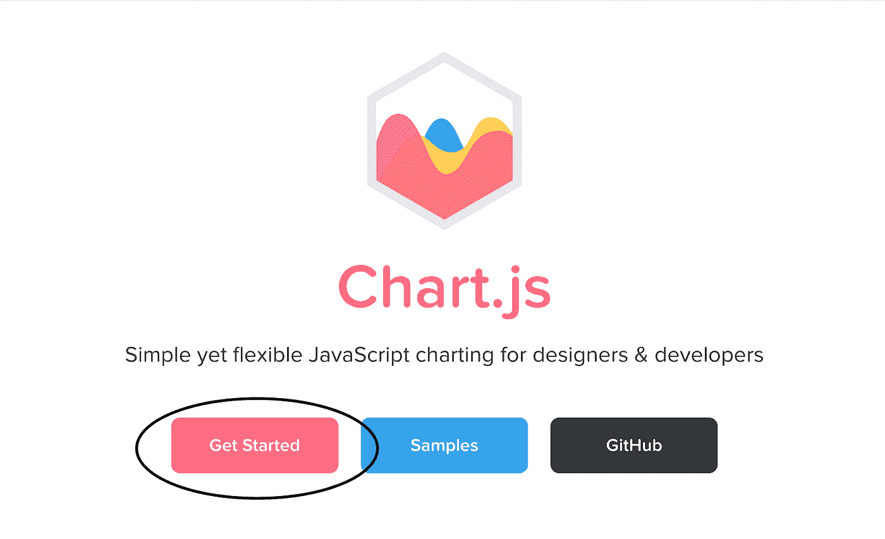

你要做的第一件事是去[主页](https://www.chartjs.org/)，然后文档>开始，然后 npm 安装 chart.js —保存。

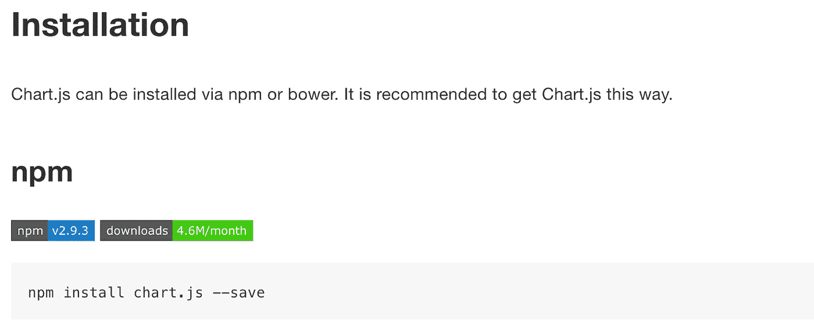

建议使用 npm 或 bower 安装 Chart.js，但是如果你想手动下载这些文件，那么可以在 [CDNJS](https://cdnjs.com/libraries/Chart.js) 、 [jsDelivr](https://www.jsdelivr.com/package/npm/chart.js?path=dist) 和 [GitHub](https://github.com/chartjs/Chart.js/releases/tag/v2.9.3) 上找到它们。如果你仍然不确定使用哪个版本，那么推荐使用 npm。

一旦安装了 Chart.js，就希望将其导入 React 组件，有几种方法可以导入它。

您可以使用脚本标签来实现它:

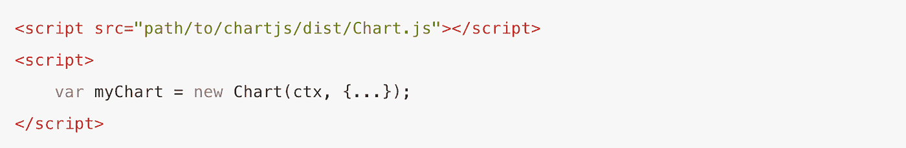

在常规 JavaScript 中需要它:

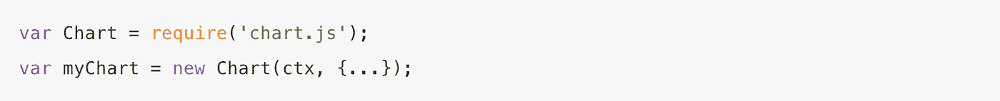

或者，如果您正在使用 Webpack 构建 React 组件，请导入它:

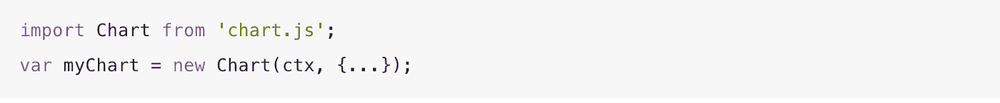

最有可能的是，您想要将它们直接导入到 React 组件中:

```
import { Line, Pie, Doughnut, Bar, Radar, Polar, Bubble, Scatter } from ‘react-chartjs-2’;
```

Chart.js API 中总共包含八种类型的图表。

为了提供它们的图示:

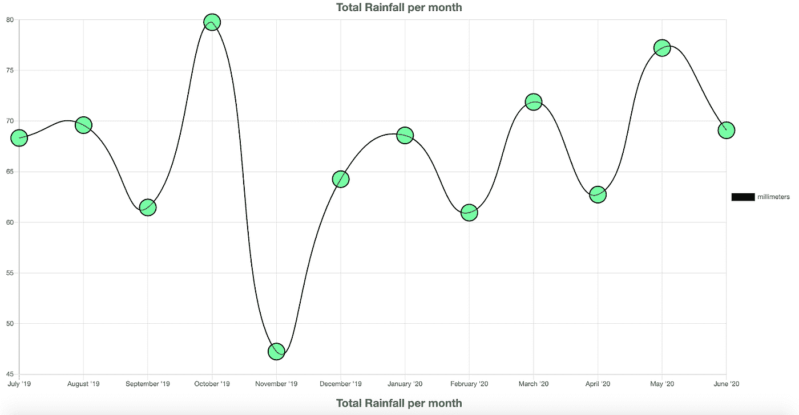

Line Plot

*   线-用于在一条线上绘制数据点，通常用于显示趋势数据和/或比较两个数据集。我们可以编辑线条样式、点样式以及悬停时与每个点的交互。如果我们愿意，我们可以选择不在我们的图上显示点之间的线。在这里，我们绘制的是数字/分类。

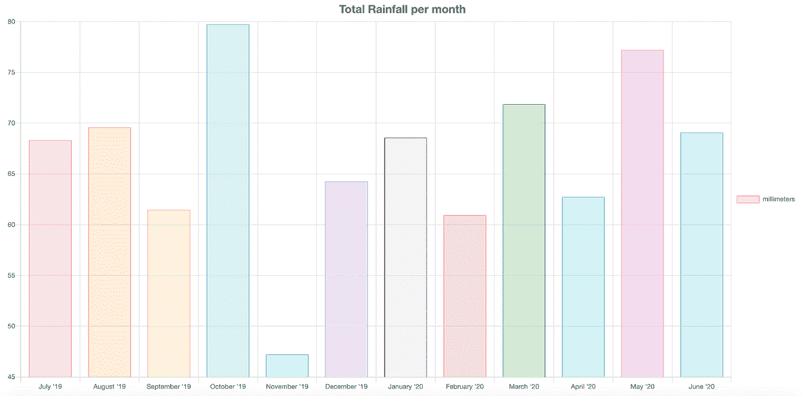

Bar Plot

*   条形图-显示以竖条表示的数据值，有时用于显示趋势数据和并排比较多个数据集。我们可以指定每个栏的样式，包括悬停时的边框(背景色、边框颜色和宽度)。

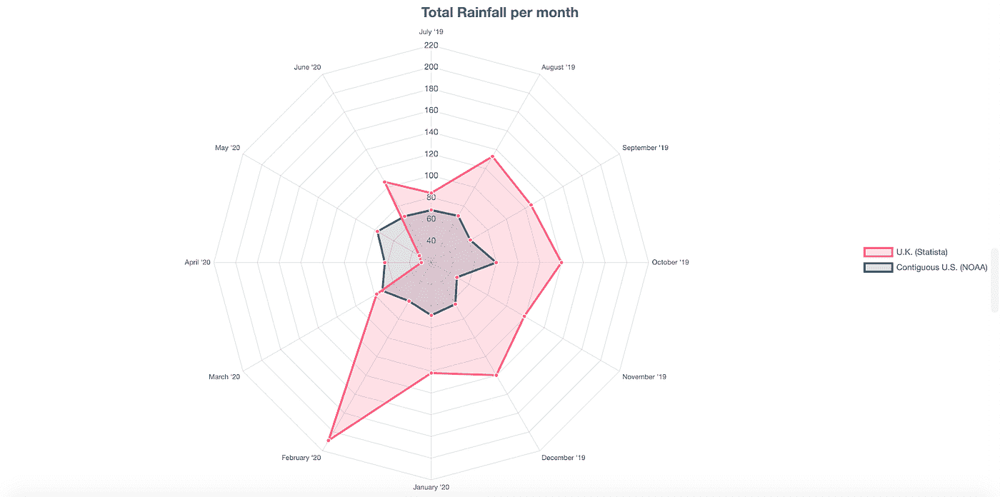

Radar Plot

*   雷达图—雷达图是显示多个数据点以及它们之间的变化的一种方式；对于比较多个数据集也很有用。我们可以指定数据集属性、点样式、悬停时与点的交互，唯一的限制是我们受限于单一比例。

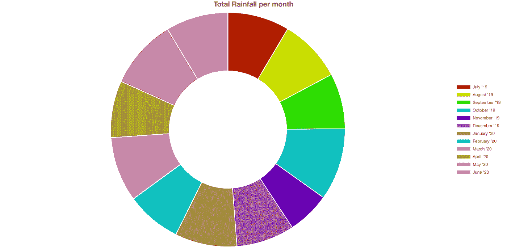

Doughnut Plot

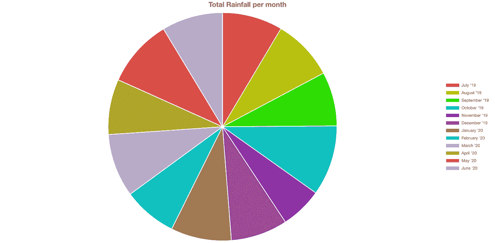

Pie Plot

*   甜甜圈和馅饼——它们非常非常相似，唯一的区别是图表的中心是否有一个洞:)。这对于显示比例和每条数据的比例值很有用。我们还可以指定动画旋转以及边框对齐属性。

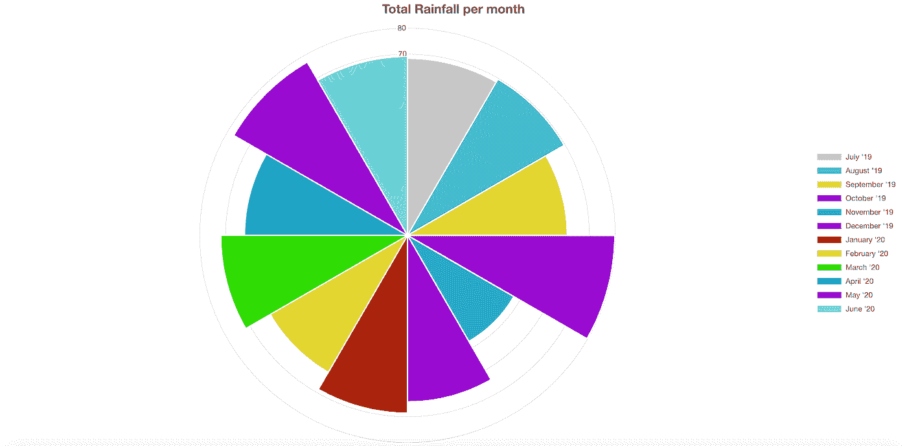

Polar Area Plot

*   极区-极图比圆环图和饼图更精确地表达数字差异；每一段数据的值沿着数字轴描绘，而每一段的角度与每一其它段的角度相同。

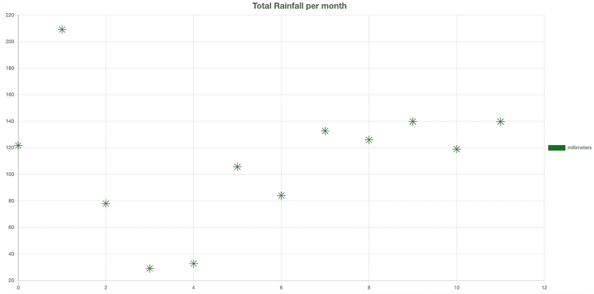

Bubble Plot

*   气泡图—气泡图用于同时显示三维数据；气泡的位置由前两个维度 x 和 y 决定，最后一个维度决定每个气泡的大小。

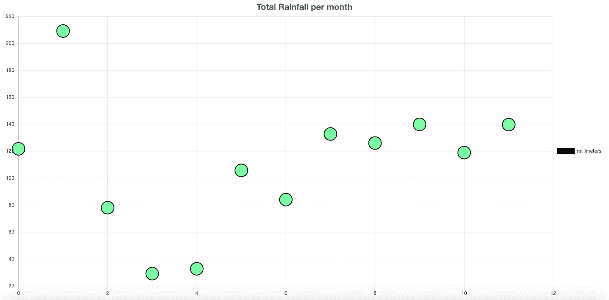

Scatter Plot

*   散点图——本质上是一个折线图，只是 x 轴不是分类轴，而是数字轴。这就像一个气泡图，除了没有第三维。

安装后，这是三个主要步骤:导入您想要的图形类型，为每个图形创建一个数据对象并将其存储在 React 组件上的某个位置，在该组件的 render()部分呈现每个数据对象——现在，让我们来看一下第二步和第三步可用的选项。

具体来说，如果我们要为每个图创建一个数据对象，我们需要指定它的属性。出于推断的目的，让我们假设我们正在创建一个线图。在线图的数据对象中，我们可以指定的所有选项都在[文档](https://www.chartjs.org/docs/latest/charts/line.html)中，如下所示:

**backgroundColor、borderCapStyle、borderColor、borderDash、borderDashOffset、borderJoinStyle、borderWidth、cubicInterpolationMode、clip、fill、hoverBackgroundColor、hoverBorderCapStyle、hoverBorderDash、hoverBorderDashOffset、hoverBorderJoinStyle、hoverBorderWidth、label、lineTension、order、pointBackgroundColor、pointHitRadius、pointHoverBackgroundColor、pointHoverBorderColor、pointHoverBorderColor**

每个图的数据对象都非常相似，但是语法略有不同，所以您需要确保查看文档。这些是用于创建上述图形的数据对象，它们被放置在 React 组件的本地状态上。

```
lineData: { labels: [], datasets: [ { label: ‘millimeters’, fill: false, lineTension: 0.5, backgroundColor: ‘rgba(75,192,192,1)’, pointBackgroundColor: ‘rgba(0, 255, 100, 0.6)’, hoverBorderColor: ‘rgba(255, 255, 0, 1)’, pointRadius: 15, borderColor: ‘rgba(0,0,0,1)’, borderWidth: 2, pointHoverBorderWidth: 15, data: [] } ]},pieDoughnutData: { labels: [], datasets: [ { label: 'millimeters', backgroundColor: ['#B21F00','#C9DE00','#2FDE00','#00A6B4','#6800B4','#a75298','#a77c52','#16e3cc','#b69edb','#a5a01d','#fc737a','#b9b6b6'], hoverBackgroundColor: ['#501800','#4B5000','#175000','#003350','#35014F','#501800','#4B5000','#175000','#003350','#35014F','#501800','#4B5000',], data: [] } ]},barData: { datasets: [ { data: [], label: 'millimeters', backgroundColor: ['rgba(255, 99, 132, 0.2)','rgba(255, 159, 64, 0.2)','rgba(255, 205, 86, 0.2)','rgba(75, 192, 192, 0.2)','rgba(54, 162, 235, 0.2)','rgba(153, 102, 255, 0.2)','rgba(201, 203, 207, 0.2)','rgba(200, 92, 92, 0.2)','rgba(30, 162, 35, 0.2)','rgba(13, 202, 255, 0.2)','rgba(201, 3, 207, 0.2)','rgba(31, 203, 202, 0.2)'], borderColor: ['rgb(255, 99, 132)','rgb(255, 159, 64)','rgb(255, 205, 86)','rgb(75, 192, 192)','rgb(54, 162, 235)','rgb(153, 102, 255)','rgb(101, 3, 107)','rgb(255, 99, 132)','rgb(30, 162, 35)','rgb(21, 203, 207)','rgb(231, 103, 202)','rgb(13, 202, 255)'], borderWidth: 1 } ], labels: []},dataRadar: { labels: [], datasets: [ { data: [], label: 'U.K. (Statista)', fill: true, backgroundColor: 'rgba(250, 99, 132, 0.2)', borderColor: 'rgb(250, 99, 132)', pointBackgroundColor: 'rgb(255, 99, 132)', pointBorderColor: '#fff', pointHoverBackgroundColor: '#fff', pointHoverBorderColor: 'rgb(255, 99, 132)' }, { data: [], label: 'Contiguous U.S. (NOAA)', fill: true, backgroundColor: 'rgba(25, 99, 132, 0.2)', borderColor: 'rgb(25, 99, 132)', pointBackgroundColor: 'rgb(255, 99, 132)', pointBorderColor: '#fff', pointHoverBackgroundColor: '#fff', pointHoverBorderColor: 'rgb(255, 99, 132)' } ]},dataPolar: { datasets: [ { label: 'millimeters', data: [], backgroundColor: ['rgb(200, 200, 200)', 'rgb(75, 192, 192)', 'rgb(255, 205, 86)', 'rgb(201, 23, 207)', 'rgb(54, 162, 235)', 'rgb(150, 2, 255)', 'rgb(178, 31, 0)', 'rgb(201, 222, 0)', 'rgb(47, 222, 0)', 'rgb(0, 166, 180)', 'rgb(104, 0, 180)', 'rgb(133, 224, 234)'] } ], labels: []},dataBubble: { datasets: [ { backgroundColor: 'Green', borderColor: 'Green', borderWidth: 1, data: [], hoverBackgroundColor: 'Green', hoverBorderColor: 'Green', hoverBorderWidth: 3, hoverRadius: 3, hitRadius: 5, label: 'millimeters', pointStyle: 'star', rotation: 0, radius: 3 } ]},dataScatter: { datasets: [ { label: 'millimeters', fill: false, lineTension: 0.5, backgroundColor: 'rgba(75,192,192,1)', pointBackgroundColor: 'rgba(0, 255, 100, 0.6)', hoverBorderColor: 'rgba(255, 155, 100, 1)', pointRadius: 15, borderColor: 'rgba(0,0,0,1)', borderWidth: 2, pointHoverBorderWidth: 15, data: [] } ]}
```

您最不想做的事情就是呈现数据对象——无论是线条、饼图、圆环图、条形图、雷达图、极坐标图、气泡图还是散点图。在渲染它们的时候，重要的是要记住 options 参数是可选的。您不一定需要指定所有选项。

使用 Chart.js 渲染东西极其容易；因为您呈现的是八种图表类型中的哪一种并不重要，您所要做的就是指定您正在使用的数据对象(在我的例子中，我将数据存储在 state 上)。

渲染有哪些选项？它们在[配置](https://www.chartjs.org/docs/latest/configuration/)的文档中，在这里你可以指定**动画、布局、图例、标题、工具提示、元素。**

作为渲染的一个例子:

```
<Line data={this.state.lineData} options={{ title: { display: true, text: 'Total Rainfall per month', fontSize: 20 }, legend: { display: true, position: 'right' } }}/>
```

为了更进一步的兴趣，请查看我最近创建的 Chart.js 的[演示，以及从 Excel 文件生成图表的](https://dean-chart-demo.herokuapp.com/graphs)[更深入研究。你甚至可以看到我关于 Chart.js 的视频！Chart.js API 的美妙之处在于，在每个数据对象中，您唯一绝对需要的主要内容是数据数组[]和标签数组[]，因为这些是创建图表所需的基本内容，而其余的只是可选的样式。](https://dean-stackathon.herokuapp.com/)

如果您有任何问题，文档中有您需要的一切。