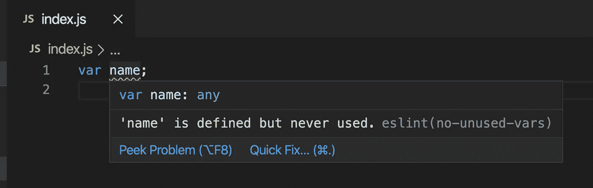
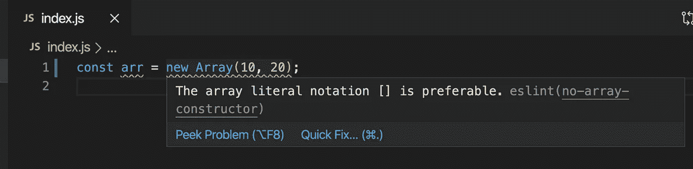
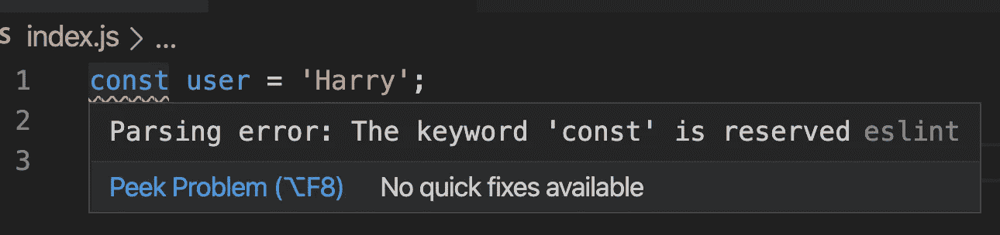
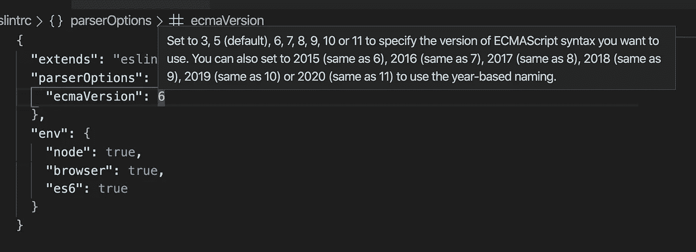
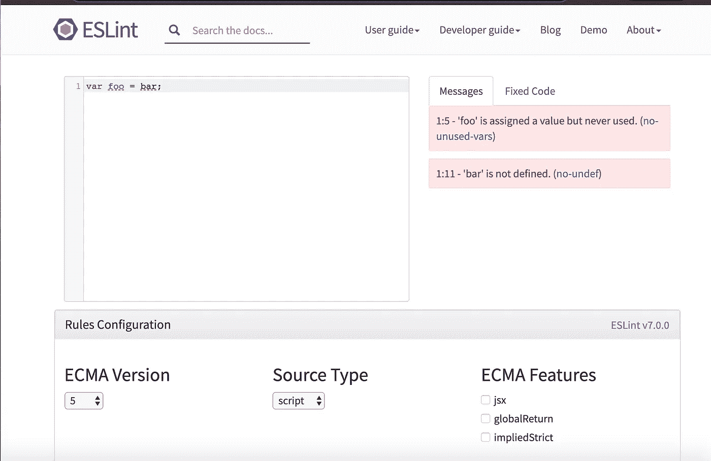
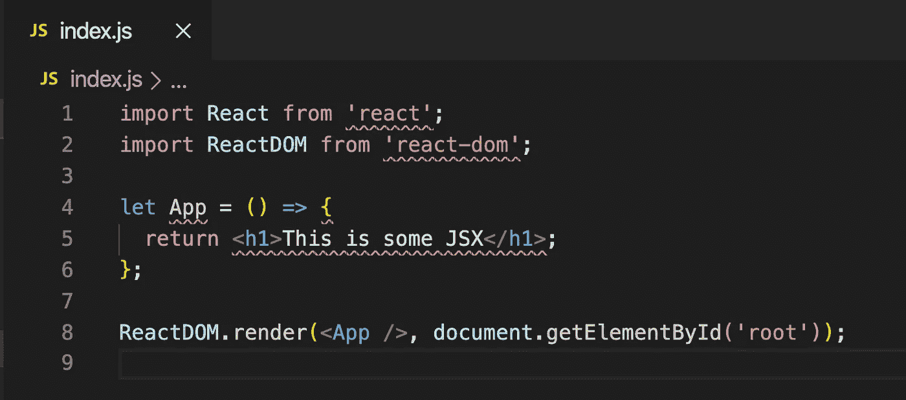
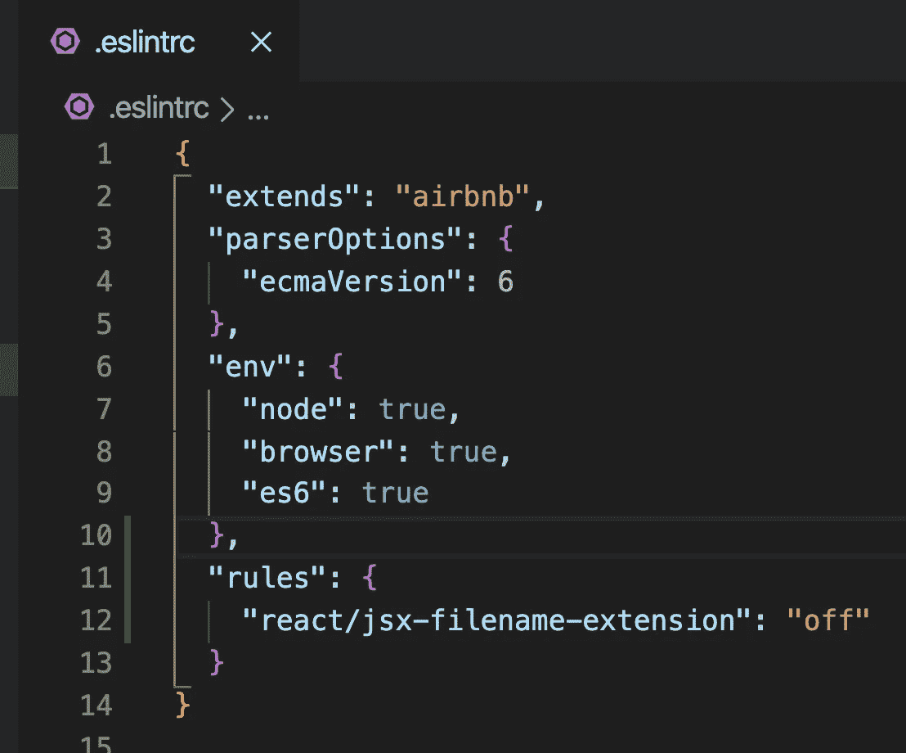

# ESLint 简介

> 原文：<https://javascript.plainenglish.io/an-introduction-to-eslint-d340159182e3?source=collection_archive---------5----------------------->

## 了解如何配置 ESLint 以便在您的项目中使用


Photo by [Charles Deluvio](https://unsplash.com/@charlesdeluvio?utm_source=medium&utm_medium=referral) on [Unsplash](https://unsplash.com?utm_source=medium&utm_medium=referral)

在本文中，我们将探讨什么是`ESLint`以及如何使用它。

让我们开始吧

`ESLint`是一个 linter，它有助于提高代码质量并预先修复 bug，以避免它在运行时出现。这也有助于避免将来难以调试的问题。

知道如何使用`ESLint`非常重要，因为大多数公司都在积极使用它。

也有其他棉绒可用，如`jslint`、`jshint`，但`ESLint`是最广泛使用和最受欢迎的。

`ESLint`出现以下情况时显示警告或错误信息

1.  我们使用一个没有声明的变量
2.  我们重新声明变量
3.  我们试图改变常量值
4.  我们添加不必要的括号
5.  当我们使用错误的语法时

`ESLint`还提供基于首选代码风格和错误语法的建议。

> 请注意，`ESLint`只是显示警告或错误，以便您可以修复它，但它不会停止程序运行。它只是让你的编码更好。

[ESLint](https://eslint.org/) 有一个非常好的网站，用规则和文档详细描述了每个部分。

**安装:**

创建一个名为`eslint-demo`的新文件夹，从这个文件夹中在终端中执行以下命令

```
npm init -yORyarn init -y
```

这将创建一个`package.json`文件。

现在，将`eslint`包作为开发依赖项安装，因为它只用于开发，而不用于生产。

```
npm install eslint --save-devORyarn add eslint --dev
```

这将把 eslint 条目添加到`package.json`的`devDependencies`部分。

**基本配置:**

在你的`eslint-demo`文件夹中创建一个新文件`index.js`，在里面添加变量声明并保存

```
var name;
```

您将看到，没有显示任何错误。

现在用下面的代码创建一个新文件`.eslintrc` ( doteslintrc)

```
{
 "extends": "eslint:recommended"
}
```

这将增加对基本推荐`ESLint`规则的支持。保存文件，如果您打开`index.js,`，您将看到带有消息的变量的红色下划线



ESLint error

所以`ESLint`将确保你不会创建不必要的、永远不会用到的变量。错误消息(`no-unused-vars`)中括号中的名称是规则的名称，我们可以在`.eslintrc`文件中配置该规则来显示或隐藏消息。

如果您不想看到红色下划线，您可以在您的`.eslintrc`文件中禁用它，方法是将其添加为一个规则

```
{
  "extends": "eslint:recommended",
  "rules": {
    "no-unused-vars": "off"
  }
}
```

随着这一改变，它将不会显示红色下划线，但通常你不应该禁用`no-unused-vars`规则，因为它有助于避免创建未使用的变量。

如果创建如下所示的新数组

```
const arr = new Array(10, 20);
```

你会看到红色的下划线，当鼠标悬停在它上面时，你会看到建议，你应该使用数组字面语法，而不是新的关键字。

所以使用像 ESLint 这样的 linter 可以帮助你避免错误的实践，从而写出更好的代码。



现在让我们在`index.js`中使用一些 ES6 特性

打开`index.js`并添加以下代码

```
const user = 'Harry';
console.log(user);
```

现在，您将看到`const`关键字的红色下划线，



ESLInt error

*这是因为默认情况下，ESLint 在 ES5 环境中运行代码。*

要指定 ES6 并指定代码可以在浏览器或节点环境中运行，我们可以在`.eslintrc`文件中添加另一个属性

```
{
  "extends": "eslint:recommended",
  "parserOptions": {
    "ecmaVersion": 6
  },
  "env": {
    "node": true,
    "browser": true,
    "es6": true
  }
}
```

这里，在`parserOptions`中，我们指定使用哪个`ecmaVersion`。

如果您将鼠标悬停在数字`6`上，您可以看到所有可用版本的附加信息



您可以根据需要更改该值。

您可以在这里看到所有可用的环境

导航[此处](https://eslint.org/demo)并点击规则配置按钮，您可以检查和取消检查环境，并通过在文本区中键入来验证代码



你可以访问源代码，直到这一点[这里](https://github.com/myogeshchavan97/eslint-demo/tree/initial-setup)

**Airbnb 风格指南中的林挺:**

在`.eslintrc`中使用`“extends”: “eslint:recommended”`是可以的，但是它并没有涵盖所有的风格指南。在`Airbnb`提供的所有项目中，有更多可用且广泛使用的指南，您可以在这里访问

这些指导方针有助于我们

1.必要时避免使用 new 运算符创建对象。

2.如果变量不会改变，当我们使用`let`而不是`const`时，也会显示警告。

3.使用运算符或函数时，有助于添加和避免额外的空格。

还有更多。

`Airbnb`提供`Javascript`和`React`林挺支持。

要将林挺仅用于`**Javascript without React**`，您可以安装所需的依赖项，如下所示

```
npm install eslint-config-airbnb-base@latest eslint-plugin-import 
--save-devORyarn add eslint-config-airbnb-base@latest eslint-plugin-import --dev
```

你可以在这里找到更多关于它的信息

要为`**Javascript with React**`设置林挺，请安装以下依赖项

```
npm install eslint-config-airbnb@latest eslint-plugin-import eslint-plugin-react eslint-plugin-react-hooks eslint-plugin-jsx-a11y 
--save-devORyarn add eslint-config-airbnb@latest eslint-plugin-import eslint-plugin-react eslint-plugin-react-hooks eslint-plugin-jsx-a11y --dev
```

你可以在这里找到更多的信息

并在`.eslintrc`文件中，更改

```
"extends": "eslint:recommended",
```

到

```
"extends": "airbnb",
```

现在，让我们写一些反应代码，我们可以检查林挺

在`index.js`中添加以下代码

```
import React from 'react';
import ReactDOM from 'react-dom';let App = () => {
  return <h1>This is some JSX</h1>;
};ReactDOM.render(<App />, document.getElementById('root'));
```

如果你保存文件，你会看到许多红色的下划线

1.无法找到包 react，react-dom

2.“应用程序”永远不会被重新分配。请改用“const”

3.扩展名为'的文件中不允许有 JSX。js '



要修复第一个错误，请安装`react`和`react-dom`软件包

```
npm install react react-domORyarn add react react-dom
```

现在，对于第二个错误，我们需要将`let`更改为`const`，因为它从未更改过

所以当它的值不会改变时，总是推荐使用 const。

正如你所看到的，林挺给出了有用的建议来写出更好的代码

如果你想了解更多关于任何错误意味着什么的信息，当你鼠标悬停在红色下划线上并在 google 中搜索时，你可以复制显示在括号中的规则名称。就像`prefer-const eslint`一样，它会向您显示关于如何修复以及它会导致什么问题的所有信息。

要查找有关任何规则以及如何禁用它的更多信息，您可以在规则页面[此处](https://eslint.org/docs/rules/)搜索该规则

如果您将鼠标悬停在 JSX 红色下划线上，您可以看到其规则名称`“react/jsx-filename-extension”`

如果您在规则页面[这里](https://eslint.org/docs/rules/)找不到规则，您可以在谷歌中搜索为`react/jsx-filename-extension eslint`，您会看到如何修改的结果，如图[这里](https://github.com/yannickcr/eslint-plugin-react/blob/master/docs/rules/jsx-filename-extension.md)

因此要禁用该检查，我们可以在`.eslintrc`文件中添加一个规则



ESLint Rule

该值通常为以下值之一

1.`warn`示警

2.`error`:显示为错误

3.`off`:不显示红色下划线

您可能会发现，有时文档中使用的是错误代码，而不是文本`warn`、`error`或`off`。

0 代表`off`，1 代表`warn`，2 代表`error`。

现在，如果您保存`.eslintrc`文件，您会看到`index.js`中不再有红色下划线。

您可以访问源代码，直到此时[在此](https://github.com/myogeshchavan97/eslint-demo/tree/advanced-setup)

您可以在`.eslintrc`中找到本文的完整 Github 源代码以及更好的林挺的附加配置[在这里](https://github.com/myogeshchavan97/eslint-demo)

今天就到这里。我希望你学到了一些新东西。

**不要忘记订阅我的每周时事通讯，在这里你可以直接在你的收件箱** [**中找到惊人的技巧、窍门和文章。**](https://yogeshchavan.dev/)

# **简明英语团队备注**

你知道我们有四个出版物和一个 YouTube 频道吗？你可以在我们的主页 [**上找到这些。**](https://plainenglish.io/)——关注我们的出版物并订阅我们的 YouTube 频道 **来表达爱意！**