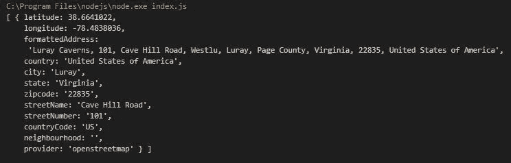
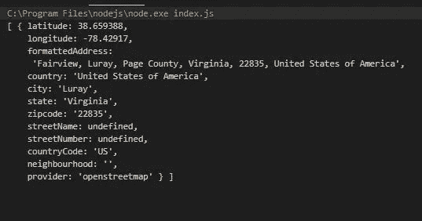

# 使用 Node.js 进行地理编码简介

> 原文：<https://javascript.plainenglish.io/an-introduction-to-geocoding-using-node-js-fe1a5d3aa05c?source=collection_archive---------0----------------------->

## 地理编码入门

## 地理信息的服务器端访问


Photo by [Amy Humphries](https://unsplash.com/@amyjoyhumphries?utm_source=medium&utm_medium=referral) on [Unsplash](https://unsplash.com?utm_source=medium&utm_medium=referral)

在这篇文章中，我想让我们使用 node.js 在服务器端探索一下**地理编码**

在[之前的一篇文章](https://medium.com/javascript-in-plain-english/introduction-to-javascripts-geolocation-api-b01ca61e47f8)中，我们使用 [JavaScript 的地理定位 API](https://developer.mozilla.org/en-US/docs/Web/API/Geolocation_API) 研究了客户端地理编码。

> 有趣的是，在这篇文章中，你可以用你自己的位置做到这一点。

# 什么是地理编码？

> **地理编码**是获取输入文本的过程，例如一个[地址](https://en.wikipedia.org/wiki/Address_(geography))或一个[地点的名称](https://en.wikipedia.org/wiki/Location_(geography))，并返回该地点在地球表面上的纬度/经度位置。

换句话说，我们输入一个地址，然后得到经度、纬度、国家等信息。我们的*地理编码提供商*将提供尽可能多的信息。

一些地理编码提供商包括，

*   谷歌地图
*   Mapquest
*   这里的地图(可以说是最全面的。)
*   OpenStreetMap

我们将像在客户端文章中一样使用 **OpenStreetMap** ，因为它免费且易于配置。

与客户端不同，在客户端，我们能够检索经度、纬度和可视地图，在服务器端，它将是信息性的。这并不是一件坏事，因为一旦我们有了信息，我们就可以随心所欲地使用它。将其传递给客户端 API，将信息存储在数据库中，任何我们想要的东西。

# 我们开始吧

## 设置

你需要安装 [node.js](https://nodejs.org/en/) 。我也将使用 [Visual Studio 代码](https://code.visualstudio.com/) (VSCode)作为我的 IDE。

1.  创建一个要在其中工作的文件夹，并在 VSCode 中打开它。
2.  打开一个终端窗口并创建一个 package.json，它会将 index.js 设置为我们的默认 JavaScript 文件，通过键入，

```
npm init -y
```

3.我们将安装 npm 包，这将使我们的地理编码成为可能。在终端窗口类型中，

```
npm install node-geocoder
```

## 代码

创建一个名为 **index.js** 的文件。首先，我们将通过键入以下命令来导入 npm 包，

```
let nodeGeocoder = require('node-geocoder');
```

接下来，我们将在选项对象参数中指定地理编码提供程序。我们的提供商是 [OpenStreetMap](https://wiki.openstreetmap.org/wiki/About_OpenStreetMap) 。我们只需要提供名称“openetreetmap”。对于其他提供者，您需要提供 API 密钥或其他参数。*你必须查看该供应商的文件。*

接下来，我们将设置我们的选项，并将它们传递给 nodeGeocoder 的一个实例。

```
let options = {
  provider: 'openstreetmap'
};

let geoCoder = nodeGeocoder(options);
```

最后一步是调用我们的 geoCoder 对象的 **geocode()** 方法，为它提供一个地址。

键入您喜欢的任何地址。我将进入*卢瑞洞穴*。

geocode()方法的调用将返回一个**承诺**，因此我们将使用*。然后是*和*。捕捉*以处理结果或错误。

输入以下内容，

```
**geoCoder.geocode('Luray Caverns')**
  .then((res)=> {
    console.log(res);
  })
  .catch((err)=> {
    console.log(err);
  });
```

你可能想试验一下你需要提供多少信息。在这里，我没有告诉它美国或弗吉尼亚州！如果我只提供 Luray，我会得到“猜测”。

> 试试自己的地址！

如果您使用 **F5** 在调试模式下运行，您将看到它返回一个包含对象的数组。如果使用 **CTRL-F5** ，就会看到数据。



Result using CTRL-F5

多酷啊！查看信息详细信息。

这是完整的代码。

```
let nodeGeocoder = require('node-geocoder');

let options = {
  provider: 'openstreetmap'
};

let geoCoder = nodeGeocoder(options);**geoCoder.geocode('Luray Caverns')**
  .then((res)=> {
    console.log(res);
  })
  .catch((err)=> {
    console.log(err);
  });
```

# 反向地理定位

> [另一方面，反向地理编码](https://en.wikipedia.org/wiki/Reverse_geocoding)将[地理坐标](https://en.wikipedia.org/wiki/Geographic_coordinates)转换成一个位置的描述，通常是一个地点或可寻址位置的名称。地理编码依赖于地址点、街道/道路网络以及邮政和行政边界的计算机表示。

节点地理编码器 npm 包也可以执行**反向地理定位**。我们调用 geoCoder 对象的 **reverse()** 方法。这也返回一个承诺，因此处理方式与前面的示例相同。

在这里，我将提供 Luray 洞穴的**纬度**和**经度**，它将返回在地球上该位置找到的内容。

下面是一个完整的例子，

```
let nodeGeocoder = require('node-geocoder');

let options = {
  provider: 'openstreetmap'
};

let geoCoder = nodeGeocoder(options);// Reverse Geocode
 ** geoCoder.reverse({lat:38.66, lon:-78.43})**
  .then((res)=> {
    console.log(res);
  })
  .catch((err)=> {
    console.log(err);
  });
```

如你所见，它返回了弗吉尼亚的卢雷洞穴。



CTRL+F5

# 结论

我们现在有了一个用于执行地理编码和反向地理编码的服务器端工具。这一点的应用取决于您的用例。

信息的准确性将取决于您使用的提供商。

我也鼓励你阅读下面的客户端 Gelocation API 并编写代码。在这里，我们可以找到我们网站的位置，并获得经度和纬度，但是也可以打开一张地图，显示他们从哪里访问我们的网站。在那篇文章中，我还使用了 OpenStreetMap。

**感谢您的阅读和快乐编码！**

*在 Medium 上阅读所有你想要的文章，并通过成为 Medium 会员来帮助我继续写作，每月只需 5 美元。*

[](https://bobtomlin-70659.medium.com/membership) [## 通过我的推荐链接加入灵媒——重力井(罗伯·汤姆林)

### 作为一个媒体会员，你的会员费的一部分会给你阅读的作家，你可以完全接触到每一个故事…

bobtomlin-70659.medium.com](https://bobtomlin-70659.medium.com/membership) [](https://medium.com/javascript-in-plain-english/introduction-to-javascripts-geolocation-api-b01ca61e47f8) [## JavaScript 地理定位 API 简介

### JavaScript 的地理定位 API 是什么以及如何使用它

medium.com](https://medium.com/javascript-in-plain-english/introduction-to-javascripts-geolocation-api-b01ca61e47f8)