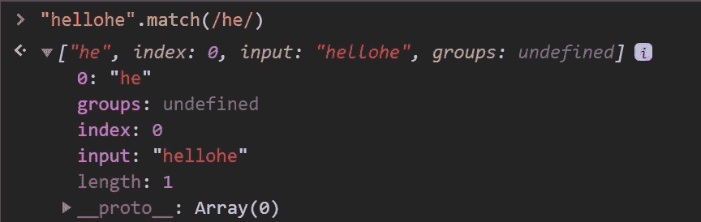
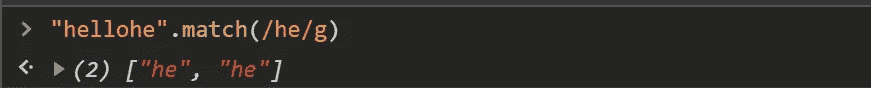
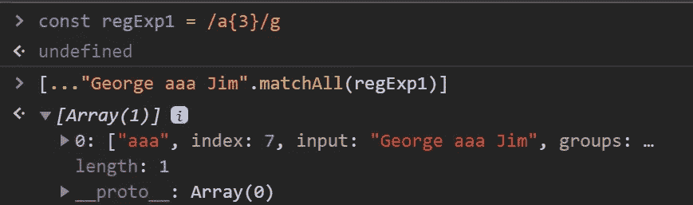
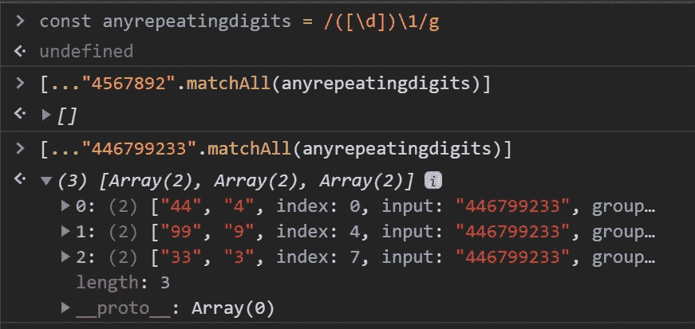
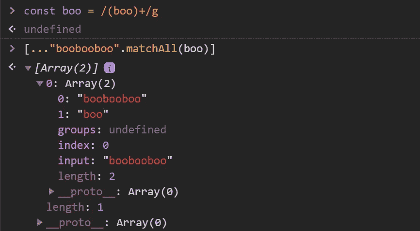
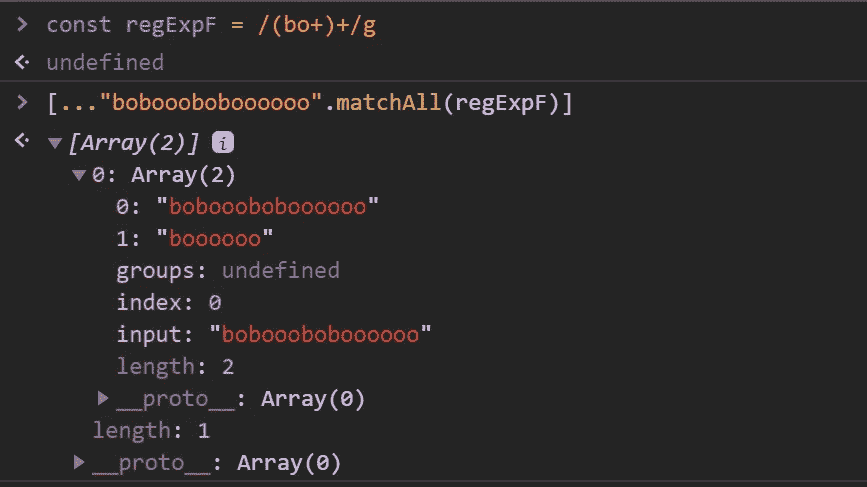

# 理解正则表达式第 3 部分

> 原文：<https://javascript.plainenglish.io/an-introduction-to-regular-expressions-200bc249b893?source=collection_archive---------6----------------------->

## 重复字符

在上一期中，我们学习了如何使用正则表达式来验证表单中的电话号码和电子邮件。这些问题说明了正则表达式中的基本概念，如匹配组、重复数字和字符顺序。在这一期中，我将深入到重复字符中。

## “匹配”和“匹配”

在本文中，我将介绍两种工具性正则表达式方法，它们比简单的“测试”方法提供了更多有价值的信息。如果我们想知道的不仅仅是真(正则表达式匹配)或假(正则表达式不匹配)，我们可以使用' match '和' matchAll 'Match 返回在字符串中找到的第一个匹配子字符串及其索引，而“matchAll”返回所有匹配子字符串及其索引。让我们看几个例子。

match method finds a match for Regular Expression in string

如上所述，match 方法查找满足正则表达式要求的字符串的第一部分及其在字符串中的索引。不幸的是，一旦这个过程找到第一个匹配，它就结束了。

matchAll method used with the global flag

从上面可以看出，matchAll 方法返回所有找到的匹配项的数组对象。每个数组都包含匹配本身，以及该匹配的起始索引。值得强调的是“g”旗。“g”代表全球。全局标志指示该方法超出第一个匹配项，在整个字符串中查找表达式。如果没有全局的“g”标志，“matchAll”将抛出一个错误，如上所示。

match method used with the global flag

当然，我们可以找到所有带有全球国旗的比赛；然而，通常的“匹配”方法不能提供关于每个实例的那么多信息。

## 重复字符

假设我们需要找到重复字符的匹配。在以前的文章中，我们已经介绍了识别重复特定次数的字符的情况。然而，回顾一下，如果我们想要找到重复的字符，我们可以指定重复的精确长度，如下所示。

The regular expression matches three a’s in a row.

如上所述，该方法成功地找到了一行中三个 a 的匹配。这种策略是有用的，但有局限性。如果我们想更进一步，找到任何重复的字符呢？让我们从看是否能找到任何重复的单词字符开始。

The regular expression matches any repeating word characters.

上面的代码介绍了另外两个需要解释的工具:捕获组和回溯。从我们之前的文章中，我们可以通过方括号看到这个正则表达式在寻找任何单词字符。但是，括号将它们变成了“捕获组”

## 捕获组和回溯

什么是捕获组？捕获组告诉方法将匹配的字符作为一组来捕获，以备后用。如果没有捕获组括号，该方法会忘记找到的模式。

什么是回溯？回溯告诉正则表达式引擎“回顾”以前的匹配，以找到进一步的匹配。在这种情况下，我们将任何单词字符作为一个组来捕获；然后，回溯符号告诉引擎寻找捕获组的重复。

因此，与回溯符号结合的捕获组括号允许我们找到一个特定单词字符的重复，而不是任何单词字符的重复。让我们检查下面的代码，看看这是什么意思。

the regular expression that finds repeating digits

“4567892”的第一行返回一个空数组，因为字符串中的所有数字都是唯一的。第二行发现三种特殊数字重复的情况。4、9 和 3。它只检查数字重复一次，然后停止。

捕捉组是有益的和多才多艺的。我们可以使用它们来寻找更复杂的重复字符模式——下面的代码演示了另一个用于捕获组的应用程序。

The code above looks for repeating “boo” substrings.

如上所示，正则表达式有一个由加号修改的捕获组‘boo’。这两种方法的组合寻找重复一次或多次的字符模式“boo”。查看“matchAll”结果，它返回“boo”和“booboo”这太棒了，但是我们可以更进一步。在下面的代码中，我们寻找的不仅仅是一个字符的重复，而是一个字符模式的重复。

Regular expression matches bo+ repeated one or more times.

现在重复的模式变得更加复杂。我们使用“加号”字符不仅寻找“o”的重复，而且寻找捕获组本身的重复。正则表达式方法寻找任何重复的‘boo’以及重复的‘boo’

然而，如果我们感兴趣的是寻找任何重复的字符，而不仅仅是单词字符。使用“.”通配符，这是可能的。

the regular expression matches any repeating characters

## 关键要点

1.  全局标志:全局标志指示方法执行全局搜索。全局搜索测试字符串中所有可能的匹配
2.  '.'通配符:The。字符匹配字符串中的任何单个字符。它最类似的是扑克牌中的百搭牌。
3.  ' match': Match 查找匹配正则表达式模式的第一个子字符串。使用全局标志，它返回一个没有其他信息的匹配数组。
4.  ' matchAll ':此方法全局查找正则表达式匹配的搜索。然后，它返回一个数组，其中包含匹配项和找到匹配项的索引。
5.  捕获组:使用模式周围的括号创建一个捕获组。捕获组捕获与模式匹配的文本，并保存在一个编号组中，该编号组可与编号的反向引用一起重复使用。

在本系列的下一部分中，我们将研究捕获组和回溯的更复杂的用法。我们还将探索正则表达式引擎的机制以及它如何找到匹配。