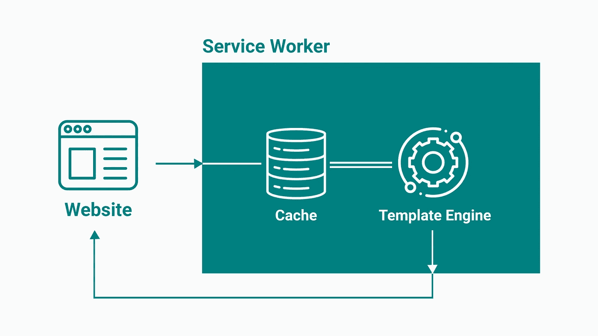
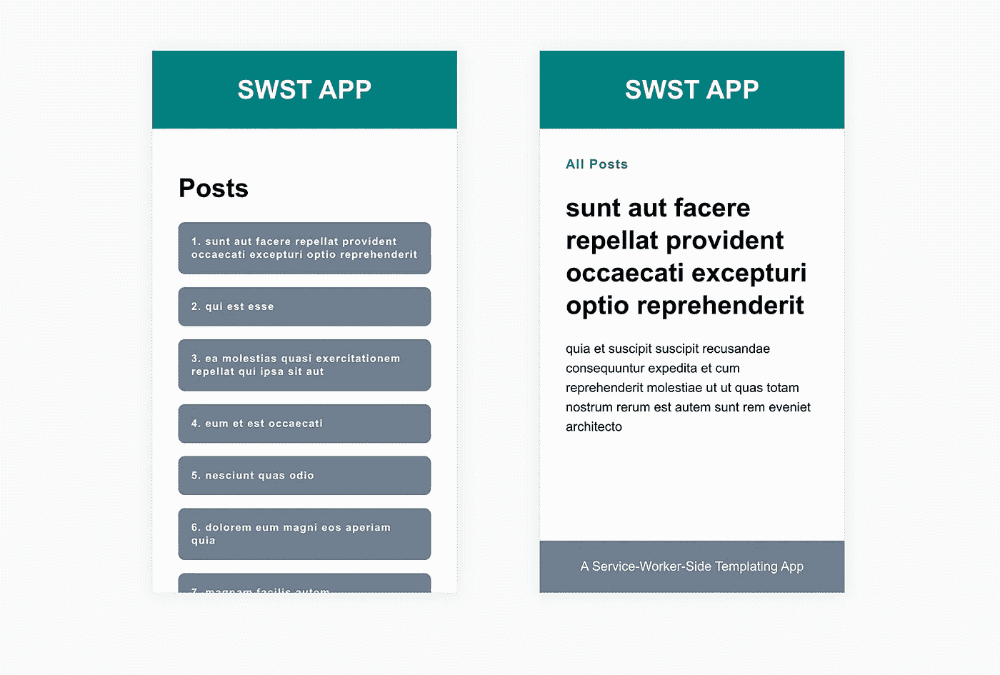

# 服务工作端模板简介

> 原文：<https://javascript.plainenglish.io/an-introduction-to-service-worker-side-templating-858b835d5062?source=collection_archive---------3----------------------->

传统上，像 PHP 或 Ruby on Rails 这样的平台负责服务器端的渲染过程。最近，像 React 或 Angular 这样的新框架将这个过程从服务器带到了客户端。有了服务人员，我们现在有了第三个可以实现模板引擎的地方——在客户机和服务器之间。这篇文章向您展示了我的意思，它的优点，以及如何使用它。

# 什么是服务工作者端模板？

服务工作者端模板的工作方式和其他模板引擎一样。您的缓存中存储了您的模板，例如文章页面。对于任何截获的请求，服务工作者将从外部 API 或其缓存中获取数据，填充模板中的合并字段，并将呈现的 HTML 返回给客户机。

这就是 PHP 或 React 等模板引擎在服务器端或客户端的工作方式。然而，为了让这个过程在我们的服务人员内部工作，我们需要事先向它添加一个模板引擎。在我们的示例中，稍后，我们将使用 Handlebars.js 作为轻量级模板引擎，这将允许我们在服务工作器中动态呈现响应。

# 服务工作者端模板化的优势

那么，我们为什么不使用服务器端或客户端渲染呢？服务人员渲染的优势是什么，可以让所有工作都有价值？

## 缓存有状态页面

首先，服务工作端呈现使您能够缓存那些本来无法缓存的页面。假设有一个包含状态数据的页面(例如导航栏中的“以 Michael 的身份登录”)，您希望缓存该页面。如果缓存整个 HTML 页面，新登录的用户仍然会看到“以 Michael 的身份登录”的通知。因为 HTML 页面在缓存中可用，所以服务人员将使用它进行响应——不管可能发生了什么变化。有了服务工作者端的模板，就可以避免这样的问题。通过预先缓存模板，您可以轻松地处理用户更改，因为所有用户数据都是单独检索的。

## 减少缓存存储容量

其次，使用模板引擎可以显著减少 web 应用程序的缓存存储容量，这取决于您运行的站点类型。例如，如果您有一个博客，上面有几百篇文章，并且您将每篇文章的整个 HTML 页面存储在缓存中，那么您或多或少会使用一百倍的相同 HTML 模板来占用客户端的存储空间。如果只存储一次 HTML 模板，每篇文章只存储内容，这就足够了。通过在 service worker 中动态呈现文章页面，您可以轻松做到这一点。此外，您还可以在缓存中节省大量不必要的存储空间。

# 实现服务工作端模板

为了给你一个服务人员渲染的例子，我们将构建一个名为 SWST 的小应用程序。它只包含两个页面:一个索引页面(列出所有文章)，一个文章页面(代表一篇文章)。

现在，我们不再缓存每篇文章已经呈现的 HTML 页面，而是只缓存它们的共享页面模板。因此，我们可以分别存储各个 post 数据，并显著减少所需的缓存存储容量。正如您在下面看到的，我们使用 Handlebars.js 作为服务人员内部的模板引擎。这非常方便，因为您只需要一个模板(就像我们导入的`post.precompiled.js`模板)，传入一些数据或上下文，然后返回一个呈现的 HTML 标记。如果你还没有使用过车把，你会发现它很容易理解。

目前为止，没什么特别的。我们导入 Handlebars.js 以及我们的帖子页面模板。然后，我们把我们以后需要的东西都预先藏起来。为了方便起见，我将所有的帖子数据缓存在一个块中。如果您想构建类似的东西，按需缓存 post 数据可能更好。

更有趣的是我们的 fetch 事件，因为这里发生了渲染过程。如果我们拦截一个请求，我们解析 URL 并测试它是否匹配我们的单个帖子的 URL 模式。如果是，我们从缓存中检索`/post/` HTML 文件和所有的 post 数据。准确地说，`/post/`文件并不是我们之前导入的把手帖子页面模板。HTML 文件是一个原始的页面布局，包含了`<head>`部分和所有静态的东西。然而，我们导入的 Handlebars 模板只负责填充页面的`<main>`部分。稍后，我们将把静态页面布局与我们从 Handlebars 动态创建的 HTML 合并。

因此，如果我们从缓存中得到两个响应，我们在数据对象(第 45 行)中找到请求的 post 数据，并将其传递到 Handlebars 模板中。车把模板基本上像一个函数一样工作。您传入数据，模板被填充，它返回一个呈现的 HTML 标记。在第 48 行，我们最终将动态创建的 HTML 与静态布局合并，并作为一个新的响应返回。

尽管看起来有点笨拙，但我认为这是一种有趣的既不在客户端也不在服务器端呈现 HTML 的方法。它肯定有一些有益的用例——否则杰克·阿奇博尔德不会在他的[离线食谱](https://jakearchibald.com/2014/offline-cookbook/)中提到它。另外，让我知道你对这项技术的看法。将渲染过程转移给服务人员有意义吗？

此外，如果你有什么不明白的地方，可以随时提问或者看看 GitHub 上的源文件。该应用程序也托管在 [Netlify](https://naughty-bhabha-4b3ae8.netlify.com/) 上。