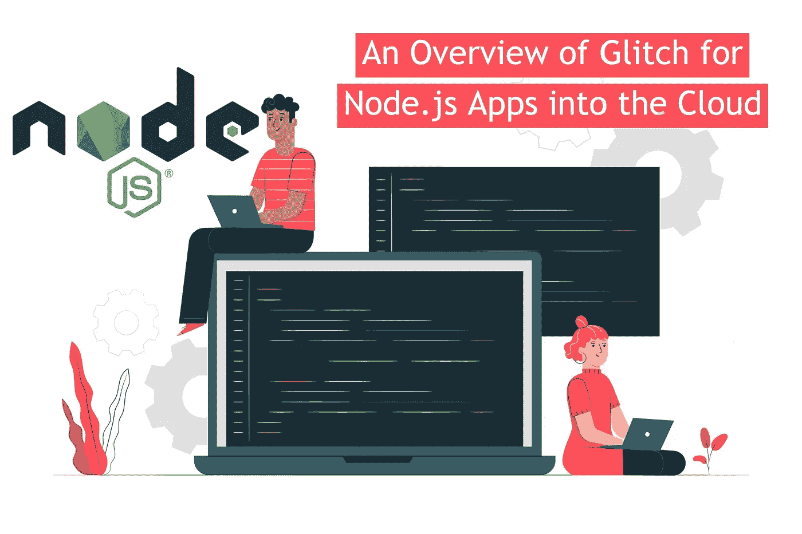
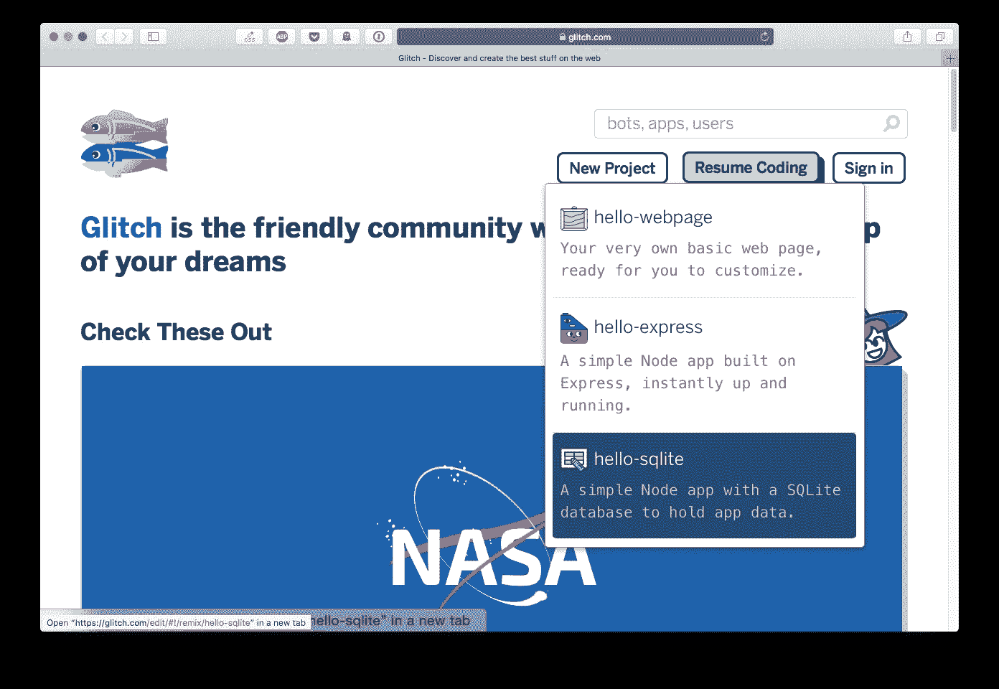
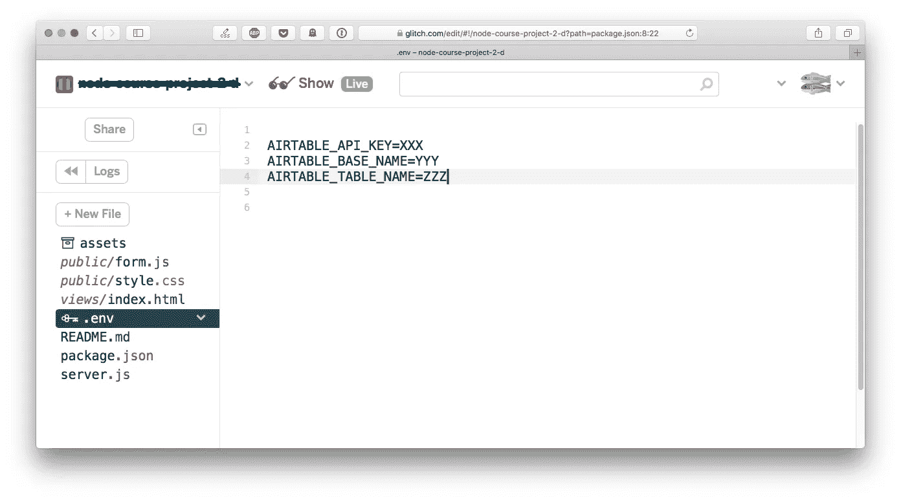
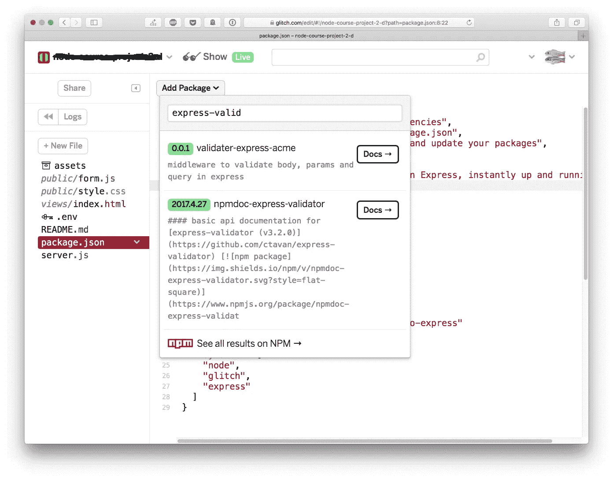
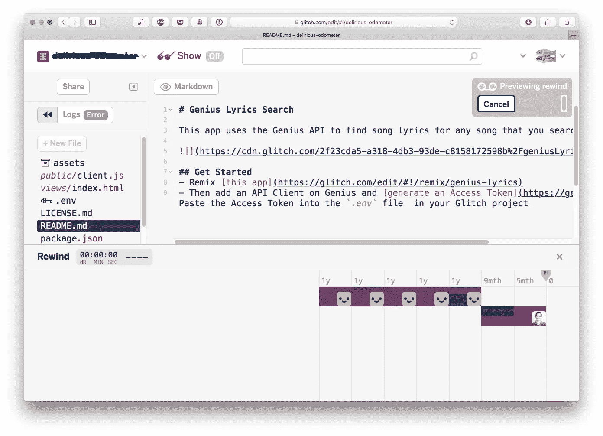
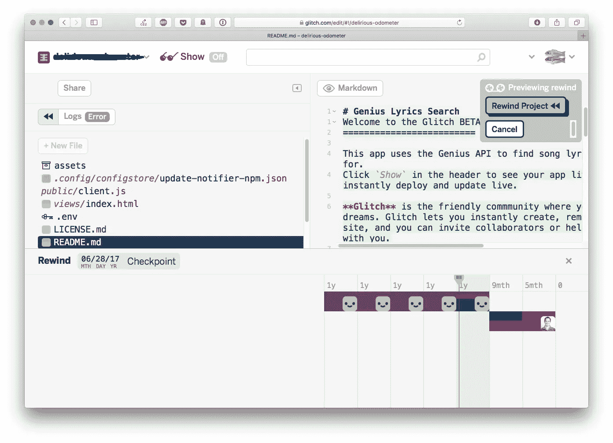
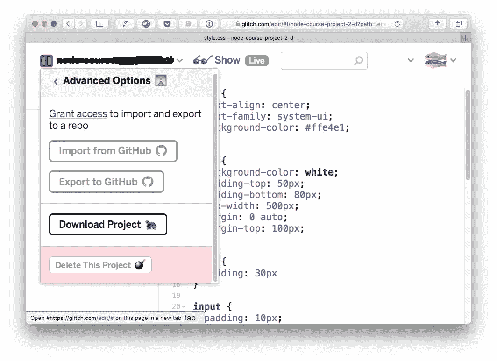

# Node.js 应用程序进入云的故障概述

> 原文：<https://javascript.plainenglish.io/an-overview-of-glitch-for-node-js-apps-into-the-cloud-47272e0797b4?source=collection_archive---------12----------------------->

[[Image Source](https://image.freepik.com/free-vector/javascript-frameworks-concept-illustration_114360-743.jpg)]

最近，Node.js 的受欢迎程度显著提高。随着 Node.js 开发人员对该技术的痴迷，商业组织开始关注 Node.js 的潜力。

一个事件驱动的异步 JavaScript 运行时，旨在构建可扩展的网络应用。凭借其对初创公司产生积极影响的一系列好处，以及巨大的全球品牌，它已经变得流行起来。

## 充满希望的运行时环境

Node.js 有许多特性，这些特性使它从其他框架中脱颖而出。这些功能包括:

简单易学且受市场欢迎

事件驱动和异步

在 Chrome V8 引擎之上创建

全栈应用开发框架

单线程的

广泛的社区支持

Node.js 开发公司拥有专业人员，以提供最佳开发服务和咨询而闻名，帮助企业达到新的高度。对合作伙伴关系的长期承诺通过服务提供商反映在整个周期中，这些服务提供商涵盖了每个开发方面以及执行。

## **node . js 的好处**

1.让应用更快上市。这是 Node.js 开发服务富有成效的首要原因。通过采用前端和后端开发，该框架大大提高了可扩展性、准确性和速度。

2.现代可扩展性和架构。Node.js 提供了快速启动时间、高性能和资源消耗。这些特性非常适合支持新一代应用程序，利用微服务，并在云中运行。

3.纯性能。使用 Node.js，您可以交付性能更高、速度更快的后端服务。当涉及到内存使用以及大容量后端的吞吐量时，编程模型继续提供产品。节点框架为网上两个最大的市场，即全球速卖通和易贝的后端提供支持。

4.开源和社区的力量。开源软件和代码重用哲学已经成为当代软件开发的主流概念。开源社区的巨大力量意味着他们可以自我净化，没有比私有软件更大的漏洞。

InnerSource 运动还向开源社区的生产力和创造力致敬，在开源社区中，创新公司采用相同的开发模型进行内部开发，重点是代码的重用。

# **云中 Node.js 应用的故障**

Glitch 是一个友好的社区，在这里你可以找到或创建你梦想中的应用程序。这是一个平台，你可以在云中创建应用程序，无论是私有的还是公共的，还可以与他人协作。此外，Glitch 是演示项目的一种极好的方式，因为有了嵌入的功能，人们可以快速地将整个应用程序或源代码可视化添加到任何网页中。

一开始，你可能会忍不住认为这没那么严重，因为有这么多的颜色和图像。

目前，Glitch 主要针对 Node.js。您可以从一个示例项目开始构建，如下所示:

或者它可能是现有项目的重新组合，这只是分叉的另一个术语。

当分叉一个项目，一个新的网址将自动分配给你。然后，您将能够更改 URL，并从符合您偏好的免费 URL 中进行选择。

## *一个*回合数据

因为文件系统是持久的，所以可以在那里创建文件和数据存储。即使可能没有内置的数据库服务，您也绝对可以依赖第三方托管的数据库提供商。

## 私人数据

一个项目可以被创建并公开，当其他人重新混合它时也可以隐藏不同的信息。正如您可能猜到的，这与 API 键或任何敏感的东西特别相关。当然，你不能把这些代码公开。

尽管如此，Glitch 为它提供了一个特殊的位置。值可以添加到环境变量中。env 文件，您将是唯一可以访问它的人。

在文件名之后，您可能会注意到有一个关键图像，它提供了文件安全性的视觉提示，并且永远不会向其他人显示，即使项目是公开的。当然，如果这个项目是私人的，没有一个文件会给人看。但是，无论何时您决定在其中构建一个公共端点，该应用程序仍然可以在公共 URL 上使用。

此外，存储在。当项目被重新混合时，数据/文件夹将不会被覆盖。

## 排除故障

Glitch 集成了节点调试器，该调试器仅在 Chrome 上可用，可以通过按下按钮来启用。你可以在 Chrome DevTools 中调试这个应用。

## 轻松管理 NPM 软件包

当点击 package.json 时，您可以选择安装 npm 包。单击“添加包”时，您将可以访问 npm 注册表上的任何可用包。

## Git 集成

每次您对其中一个文件进行更改时，Glitch 都会创建一个新的项目修订。Git 功能强大，但是以一种真正创新和令人耳目一新的方式呈现，也可以被一开始就不熟悉 Git 的人所利用。

点击个人资料图片下的两个左箭头图标，即可进入回放视图。您将看到由谁做出的改变。

当在更改上移动垂直线时，编辑器会切换到比较可视化工具。快速浏览一下，左边是更改的文件，右边是打开的文件中更改的代码行。

这确实很方便，特别是当你在几个月后查看你的代码，或者团队的其他成员将会改变的时候。

## GitHub 集成

任何项目都可以导出到 GitHub，也可以从 GitHub 导入任何项目。

## 流线型，而不是向下变笨

Glitch 中有一些漂亮的工具，它们在底层平台上进行抽象。但是当你点击“登录ǀ控制台”时提供了对外壳的访问:

从这里，你可以做任何控制台魔术，以及任何类型的魔术，不需要访问根。

## **在关闭时**

对于下一个开发项目，你可以重新混合它，使它成为你的。对于试验、创造事物、确定什么会坚持下去以及尝试新技术来说，Glitch 是非常棒的。