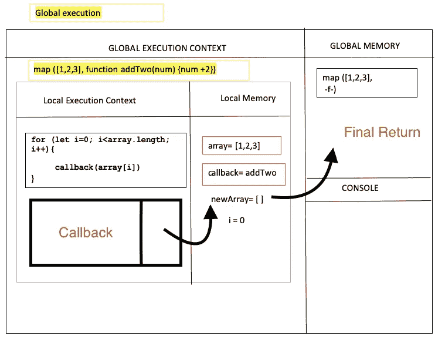

# JavaScript 代码是如何在幕后执行的

> 原文：<https://javascript.plainenglish.io/an-under-the-hood-at-how-javascript-code-is-executed-2ddd5f2e9dde?source=collection_archive---------11----------------------->

## 白板系列第二部分。map()本机函数


Photo by [Aleksander Vlad](https://unsplash.com/@aleksowlade?utm_source=medium&utm_medium=referral) on [Unsplash](https://unsplash.com?utm_source=medium&utm_medium=referral)

在我之前的博客中，我已经建立了。map()原生函数，仔细看看它是什么。这里是我写的代码的快速回顾。这段代码将用于演示 JavaScript 执行一段代码时会发生什么。

```
function map(array,callback){
    let newArray=[];    
    for (let i=0; i<array.length; i++){
         newArray.push(callback(array[i]))
    };   

   return newArray
}
```

## 什么是执行上下文？

根据定义， ***执行上下文是 JavaScript 代码被执行和评估的地方*。我发现把它想象成一栋房子更容易。取决于你在哪个房间和你的任务的环境，你能得到的会稍微不同。除非你做的事情有点不同，否则可以肯定地说，你可能不会在浴室里给自己做一顿地道的英式早餐。JavaScript 代码以同样的方式运行。它执行的地方改变了某些变量的值，比如**T5 this。****

一般来说，执行上下文明显有两个阶段:

1.  **创建阶段**
2.  **执行阶段**

当 JavaScript 代码运行时，在**创建阶段**，引擎(在引擎盖下)创建一个**全局执行上下文，**这是执行代码的地方。其中有全局内存，用来存储变量和函数定义。在我的例子中，控制台也是可用的，以便向程序员显示值。请注意，您希望在控制台上显示的值必须在 console.log()中；否则，您将无法看到您的代码是否正确运行，甚至无法看到它是否已经完全执行。下图显示了引擎盖下发生的事情的简单白板版本。


Simple diagram of the creation phase of the Global Execution Context

在**执行阶段，** JavaScript 代码逐行执行，遵循执行的线程。简而言之，这意味着 JavaScript 是一种单线程语言。前一行代码执行完毕后，它只能移动到下一行代码。在这个阶段，它分配变量并执行函数调用。注意，每次调用函数时，都会创建一个新的本地或函数级执行上下文。一旦执行了函数的求值，返回值将被发送回全局执行上下文并存储在全局内存中。**和往常一样，不要担心，我们将详细介绍上面显示的地图功能。**

## JavaScript 如何执行代码

出于参考目的，我将从顶部再次粘贴代码，以便我们可以更仔细地查看它。我已经对它进行了编号，所以我们可以遵循 JavaScript 如何运行脚本，并使它更容易被引用。

```
1)function map(array,callback){
      let newArray=[];    
      for (let i=0; i<array.length; i++){
          newArray.push(callback(array[i]))
      };   

     return newArray
  }2) map([1,2,3], function addTwo(num){num +2})(we can always use an arrow function but for the purposes of visually demonstration this syntax is easier)
```

## 第一阶段

当 JavaScript 逐行执行代码时:


Function definition of map is stored in Global Memory

*   创建具有全局存储器的全局执行上下文。
*   使用变量和函数——第一次通过时，JavaScript 存储变量和函数名，并给它赋值 undefined。
*   第二次，它给变量赋值，并存储函数定义。

## 次相

当 JavaScript 到达数字 2 时，在上面的代码片段中，使用数组[1，2，3]调用 map 函数，回调函数 addTwo(num){num+2}都作为参数传递。注意，初始函数定义中的(数组，回调)被称为**参数**，是临时占位符。这些参数名称稍后会被重新分配，以便它们的值成为传入的参数。

在这一点上，我们不能在不谈论**调用栈的情况下继续前进。**

A visual example of a callstack

从上图来看，**调用栈**就像 Gru。简而言之，他跟踪他所有的爪牙以及他们在做什么。调用栈本质上是一样的，它跟踪 JavaScript 当前正在执行的函数。对于我们目前正在处理的代码片段，当 JavaScript 到达调用 map 函数的那一行时，该函数将被弹出到调用堆栈中。当执行完成时，它被弹出。


Think of popping off and popping on as Gru keeping track of his minions

通过调用 map 函数，创建了新的本地或函数级执行上下文。在这个本地执行上下文中，使用实参的值重新分配参数名，并保存在本地内存中(红框突出显示了这一点)。JavaScript 逐行存储变量声明及其值，函数及其定义。


在本地执行上下文中，Javascript 将运行 for 循环，每次***i*** 递增时，它将首先更新其在内存中的值，然后将其作为参数传递给回调函数。由于回调(**函数 addTwo()** )现在被调用，一个新的本地执行上下文被创建，一个新的堆栈被弹出到调用堆栈上。

## 最后阶段

一旦函数被完全执行，它就向外部返回显式的返回值。如果执行外部的函数需要评估的结果，将使用该结果，并将该函数的返回值发送到外部。这是一个地狱循环，但幸运的是我们不必担心它，因为 JavaScript 为我们处理了所有这些。它将一直这样做，直到最后的返回值被发送到全局内存，全局执行上下文从调用堆栈中被删除(弹出)并且执行完成。此外，每次执行完一个函数后，它会被弹出调用堆栈并被“垃圾收集”。



## 结论

我知道你可能通读了所有这些，这让你有点头晕。好的一面是，一旦你能够理解本机函数，以及 JavaScript 代码是如何运行的，它就更容易可视化和解释概念，并允许你找到编码问题的解决方案。

主要要点是:

*   JavaScript 是一种单线程语言。它逐行运行代码。
*   当执行代码时，全局执行上下文被弹出到调用堆栈上并被创建。变量和函数定义存储在全局存储器中。
*   当一个函数被调用时，它被弹出到调用栈，并且一个本地执行上下文和一个本地内存被创建。
*   一旦函数执行完毕，显式返回值将被发送到它上面的本地执行，依此类推，直到最终的返回值被发送回全局内存。
*   每次执行完一个函数，它就会从调用堆栈中弹出，当所有代码执行完成时，全局执行上下文就会弹出。

## 额外资源

*   [https://developer . Mozilla . org/en-US/docs/Glossary/Call _ stack](https://developer.mozilla.org/en-US/docs/Glossary/Call_stack)
*   [https://www . JavaScript tutorial . net/JavaScript-execution-context/](https://www.javascripttutorial.net/javascript-execution-context/)
*   [https://blog . bitsrc . io/understanding-execution-context-and-execution-stack-in-JavaScript-1c 9 ea 8642 DD 0](https://blog.bitsrc.io/understanding-execution-context-and-execution-stack-in-javascript-1c9ea8642dd0)
*   [https://dev . to/steel voltage/if-JavaScript-is-single-threaded-how-it-asynchronous-56gd](https://dev.to/steelvoltage/if-javascript-is-single-threaded-how-is-it-asynchronous-56gd)
*   [https://www.youtube.com/watch?v=exrc_rLj5iw](https://www.youtube.com/watch?v=exrc_rLj5iw)