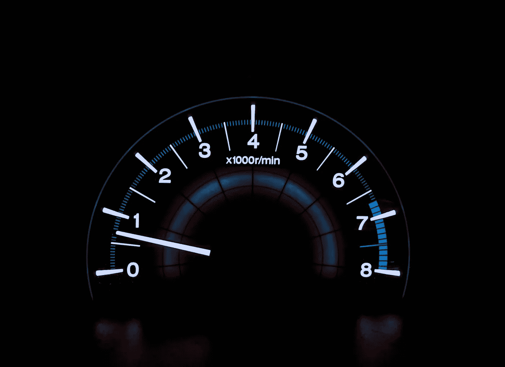
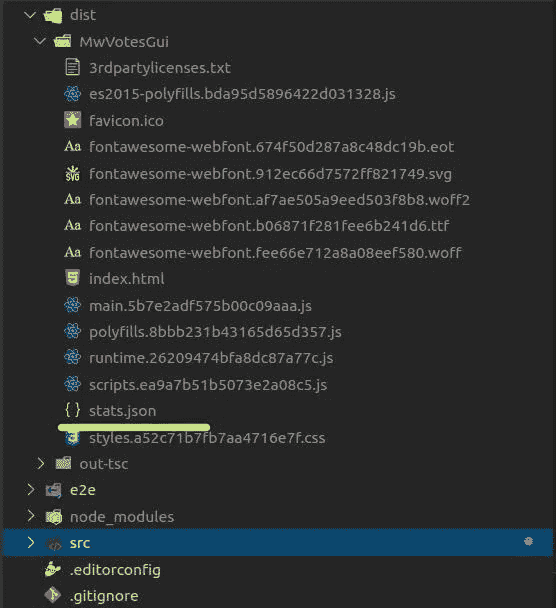
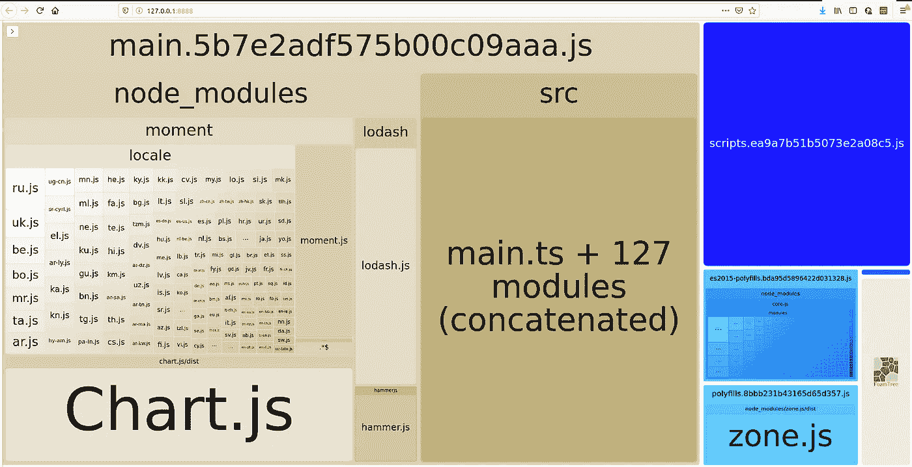

# 分析角度束大小以改善应用程序加载时间。

> 原文：<https://javascript.plainenglish.io/analyze-angular-bundle-size-to-improve-application-load-time-a28df9df59ad?source=collection_archive---------1----------------------->

## 优化捆绑包大小，加快和改善 angular 应用程序的加载速度

Photo by [Chris Liverani](https://unsplash.com/@chrisliverani?utm_source=unsplash&utm_medium=referral&utm_content=creditCopyText) on [Unsplash](https://unsplash.com/s/photos/speed?utm_source=unsplash&utm_medium=referral&utm_content=creditCopyText)

改善 angular 应用程序加载时间的最重要的方法之一是使主包文件尽可能小。`main.bundle`文件构成了 angular 应用程序的一个很大的块，并且非常重要，因为它包含供应商模块和所有其他非延迟加载的代码。

随着 angular 应用的增长和依赖性的增加，`main.bundle`也在增长。大的主包文件意味着应用程序加载时间会因为以下原因而变慢:

*   JavaScript 解析和执行速度较慢
*   下载主包的内容需要更长的时间

今天我们将使用`Webpack-bundle-analyzer`，一个免费的工具，来分析一个角度应用的束尺寸。来自包大小分析的信息将帮助您做出明智的决策，以优化应用程序加载时间。

首先，让我们使用以下命令通过 npm 全局安装 webpack-bundle-analyzer 包:

`$ npm install webpack-bundle-analyzer -g`

一旦安装完毕，你就可以为生产构建 angular 应用程序，并传入- *-stats-json* 参数。运行命令:

`$ ng build --prod --stats-json`。

上面的命令构建了用于生产的 angular 应用程序，此外还在 applications dist 文件夹下创建了一个 *stats.json* 文件。输出应该如下所示:

现在您可以运行 webpack-bundle-analyzer 来报告您的主包的状态。为此，只需运行以下命令。

`$ npx webpack-bundle-analyzer dist/MwVotesGui`

其中 *"dist/MwVotesGui"* 是 stats.json 文件的位置，如上图所示。

***注意*** *:确保根据运行命令的文件夹给出 stats.json 文件的正确相对路径。*

上面的命令创建了一个类似于下面的报告。

默认情况下，报告在此 URL 上运行 [http://127.0.0.1:8888](http://localhost:8888) 。如果要在另一个 URL 上运行报告，可以运行将主机和端口指定为命令的参数，如下所示:

`$ npx webpack-bundle-analyzer ./dist/MwVotesGui/stats.json --host 127.0.0.42 --port 8042`。

每个彩色框代表一个单独的模块包。我们可以进一步检查每个包，查看未压缩和压缩后的大小。例如，在上面的报告中，chart.js 库贡献了相当大的一部分。

这种分析有助于我们快速确定哪些部分的代码最大，因此我们可以相应地决定是否需要使用延迟加载来进一步分解我们的应用程序，或者删除一些未使用的或不必要的大包。

# 结论

为了优化应用程序的加载时间，理解主包文件的内容是非常重要的。在这方面，webpack-bundle-analyzer 是一个方便的工具。

## 简单英语的 JavaScript

喜欢这篇文章吗？如果是这样，通过 [**订阅解码获得更多类似内容，我们的 YouTube 频道**](https://www.youtube.com/channel/UCtipWUghju290NWcn8jhyAw) **！**