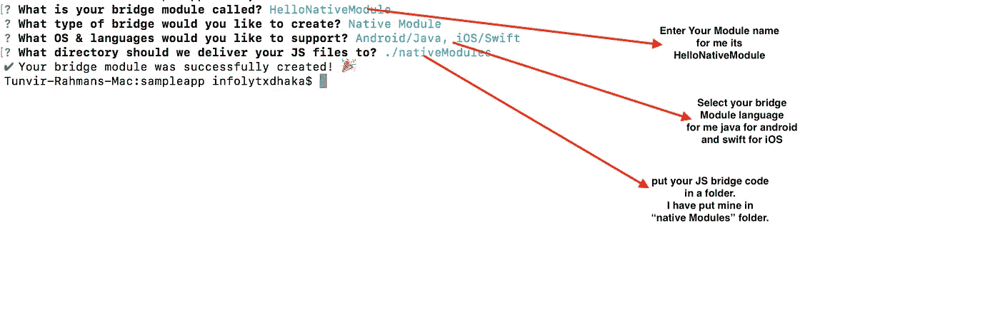
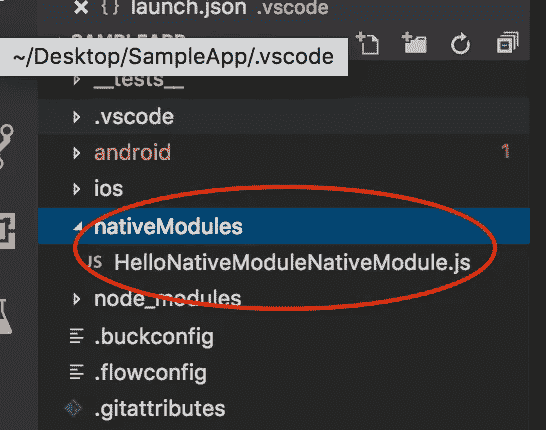
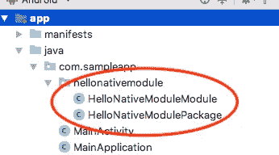

# 安卓原生新娘模块反应原生只需四个步骤。

> 原文：<https://javascript.plainenglish.io/android-native-bride-module-for-react-native-with-few-step-50dec026a7b6?source=collection_archive---------2----------------------->

## 用一种简化的方式！


Photo By [David Martin](https://unsplash.com/@davidmartinjr) from unsplash

> 如果你必须为 React-Native 应用程序编写 native bridge，那么这个博客将帮助你一步一步地做到这一点。
> 
> 如果你没有一个 react-native 应用程序，那么使用

```
react-native init SampleApp
```

**第一步:**

> 现在安装[**react-native-create-bridge**](https://github.com/peggyrayzis/react-native-create-bridge)**。**

```
yarn add react-native-create-bridge
```

> 现在快跑

```
react-native new-module
```



Fill the promt from CLI



Our JS for Bridging.



Native Android Bridge Code from Android Studio.

**第二步:**

> 打开 **HelloNativeModule** 模块，打开**HelloNativeModuleModule.java**从上面复制包名。我的案例其***com . sample app . hellonative module****。*
> 
> 打开**主应用**，导入复制的**包名**。

```
**import** com.sampleapp.hellonativemodule.HelloNativeModuleModule;
```

> 并添加 ***新的****HelloNativeModulePackage()*

```
@Override
**protected** List<ReactPackage> getPackages() {
  **return** Arrays.<ReactPackage>*asList*(

          **new** MainReactPackage(),
          **new** HelloNativeModulePackage() *//Add  this only* );
}
```

> android 的设置已完成。现在是时候玩本机模块了。

**第三步:**

> 让我们用一个名为**的简单按钮在我们的应用程序上测试本机桥**进行测试。点击 javaScript 代码将调用一个本地 Java 代码并返回给我们一些东西。

```
import React, { Component } from 'react';
import { View, Text,Button} from 'react-native';
export default class App extends Component {
constructor(props) {
   super(props);
}
render() {
   return (
       <View>
          <Button title = “Test Native Bridge” onPress = {()=>{
                   //we will call our native Java Code here.
          }}></Button>
       </View>
   );
}}
```

**第四步:**

> 打开**HelloNativeModuleModule.java**并像这样添加新方法

```
@ReactMethod
**public void** MyBridgeMethod(String stringFromJS, Callback callBack){//Replace the **JavaScriptCode** with **JavaCode** to mimic some change from Java Code.
    String newString =  stringFromJS.replace(**"JavaScriptCode"**,**"Java  Code"**);
    callBack.invoke(newString);
}
```

> 现在在 React 原生项目中。
> 
> 注:记住—导入 com . Facebook . react . bridge . callback；

```
import { View, Text,Button, NativeModules} from 'react-native';
const myModule = NativeModules.HelloNativeModule
```

> 现在在按钮处理程序中放置这段代码。

```
myModule.MyBridgeMethod(“Its from JavaScriptCode”,(fromJavaCode)=>{
        console.log(fromJavaCode)
})
```

> 现在我们有了一个桥接 Java 方法，它可以从 JavaScript 代码进行通信。
> 
> **注意:JavaScript 是异步的。所以如果你想从 Java 代码中得到一些回报，那么你必须写一个回调函数并通过回调函数返回结果**

就这些。

累吗？从这里开始做一个快速的头脑更新。

## [32+搞笑代码评论居然有人写](https://medium.com/javascript-in-plain-english/30-funny-code-comments-that-will-make-you-laugh-1c1b54d4ab00)

# 感谢阅读。🍻