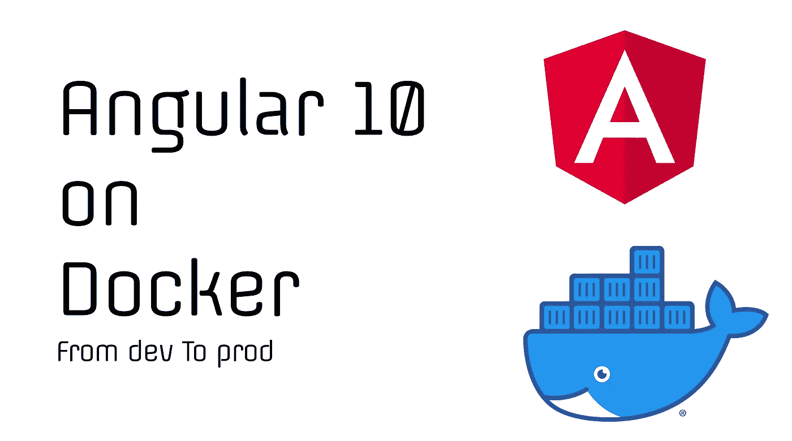

# 如何将 Angular 10 应用程序用于生产

> 原文：<https://javascript.plainenglish.io/angular-10-on-docker-to-production-61ee6e84006?source=collection_archive---------3----------------------->

创建和部署 Angular docker 映像从未如此简单。在本文档中，我们将对我们的 [Angular](https://angular.io/) 应用程序进行文档化，并继续部署构建的映像。



## 为什么要将你的前端角度应用程序 Dockerize。？

1.  **改进型**[CI/CD](https://www.infoworld.com/article/3271126/what-is-cicd-continuous-integration-and-continuous-delivery-explained.html)**。**

对应用程序进行 dockerizing 带来的健全性和效率是无价的。

这可以通过在您的 [CI 管道中包含 docker 构建流程来进一步改进。](https://www.infoworld.com/article/3271126/what-is-cicd-continuous-integration-and-continuous-delivery-explained.html)您将节省大量时间，并减轻许多头痛，尤其是如果您有一个定义明确的 CI/CD。

**2。复制&可扩展性**

您的应用程序将是自包含的，因此可以使用像 [Kubernetes](https://kubernetes.io/) 这样的容器编排工具按需自动伸缩。

**3。应用版本**

您构建的 docker 映像可以用版本名进行标记，从而作为应用程序某个状态的参考(这将证明在恢复到稳定版本/状态时非常有用)。比如 myapp:1.0.0。

这些镜像版本作为[注册表](https://docs.docker.com/registry/)存储在所有代码托管平台中，最流行的存储库是 [Docker Hub。](https://hub.docker.com/)

## 先决条件

1.  [角度的基本知识。](https://angular.io/)
2.  [码头工人的基础知识。](https://docs.docker.com/get-started/)
3.  [Nginx 的基础知识。](https://www.nginx.com/)

## 构建并服务于您的角度应用

因此，您已经构建了自己的 angular 应用程序，并希望在本地提供服务，以便测试服务器将如何呈现您的捆绑应用程序。

我们可以使用一个有用的 npm 包 [http-server](https://www.npmjs.com/package/http-server) 来提供捆绑的应用程序。

**第一步:安装 Http-Server**

```
npm i http-server
```

**第二步:分发文件夹**

在项目文件夹中运行以下命令:

```
http-server ./dist
```

Http-server 在端口 **8080、**上提供服务，因此请前往此地址**[*http://localhost:8080*](http://localhost:8080/)*查看应用程序。***

## ***Docker 设置***

***基本上， **Docker 容器/图像**是一个包含所有依赖项的自包含应用程序，可以是小服务，如卡片处理、时事通讯服务。***

***而 [**DockerFile**](https://docs.docker.com/engine/reference/builder/#:~:text=A%20Dockerfile%20is%20a%20text,can%20use%20in%20a%20Dockerfile%20.) 包含关于如何构建包含所有依赖关系的容器的指令。***

***在接下来的步骤中，我们将设置构建映像所需的 docker 配置，然后继续构建和运行映像。***

*****第一步:创建 DockerFile*****

*****DockerFile** 包含构建 docker 映像(容器)的指令。
在你的项目的根目录下创建这个没有扩展名的文件 [**DockerFile**](https://docs.docker.com/engine/reference/builder/#:~:text=A%20Dockerfile%20is%20a%20text,can%20use%20in%20a%20Dockerfile%20.) 。***

***该文件的内容将包括:***

```
*FROM nginx:1.15.8EXPOSE 80COPY conf/default.conf /etc/nginx/conf.d/RUN rm -rf /usr/share/nginx/html/*COPY dist /usr/share/nginx/htmlCMD ["nginx", "-g", "daemon off;"]*
```

***以上配置将构建一个 [Nginx 服务器](https://www.nginx.com/)映像，在端口 80 上为您的应用程序提供服务。***

***第二步:创建 Nginx 配置文件。
在上面的 dockerFile 配置(第 3 行)中，Docker 正在期待一个配置文件(`default.conf` ) ，我们需要创建该文件并将其传递给 Docker 映像。当我们需要修改 Nginx 配置时，这将非常有用。***

***在项目根文件夹中创建这个文件夹**。/conf*****

```
*mkdir ./conf*
```

***继续创建 Nginx 配置文件***

```
*default.conf*
```

***文件的内容(随意修改):***

***此时，映像配置已经完成，我们准备好构建映像了。***

*****第三步:构建 docker 映像*****

***在这一步中，我们将构建 angular 应用程序 docker 映像。首先，我们需要确保我们已经构建了应用程序(这个过程可以包含在 CI 中)。***

```
*ng build --prod*
```

***要构建映像，运行以下命令(其中<app_name>是您的应用程序名称):</app_name>***

```
*docker build -t <APP_NAME> .*
```

*****第四步:运行 docker 镜像*****

***在 docker 文件中，我们将**端口 80** 指定为应用程序将运行的端口(**公开**)，为了让我们在运行映像(容器)之外访问它，我们将需要在外部公开应用程序，为此，我们将[端口 5100 上的应用程序进行](https://en.wikipedia.org/wiki/Port_forwarding)端口转发(您可以选择当前未使用的任何其他端口)。***

***要运行 docker 映像，请运行以下命令:***

```
*docker run -p 5100:80 <DOCKER_IMAGE>*
```

***要查看应用程序，请访问以下地址:***

```
*[http://localhost:5100](http://localhost:5100)*
```

## ***在生产中运行映像***

***现在您已经构建并测试了 docker 映像，您希望在生产中运行它。有很多方法可以让映像运行:***

***[**1。docker-compose**](https://github.com/docker/compose)***

***这是目前最简单的方法让你的图像启动并运行，但不建议大规模使用。[阅读 _ 更多](https://docs.docker.com/compose/production/)***

*****2。Kubernetes** 这个容器编排工具将使你能够轻松地管理和自动扩展你的应用程序，并且是我最喜欢的。***

***还有其他容器编排工具([列表](https://phoenixnap.com/blog/container-orchestration-tools))。请随意设置和探索它们。***

***希望你发现这很有帮助，你的阅读伴随着笑声。我确实相信教育应该是有趣的。请随意留下任何评论或建议，或者一些掌声。***

***[](https://www.buymeacoffee.com/GeoffDeveloper)***

***多 love️！***

****你可以在*[*Twitter*](https://twitter.com/GeoffreyMahugu)*上关注我，或者如果你愿意与我合作，你可以在* [*Portfolio Link 获取我的联系人。*](https://geoffreymahugu.com)***

****更多内容请看*[*plain English . io*](http://plainenglish.io/)***