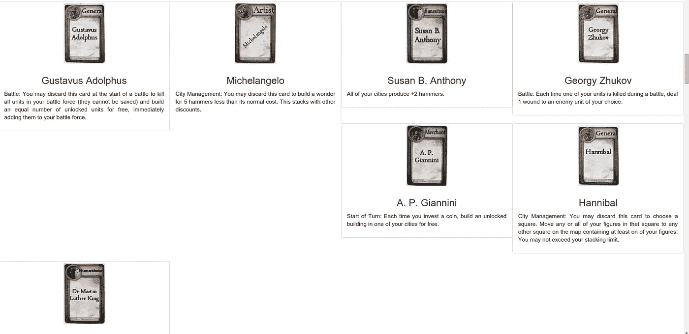

# 角度引导 4 行列相同高度

> 原文：<https://javascript.plainenglish.io/angular-6-bootstrap-4-row-columns-same-height-8be5bdb53099?source=collection_archive---------2----------------------->

你有没有在*ngFor 循环中遇到过这样的情况:你想让列的高度增长到一行中最长的一列？



但是你会说:等等，用 flex 的时候很简单。

当你有一行和许多列的时候会发生什么，高度会延伸到整个行的大小，这不是我们想要的。

我们将构建一个简单的应用程序，我们将在其中创建一个行类和 3 个列，并用*ngFor 循环重复这个过程。

那么，让我们开始吧:

# 1.

我们将创建一个有角度的应用程序，我们将有一个简单的项目阵列:

```
**export interface** Item {
  title: **string**;
  subTitle: **string**;
  description: **string**;
}
```

# 2.

要使每行有 3 列，设置 k = 3:

注意，对于 k = 2，4 或其他高达 12 列的情况，一行中将有 2，4，…列。

```
**for** (**let** i = 0; i < **this**.arrayOfItems.length; i += k) {

  **this**.newArray.push({ items: **this**.arrayOfItems.slice(i, i + k) });
}
```

此循环将从第一个项目开始，每隔三个项目迭代一次，将当前数组分割为最多 3 个项目，并将它们推送到新数组，该数组将包含具有 items 属性对象，该对象恰好包含 k 个项目。

现在我们可以比较开始数组和这个循环新创建的数组。

旧的，例如:

```
arrayOfItems = [
  {
    title: 'red',
    subTitle: 'f00',
    description: 'toto lorem ispum soil t'
  },
  {
    title: 'blue',
    subTitle: 'aaas',
    description: 'toto lorem ispum soil t'
  },
]
```

新的，例如

```
newArrayOfItems = [
  {
    items: [
     {
       title: 'red',
       subTitle: 'f00',
       description: 'toto lorem ispum soil t'
     },
     {
       title: 'red',
       subTitle: 'f00',
       description: 'toto lorem ispum soil t'
     },
     {
       title: 'red',
       subTitle: 'f00',
       description: 'toto lorem ispum soil t'
     },
  },
  {
    items: [
      {
       title: 'red',
       subTitle: 'f00',
       description: 'toto lorem ispum soil t'
      },
      {
       title: 'red',
       subTitle: 'f00',
       description: 'toto lorem ispum soil t'
      },
  }]
```

# 3.

现在，我们将像以前一样使用 ngFor，其中 app-item 是项目组件:

```
<div class="container m-t-md"> <h1 style="text-align: center;" class="mg-bottom">
Angular + Bootstrap ngFor 3 columns in row</h1> <div class="row mg-bottom" *ngFor="let row of newArray">
    <ng-container *ngFor="let item of row?.items">
      <app-item class="col-xs-12 col-md-4" [item]="item"></app-item>
    </ng-container>
  </div></div>
```

现在我们在 html 中创建了类似这样的结构:

```
<row>
<div class="col-xs-12 col-md-4"></div>
<div class="col-xs-12 col-md-4"></div>
<div class="col-xs-12 col-md-4"></div>
</row><row>
<div class="col-xs-12 col-md-4"></div>
<div class="col-xs-12 col-md-4"></div>
<div class="col-xs-12 col-md-4"></div>
</row><row>
<div class="col-xs-12 col-md-4"></div>
<div class="col-xs-12 col-md-4"></div>
</row>
```

# 4.

最后一步是将高度 100%添加到项目组件，您将得到如下结果:


> **代码和演示可以在这个链接上找到:** [**演示**](https://miki995.github.io/angular-bootstrap-row-colum)**|**[**Github**](https://github.com/miki995/angular-bootstrap-row-colum)**。**