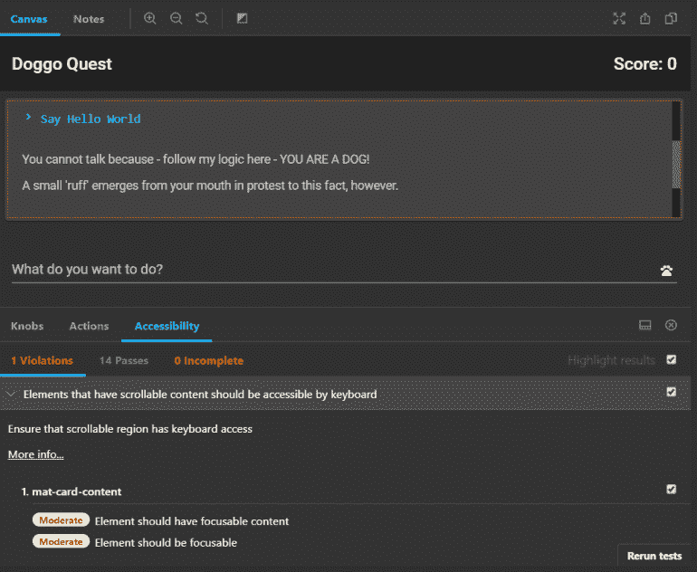
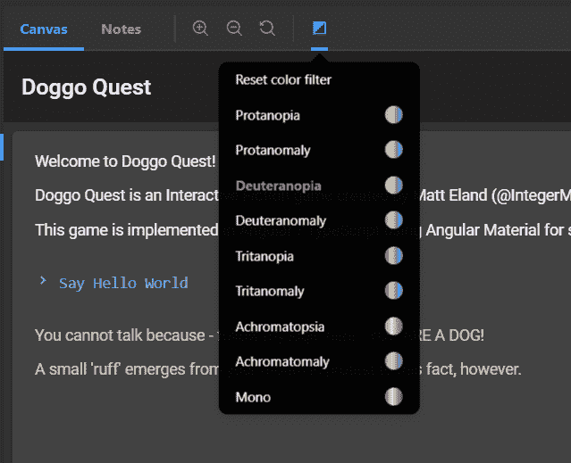

# 角度可达性

> 原文：<https://javascript.plainenglish.io/angular-accessibility-81736ab4f1c4?source=collection_archive---------5----------------------->

## 角度支持 Web A11y 标准

让我们来谈谈构建可访问的角度应用程序。为什么？因为 Angular 应用程序很棒，但 Angular 让你做的令人惊讶的事情是一个净负面，除非你能建立一个每个人都可以使用的应用程序。

可访问性(有时缩写为“a11y”)是指以这样一种方式设计软件，即所有用户都可以使用它，不管他们是否有任何残疾。

虽然我不是可访问性专家，但我可以帮助您从一般的可访问性开始，更具体地说，如何在 Angular 中遵循可访问性实践。

# 无障碍 101

在我们开始审计您的应用程序的可访问性问题之前，让我们看看一些常见的违规情况。

## 现代 HTML 标签

现代浏览器支持一组丰富多样的有意义的 HTML 标签，然而 Angular 等现代 web 技术的力量让我们可以轻松地在代码中的任何地方使用`div`元素。

这很糟糕。

为什么？因为屏幕阅读器和其他辅助软件看到一个`div`标签，它们不知道这是一个按钮、一个段落还是一个边框。

不要这样。

而不是`<div class="btn">My Button</div>`

用途:`<button class="btn">My Button</button>`

这也适用于其他 HTML 元素。如果可以的话，使用[语义 HTML 元素](https://www.w3schools.com/html/html5_semantic_elements.asp)，比如`nav`、`header`、`footer`、`section`、`article`和`aside`。

## 使用 Aria 属性

有时你不得不以有趣的方式使用 HTML。在这些时候，你需要考虑`role`标签以及[可访问的富互联网应用(ARIA)标签标准](https://www.w3.org/TR/html-aria/)。

通常，您需要注意:

注意，如果您需要将一个`aria`属性的值绑定到 Angular 中的某个东西，您可以使用如下语法:`<div [attr.aria-expanded]="isExpanded">`

还有另一个 aria 标签需要注意:接收实时更新、插入或删除的区域应该使用。我们将在稍后讨论宣布变更时回到这一点。

由于我不是一个可访问性专家，我在这里的重点更多的是在 Angular 中实现可访问性，我推荐你去看看 [Ian Forrest 的](https://twitter.com/ianforr)精彩的[关于 web 可访问性趋势的演讲](https://app.pluralsight.com/library/courses/codemash-session-09/description)可以在 Pluralsight 上免费获得。

# 将可访问性集成到您的角度工作流中

既然我们已经讨论了一般的可访问性，让我们探索一些更具体的场景。

## 故事书可访问性

我以前写过我是多么喜欢使用 Storybook 来快速检验有棱角的用户界面。Storybook 是一个了不起的图书馆，有许多做得非常好的附加组件，包括[一个可访问性附加组件](https://github.com/storybookjs/storybook/tree/master/addons/a11y)，它可以简化可访问性审核。

您可以通过在 Angular 应用程序中打开命令行，然后运行以下命令来安装此附加组件:

`npm i @storybook/addon-a11y --save-dev`

这将安装必要的依赖项作为开发时的依赖项。

从那里，您需要在`.storybook/main.js`文件中注册插件，如下所示:

```
module.exports = { 
  stories: ['../src/**/*.stories.ts'], 
  addons: ['@storybook/addon-a11y'], // other addons hidden for clarity 
};
```

接下来，您需要将`withA11y`添加到您想要进行可访问性测试的每个`stories.ts`文件中，如下所示(特别注意第 4 行和第 8 行):

## 查看和修复故事书中的所有问题

一旦在 Storybook 中设置了`addon-a11y`,当您执行`npm run storybook`时，您应该会看到一个`Accessibility`选项卡，它会突出显示检测到的任何违反可访问性的情况，如下所示:



这里，插件告诉我，屏幕上有一个区域正在显示滚动条，但是这个区域不是键盘焦点。这意味着任何通过键盘导航的人(比如许多需要辅助功能的用户)都不能滚动。

在这种情况下，我可以单击“更多信息…”来导航到失败的规则，并查看一些推荐的修复示例。在这种情况下，我需要将`tabindex="0"`添加到可滚动区域，以便。这样做并重新运行测试可以解决问题。

请注意，这不会像专门为可访问性测试设计的浏览器插件那样广泛或全面，但是如果您已经在使用 [Storybook](https://storybook.js.org/) ，这是一个简单的方法，也可以用来快速检查可访问性。

可访问性不仅仅指需要屏幕阅读器的人。许多人患有各种形式的色盲。a11y 插件为我们提供了一个滤色器功能(如下图),可以模拟各种形式的色盲，因此您可以验证您的应用程序，并确保您没有隐藏基于颜色敏感度的信息。



## aria-直播和内容更新

[Aria-live](https://www.w3.org/WAI/PF/aria-1.1/states_and_properties#aria-live) 用于表示接收定期更新的网络应用区域。

使用`aria-live`相当简单，您可以将它添加到任何 div 中，并指定*礼貌*。这是指通知对最终用户的紧急程度。

例如，你可以使用`<div aria-live="polite">`只在用户空闲时宣布事件，而`assertive`会更主动。

然而，设置`aria-live`还不够。你还需要用一个`LiveAnnouncer`来宣布对屏幕阅读器软件的修改。

看一下这个示例组件:

在第 20 行，我们通过 Angular 的依赖注入机制将`LiveAnnouncer`注入到组件中。

接下来，在从第 35 行开始的`onEntryAdded`方法中，我们用文本事件调用`liveAnnouncer`。这些事件将被屏幕阅读器获取并呈现给用户。

## 林挺可达性

如果您想轻松地对您的开发实践进行某种程度的审计，您可以在 Angular 附带的`tslint.json`文件中添加一些可访问性规则。这将允许您在林挺过程中运行可访问性检查，并可以捕获一些常见错误。

为此，打开`tslint.json`并将以下规则添加到您的规则集合中:

```
 "template-accessibility-alt-text": true,
    "template-accessibility-elements-content": true,
    "template-accessibility-label-for": true,
    "template-accessibility-tabindex-no-positive": true,
    "template-accessibility-table-scope": true,
    "template-accessibility-valid-aria": true,
    "template-click-events-have-key-events": true,
    "template-mouse-events-have-key-events": true,
    "template-no-autofocus": true,
    "template-no-distracting-elements": true,
```

现在，当您运行`npm run lint`来 lint 您的代码时，一些基本的可访问性检查将会发生。请注意，这绝不是全面的，但即使是基本的检查也有助于发现问题。

# 结束语

希望这篇文章已经给了你一个关于一般可访问性的快速入门或复习，以及一些关于如何在 Angular 中审计和实现可访问性问题的想法。

无论如何，我都不是可访问性方面的专家，如果你真的想认真审核你的应用程序的可访问性，我强烈建议你也考虑像 [Wave](https://wave.webaim.org/) 等专门构建的工具。

关于角度可及性的更多最新细节，请看框架的[关于可及性的官方文档页面](https://angular.io/guide/accessibility)。

【https://killalldefects.com】原载于 2020 年 2 月 13 日[](https://killalldefects.com/2020/02/12/angular-accessibility/)**。**